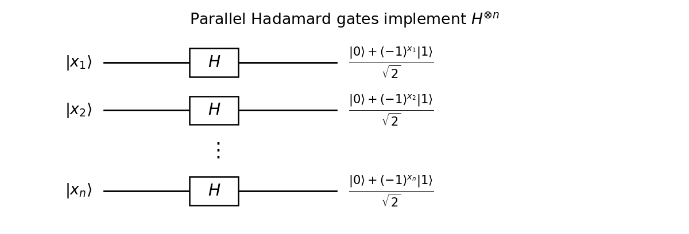

<h1 id="2/1/solution">Solution</h1>

↑ **Parent:** [1](../1.md)

Apply one [Hadamard gate](../../../../../../hadamard-gate.md) independently to each [qubit](../../../../../../qubit.md). These gates act in parallel, so the [quantum circuit](../../../../../../quantum-circuit-split.md) implements $H^{\otimes n}$ with $n$ gates and depth one.

**[Figure 1](#2/1/image-parallel-hadamard-gates-implementing-the-binary-fourier-transform). Parallel Hadamard gates implementing the binary Fourier transform**.

For a [computational basis](../../../../../../computational-basis.md) state, factorization gives

$$
H^{\otimes n}|x_1\cdots x_n\rangle=\bigotimes_{j=1}^n\frac{|0\rangle+(-1)^{x_j}|1\rangle}{\sqrt2}=2^{-n/2}\sum_{y\in\{0,1\}^n}(-1)^{x\cdot y}|y\rangle.
$$

The exponent is the dot product over the [finite field](../../../../../../finite-field.md) $\mathbb F_2$, because multiplying the separate signs adds their exponents modulo two. This is the [Walsh-Hadamard transform](../../../../../../walsh-hadamard-transform.md), equivalently the [quantum Fourier transform](../../../../../../quantum-fourier-transform.md) on the finite Abelian group $(\mathbb Z_2)^n$.

In particular, the all-zero input becomes the uniform coherent [superposition](../../../../../../superposition-principle.md) $2^{-n/2}\sum_y|y\rangle$. It is a useful initial operation because an oracle can then act on all amplitudes in one call, and subsequent interference can reveal a global property. Measurement alone does not read all function values: the later interference step is what turns the preparation into an algorithmic advantage.

## ↑ Ancestors (11)

1. [1](../1.md)
2. [2](../../2.md)
3. [Paper 53](../../../paper-53-split.md)
4. [Iii](../../../split.md)
5. [2004](../../../../split.md)
6. [Past exam of the mathematics course of the University of Cambridge](../../../../../split.md)
7. [Mathematics course of the University of Cambridge](../../../../../../mathematics-course-of-the-university-of-cambridge.md)
8. [Course of the University of Cambridge](../../../../../../course-of-the-university-of-cambridge.md)
9. [University of Cambridge](../../../../../../university-of-cambridge-split.md)
10. [List of universities](../../../../../../list-of-universities.md)
11. [Codex Wiki](../../../../../../split.md)
