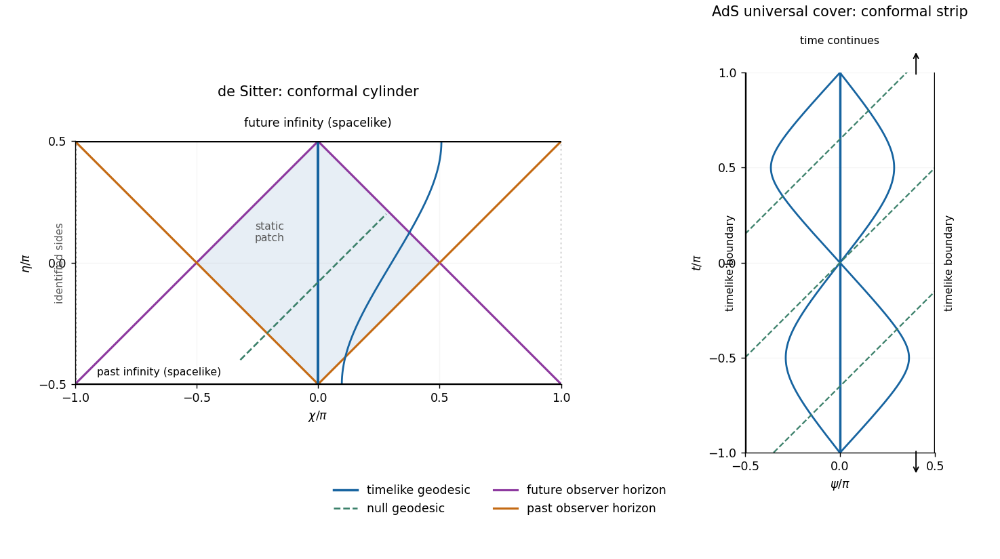

<h1 id="4/solution">Solution</h1>

↑ **Parent:** [4](../4.md)

Both metrics have [curvature](../../../../../curvature.md) radius one and signature $(+-)$. Their global topology must be specified as well as their local metric. The usual [two-dimensional de Sitter spacetime](../../../../../two-dimensional-de-sitter-spacetime.md) is the hyperboloid $(X^0)^2-(X^1)^2-(X^2)^2=-1$ in three-dimensional [Minkowski spacetime](../../../../../minkowski-spacetime.md), parametrized by

$$
X^0=\sinh t,\qquad X^1=\cosh t\cos\chi,\qquad X^2=\cosh t\sin\chi.
$$

Thus **$t\in\mathbb R$ and $\chi$ is periodic modulo $2\pi$**, for example $0\leq\chi<2\pi$. Spatial slices are circles. Unwrapping $\chi$ instead gives the [universal cover](../../../../../universal-cover.md), not the usual closed spatial model.

The ordinary [two-dimensional anti-de Sitter spacetime](../../../../../two-dimensional-anti-de-sitter-spacetime.md) hyperboloid is $(X^0)^2+(X^1)^2-(X^2)^2=1$ in ambient signature $(++-)$, with

$$
X^0=\cosh r\cos t,\qquad X^1=\cosh r\sin t,\qquad X^2=\sinh r.
$$

On this quadric **$r\in\mathbb R$ and $t$ is periodic modulo $2\pi$**. The closed time circles are timelike, so it contains [closed timelike curves](../../../../../closed-timelike-curve.md). The usual physically causal [AdS](../../../../../anti-de-sitter-spacetime.md) model is its [universal cover](../../../../../universal-cover.md), for which **$r,t\in\mathbb R$**, with time no longer identified. The signed radial coordinate has two spatial ends; restricting to $r\geq0$ would retain only half of this global model. The metric by itself cannot distinguish periodic time from the cover. The [scalar curvature](../../../../../scalar-curvature.md) is $+2$ for [de Sitter](../../../../../de-sitter-spacetime.md) and $-2$ for [AdS](../../../../../anti-de-sitter-spacetime.md) in the Ricci convention of Q2. Both are maximally symmetric and have no [curvature](../../../../../curvature.md) singularity; these toy two-dimensional metrics illustrate causal geometry rather than the ordinary four-dimensional matter field equations.

For the [conformal cylinder of two-dimensional de Sitter spacetime](../../../../../conformal-cylinder-of-two-dimensional-de-sitter-spacetime.md), introduce

$$
\eta=\arctan(\sinh t),\qquad d\eta=\operatorname{sech}t\,dt,\qquad
\cosh t=\sec\eta.
$$

Then

$$
\boxed{ds^2=\sec^2\eta\,(d\eta^2-d\chi^2),\qquad-\pi/2<\eta<\pi/2,\quad\chi\sim\chi+2\pi.}
$$

The [conformal boundaries](../../../../../conformal-boundary.md) $\eta=\pm\pi/2$ are spacelike circles, representing past and future infinity. [Null geodesics](../../../../../null-geodesic.md) are straight lines $\chi=\chi_0\pm(\eta-\eta_0)$, with the periodic spatial identification. The finite total conformal-time interval explains the [cosmological horizons](../../../../../cosmological-horizon.md): light cannot complete a full trip around the circle during the entire history.

For the [conformal strip of two-dimensional anti-de Sitter spacetime](../../../../../conformal-strip-of-two-dimensional-anti-de-sitter-spacetime.md), use

$$
\psi=\arctan(\sinh r),\qquad dr=\sec\psi\,d\psi,\qquad\cosh r=\sec\psi,
$$

so on the [universal cover](../../../../../universal-cover.md)

$$
\boxed{ds^2=\sec^2\psi\,(dt^2-d\psi^2),\qquad-\pi/2<\psi<\pi/2,\quad t\in\mathbb R.}
$$

Its two [conformal boundaries](../../../../../conformal-boundary.md) at $\psi=\pm\pi/2$ are timelike. Null rays are $t\pm\psi=\text{constant}$, and the strip extends for arbitrarily long coordinate time. The distances in these conformal diagrams are not physical lengths: a [conformal boundary](../../../../../conformal-boundary.md) may be reached in finite coordinate time while lying infinitely far away in physical [affine parameter](../../../../../affine-parameter.md).

**[Figure 1](#4/image-conformal-cylinder-and-observer-horizons-of-two-dimensional-de-sitter-spacetime-compared-with-the-timelike-boundaries-and-geodesics-of-the-ads-universal-cover). Conformal cylinder and observer horizons of two-dimensional de Sitter spacetime, compared with the timelike boundaries and geodesics of the AdS universal cover**.

The sides of the [de Sitter](../../../../../de-sitter-spacetime.md) diagram are identified; its top and bottom are spacelike infinities. The [AdS](../../../../../anti-de-sitter-spacetime.md) diagram shows a finite window of an infinite time strip, with no identification of top and bottom. Null rays have slope one in both diagrams. The blue curves are [timelike geodesics](../../../../../timelike-geodesic.md), while the colored [de Sitter](../../../../../de-sitter-spacetime.md) lines bound the central observer's causal domains.

The [geodesics of two-dimensional de Sitter spacetime](../../../../../geodesics-of-two-dimensional-de-sitter-spacetime.md) can be derived directly. Let an overdot denote an [affine parameter](../../../../../affine-parameter.md) normalized so that the tangent norm is $\kappa=1,0,-1$ for timelike, null and [spacelike geodesics](../../../../../spacelike-geodesic.md). The cyclic coordinate $\chi$ gives conserved $p=\cosh^2t\,\dot\chi$, and normalization gives

$$
\dot t^2-\frac{p^2}{\cosh^2t}=\kappa.
$$

Writing $y=\sinh t$ reduces this to $\dot y^2=p^2+\kappa(1+y^2)$. For a future-directed [timelike geodesic](../../../../../timelike-geodesic.md),

$$
y=\sqrt{1+p^2}\sinh(\tau-\tau_0),\qquad
\chi(t)=\chi_0+\arcsin\left(\frac{p\tanh t}{\sqrt{1+p^2}}\right).
$$

The spatially comoving curves $p=0$ are [geodesics](../../../../../geodesic.md), and every [timelike geodesic](../../../../../timelike-geodesic.md) extends through all $t\in\mathbb R$, with infinite [proper time](../../../../../proper-time.md) in both directions. Initially comoving nearby observers have physical separation proportional to $\cosh t$, displaying [de Sitter](../../../../../de-sitter-spacetime.md)'s tidal defocusing. Relative separation can initially decrease for other initial velocities; not every pair is monotonically separating.

For a nontrivial [null geodesic](../../../../../null-geodesic.md), $p\ne0$ and $\sinh t=\pm|p|\lambda+\text{constant}$. Hence the conformal infinities at $t\to\pm\infty$ occur at infinite [affine parameter](../../../../../affine-parameter.md), despite their finite values of $\eta$. For a [spacelike geodesic](../../../../../spacelike-geodesic.md), $|p|\geq1$ and $y=\sqrt{p^2-1}\sin(s-s_0)$. Over a full affine-length period $2\pi$, integrating $\dot\chi=p/[1+(p^2-1)\sin^2(s-s_0)]$ gives a change $2\pi\operatorname{sgn}p$. Thus the [spacelike geodesics](../../../../../spacelike-geodesic.md) close on the usual cylinder. The special case $|p|=1$ is the equatorial circle $t=0$. These closed spacelike curves do not threaten causality.

The [geodesics of two-dimensional anti-de Sitter spacetime](../../../../../geodesics-of-two-dimensional-anti-de-sitter-spacetime.md) instead conserve $E=\cosh^2r\,\dot t$. Their norm equation gives

$$
\dot r^2=\frac{E^2}{\cosh^2r}-\kappa,\qquad
\left(\frac{d}{ds}\sinh r\right)^2=E^2-\kappa(1+\sinh^2r).
$$

A future [timelike geodesic](../../../../../timelike-geodesic.md) has $E\geq1$ and

$$
\boxed{\sinh r=\sqrt{E^2-1}\sin(\tau-\tau_0).}
$$

Its turning points are $r=\pm\operatorname{arcosh}E$. [Timelike geodesics](../../../../../timelike-geodesic.md) oscillate rather than escaping to the spatial boundary. For $E=1$, the central curve $r=0$ is [geodesic](../../../../../geodesic.md). Integrating $\dot t=E/[1+(E^2-1)\sin^2(\tau-\tau_0)]$ shows that a full proper-time period $2\pi$ advances coordinate time by $2\pi$. They close on the periodically identified hyperboloid but remain complete nonclosed curves on the [universal cover](../../../../../universal-cover.md). [Geodesics](../../../../../geodesic.md) leaving $r=0,t=0$ reconverge at $r=0,t=\pi$ after [proper time](../../../../../proper-time.md) $\pi$, illustrating [AdS](../../../../../anti-de-sitter-spacetime.md) tidal focusing. A static observer at nonzero fixed $r$ is accelerated, not one of these oscillating free trajectories.

For [AdS](../../../../../anti-de-sitter-spacetime.md) [null geodesics](../../../../../null-geodesic.md), $\sinh r=\pm E\lambda+\text{constant}$ and $t\mp\psi=\text{constant}$. They approach either timelike [conformal boundary](../../../../../conformal-boundary.md) at infinite [affine parameter](../../../../../affine-parameter.md), while the coordinate-time travel from the centre is only $\pi/2$. A [spacelike geodesic](../../../../../spacelike-geodesic.md) has $\sinh r=\sqrt{E^2+1}\sinh(s-s_0)$ and connects the two spatial ends with infinite affine length. Both global models are geodesically complete. Reflecting a signal at the [AdS](../../../../../anti-de-sitter-spacetime.md) [conformal boundary](../../../../../conformal-boundary.md) is a choice of boundary condition for fields; it is not an automatic continuation of a [geodesic](../../../../../geodesic.md) at a finite affine endpoint.

For the complete [de Sitter](../../../../../de-sitter-spacetime.md) observer at $\chi=0$, let $d(\chi,0)\in[0,\pi]$ be the shortest angular distance. An event at $(\eta,\chi)$ can send a signal reaching the observer at a finite future time exactly when

$$
d(\chi,0)<\pi/2-\eta.
$$

It can receive a signal sent by the observer at a finite past time exactly when $d(\chi,0)<\eta+\pi/2$. Equality gives the future and past [observer horizons in two-dimensional de Sitter spacetime](../../../../../observer-horizons-in-two-dimensional-de-sitter-spacetime.md); their null branches are respectively $\chi=\pm(\pi/2-\eta)$ and $\chi=\pm(\eta+\pi/2)$ on the displayed cylinder. Their intersection is the central static patch, $d(\chi,0)+|\eta|<\pi/2$. All complete [timelike geodesic](../../../../../timelike-geodesic.md) observers have analogous horizons by [de Sitter](../../../../../de-sitter-spacetime.md) symmetry. These are observer-dependent [cosmological horizons](../../../../../cosmological-horizon.md), not singularities of the global coordinates or Cauchy horizons.

In contrast, the complete central [AdS](../../../../../anti-de-sitter-spacetime.md) observer can exchange signals with every event at finite $r$: the conformal distance $|\psi|$ is finite and the observer exists for all $t\in\mathbb R$. Its static Killing vector has squared norm $\cosh^2r>0$ everywhere. Thus **global [AdS](../../../../../anti-de-sitter-spacetime.md) on its cover has no cosmological event horizon for this observer**, although other restricted patches or accelerated observers can have horizons.

The causal predictability distinction is also important. Global [de Sitter](../../../../../de-sitter-spacetime.md) is [globally hyperbolic](../../../../../globally-hyperbolic-spacetime.md): constant-$t$ circles are [Cauchy surfaces](../../../../../cauchy-surface.md). A causal curve is monotone in $t$ and satisfies $|d\chi/dt|\leq\operatorname{sech}t$; if it ended at finite $t$, compactness of the spatial circle would allow an endpoint and extension. Hence an inextendible causal curve crosses every such slice once. [AdS](../../../../../anti-de-sitter-spacetime.md) on the cover has no closed timelike curves, but it is not globally hyperbolic. For two central events at $t=-T$ and $t=T$, with $T>\pi/2$, their causal diamond contains events at $t=0$ and arbitrarily large $r$, so it is not compact. Initial data alone do not determine field evolution without conditions at the timelike [conformal boundaries](../../../../../conformal-boundary.md). **[de Sitter](../../../../../de-sitter-spacetime.md) has spacelike conformal infinities and cosmological observer horizons; covered [AdS](../../../../../anti-de-sitter-spacetime.md) has timelike conformal infinities and requires boundary data.** The distinction between the [AdS](../../../../../anti-de-sitter-spacetime.md) quadric and its [universal cover](../../../../../universal-cover.md) is also explained in [David Tong's general relativity lectures](https://www.damtp.cam.ac.uk/user/tong/gr/grhtml/S4.html).

## ↑ Ancestors (10)

1. [4](../4.md)
2. [Paper 55](../../paper-55-split.md)
3. [Iii](../../split.md)
4. [2004](../../../split.md)
5. [Past exam of the mathematics course of the University of Cambridge](../../../../split.md)
6. [Mathematics course of the University of Cambridge](../../../../../mathematics-course-of-the-university-of-cambridge.md)
7. [Course of the University of Cambridge](../../../../../course-of-the-university-of-cambridge.md)
8. [University of Cambridge](../../../../../university-of-cambridge-split.md)
9. [List of universities](../../../../../list-of-universities.md)
10. [Codex Wiki](../../../../../split.md)
