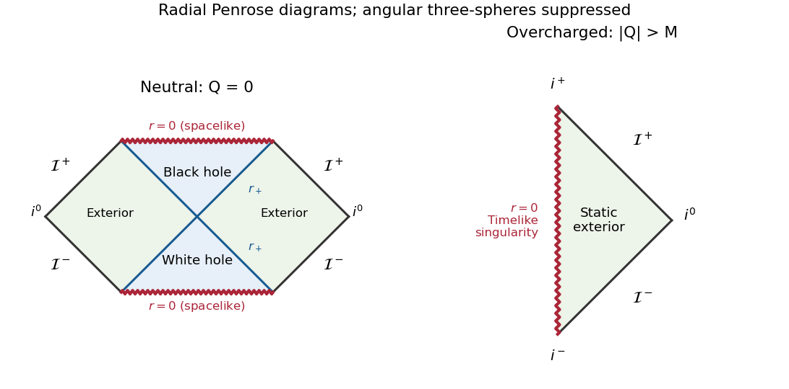
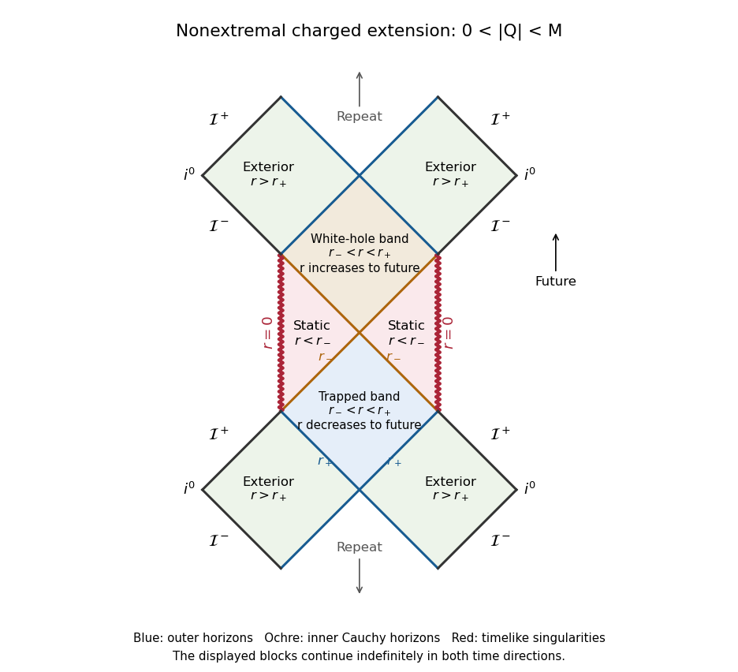
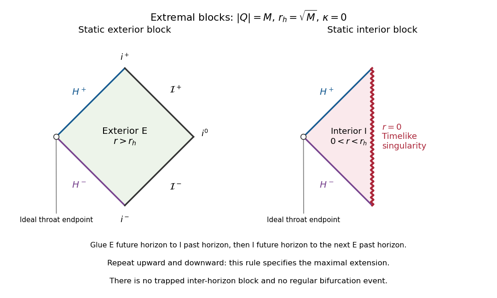

# Paper 57

↑ **Parent:** [Iii](../iii.md)

[https://www.maths.cam.ac.uk/postgrad/part-iii/files/pastpapers/2004/Paper57.pdf](https://www.maths.cam.ac.uk/postgrad/part-iii/files/pastpapers/2004/Paper57.pdf)

**Table of contents**

- [1](#1)
  - [Solution](#1/solution)
- [2](#2)
  - [Solution](#2/solution)
- [3](#3)
  - [Solution](#3/solution)
- [4](#4)
  - [i](#4/i)
    - [Solution](#4/i/solution)
  - [ii](#4/ii)
    - [Solution](#4/ii/solution)
  - [iii](#4/iii)
    - [Solution](#4/iii/solution)
  - [iv](#4/iv)
    - [Solution](#4/iv/solution)
  - [v](#4/v)
    - [Solution](#4/v/solution)
  - [vi](#4/vi)
    - [Solution](#4/vi/solution)

## 1

↑ **Parent:** [Paper 57](paper-57.md)

<h3 id="1/solution">Solution</h3>

↑ **Parent:** [1](#1)

A stationary [black hole](../../../general-relativity.md#black-hole) behaves mechanically like an equilibrium thermodynamic system. Its horizon area A, asymptotic energy E, [angular momentum](../../../classical-mechanics.md#angular-momentum) J and [electric charge](../../../electromagnetism.md#electric-charge) Q are linked by the [laws of black-hole mechanics](../../../general-relativity.md#laws-of-black-hole-mechanics). Let $\chi^a=t^a+\Omega_H\phi^a$ generate its [Killing horizon](../../../general-relativity.md#killing-horizon), with the time translation normalized at infinity; its [surface gravity](../../../general-relativity.md#surface-gravity) is defined by $\chi^b\nabla_b\chi^a=\kappa\chi^a$ on that horizon. We use $c=1$ and keep G explicit. The horizon electrostatic potential $\Phi_H$ is measured relative to infinity.

The [Zeroth law of black-hole mechanics](../../../general-relativity.md#zeroth-law-of-black-hole-mechanics) states that kappa is constant on each connected stationary horizon, under the Einstein equations and suitable energy/regularity assumptions. It parallels the [zeroth law of thermodynamics](../../../thermodynamics.md#zeroth-law-of-thermodynamics), which makes [temperature](../../../thermodynamics.md#temperature) uniform in equilibrium. Kappa need not be constant in a dynamical geometry. For an asymptotically flat static hole, local observers see gravitationally redshifted temperatures; the equilibrium quantity comparable to kappa is the [temperature](../../../thermodynamics.md#temperature) referenced to infinity.

The [First law of black-hole mechanics](../../../general-relativity.md#first-law-of-black-hole-mechanics) relates nearby stationary solutions:

$$
\boxed{\delta E=\frac{\kappa}{8\pi G}\delta A+\Omega_H\delta J+\Phi_H\delta Q.}
$$

The same leading relation describes a small physical process which perturbs a horizon and subsequently settles to equilibrium, with the appropriate hypotheses on fluxes and final state. The work terms correspond to rotational and electromagnetic work. The structural analogy with the [first law of thermodynamics](../../../thermodynamics.md#first-law-of-thermodynamics), $dE=T\,dS+\text{work}$, identifies area as an entropy-like variable and [surface gravity](../../../general-relativity.md#surface-gravity) as a temperature-like variable. Classically this fixes their product in the first law, rather than their separate normalizations.

The [second law of black-hole mechanics](../../../general-relativity.md#second-law-of-black-hole-mechanics), or [black-hole area theorem](../../../general-relativity.md#hawking-s-area-theorem), states that future event-horizon area does not decrease classically. Its essential geometric ingredient is the [Raychaudhuri equation](../../../cosmology.md#friedmann-acceleration-equation) for affinely parametrized null generators. In four dimensions a hypersurface-orthogonal congruence obeys

$$
\frac{d\vartheta}{d\lambda}=-\frac12\vartheta^2-\sigma_{ab}\sigma^{ab}-R_{ab}k^ak^b.
$$

The [null energy condition](../../../general-relativity.md#null-energy-condition) and Einstein equations make the last term nonpositive. If the expansion became negative, the inequality would focus the generators to a [conjugate point](../../../calculus-of-variations.md#conjugate-point) in finite [affine parameter](../../../riemannian-geometry.md#affine-parameter). Under future completeness and predictability assumptions, that would conflict with their remaining on an achronal [event horizon](../../../general-relativity.md#event-horizon). Thus $\vartheta\geq0$, and the area element, satisfying $d\log dA/d\lambda=\vartheta$, cannot decrease. For a merger the final area is at least the sum of the initial component areas. These assumptions matter: the theorem is a classical statement, not a prohibition of quantum evaporation.

The [third law of black-hole mechanics](../../../general-relativity.md#third-law-of-black-hole-mechanics) is an unattainability statement: a nonextremal hole cannot be driven to zero [surface gravity](../../../general-relativity.md#surface-gravity) in a finite physical process satisfying the usual bounded-stress and regularity conditions. This parallels the unattainability form of the [Third law of thermodynamics](../../../thermodynamics.md#third-law-of-thermodynamics). Extremal stationary solutions exist, so the law concerns how an initially nonextremal hole approaches them. The stronger [entropy](../../../thermodynamics.md#entropy) form of Nernst's theorem does not transfer unchanged: extremal holes can have finite area and [entropy](../../../thermodynamics.md#entropy), depending on their conserved charges.

Quantum field theory turns the mechanical analogy into a physical thermodynamic identification. [Hawking radiation](../../../general-relativity.md#hawking-radiation) is thermal at infinity to leading semiclassical order, with

$$
\boxed{T_H=\frac{\hbar\kappa}{2\pi k_B},\qquad S_{\rm BH}=\frac{k_B A}{4G\hbar}.}
$$

These give $T_H\delta S_{\rm BH}=\kappa\delta A/(8\pi G)$ exactly, so the mechanical first law becomes the thermodynamic first law with [Bekenstein-Hawking entropy](../../../general-relativity.md#bekenstein-hawking-entropy). Scattering through the exterior adds [greybody factors](../../../general-relativity.md#greybody-factor) to the emitted spectrum but leaves this [temperature](../../../thermodynamics.md#temperature) identification intact. Equilibrium with an external bath and isolated evaporation are different physical states of the field.

During [black-hole evaporation](../../../general-relativity.md#black-hole-evaporation), the area can decrease because the semiclassical stress tensor need not satisfy the classical [null energy condition](../../../general-relativity.md#null-energy-condition). The proposed [generalized second law](../../../general-relativity.md#generalized-second-law) applies instead to $S_{\rm gen}=S_{\rm BH}+S_{\rm outside}$, asserting nondecrease of the combined [entropy](../../../thermodynamics.md#entropy). A Schwarzschild hole illustrates an unusual thermodynamic property: $T_H\propto E^{-1}$, so its [heat capacity](../../../thermodynamics.md#heat-capacity) is negative. It becomes hotter as it loses energy and is unstable in a simple canonical heat bath, while [entropy](../../../thermodynamics.md#entropy) and energy laws still describe an isolated system. The quantum [temperature](../../../thermodynamics.md#temperature), area [entropy](../../../thermodynamics.md#entropy) and [generalized second law](../../../general-relativity.md#generalized-second-law) supply the correspondence; the mechanical laws alone do not establish a thermal emission spectrum or a microscopic [entropy](../../../thermodynamics.md#entropy) count.

## 2

↑ **Parent:** [Paper 57](paper-57.md)

<h3 id="2/solution">Solution</h3>

↑ **Parent:** [2](#2)

An [orthonormal tetrad](../../../general-relativity.md#orthonormal-frame-in-spacetime), or [vierbein](../../../general-relativity.md#orthonormal-coframe-in-spacetime), is a local basis $e_I{}^a$ of tangent vectors together with inverse coframe $e_a{}^I$, satisfying $g_{ab}e_I{}^ae_J{}^b=\eta_{IJ}$ and $g_{ab}=e_a{}^Ie_b{}^J\eta_{IJ}$. Capital indices label the locally orthonormal Lorentz frame; lower-case indices label spacetime coordinates. Changing the frame by a local [Lorentz transformation](../../../special-relativity.md#lorentz-transformation) leaves the metric unchanged. A [spinor](../../../algebra.md#spinor) description uses a compatible local spin frame and the torsion-free [spin connection](../../../connection-1-form.md#spin-connection).

Let fixed flat matrices satisfy $\{\Gamma_I,\Gamma_J\}=2\eta_{IJ}\mathbf1$. The [curved spacetime gamma matrices](../../../general-relativity.md#curved-spacetime-gamma-matrices) are $\gamma_a=e_a{}^I\Gamma_I$ and $\gamma^a=e_I{}^a\Gamma^I$. Therefore

$$
\boxed{\{\gamma_a,\gamma_b\}=e_a{}^Ie_b{}^J\{\Gamma_I,\Gamma_J\}=2g_{ab}\mathbf1.}
$$

The identity matrix is four by four for a four-dimensional [Dirac spinor](../../../relativistic-quantum-field.md#dirac-spinor). The combined tensor/spin [covariant derivative](../../../general-relativity.md#covariant-derivative) makes $\nabla_a\gamma_b=0$, the Clifford version of the [tetrad postulate](../../../connection-1-form.md#tetrad-postulate).

Fix the curvature slots by $R_{abcd}=g_{ae}R^e{}_{bcd}$, with $[\nabla_c,\nabla_d]v^a=R^a{}_{bcd}v^b$, and $R=g^{ac}g^{bd}R_{abcd}$. The torsion-free [spin connection](../../../connection-1-form.md#spin-connection) then has $[\nabla_a,\nabla_b]\psi=\tfrac14R_{abcd}\gamma^c\gamma^d\psi$. These choices fix the signs in the requested identities.

Write $\gamma^{ab}=\gamma^{[a}\gamma^{b]}$ and similarly for four indices. Clifford anticommutation gives

$$
\begin{aligned}
\gamma^a\gamma^b\gamma^c\gamma^d={}&\gamma^{abcd}+g^{ab}\gamma^{cd}-g^{ac}\gamma^{bd}+g^{ad}\gamma^{bc}\\
&+g^{bc}\gamma^{ad}-g^{bd}\gamma^{ac}+g^{cd}\gamma^{ab}\\
&+(g^{ab}g^{cd}-g^{ac}g^{bd}+g^{ad}g^{bc})\mathbf1.
\end{aligned}
$$

On contraction with the [Riemann curvature tensor](../../../general-relativity.md#riemann-curvature-tensor), the four-form term vanishes by the [first Bianchi identity](../../../general-relativity.md#first-bianchi-identity). The first and last two-form terms vanish by pair antisymmetry; the remaining two-form terms are symmetric Ricci contractions against antisymmetric gamma matrices and vanish too. The scalar terms are zero, minus R and minus R respectively. Thus the [Riemann tensor Clifford contraction](../../../relativistic-quantum-field.md#riemann-tensor-clifford-contraction) is

$$
\boxed{R_{abcd}\gamma^a\gamma^b\gamma^c\gamma^d=-2R\mathbf1.}
$$

This algebraic result is independent of Lorentz signature when the contraction convention is held fixed.

Apply the Dirac operator twice, using covariant constancy of the gamma matrices. Define the rough wave operator by $\Box=g^{ab}\nabla_a\nabla_b$, with the full connection acting on the intermediate covector-spinor derivative. Splitting the product into symmetric and antisymmetric parts gives

$$
\begin{aligned}
(\gamma^a\nabla_a)^2\psi&=\Box\psi+\frac12\gamma^{ab}[\nabla_a,\nabla_b]\psi\\
&=\Box\psi+\frac18R_{abcd}\gamma^a\gamma^b\gamma^c\gamma^d\psi=(\Box-R/4)\psi.
\end{aligned}
$$

Consequently the [Lichnerowicz spinor-square formula](../../../relativistic-quantum-field.md#lichnerowicz-spinor-square-formula) and the assumed massless [Dirac equation](../../../relativistic-quantum-field.md#dirac-equation) imply $\boxed{(\Box-R/4)\psi=0}$. Torsion would modify the commutator and introduce extra terms, so the [torsion-free connection](../../../fiber-bundle.md#torsion-free-connection) is part of this argument.

## 3

↑ **Parent:** [Paper 57](paper-57.md)

<h3 id="3/solution">Solution</h3>

↑ **Parent:** [3](#3)

Keep the unit-normal sign explicit: $n^an_a=\varepsilon\in\{+1,-1\}$. Since the hypersurface is spacelike its normal is timelike. Construct

$$
n_a=\pm\frac{\nabla_af}{\sqrt{|g^{bc}\nabla_bf\nabla_cf|}},\qquad h_{ab}=g_{ab}-\varepsilon n_an_b,\qquad h_a{}^b=\delta_a{}^b-\varepsilon n_an^b.
$$

Choose the sign of n for the desired time orientation. The pullback of h is the nondegenerate [induced metric](../../../riemannian-geometry.md#induced-metric). The [second fundamental form](../../../second-fundamental-form.md) is

$$
\boxed{K_{ab}=h_a{}^ch_b{}^d\nabla_cn_d.}
$$

Its sign reverses when n reverses. It is tangential in both indices and symmetric: the antisymmetric part of the derivative of a normalized gradient vanishes after both tangential projections. Equivalently it is the projected Hessian of f divided by the normalizing factor. This is the normal-change definition of [extrinsic curvature](../../../differential-geometry.md#extrinsic-curvature).

For tangent vector fields X,Y, let D be the induced [Levi-Civita connection](../../../general-relativity.md#levi-civita-connection). Orthogonality to n gives the derivative decomposition

$$
\nabla_XY=D_XY-\varepsilon K(X,Y)n,\qquad g(\nabla_Xn,Y)=K(X,Y).
$$

Use the curvature convention of the preceding solution, $R(X,Y)Z=[\nabla_X,\nabla_Y]Z-\nabla_{[X,Y]}Z$. Substitute the decomposition twice and take its tangential component. Terms differentiated normally cancel, while the two normal components contribute the quadratic shape terms:

$$
P R^{(4)}(X,Y)Z=R^{(3)}(X,Y)Z-\varepsilon\{K(Y,Z)\nabla_Xn-K(X,Z)\nabla_Yn\}.
$$

Lowering the first curvature index gives the [Gauss equation for a nonnull hypersurface](../../../second-fundamental-form.md#gauss-equation-for-a-nonnull-hypersurface)

$$
\boxed{{}^{(3)}R_{abcd}=h_a{}^eh_b{}^fh_c{}^gh_d{}^k{}^{(4)}R_{efgk}+\varepsilon(K_{ac}K_{bd}-K_{ad}K_{bc}).}
$$

All four displayed indices on the left are tangential.

Contract with $h^{ac}h^{bd}$ and use $h^{ab}=g^{ab}-\varepsilon n^an^b$ for tangential contractions. The double-normal term vanishes by curvature antisymmetry and each mixed contraction is ambient [Ricci curvature](../../../second-fundamental-form.md#ricci-curvature). With $K=h^{ab}K_{ab}$ this gives

$$
\boxed{{}^{(3)}R={}^{(4)}R-2\varepsilon\,{}^{(4)}R_{ab}n^an^b+\varepsilon(K^2-K_{ab}K^{ab}).}
$$

This also records which metric and curvature conventions enter the sign.

In vacuum without a cosmological constant, the ambient [Ricci tensor](../../../general-relativity.md#ricci-tensor) and scalar vanish. A [totally umbilic hypersurface](../../../second-fundamental-form.md#totally-umbilic-hypersurface) has $K_{ab}=\lambda h_{ab}$, so $K=3\lambda$ and $K_{ab}K^{ab}=3\lambda^2$. Therefore the [scalar curvature of an umbilic vacuum hypersurface](../../../second-fundamental-form.md#scalar-curvature-of-an-umbilic-vacuum-hypersurface) is $6\varepsilon\lambda^2$.

To express the requested nonnegative version, take Lorentz signature $(+---)$, so the timelike [unit normal](../../../differential-geometry.md#unit-normal) has $\varepsilon=+1$ and h is the induced negative-definite spatial metric. Then

$$
\boxed{{}^{(3)}R=6\lambda^2=\frac23K^2\geq0.}
$$

If instead one uses signature $(-+++)$ and its positive-definite spatial metric with the same curvature-slot convention, the scalar is $-6\lambda^2$. Replacing h by $-h$ reverses its scalar curvature. Thus the printed inequality has a signature/induced-metric convention built into it; the general formula above makes that choice explicit rather than losing the sign. The metric in the separate final question explicitly uses the mostly-plus signature.

## 4

↑ **Parent:** [Paper 57](paper-57.md)

<h3 id="4/i">i</h3>

↑ **Parent:** [4](#4)

<h4 id="4/i/solution">Solution</h4>

↑ **Parent:** [I](#4/i)

A positive-radius horizon occurs at a zero of V. Set $u=r^2>0$; multiplying by $r^4$ gives $u^2-2Mu+Q^2=0$. Thus real roots require $M^2-Q^2\geq0$. With $M>0$, the horizon condition and radii are

$$
\boxed{|Q|\leq M,\qquad r_\pm^2=M\pm\sqrt{M^2-Q^2}.}
$$

For $0<|Q|<M$ both roots are positive, giving an outer [event horizon](../../../general-relativity.md#event-horizon) and an inner [Cauchy horizon](../../../general-relativity.md#cauchy-horizon). For $|Q|=M$ they coincide at $r_h=\sqrt M$. For $Q=0$ only $r_+=\sqrt{2M}$ is a horizon: the formal root $u=0$ was introduced by multiplication and is the singular origin, where the original expression for V is undefined. For $|Q|>M$ there is no horizon and the central singularity is naked. Each positive root is regular in ingoing coordinates $v=t+r_*$, where the radial metric is $-Vdv^2+2dv\,dr$.

<h3 id="4/ii">ii</h3>

↑ **Parent:** [4](#4)

<h4 id="4/ii/solution">Solution</h4>

↑ **Parent:** [Ii](#4/ii)

At a horizon, use $Q^2=2Mr_0^2-r_0^4$ in $V'(r)=4M/r^3-4Q^2/r^5$ to obtain $V'(r_0)=4(r_0^2-M)/r_0^3$. A double root therefore requires $r_0^2=M$, and the horizon equation then gives $Q^2=M^2$. Conversely at $|Q|=M$,

$$
V(r)=\left(1-\frac M{r^2}\right)^2,\qquad V'(\sqrt M)=0,\qquad V''(\sqrt M)=\frac8M\ne0.
$$

Hence $\boxed{|Q|=M\text{ gives a degenerate horizon at }r_h=\sqrt M}$. It is a [degenerate Killing horizon](../../../general-relativity.md#degenerate-killing-horizon) of an [extremal black hole](../../../general-relativity.md#extremal-black-hole). For distinct charged roots, the normalized signed surface gravities are $\kappa_\pm=\pm2\sqrt{M^2-Q^2}/r_\pm^3$, so neither is degenerate. The neutral positive-radius horizon is also simple.

<h3 id="4/iii">iii</h3>

↑ **Parent:** [4](#4)

<h4 id="4/iii/solution">Solution</h4>

↑ **Parent:** [Iii](#4/iii)

Suppress the angular three-spheres and use radial [null coordinates](../../../general-relativity.md#null-coordinate) $u=t-r_*$, $v=t+r_*$ with $dr_*/dr=1/V$. Compactifying these [null coordinates](../../../general-relativity.md#null-coordinate) puts radial light rays at 45 degrees in the [Penrose diagram](../../../general-relativity.md#penrose-diagram). Simple zeros of V give logarithmic ends of the [tortoise coordinate](../../../general-relativity.md#tortoise-coordinate) and are crossed by regular null charts. The sign of V distinguishes static blocks, where r is spacelike, from inter-horizon blocks, where r is timelike.

The center is a genuine [curvature singularity](../../../general-relativity.md#curvature-singularity). An orthonormal-frame calculation gives the [Kretschmann scalar of a five-dimensional charged black hole](../../../general-relativity.md#kretschmann-scalar-of-a-five-dimensional-charged-black-hole)

$$
R_{abcd}R^{abcd}=(V'')^2+6(V'/r)^2+12((1-V)/r^2)^2=\frac{288M^2}{r^8}-\frac{720MQ^2}{r^{10}}+\frac{508Q^4}{r^{12}}.
$$

It diverges at zero radius and is finite at positive horizons. Since the normal to a constant-r hypersurface has squared norm V, the singular boundary is spacelike when V is negative near zero and timelike when V is positive there.

For $Q=0$, V is negative inside the sole horizon and the maximal extension is Schwarzschild-like: two asymptotically flat exteriors, a future black-hole triangle ending at a spacelike singularity, and a past [white hole](../../../general-relativity.md#white-hole) triangle beginning at a spacelike singularity. The two pairs of horizon branches meet at a regular bifurcation sphere.

For $|Q|>M$, V is positive for every positive r. The radial conformal domain is a single exterior with a timelike [naked singularity](../../../general-relativity.md#naked-singularity) at its left boundary and the usual past/future null infinities on its outer boundaries. There is no horizon. These two cases are shown together below; red zigzags denote curvature singularities.

**[Figure 1](#4/iii/image-neutral-and-overcharged-radial-penrose-diagrams-in-five-dimensions). Neutral and overcharged radial Penrose diagrams in five dimensions**.

For $0<|Q|<M$, the exterior $r>r_+$ and deep interior $0<r<r_-$ are static, while $r_-<r<r_+$ is a trapped or time-reversed band. The outer roots are [event horizons](../../../general-relativity.md#event-horizon) for a chosen exterior, and the inner roots are [Cauchy horizons](../../../general-relativity.md#cauchy-horizon). The center is timelike because $V\sim Q^2/r^4>0$ there. In the exact analytic extension, crossing successive inner and outer horizon branches produces an infinite succession of exterior, trapped, inner-static and [white hole](../../../general-relativity.md#white-hole) blocks. The following finite strip specifies the repetition; it does not terminate the spacetime at the drawing's upper or lower edge.

**[Figure 2](#4/iii/image-repeated-nonextremal-charged-blocks-with-outer-and-inner-horizons-and-timelike-singularities). Repeated nonextremal charged blocks with outer and inner horizons and timelike singularities**.

For $|Q|=M$, $V=(1-M/r^2)^2$ is nonnegative on both sides of $r_h=\sqrt M$. There is no inter-horizon trapped band. Near the horizon, $r_*\sim-M/[4(r-r_h)]$, so the horizon is an infinite throat end of each static coordinate block. It is null and degenerate, without a regular bifurcation surface. The extension consists of alternating exterior and inner-static blocks, with timelike singularities in the latter. The separate conformal blocks below, together with their future-to-past horizon gluing rule, describe the full repeated extension. The open throat endpoints are ideal boundaries, not additional events where horizon branches meet.

**[Figure 3](#4/iii/image-extremal-static-conformal-blocks-and-the-gluing-rule-for-their-maximal-extension). Extremal static conformal blocks and the gluing rule for their maximal extension**.

Thus the neutral, strictly subextremal charged, extremal and overcharged cases all have distinct causal structures. These drawings describe the maximal analytic stationary metrics. The additional angular dimension changes areas and curvature falloff, but does not change these radial causal block types.

<h3 id="4/iv">iv</h3>

↑ **Parent:** [4](#4)

<h4 id="4/iv/solution">Solution</h4>

↑ **Parent:** [Iv](#4/iv)

The [Wick rotation](../../../perturbative-quantum-field-theory.md#wick-rotation) gives the radial [Euclidean metric](../../../differential-geometry.md#euclidean-metric) $ds_E^2=Vd\tau^2+dr^2/V$. For a simple root, write $b=V'(r_0)\ne0$ and choose the side with V positive. There $r-r_0=b\rho^2/4$ for $\rho\geq0$, so $V=b^2\rho^2/4+O(\rho^4)$ and

$$
\boxed{ds_E^2=d\rho^2+\frac{b^2}{4}\rho^2d\tau^2+O(\rho^2)d\rho^2+O(\rho^4)d\tau^2.}
$$

The leading geometry is a plane in polar coordinates with angle $\varphi=|b|\tau/2$. For a time identification of period beta, the circumference/proper-radius ratio approaches $|b|\beta/2$. Unless it is exactly $2\pi$, the origin is a [conical singularity](../../../riemannian-geometry.md#conical-singularity), with deficit $2\pi-|b|\beta/2$ or an excess if this is negative. This is the [Euclidean metric near a simple static horizon](../../../general-relativity.md#euclidean-metric-near-a-simple-static-horizon), rather than a divergent Lorentzian curvature invariant at the horizon. The side with V negative does not give a positive-definite metric under this real [Wick rotation](../../../perturbative-quantum-field-theory.md#wick-rotation).

<h3 id="4/v">v</h3>

↑ **Parent:** [4](#4)

<h4 id="4/v/solution">Solution</h4>

↑ **Parent:** [V](#4/v)

Smoothness requires the polar angle $|V'(r_0)|\tau/2$ to have period exactly $2\pi$. Therefore Euclidean time must be identified by

$$
\boxed{\tau\sim\tau+\beta_0,\qquad\beta_0=\frac{4\pi}{|V'(r_0)|}=\frac{2\pi}{|\kappa_0|}.}
$$

A nontrivial integer multiple of this fundamental period still gives an excess-angle cone at the tip; it is not a smooth plane there. The static time has already been normalized at infinity because V tends to one.

For distinct charged roots, writing $d=\sqrt{M^2-Q^2}$ gives $\beta_\pm=\pi r_\pm^3/d$. These unequal periods cannot simultaneously remove both simple-root cones using one common time identification; the outer and inner static Euclidean regions are in any case separated by a band where V is negative. The physically relevant asymptotically flat exterior uses $\beta_+$. The neutral outer horizon gives $\beta_+=2\pi\sqrt{2M}$.

<h3 id="4/vi">vi</h3>

↑ **Parent:** [4](#4)

<h4 id="4/vi/solution">Solution</h4>

↑ **Parent:** [Vi](#4/vi)

In natural units, periodic Euclidean time of period beta is the inverse [temperature](../../../thermodynamics.md#temperature) of a thermal quantum state. The horizon regularity calculation therefore gives the [Hawking temperature](../../../general-relativity.md#hawking-temperature)

$$
\boxed{T_H=\frac1{\beta_+}=\frac{V'(r_+)}{4\pi}=\frac{\kappa_+}{2\pi}=\frac{\sqrt{M^2-Q^2}}{\pi r_+^3}.}
$$

This agrees with the radiation calculation based on the near-horizon redshift. Restoring constants with $c=1$ multiplies the expression $\kappa_+/(2\pi)$ by $\hbar/k_B$. In the neutral case $T_H=1/(2\pi\sqrt{2M})$; the [temperature](../../../thermodynamics.md#temperature) is positive for every nonextremal outer horizon.

The extremal limit is different. At $|Q|=M$, $V\sim4(r-r_h)^2/M$, so the proper Euclidean radial distance to the horizon diverges logarithmically. This [extremal Euclidean throat](../../../general-relativity.md#extremal-euclidean-throat) is an infinite end, with no finite polar origin on which to impose the cone-removal condition. Local smoothness therefore does not select a finite period by the preceding argument. The vanishing [surface gravity](../../../general-relativity.md#surface-gravity) and the nonextremal limit give $\boxed{T_H=0\text{ at extremality}}$, rather than a universally nonzero [temperature](../../../thermodynamics.md#temperature) for all horizon solutions. A geometry with $|Q|>M$ has no black-hole horizon and no [Hawking temperature](../../../general-relativity.md#hawking-temperature) inferred from this horizon argument.

## ↑ Ancestors (8)

1. [Iii](../iii.md)
2. [2004](../../2004.md)
3. [Past exam of the mathematics course of the University of Cambridge](../../../past-exam-of-the-mathematics-course-of-the-university-of-cambridge.md)
4. [Mathematics course of the University of Cambridge](../../../university-of-cambridge.md#mathematics-course-of-the-university-of-cambridge)
5. [Course of the University of Cambridge](../../../university-of-cambridge.md#course-of-the-university-of-cambridge)
6. [University of Cambridge](../../../university-of-cambridge.md)
7. [List of universities](../../../README.md#list-of-universities)
8. [Codex Wiki](../../../README.md)
