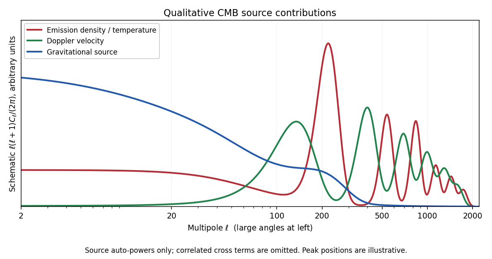

<h1 id="4/c/solution">Solution</h1>

↑ **Parent:** [C](../c.md)

The emission-density term is the intrinsic temperature fluctuation: blackbody radiation has $\delta\rho_\gamma/\rho_\gamma=4\Delta T/T$, hence the factor $1/4$. Adiabatic compression and rarefaction of the photon-baryon fluid create coherent density extrema at last scattering. Their projection produces acoustic peaks, with angular scale set by the [sound horizon](../../../../../../sound-horizon.md) divided by the distance to last scattering. In a familiar nearly flat cosmology the first prominent temperature peak is around degree scales, $\ell$ of order a few hundred; precise positions depend on the background.

The velocity term is a [Doppler effect](../../../../../../doppler-effect.md) from the emitting plasma's line-of-sight motion. The acoustic velocity is approximately a quarter-cycle out of phase with the density oscillation. Its projected contribution is strongest on acoustic and smaller angular scales and interleaves with density extrema, with projection broadening its features. Both sources are suppressed on sufficiently small scales by [Silk damping](../../../../../../cosmic-microwave-background-diffusion-damping.md) and the finite thickness of last scattering.

The [metric tensor](../../../../../../metric-tensor.md) [integral](../../../../../../integral.md) describes photon-energy shifts during propagation through the changing perturbed geometry. In synchronous coordinates its split from the intrinsic endpoint term is gauge dependent. Rewriting the observable in Newtonian variables produces the usual emission [Sachs-Wolfe effect](../../../../../../sachs-wolfe-effect.md) and the [Integrated Sachs-Wolfe effect](../../../../../../integrated-sachs-wolfe-effect.md) from evolving potentials, with the appropriate endpoint terms. The ordinary large-scale Sachs-Wolfe combination gives a low-multipole plateau for nearly scale-invariant initial curvature power. Late-time evolving potentials chiefly affect large angles, often $\ell\lesssim20$; evolution near radiation-matter equality also drives an early integrated contribution near the first acoustic peak. Static matter-era potentials do not produce that Newtonian integrated contribution.

All emission quantities are evaluated at the last-scattering endpoint and the [metric tensor](../../../../../../metric-tensor.md) source along the unperturbed photon ray, not at a single fixed spatial point throughout the [integral](../../../../../../integral.md). Observer monopole/dipole conventions do not change this physical interpretation.

**[Figure 1](#4/c/image-schematic-density-doppler-and-gravitational-contributions-to-cmb-angular-power-with-correlated-cross-terms-omitted). Schematic density, Doppler and gravitational contributions to CMB angular power, with correlated cross terms omitted**.

The sketch uses arbitrary units and representative scales. It displays source auto-power shapes, not measured data or an assertion that the total power is their simple sum. The terms are correlated; their cross-power contributions and the gauge-consistent endpoint combination are essential in an actual angular-spectrum calculation.

## ↑ Ancestors (11)

1. [C](../c.md)
2. [4](../../4.md)
3. [Paper 59](../../../paper-59-split.md)
4. [Iii](../../../split.md)
5. [2004](../../../../split.md)
6. [Past exam of the mathematics course of the University of Cambridge](../../../../../split.md)
7. [Mathematics course of the University of Cambridge](../../../../../../mathematics-course-of-the-university-of-cambridge.md)
8. [Course of the University of Cambridge](../../../../../../course-of-the-university-of-cambridge.md)
9. [University of Cambridge](../../../../../../university-of-cambridge-split.md)
10. [List of universities](../../../../../../list-of-universities.md)
11. [Codex Wiki](../../../../../../split.md)
