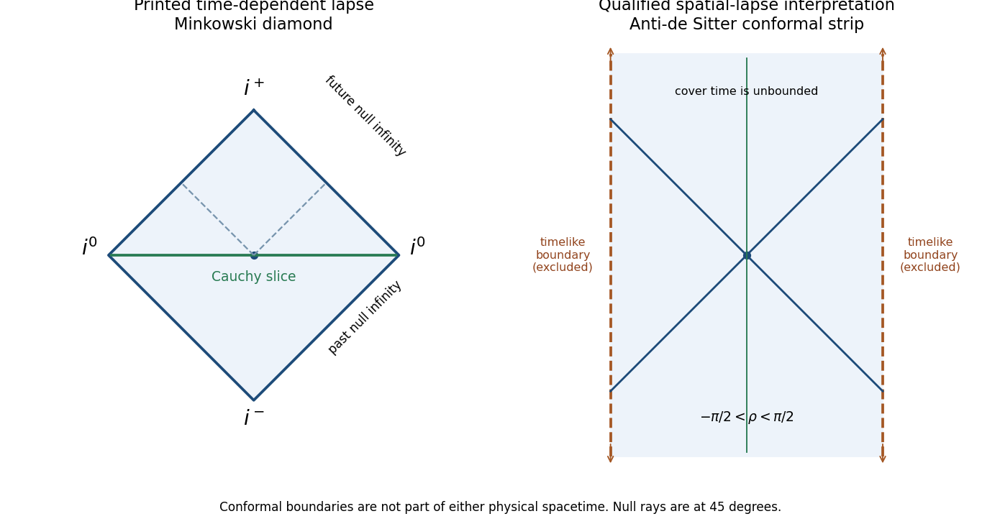

<h1 id="5/b/solution">Solution</h1>

↑ **Parent:** [B](../b.md)

For the printed [metric tensor](../../../../../../metric-tensor.md), first use the global Minkowski time $T=\sinh t$. Set

$$
u=T-x,\quad v=T+x,\quad U=\arctan u,\quad V=\arctan v,
\quad\mathcal T=U+V,\quad\mathcal X=V-U.
$$

Then

$$
ds^2=\frac{-d\mathcal T^2+d\mathcal X^2}{4\cos^2U\cos^2V},
\qquad\boxed{|\mathcal T|+|\mathcal X|<\pi.}
$$

Removing the positive [conformal factor](../../../../../../conformal-factor.md) yields the ordinary [Penrose diagram](../../../../../../penrose-diagram.md) of two-dimensional [Minkowski spacetime](../../../../../../minkowski-spacetime.md): a diamond with null future/past infinity on its sloping edges, timelike infinity at the top/bottom, and spatial infinity at the left/right corners. [Null geodesics](../../../../../../null-geodesic.md) have slope $\pm1$; future/past causal cones are ordinary Minkowski cones. There is no physical boundary or curvature singularity at a finite original coordinate value.

For the alternative spatial-lapse [metric tensor](../../../../../../metric-tensor.md) identified in part (a), set $\rho=\arctan(\sinh x)$. Then $dx=\sec\rho\,d\rho$ and $\cosh x=\sec\rho$, so

$$
\boxed{ds^2=\sec^2\rho(-dt^2+d\rho^2),\qquad
-\pi/2<\rho<\pi/2.}
$$

Its universal-cover conformal diagram is an infinitely tall strip with two timelike conformal boundaries, the [conformal strip of two-dimensional anti-de Sitter spacetime](../../../../../../conformal-strip-of-two-dimensional-anti-de-sitter-spacetime.md). [Null geodesics](../../../../../../null-geodesic.md) reach either boundary in finite coordinate time, though the boundary is not part of the physical manifold and the physical null affine parameter diverges there. The strip and diamond have different causal structures; no conformal coordinate change can identify their global causal properties.

**[Figure 2](#5/b/image-the-minkowski-diamond-for-the-printed-time-dependent-lapse-and-the-ads-conformal-strip-for-the-explicitly-qualified-spatial-lapse-interpretation). The Minkowski diamond for the printed time-dependent lapse and the AdS conformal strip for the explicitly qualified spatial-lapse interpretation**.

## ↑ Ancestors (11)

1. [B](../b.md)
2. [5](../../5.md)
3. [Paper 59](../../../paper-59-split.md)
4. [Iii](../../../split.md)
5. [2004](../../../../split.md)
6. [Past exam of the mathematics course of the University of Cambridge](../../../../../split.md)
7. [Mathematics course of the University of Cambridge](../../../../../../mathematics-course-of-the-university-of-cambridge.md)
8. [Course of the University of Cambridge](../../../../../../course-of-the-university-of-cambridge.md)
9. [University of Cambridge](../../../../../../university-of-cambridge-split.md)
10. [List of universities](../../../../../../list-of-universities.md)
11. [Codex Wiki](../../../../../../split.md)
