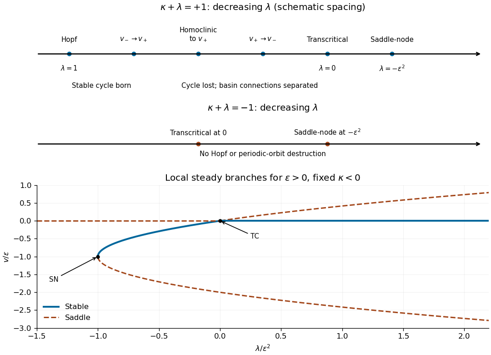

# Paper 60

↑ **Parent:** [Iii](../iii.md)

[https://www.maths.cam.ac.uk/postgrad/part-iii/files/pastpapers/2004/Paper60.pdf](https://www.maths.cam.ac.uk/postgrad/part-iii/files/pastpapers/2004/Paper60.pdf)

**Table of contents**

- [1](#1)
  - [a](#1/a)
    - [Solution](#1/a/solution)
  - [b](#1/b)
    - [Solution](#1/b/solution)
  - [c](#1/c)
    - [Solution](#1/c/solution)
  - [d](#1/d)
    - [Solution](#1/d/solution)
  - [e](#1/e)
    - [Solution](#1/e/solution)
- [2](#2)
  - [a](#2/a)
    - [i](#2/a/i)
      - [Solution](#2/a/i/solution)
    - [ii](#2/a/ii)
      - [Solution](#2/a/ii/solution)
  - [b](#2/b)
    - [Solution](#2/b/solution)
- [3](#3)
  - [a](#3/a)
    - [Solution](#3/a/solution)
  - [b](#3/b)
    - [Solution](#3/b/solution)
  - [c](#3/c)
    - [Solution](#3/c/solution)
- [4](#4)
  - [a](#4/a)
    - [Solution](#4/a/solution)
  - [b](#4/b)
    - [Solution](#4/b/solution)
  - [c](#4/c)
    - [Solution](#4/c/solution)
  - [d](#4/d)
    - [Solution](#4/d/solution)

## 1

↑ **Parent:** [Paper 60](paper-60.md)

<h3 id="1/a">a</h3>

↑ **Parent:** [1](#1)

<h4 id="1/a/solution">Solution</h4>

↑ **Parent:** [A](#1/a)

For a vector $x$, its [isotropy group](../../../group-theory.md#stabilizer-subgroup) is the [stabilizer subgroup](../../../group-theory.md#stabilizer-subgroup)

$$
\boxed{G_x=\{g\in G:R_G(g)x=x\}.}
$$

For a [subgroup](../../../group.md#subgroup) $H\le G$, its [fixed-point subspace of a group action](../../../representation-theory.md#fixed-point-subspace-of-a-group-action) is

$$
\boxed{\operatorname{Fix}(H)=\{x\in\mathbb R^n:R_G(h)x=x\text{ for every }h\in H\}.}
$$

It is a [linear subspace](../../../vector-space.md#vector-subspace), the intersection of the [kernels](../../../linear-algebra.md#kernel-of-a-linear-map) of $R_G(h)-I$. The [subgroup](../../../group.md#subgroup) fixes a particular vector pointwise; the [fixed-point subspace of a group action](../../../representation-theory.md#fixed-point-subspace-of-a-group-action) consists of all vectors it fixes, and need not be one-dimensional.

<h3 id="1/b">b</h3>

↑ **Parent:** [1](#1)

<h4 id="1/b/solution">Solution</h4>

↑ **Parent:** [B](#1/b)

Suppose $f$ is sufficiently smooth and [equivariant](../../../group-theory.md#equivariant-map), $f(0,\mu)=0$, and the [group representation](../../../representation-theory.md#group-representation) on the critical space is [absolutely irreducible](../../../representation-theory.md#absolutely-irreducible-real-representation). Its [linearization](../../../algebra.md#linearization) is then $D_xf(0,\mu)=a(\mu)I$. Assume $a(0)=0$ and $a'(0)\ne0$. The [equivariant branching lemma](../../../dynamical-systems.md#equivariant-branching-lemma) states that **each isotropy [subgroup](../../../group.md#subgroup) $H$ with $\dim\operatorname{Fix}(H)=1$ has a local nontrivial branch of [equilibria](../../../dynamical-systems.md#equilibrium-point-of-a-dynamical-system) with that isotropy**, apart from the common origin. Conjugate isotropy [subgroups](../../../group.md#subgroup) give symmetry-related branches, so branch types are counted up to conjugacy.

To see the scalar mechanism, write the [fixed-point subspace of a group action](../../../representation-theory.md#fixed-point-subspace-of-a-group-action) as $\mathbb Re$ and restrict $f(se,\mu)=e\,h(s,\mu)$. [Equivariance](../../../group-theory.md#equivariant-map) makes the [fixed-point subspace of a group action](../../../representation-theory.md#fixed-point-subspace-of-a-group-action) invariant. Since $h(0,\mu)=0$, write $h=s\,k(s,\mu)$; $k(0,0)=0$ and $k_\mu(0,0)=a'(0)\ne0$. The [implicit function theorem](../../../calculus.md#implicit-function-theorem) solves $k(s,\mu(s))=0$ near zero. For small nonzero $s$, the [stabilizer subgroup](../../../group-theory.md#stabilizer-subgroup) is exactly that of $e$. A [normalizer](../../../group-theory.md#normalizer) element reversing $e$ makes $h$ odd and $\mu(s)$ even; the generic branch is then a [pitchfork bifurcation](../../../dynamical-systems.md#pitchfork-bifurcation-normal-form). The lemma ensures existence, not [dynamical stability](../../../dynamical-systems.md#stability-theory), and does not exclude further branches of smaller isotropy.

<h3 id="1/c">c</h3>

↑ **Parent:** [1](#1)

<h4 id="1/c/solution">Solution</h4>

↑ **Parent:** [C](#1/c)

Conjugating the coordinate [reflection](../../../linear-algebra.md#reflection-mathematics) by the rotations supplies [reflections](../../../linear-algebra.md#reflection-mathematics) in the other two coordinates. The quarter-turns, together with those [reflections](../../../linear-algebra.md#reflection-mathematics), also supply coordinate transpositions. Consequently the represented [group](../../../group.md) consists of all signed permutation [matrices](../../../vector-space.md#matrix), the full [symmetry group of a cube](../../../group-theory.md#symmetry-group-of-a-cube) of order $2^3\cdot3!=48$.

Let $C$ be any real or complex [matrix](../../../vector-space.md#matrix) commuting with the [group representation](../../../representation-theory.md#group-representation). Commutation with the three independent coordinate [reflections](../../../linear-algebra.md#reflection-mathematics) forces all off-diagonal entries of $C$ to vanish. Commutation with the quarter-turn about the first axis equates its second and third diagonal entries, and the quarter-turn about the second axis equates its first and third entries. Therefore

$$
\boxed{\operatorname{End}_\Gamma(\mathbb C^3)=\mathbb C I.}
$$

For completeness, if the complexified [group representation](../../../representation-theory.md#group-representation) had a proper invariant subspace, its [orthogonal complement](../../../hilbert-space.md#orthogonal-complement) would be invariant too, since the generating [matrices](../../../vector-space.md#matrix) are unitary. The [orthogonal projection](../../../hilbert-space.md#orthogonal-projection) onto that subspace would be a nonscalar commuting [matrix](../../../vector-space.md#matrix), contradicting the calculation. Thus the complexification is [irreducible](../../../representation-theory.md#irreducible-representation), proving **[absolute irreducibility](../../../representation-theory.md#absolute-irreducibility-of-a-group-representation)** of the real [group representation](../../../representation-theory.md#group-representation).

<h3 id="1/d">d</h3>

↑ **Parent:** [1](#1)

<h4 id="1/d/solution">Solution</h4>

↑ **Parent:** [D](#1/d)

Choose three representative vectors, with nonzero coordinate scale suppressed. Their [stabilizer subgroups](../../../group-theory.md#stabilizer-subgroup) and [fixed-point subspaces of a group action](../../../representation-theory.md#fixed-point-subspace-of-a-group-action) are

$$
\begin{array}{c|c|c|c}
\text{vector}&\text{stabilizer}&\text{order}&\text{fixed space}\\\hline
(1,0,0)&\langle r_x,\kappa_y,\kappa_z\rangle\cong D_4&8&\mathbb R(1,0,0)\\
(1,1,0)&\langle\kappa_z,\kappa_xr_z\rangle\cong C_2\times C_2&4&\mathbb R(1,1,0)\\
(1,1,1)&\langle\kappa_xr_z,\kappa_yr_x\rangle\cong S_3&6&\mathbb R(1,1,1).
\end{array}
$$

Here $\kappa_xr_z$ exchanges the first two coordinates and $\kappa_yr_x$ exchanges the last two. On the first line the [stabilizer subgroup](../../../group-theory.md#stabilizer-subgroup) is every signed permutation of the two zero coordinates; fixing it forces those coordinates to vanish. On the second line it exchanges the equal coordinates and independently reflects the zero coordinate, forcing $x=y,z=0$. On the third line all coordinate permutations fix the vector, forcing $x=y=z$.

The three [subgroups](../../../group.md#subgroup) have different orders and hence cannot be conjugate. Their [group orbits](../../../group-theory.md#orbit-of-a-group-action) contain respectively six face-axis, twelve edge-axis and eight vertex-axis directions. Each [fixed-point subspace of a group action](../../../representation-theory.md#fixed-point-subspace-of-a-group-action) is one-dimensional, so the [equivariant branching lemma](../../../dynamical-systems.md#equivariant-branching-lemma) guarantees **three distinct symmetry types of bifurcating [equilibria](../../../dynamical-systems.md#equilibrium-point-of-a-dynamical-system)**. The [axial isotropy types of the full cube symmetry group](../../../group-theory.md#axial-isotropy-types-of-the-full-cube-symmetry-group) are precisely these: a vector with several distinct nonzero absolute coordinate values has a separate freely variable coordinate block for each such value in the [fixed-point subspace of a group action](../../../representation-theory.md#fixed-point-subspace-of-a-group-action) of its [stabilizer subgroup](../../../group-theory.md#stabilizer-subgroup), giving dimension greater than one.

<h3 id="1/e">e</h3>

↑ **Parent:** [1](#1)

<h4 id="1/e/solution">Solution</h4>

↑ **Parent:** [E](#1/e)

Coordinate [reflection](../../../linear-algebra.md#reflection-mathematics) in $x_i$ requires the $i$th component to be odd in $x_i$, and [reflections](../../../linear-algebra.md#reflection-mathematics) in the other coordinates require it to be even in those coordinates. Thus no constant or quadratic terms are permitted. The only cubic monomials in component $i$ are $x_i^3$ and $x_ix_j^2$ for $j\ne i$. Coordinate permutations equate their coefficients in all components. After using the transverse linear [eigenvalue](../../../linear-operator-theory.md#eigenvalue) as parameter, the [normal form](../../../dynamical-systems.md#normal-form-dynamical-systems) is

$$
\boxed{\begin{aligned}
\dot x&=\mu x+a x^3+b x(y^2+z^2)+\cdots,\\
\dot y&=\mu y+a y^3+b y(z^2+x^2)+\cdots,\\
\dot z&=\mu z+a z^3+b z(x^2+y^2)+\cdots.
\end{aligned}}
$$

The remainder starts at fifth spatial order, together with parameter-dependent corrections such as $\mu|x|^3$. This is the [cubic equivariants of the full cube symmetry group](../../../dynamical-systems.md#cubic-equivariants-of-the-full-cube-symmetry-group) form. On a branch with $m=1,2,3$ equal nonzero absolute coordinates $s$, respectively,

$$
\mu+[a+(m-1)b]s^2=0.
$$

Hence the three leading branch amplitudes are $s^2=-\mu/a$, $-\mu/(a+b)$ and $-\mu/(a+2b)$. Their generic nonzero denominators determine on which side the branches occur; existence alone does not make them stable.

## 2

↑ **Parent:** [Paper 60](paper-60.md)

<h3 id="2/a">a</h3>

↑ **Parent:** [2](#2)

<h4 id="2/a/i">i</h4>

↑ **Parent:** [A](#2/a)

<h5 id="2/a/i/solution">Solution</h5>

↑ **Parent:** [I](#2/a/i)

Set $g(x)=x^2+x^3/3$. [Equilibria](../../../dynamical-systems.md#equilibrium-point-of-a-dynamical-system) satisfy $\mu^2=g(x)$, and their scalar linear [eigenvalue](../../../linear-operator-theory.md#eigenvalue) is

$$
F_x=-x(x+2).
$$

It vanishes only at $x=0$ or $x=-2$. Substitution in the [equilibrium](../../../dynamical-systems.md#equilibrium-point-of-a-dynamical-system) relation gives the three nonhyperbolic parameter-state points

$$
\boxed{(\mu,x)=(0,0),\quad(2/\sqrt3,-2),\quad(-2/\sqrt3,-2).}
$$

The branches with $x<-2$ and $x>0$ are stable, while $-2<x<0$ is unstable. For $0<|\mu|<2/\sqrt3$ there are three [equilibria](../../../dynamical-systems.md#equilibrium-point-of-a-dynamical-system); beyond the two outer [saddle-node bifurcations](../../../dynamical-systems.md#saddle-node-bifurcation) there is just the positive stable one. At $\mu=0$ there is also the distinct stable [equilibrium](../../../dynamical-systems.md#equilibrium-point-of-a-dynamical-system) $x=-3$.

Near the crossing, use the smooth coordinate $y=x\sqrt{1+x/3}$, whose derivative is positive near zero. The equation becomes $\dot y=p(y)(\mu^2-y^2)$ with $p>0$. A positive time rescaling removes $p$, and the parameter-dependent state shift $u=y-\mu$ gives

$$
\frac{du}{d\tau}=-2\mu u-u^2.
$$

Thus **the crossing at $\mu=0$ is a [transcritical bifurcation](../../../dynamical-systems.md#transcritical-bifurcation)**, with parameter $-2\mu$. The two smooth branches $y=\pm\mu$ exchange [dynamical stability](../../../dynamical-systems.md#stability-theory); labeling the stable branch by $|\mu|$ instead would obscure that exchange. The [parameter-dependent coordinate shift in a transcritical bifurcation](../../../dynamical-systems.md#parameter-dependent-coordinate-shift-in-a-transcritical-bifurcation) explains why the original coordinate need not display a branch identically equal to zero.

**[Figure 1](#2/a/i/image-scalar-equilibrium-diagrams-before-and-after-positive-and-negative-unfolding-with-stable-branches-solid-and-unstable-branches-dashed). Scalar equilibrium diagrams before and after positive and negative unfolding, with stable branches solid and unstable branches dashed**.

<h4 id="2/a/ii">ii</h4>

↑ **Parent:** [A](#2/a)

<h5 id="2/a/ii/solution">Solution</h5>

↑ **Parent:** [Ii](#2/a/ii)

Write $h=\mu^2+\varepsilon$. The entire unfolded diagram is obtained from $g(x)=h$, with the same [dynamical stability](../../../dynamical-systems.md#stability-theory) sign $-x(x+2)$ as before. A [saddle-node bifurcation](../../../dynamical-systems.md#saddle-node-bifurcation) at $x=0$ requires $h=0$, while a [saddle-node bifurcation](../../../dynamical-systems.md#saddle-node-bifurcation) at $x=-2$ requires $h=4/3$.

For $0<\varepsilon<4/3$, **the crossing separates into a positive stable branch and a negative unstable branch**, with no [saddle-node bifurcation](../../../dynamical-systems.md#saddle-node-bifurcation) near $\mu=0$. Three [equilibria](../../../dynamical-systems.md#equilibrium-point-of-a-dynamical-system) exist for $|\mu|<\sqrt{4/3-\varepsilon}$, and the two negative branches annihilate at the outer [saddle-node bifurcations](../../../dynamical-systems.md#saddle-node-bifurcation) $\mu=\pm\sqrt{4/3-\varepsilon}$. Outside that interval only the positive stable [equilibrium](../../../dynamical-systems.md#equilibrium-point-of-a-dynamical-system) remains. If $\varepsilon>4/3$, the diagram has just that one branch everywhere; equality is the limiting [saddle-node bifurcation](../../../dynamical-systems.md#saddle-node-bifurcation) contact at $\mu=0,x=-2$.

For $\varepsilon<0$, let $d=-\varepsilon>0$. **Two inner [saddle-node bifurcations](../../../dynamical-systems.md#saddle-node-bifurcation) occur at $\mu=\pm\sqrt d,x=0$**, and two outer [saddle-node bifurcations](../../../dynamical-systems.md#saddle-node-bifurcation) at $\mu=\pm\sqrt{4/3+d},x=-2$. For $|\mu|<\sqrt d$ there is a single stable [equilibrium](../../../dynamical-systems.md#equilibrium-point-of-a-dynamical-system) below $-3$; for $\sqrt d<|\mu|<\sqrt{4/3+d}$ there are three [equilibria](../../../dynamical-systems.md#equilibrium-point-of-a-dynamical-system) with stable–unstable–stable ordering; outside the outer [saddle-node bifurcations](../../../dynamical-systems.md#saddle-node-bifurcation) only the positive stable [equilibrium](../../../dynamical-systems.md#equilibrium-point-of-a-dynamical-system) remains. The preceding figure shows representative small unfoldings. In particular this unrestricted perturbation destroys the exact [transcritical bifurcation](../../../dynamical-systems.md#transcritical-bifurcation) crossing.

<h3 id="2/b">b</h3>

↑ **Parent:** [2](#2)

<h4 id="2/b/solution">Solution</h4>

↑ **Parent:** [B](#2/b)

Put $w=\dot v$. The planar [vector field](../../../calculus.md#vector-field) and its [equilibrium](../../../dynamical-systems.md#equilibrium-point-of-a-dynamical-system) [eigenvalue](../../../linear-operator-theory.md#eigenvalue) data are

$$
\dot v=w,\qquad\dot w=-\lambda v+2\varepsilon v^2+v^3+(\kappa-v^2)w,
$$

$$
v_0=0,\quad v_\pm=-\varepsilon\pm\sqrt{\varepsilon^2+\lambda},\qquad
\operatorname{tr}J=\kappa-v_*^2,\quad\det J=\lambda-4\varepsilon v_*-3v_*^2.
$$

For a nonzero [equilibrium](../../../dynamical-systems.md#equilibrium-point-of-a-dynamical-system), use $\lambda=v_*^2+2\varepsilon v_*$ to rewrite the [determinant](../../../linear-algebra.md#determinant) as $-2v_*(v_*+\varepsilon)$. These formulas determine the local bifurcations of the [imperfect soft Duffing-van der Pol oscillator](../../../dynamical-systems.md#imperfect-soft-duffing-van-der-pol-oscillator) directly.

When $\varepsilon=0$, the origin is a [saddle equilibrium](../../../dynamical-systems.md#saddle-equilibrium) for $\lambda<0$ and has [determinant](../../../linear-algebra.md#determinant) $\lambda$ for $\lambda>0$; the two [equilibria](../../../dynamical-systems.md#equilibrium-point-of-a-dynamical-system) $\pm\sqrt\lambda$ are [saddle equilibria](../../../dynamical-systems.md#saddle-equilibrium). They meet the origin in a symmetry-protected [pitchfork bifurcation](../../../dynamical-systems.md#pitchfork-bifurcation-normal-form) at $\lambda=0$ for $\kappa\ne0$. At $\kappa=0,\lambda>0$ the origin undergoes a [supercritical Hopf bifurcation](../../../dynamical-systems.md#supercritical-hopf-bifurcation). To determine criticality, take $v=r\cos(\sqrt\lambda t)+\cdots$: averaging $\dot H=(\kappa-v^2)w^2$ gives $\dot r=\kappa r/2-r^3/8+\cdots$, so the stable small [limit cycle](../../../dynamical-systems.md#limit-cycle) has $r^2=4\kappa+\cdots$.

The [potential energy](../../../classical-mechanics.md#potential-energy) of the conservative part and the exact [energy](../../../classical-mechanics.md#energy) balance are

$$
H=\frac12w^2+\frac12\lambda v^2-\frac23\varepsilon v^3-\frac14v^4,
\qquad\dot H=(\kappa-v^2)w^2.
$$

At zero imperfection the stable [limit cycle](../../../dynamical-systems.md#limit-cycle) grows to a [heteroclinic cycle](../../../dynamical-systems.md#heteroclinic-cycle) connecting the two outer [saddle equilibria](../../../dynamical-systems.md#saddle-equilibrium). Near the double-zero point its leading connection curve can be calculated, rather than inferred just from symmetry. In the [Hamiltonian system](../../../classical-mechanics.md#hamiltonian-system) limit the [heteroclinic orbit](../../../dynamical-systems.md#heteroclinic-orbit) is $v=\sqrt\lambda\tanh(\sqrt{\lambda/2}\,t)$, and

$$
\int_{-\infty}^{\infty}w^2dt=\frac{4\lambda^{3/2}}{3\sqrt2},\qquad
\frac{\int v^2w^2dt}{\int w^2dt}=\frac\lambda5.
$$

The weak-damping persistence condition is therefore $\kappa=\lambda/5+o(\lambda)$, not an exact formula at order-one parameters.

Now take $\varepsilon>0$; negative imperfection reflects the phase portrait. The [pitchfork bifurcation](../../../dynamical-systems.md#pitchfork-bifurcation-normal-form) unfolds into **a [transcritical bifurcation](../../../dynamical-systems.md#transcritical-bifurcation) crossing at $\lambda=0$ and a [saddle-node bifurcation](../../../dynamical-systems.md#saddle-node-bifurcation) at $\lambda=-\varepsilon^2$**. The latter occurs at $v=-\varepsilon$. Between those values the origin and $v_-$ are [saddle equilibria](../../../dynamical-systems.md#saddle-equilibrium), while $v_+$ lies in $(-\varepsilon,0)$ and is a sink or source according to the [trace](../../../linear-algebra.md#matrix-trace). At $\lambda=0$, $v_+=\lambda/(2\varepsilon)+\cdots$ exchanges its [saddle equilibrium](../../../dynamical-systems.md#saddle-equilibrium)/non-saddle character with the origin. The double-zero points are now at $(\lambda,\kappa)=(0,0)$ and $(-\varepsilon^2,\varepsilon^2)$.

The original [Hopf bifurcation](../../../dynamical-systems.md#hopf-bifurcation) line $\kappa=0,\lambda>0$ remains, still supercritical. A second [Hopf bifurcation](../../../dynamical-systems.md#hopf-bifurcation) curve occurs on the intermediate nonzero [equilibrium](../../../dynamical-systems.md#equilibrium-point-of-a-dynamical-system):

$$
\boxed{\lambda=q^2+2\varepsilon q,\quad\kappa=q^2,\quad-\varepsilon<q<0.}
$$

It is important not to assign the same criticality to its entire length. Write $s=\sqrt{\varepsilon^2+\lambda}$, so $q=-\varepsilon+s$. Around that center the restoring quadratic coefficient is $g_2=-\varepsilon+3s$, the damping linear coefficient is $f_1=2(\varepsilon-s)$, and $\omega^2=2s(\varepsilon-s)$. The [Hopf criticality for an asymmetric Lienard center](../../../dynamical-systems.md#hopf-criticality-for-an-asymmetric-lienard-center) calculation gives cubic amplitude coefficient

$$
\frac18\left(-1+\frac{f_1g_2}{\omega^2}\right)=\frac18(2-\varepsilon/s).
$$

Hence it is supercritical for $s<\varepsilon/2$ and subcritical for $s>\varepsilon/2$, with a [generalized Hopf bifurcation](../../../dynamical-systems.md#generalized-hopf-bifurcation) point at $\lambda=-3\varepsilon^2/4,\kappa=\varepsilon^2/4$. Higher-order terms are needed exactly there. For small imperfection the leading quintic coefficient is positive: writing $q_1=v-q$ and using the coordinate that normalizes the [potential energy](../../../classical-mechanics.md#potential-energy), $y=q_1\sqrt{1-aq_1-bq_1^2}$, with $a=2g_2/(3\omega^2)$ and $b=1/(2\omega^2)$, the coefficient of $y^4$ in $(f_1q_1-q_1^2)dq_1/dy$ at vanishing cubic coefficient is $10b/3>0$. Weak-damping averaging therefore supplies the nearby [saddle-node bifurcation](../../../dynamical-systems.md#saddle-node-bifurcation) of stable and unstable [limit cycles](../../../dynamical-systems.md#limit-cycle) in the [generalized Hopf bifurcation](../../../dynamical-systems.md#generalized-hopf-bifurcation) unfolding. None of these small $O(\varepsilon^2)$ features intersects either requested parameter line.

Globally, the two [saddle equilibrium](../../../dynamical-systems.md#saddle-equilibrium) barriers are no longer equal. Their leading [energy](../../../classical-mechanics.md#energy) difference is $H(v_+,0)-H(v_-,0)=-4\varepsilon\lambda^{3/2}/3+\cdots$. The two one-way connections consequently separate; matching their [energy](../../../classical-mechanics.md#energy) differences with the connection integral gives

$$
\kappa=\lambda/5-\sqrt2\,\varepsilon+\cdots\quad(v_-\to v_+),\qquad
\kappa=\lambda/5+\sqrt2\,\varepsilon+\cdots\quad(v_+\to v_-).
$$

These [weak-damping heteroclinic splitting of a tilted quartic oscillator](../../../dynamical-systems.md#weak-damping-heteroclinic-splitting-of-a-tilted-quartic-oscillator) formulas apply for small $\lambda$ with $|\varepsilon|\ll\sqrt\lambda$. Between the separated connection curves, the central stable [limit cycle](../../../dynamical-systems.md#limit-cycle) terminates in a [homoclinic orbit](../../../dynamical-systems.md#homoclinic-orbit) to the lower-barrier [saddle equilibrium](../../../dynamical-systems.md#saddle-equilibrium), $v_+$ for positive imperfection. The simultaneous symmetric heteroclinic-cycle destruction is therefore replaced by two basin-changing one-way connections and a distinct [homoclinic orbit](../../../dynamical-systems.md#homoclinic-orbit) loss of the [limit cycle](../../../dynamical-systems.md#limit-cycle). Its period diverges at that loss.

Along $\kappa+\lambda=1$, decrease $\lambda$ from above one. The sequence is **[supercritical Hopf bifurcation](../../../dynamical-systems.md#supercritical-hopf-bifurcation) at $\lambda=1$; first [heteroclinic orbit](../../../dynamical-systems.md#heteroclinic-orbit); [homoclinic orbit](../../../dynamical-systems.md#homoclinic-orbit) loss of the stable [limit cycle](../../../dynamical-systems.md#limit-cycle); second [heteroclinic orbit](../../../dynamical-systems.md#heteroclinic-orbit); [transcritical bifurcation](../../../dynamical-systems.md#transcritical-bifurcation) crossing at zero; [saddle-node bifurcation](../../../dynamical-systems.md#saddle-node-bifurcation) at $-\varepsilon^2$**. The connection locations are global, not obtained by treating the Melnikov approximation as exact. For illustration, direct stable/unstable manifold matching at $\varepsilon=0.04$ places them at approximately $\lambda=0.882,0.858,0.783$, respectively. The diagram below gives the qualitative ordering without prescribing those example values for arbitrary imperfection.

Along $\kappa+\lambda=-1$, the sequence is simply **[transcritical bifurcation](../../../dynamical-systems.md#transcritical-bifurcation) crossing at zero, followed by [saddle-node bifurcation](../../../dynamical-systems.md#saddle-node-bifurcation) at $-\varepsilon^2$**. Before the latter, $\kappa<0$ in the relevant region, so $H$ decreases strictly on nonstationary trajectories and there is no [periodic orbit](../../../dynamical-systems.md#periodic-orbit) or [saddle equilibrium](../../../dynamical-systems.md#saddle-equilibrium) loop. After it only a [saddle equilibrium](../../../dynamical-systems.md#saddle-equilibrium) remains, which cannot be enclosed by a [periodic orbit](../../../dynamical-systems.md#periodic-orbit) by the [Poincare-index obstruction to a periodic orbit](../../../dynamical-systems.md#poincare-index-obstruction-to-a-periodic-orbit). The origin does not undergo a [Hopf bifurcation](../../../dynamical-systems.md#hopf-bifurcation) at $\lambda=-1$, since its [determinant](../../../linear-algebra.md#determinant) there is negative.

**[Figure 2](#2/b/image-bifurcation-sequences-along-the-two-diagonal-parameter-lines-after-a-small-positive-reflection-symmetry-imperfection-arrows-indicate-decreasing-lambda). Bifurcation sequences along the two diagonal parameter lines after a small positive reflection-symmetry imperfection; arrows indicate decreasing lambda**.

## 3

↑ **Parent:** [Paper 60](paper-60.md)

<h3 id="3/a">a</h3>

↑ **Parent:** [3](#3)

<h4 id="3/a/solution">Solution</h4>

↑ **Parent:** [A](#3/a)

Write $s=\alpha^2+\pi^2$ and use modes satisfying all [boundary conditions](../../../differential-equation.md#boundary-condition),

$$
\psi=a(t)\sin\alpha x\sin\pi z,\qquad
\theta=b(t)\cos\alpha x\sin\pi z+c(t)\sin2\pi z+\cdots.
$$

The quadratic [temperature](../../../thermodynamics.md#temperature) distortion $c$ is retained for the saturation calculation; it does not enter the linear onset. Substitution of the primary modes gives

$$
\frac d{dt}\begin{pmatrix}a\\b\end{pmatrix}
=\begin{pmatrix}-\sigma(s+Q\pi^2/s)&\sigma R\alpha/s\\\alpha&-s\end{pmatrix}
\begin{pmatrix}a\\b\end{pmatrix}.
$$

The [determinant](../../../linear-algebra.md#determinant) vanishes when

$$
\boxed{R_c(Q,\alpha)=\frac{s(s^2+Q\pi^2)}{\alpha^2}.}
$$

The [trace](../../../linear-algebra.md#matrix-trace) is $-[s+\sigma(s+Q\pi^2/s)]<0$. Thus no conjugate [eigenvalues](../../../linear-operator-theory.md#eigenvalue) can cross the imaginary axis away from zero, and **the initial instability is stationary, not oscillatory**. Indeed for $R\ge0$ the [discriminant](../../../polynomial.md#discriminant) is $[\sigma(s+Q\pi^2/s)-s]^2+4\sigma R\alpha^2/s>0$. This is [quasistatic vertical-field magnetoconvection](../../../astrophysical-fluid-dynamics.md#quasistatic-vertical-field-magnetoconvection): there is no independent magnetic evolution mode that could produce a magnetic-thermal [Hopf bifurcation](../../../dynamical-systems.md#hopf-bifurcation) instability.

For a fixed box the other allowed horizontal [wavenumbers](../../../wave-equation.md#wavenumber) are $n\pi/L$, and the actual first threshold is the minimum of their corresponding $R_c$ values. Vertical index $m$ replaces $\pi^2$ by $m^2\pi^2$ and strictly increases the threshold at fixed horizontal [wavenumber](../../../wave-equation.md#wavenumber), so $m=1$ is selected. The displayed formula describes the prescribed fundamental roll; part (b) optimizes its width.

<h3 id="3/b">b</h3>

↑ **Parent:** [3](#3)

<h4 id="3/b/solution">Solution</h4>

↑ **Parent:** [B](#3/b)

Put $x=\alpha^2$ and $p=\pi^2$. Then

$$
R_c=\frac{(x+p)^3+Qp(x+p)}x,\qquad
\frac{dR_c}{dx}=\frac{(x+p)^2(2x-p)-Qp^2}{x^2}.
$$

The minimizing condition is

$$
2x^3+3px^2=p^3+Qp^2.
$$

Its left side increases strictly for $x>0$ and the neutral curve diverges at both ends, so there is a unique global minimum. For large $Q$, $x\to\infty$ and the leading balance is $2x^3\sim Qp^2$. Therefore

$$
\boxed{\alpha\sim(\pi^4/2)^{1/6}Q^{1/6}.}
$$

This is the [strong-field wavenumber selection in magnetoconvection](../../../astrophysical-fluid-dynamics.md#strong-field-wavenumber-selection-in-magnetoconvection) scaling. In a box of fixed width one compares the two admissible horizontal [wavenumbers](../../../wave-equation.md#wavenumber) bracketing the continuum optimum.

<h3 id="3/c">c</h3>

↑ **Parent:** [3](#3)

<h4 id="3/c/solution">Solution</h4>

↑ **Parent:** [C](#3/c)

The primary vorticity [Jacobian determinant](../../../calculus.md#jacobian-determinant) vanishes because $\nabla^2\psi=-s\psi$. The quadratic [temperature](../../../thermodynamics.md#temperature) [Jacobian determinant](../../../calculus.md#jacobian-determinant) is

$$
J(\psi,b\cos\alpha x\sin\pi z)=\frac{\alpha\pi ab}{2}\sin2\pi z.
$$

The mean [temperature](../../../thermodynamics.md#temperature) correction therefore obeys $\dot c=-4\pi^2c-\alpha\pi ab/2$. Its [Jacobian determinant](../../../calculus.md#jacobian-determinant) with the primary [streamfunction](../../../fluid-mechanics.md#stream-function) is

$$
J(\psi,c\sin2\pi z)=\alpha\pi ac\cos\alpha x(\sin3\pi z-\sin\pi z).
$$

Projecting on the retained primary modes gives, with $D=s+Q\pi^2/s$,

$$
\dot a=-\sigma Da+\sigma R\alpha b/s,\quad
\dot b=-sb+\alpha a+\alpha\pi ac,\quad
\dot c=-4\pi^2c-\alpha\pi ab/2.
$$

For a nonzero steady roll, $b=(s^2+Q\pi^2)a/(R\alpha)$ and $c=-\alpha ab/(8\pi)$. Substitution in the second equation gives, within this truncation,

$$
\boxed{a^2=\frac{8(R-R_c)}{s^2+Q\pi^2},\qquad c=-\frac{R-R_c}{\pi R}.}
$$

The positive denominator ensures branches only on the supercritical side for every $Q\ge0$. To verify [dynamical stability](../../../dynamical-systems.md#stability-theory) as well as existence, the critical right [eigenvector](../../../linear-operator-theory.md#eigenvector) is $(1,\alpha/s)$; normalizing the left [eigenvector](../../../linear-operator-theory.md#eigenvector) gives linear [eigenvalue](../../../linear-operator-theory.md#eigenvalue) derivative

$$
K=\frac{\sigma\alpha^2}{s(s+\sigma D)}>0.
$$

Quadratic slaving gives $c=-\alpha^2a^2/(8\pi s)$, and projection of its feedback gives the cubic amplitude equation

$$
\boxed{\dot a=K\left[(R-R_c)a-\frac{s^2+Q\pi^2}{8}a^3\right]+\cdots.}
$$

Its nonzero branches are stable in the center direction, while all other [eigenvalues](../../../linear-operator-theory.md#eigenvalue) remain negative at a simple onset. [Reflection](../../../linear-algebra.md#reflection-mathematics) about the mid-width sends $a\to-a$, so the bifurcation is **a supercritical [pitchfork bifurcation](../../../dynamical-systems.md#pitchfork-bifurcation-normal-form) for all $Q$**, in the generic case of a single critical roll mode.

The [cubic saturation of quasistatic magnetoconvection](../../../astrophysical-fluid-dynamics.md#cubic-saturation-of-quasistatic-magnetoconvection) result is identical in [Fourier truncation](../../../partial-differential-equation.md#fourier-truncation) and perturbation theory at the orders needed here. At quadratic order the only forced mode is precisely the retained horizontally uniform $\sin2\pi z$ [temperature](../../../thermodynamics.md#temperature) mode. At cubic order its feedback projects on the primary mode with the same coefficient. The generated third vertical harmonic is orthogonal to that primary projection and contributes only to higher-order corrections. Thus both methods give the same linear threshold and cubic solvability condition; the truncated finite-amplitude branch is not an exact solution of the full PDE at all amplitudes.

## 4

↑ **Parent:** [Paper 60](paper-60.md)

<h3 id="4/a">a</h3>

↑ **Parent:** [4](#4)

<h4 id="4/a/solution">Solution</h4>

↑ **Parent:** [A](#4/a)

After one iteration $y_n\in\{1,-1\}$, so work on that invariant sign sheet. For $x_n\ne0$,

$$
\begin{aligned}
z_{n+1}&=-x_{n+1}y_{n+1}
=\mu-A\operatorname{sgn}(y_n)\operatorname{sgn}(x_n)|x_n|^\delta\\
&=\boxed{\mu+A\operatorname{sgn}(z_n)|z_n|^\delta},
\end{aligned}
$$

since $z_n=-x_ny_n$ and $|y_n|=1$. This is the [signed gluing-map reduction](../../../dynamical-systems.md#signed-gluing-map-reduction). If an arbitrary initial value of $y$ is admitted, the formula applies after that first iterate, not before it. The point $z=0$ represents a [separatrix](../../../dynamical-systems.md#separatrix) at which the original flow return is singular, even though the scalar map can be extended continuously there.

<h3 id="4/b">b</h3>

↑ **Parent:** [4](#4)

<h4 id="4/b/solution">Solution</h4>

↑ **Parent:** [B](#4/b)

Let a scalar [fixed point](../../../function.md#fixed-point) have magnitude $r>0$. If $z=-r<0$, then $x$ and $y$ have the same sign; the two lifts are **the [fixed points](../../../function.md#fixed-point) $(r,1)$ and $(-r,-1)$**. If $z=r>0$, their signs are opposite, and the lift is **the [period-two orbit](../../../dynamical-systems.md#period-two-orbit) $(r,-1)\leftrightarrow(-r,1)$**. The scalar [fixed-point multiplier](../../../dynamical-systems.md#multiplier-of-a-periodic-orbit-of-an-iteration) is

$$
m=A\delta r^{\delta-1}>0.
$$

The two-return [fixed-point multiplier](../../../dynamical-systems.md#multiplier-of-a-periodic-orbit-of-an-iteration) of the period-two lift is $m^2$, so in either case [dynamical stability](../../../dynamical-systems.md#stability-theory) requires $m<1$. The negative [fixed point](../../../function.md#fixed-point) represents one of two mirror-related single-lobe [periodic orbits](../../../dynamical-systems.md#periodic-orbit) in the flow, whereas the positive [fixed point](../../../function.md#fixed-point) represents a double-lobe [periodic orbit](../../../dynamical-systems.md#periodic-orbit).

For $\delta>1$, the nearby [fixed point](../../../function.md#fixed-point) is $z=\mu+o(\mu)$ and its [fixed-point multiplier](../../../dynamical-systems.md#multiplier-of-a-periodic-orbit-of-an-iteration) tends to zero. Thus **two stable single-lobe [limit cycles](../../../dynamical-systems.md#limit-cycle) for $\mu<0$ glue into one stable double-lobe [limit cycle](../../../dynamical-systems.md#limit-cycle) for $\mu>0$**. Their periods diverge as the [separatrix](../../../dynamical-systems.md#separatrix) is approached; $\mu=0,z=0$ is not a finite-period [limit cycle](../../../dynamical-systems.md#limit-cycle).

For $0<\delta<1$, the small branch instead satisfies $z\sim-\operatorname{sgn}(\mu)(|\mu|/A)^{1/\delta}$ and its [fixed-point multiplier](../../../dynamical-systems.md#multiplier-of-a-periodic-orbit-of-an-iteration) tends to infinity. Hence **one unstable double-lobe [limit cycle](../../../dynamical-systems.md#limit-cycle) on $\mu<0$ splits into two unstable single-lobe [limit cycles](../../../dynamical-systems.md#limit-cycle) on $\mu>0$**. Additional finite-size stable branches depend on the surrounding map; near the resonance $\delta=1$ with $A<1$ they are resolved by the [saddle-node bifurcations](../../../dynamical-systems.md#saddle-node-bifurcation) in part (c).

<h3 id="4/c">c</h3>

↑ **Parent:** [4](#4)

<h4 id="4/c/solution">Solution</h4>

↑ **Parent:** [C](#4/c)

For a [fixed point](../../../function.md#fixed-point) write $\mu=h(z)=z-A\operatorname{sgn}(z)|z|^\delta$. A [saddle-node bifurcation](../../../dynamical-systems.md#saddle-node-bifurcation) requires both $f(z)=z$ and $f'(z)=1$. For $\delta\ne1$ these conditions give

$$
\boxed{r=(A\delta)^{-1/(\delta-1)},\qquad
z=\pm r,\qquad\mu=\pm\frac{\delta-1}{\delta}r.}
$$

The second derivative is nonzero at either nonzero [saddle-node bifurcation](../../../dynamical-systems.md#saddle-node-bifurcation), making it an ordinary [saddle-node bifurcation](../../../dynamical-systems.md#saddle-node-bifurcation). For $\delta<1$, define

$$
C(\delta)=\frac{1-\delta}{\delta}(A\delta)^{1/(1-\delta)}.
$$

The [saddle-node bifurcations](../../../dynamical-systems.md#saddle-node-bifurcation) occur at $(\mu,z)=(-C,r)$ and $(C,-r)$, and **three scalar [fixed points](../../../function.md#fixed-point) coexist for $|\mu|<C$**. The two outer branches have [fixed-point multiplier](../../../dynamical-systems.md#multiplier-of-a-periodic-orbit-of-an-iteration) below one and are stable, while the middle branch is unstable. Negative points lift to two symmetry-related [limit cycles](../../../dynamical-systems.md#limit-cycle), so these scalar branch counts need not equal the number of flow [limit cycles](../../../dynamical-systems.md#limit-cycle). The cusp records coexistence of distinct return-map branches; even outside it a negative branch represents a symmetry-related pair of flow cycles.

If $\delta=1-\eta$, $\eta\downarrow0$, then

$$
\boxed{C(1-\eta)\sim\frac\eta e A^{1/\eta}.}
$$

This exponentially narrow region ends in a [gluing-map cusp](../../../dynamical-systems.md#exponentially-narrow-gluing-map-cusp) at $(\mu,\delta)=(0,1)$. At its boundaries the graph of $f$ is tangent to the diagonal at $z=+r$ or $-r$, as shown below. At exactly $\delta=1$, $f=\mu+Az$ and $A<1$ gives one stable [fixed point](../../../function.md#fixed-point) for nonzero $\mu$.

For $\delta=1+\eta$, the formal [saddle-node bifurcation](../../../dynamical-systems.md#saddle-node-bifurcation) radius is $(A\delta)^{-1/\eta}\to\infty$, and the corresponding [saddle-node bifurcation](../../../dynamical-systems.md#saddle-node-bifurcation) parameters also diverge. Thus the near-origin [gluing-map cusp](../../../dynamical-systems.md#exponentially-narrow-gluing-map-cusp) lies on the $\delta<1$ side; the formal large [saddle-node bifurcations](../../../dynamical-systems.md#saddle-node-bifurcation) of the power-law formula on the other side are outside the local gluing-map approximation. They must not be drawn as a second small [gluing-map cusp](../../../dynamical-systems.md#exponentially-narrow-gluing-map-cusp) near the origin.

**[Figure 3](#4/c/image-exponentially-narrow-gluing-map-cusp-tangencies-at-its-two-fold-boundaries-and-stable-and-unstable-fixed-point-diagrams-on-either-side-of-delta-one). Exponentially narrow gluing-map cusp, tangencies at its two fold boundaries, and stable and unstable fixed-point diagrams on either side of delta one**.

<h3 id="4/d">d</h3>

↑ **Parent:** [4](#4)

<h4 id="4/d/solution">Solution</h4>

↑ **Parent:** [D](#4/d)

For $\delta=1+\varepsilon>1$, the graph of $h(z)$ has a positive maximum at $z=r$ and a negative minimum at $z=-r$. The central branch $|z|<r$ is stable, while the formal outer branches $|z|>r$ are unstable. Near the gluing point only the stable central branch is relevant: it crosses from negative $z$ to positive $z$, representing the stable two-to-one gluing described in part (b). The formal full power-law diagram has three [fixed points](../../../function.md#fixed-point) between its two large [saddle-node bifurcations](../../../dynamical-systems.md#saddle-node-bifurcation).

For $\delta=1+\varepsilon<1$, the positive branch has its minimum at $(\mu,z)=(-C,r)$, while the negative branch has its maximum at $(C,-r)$. The inner pieces $|z|<r$ are unstable and outer pieces stable. In the [gluing-map cusp](../../../dynamical-systems.md#exponentially-narrow-gluing-map-cusp) interval there is a stable negative branch, a stable positive branch, and an unstable central branch; the unstable branch passes through the singular gluing point with opposite sign to $\mu$. Outside the [gluing-map cusp](../../../dynamical-systems.md#exponentially-narrow-gluing-map-cusp) just one stable outer branch remains. The lower panels of the figure plot these diagrams in fold-scaled variables; dashed lines denote instability and solid lines [dynamical stability](../../../dynamical-systems.md#stability-theory). Neither diagram has a flip bifurcation, since the scalar derivative is positive wherever defined.

## ↑ Ancestors (8)

1. [Iii](../iii.md)
2. [2004](../../2004.md)
3. [Past exam of the mathematics course of the University of Cambridge](../../../past-exam-of-the-mathematics-course-of-the-university-of-cambridge.md)
4. [Mathematics course of the University of Cambridge](../../../university-of-cambridge.md#mathematics-course-of-the-university-of-cambridge)
5. [Course of the University of Cambridge](../../../university-of-cambridge.md#course-of-the-university-of-cambridge)
6. [University of Cambridge](../../../university-of-cambridge.md)
7. [List of universities](../../../README.md#list-of-universities)
8. [Codex Wiki](../../../README.md)
