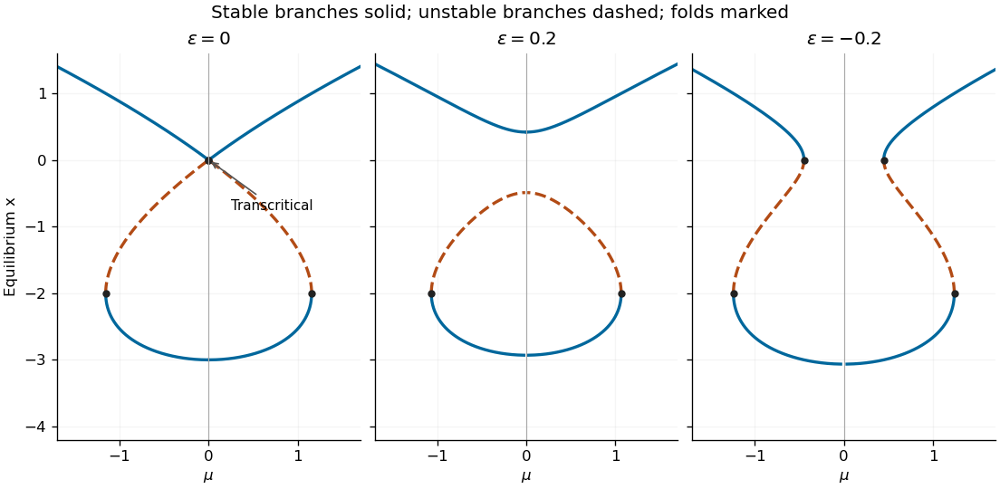

<h1 id="2/a/i/solution">Solution</h1>

↑ **Parent:** [I](../i.md)

Set $g(x)=x^2+x^3/3$. [Equilibria](../../../../../../../equilibrium-point-of-a-dynamical-system.md) satisfy $\mu^2=g(x)$, and their scalar linear [eigenvalue](../../../../../../../eigenvalue.md) is

$$
F_x=-x(x+2).
$$

It vanishes only at $x=0$ or $x=-2$. Substitution in the [equilibrium](../../../../../../../equilibrium-point-of-a-dynamical-system.md) relation gives the three nonhyperbolic parameter-state points

$$
\boxed{(\mu,x)=(0,0),\quad(2/\sqrt3,-2),\quad(-2/\sqrt3,-2).}
$$

The branches with $x<-2$ and $x>0$ are stable, while $-2<x<0$ is unstable. For $0<|\mu|<2/\sqrt3$ there are three [equilibria](../../../../../../../equilibrium-point-of-a-dynamical-system.md); beyond the two outer [saddle-node bifurcations](../../../../../../../saddle-node-bifurcation.md) there is just the positive stable one. At $\mu=0$ there is also the distinct stable [equilibrium](../../../../../../../equilibrium-point-of-a-dynamical-system.md) $x=-3$.

Near the crossing, use the smooth coordinate $y=x\sqrt{1+x/3}$, whose derivative is positive near zero. The equation becomes $\dot y=p(y)(\mu^2-y^2)$ with $p>0$. A positive time rescaling removes $p$, and the parameter-dependent state shift $u=y-\mu$ gives

$$
\frac{du}{d\tau}=-2\mu u-u^2.
$$

Thus **the crossing at $\mu=0$ is a [transcritical bifurcation](../../../../../../../transcritical-bifurcation.md)**, with parameter $-2\mu$. The two smooth branches $y=\pm\mu$ exchange [dynamical stability](../../../../../../../stability-theory.md); labeling the stable branch by $|\mu|$ instead would obscure that exchange. The [parameter-dependent coordinate shift in a transcritical bifurcation](../../../../../../../parameter-dependent-coordinate-shift-in-a-transcritical-bifurcation.md) explains why the original coordinate need not display a branch identically equal to zero.

**[Figure 1](#2/a/i/image-scalar-equilibrium-diagrams-before-and-after-positive-and-negative-unfolding-with-stable-branches-solid-and-unstable-branches-dashed). Scalar equilibrium diagrams before and after positive and negative unfolding, with stable branches solid and unstable branches dashed**.

## ↑ Ancestors (12)

1. [I](../i.md)
2. [A](../../a.md)
3. [2](../../../2.md)
4. [Paper 60](../../../../paper-60-split.md)
5. [Iii](../../../../split.md)
6. [2004](../../../../../split.md)
7. [Past exam of the mathematics course of the University of Cambridge](../../../../../../split.md)
8. [Mathematics course of the University of Cambridge](../../../../../../../mathematics-course-of-the-university-of-cambridge.md)
9. [Course of the University of Cambridge](../../../../../../../course-of-the-university-of-cambridge.md)
10. [University of Cambridge](../../../../../../../university-of-cambridge-split.md)
11. [List of universities](../../../../../../../list-of-universities.md)
12. [Codex Wiki](../../../../../../../split.md)
