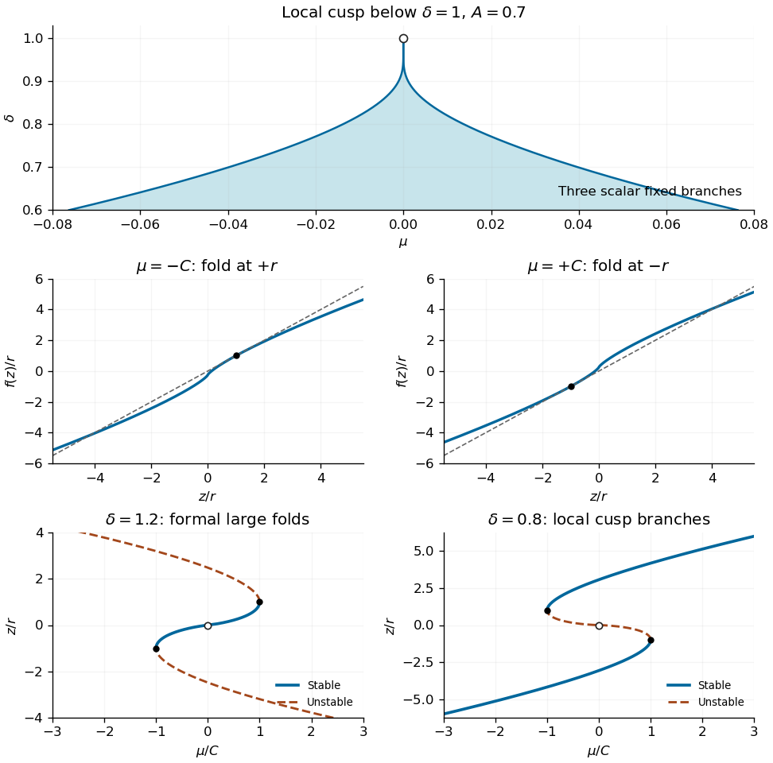

<h1 id="4/c/solution">Solution</h1>

↑ **Parent:** [C](../c.md)

For a [fixed point](../../../../../../fixed-point.md) write $\mu=h(z)=z-A\operatorname{sgn}(z)|z|^\delta$. A [saddle-node bifurcation](../../../../../../saddle-node-bifurcation.md) requires both $f(z)=z$ and $f'(z)=1$. For $\delta\ne1$ these conditions give

$$
\boxed{r=(A\delta)^{-1/(\delta-1)},\qquad
z=\pm r,\qquad\mu=\pm\frac{\delta-1}{\delta}r.}
$$

The second derivative is nonzero at either nonzero [saddle-node bifurcation](../../../../../../saddle-node-bifurcation.md), making it an ordinary [saddle-node bifurcation](../../../../../../saddle-node-bifurcation.md). For $\delta<1$, define

$$
C(\delta)=\frac{1-\delta}{\delta}(A\delta)^{1/(1-\delta)}.
$$

The [saddle-node bifurcations](../../../../../../saddle-node-bifurcation.md) occur at $(\mu,z)=(-C,r)$ and $(C,-r)$, and **three scalar [fixed points](../../../../../../fixed-point.md) coexist for $|\mu|<C$**. The two outer branches have [fixed-point multiplier](../../../../../../multiplier-of-a-periodic-orbit-of-an-iteration.md) below one and are stable, while the middle branch is unstable. Negative points lift to two symmetry-related [limit cycles](../../../../../../limit-cycle.md), so these scalar branch counts need not equal the number of flow [limit cycles](../../../../../../limit-cycle.md). The cusp records coexistence of distinct return-map branches; even outside it a negative branch represents a symmetry-related pair of flow cycles.

If $\delta=1-\eta$, $\eta\downarrow0$, then

$$
\boxed{C(1-\eta)\sim\frac\eta e A^{1/\eta}.}
$$

This exponentially narrow region ends in a [gluing-map cusp](../../../../../../exponentially-narrow-gluing-map-cusp.md) at $(\mu,\delta)=(0,1)$. At its boundaries the graph of $f$ is tangent to the diagonal at $z=+r$ or $-r$, as shown below. At exactly $\delta=1$, $f=\mu+Az$ and $A<1$ gives one stable [fixed point](../../../../../../fixed-point.md) for nonzero $\mu$.

For $\delta=1+\eta$, the formal [saddle-node bifurcation](../../../../../../saddle-node-bifurcation.md) radius is $(A\delta)^{-1/\eta}\to\infty$, and the corresponding [saddle-node bifurcation](../../../../../../saddle-node-bifurcation.md) parameters also diverge. Thus the near-origin [gluing-map cusp](../../../../../../exponentially-narrow-gluing-map-cusp.md) lies on the $\delta<1$ side; the formal large [saddle-node bifurcations](../../../../../../saddle-node-bifurcation.md) of the power-law formula on the other side are outside the local gluing-map approximation. They must not be drawn as a second small [gluing-map cusp](../../../../../../exponentially-narrow-gluing-map-cusp.md) near the origin.

**[Figure 3](#4/c/image-exponentially-narrow-gluing-map-cusp-tangencies-at-its-two-fold-boundaries-and-stable-and-unstable-fixed-point-diagrams-on-either-side-of-delta-one). Exponentially narrow gluing-map cusp, tangencies at its two fold boundaries, and stable and unstable fixed-point diagrams on either side of delta one**.

## ↑ Ancestors (11)

1. [C](../c.md)
2. [4](../../4.md)
3. [Paper 60](../../../paper-60-split.md)
4. [Iii](../../../split.md)
5. [2004](../../../../split.md)
6. [Past exam of the mathematics course of the University of Cambridge](../../../../../split.md)
7. [Mathematics course of the University of Cambridge](../../../../../../mathematics-course-of-the-university-of-cambridge.md)
8. [Course of the University of Cambridge](../../../../../../course-of-the-university-of-cambridge.md)
9. [University of Cambridge](../../../../../../university-of-cambridge-split.md)
10. [List of universities](../../../../../../list-of-universities.md)
11. [Codex Wiki](../../../../../../split.md)
