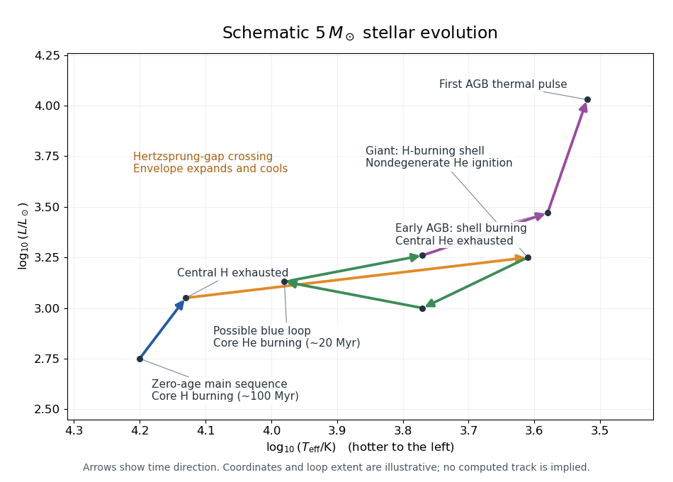

# Paper 63

↑ **Parent:** [Iii](../iii.md)

[https://www.maths.cam.ac.uk/postgrad/part-iii/files/pastpapers/2004/Paper63.pdf](https://www.maths.cam.ac.uk/postgrad/part-iii/files/pastpapers/2004/Paper63.pdf)

**Table of contents**

- [1](#1)
  - [Solution](#1/solution)
- [2](#2)
  - [Solution](#2/solution)
- [3](#3)
  - [Solution](#3/solution)
- [4](#4)
  - [Solution](#4/solution)

## 1

↑ **Parent:** [Paper 63](paper-63.md)

<h3 id="1/solution">Solution</h3>

↑ **Parent:** [1](#1)

After complete [ionization](../../../physics.md#ionization), each [hydrogen](../../../chemistry.md#hydrogen) nucleus supplies one [ion](../../../chemistry.md#ion) and one [Electron](../../../physics.md#electron), while each [helium-4](../../../chemistry.md#helium-4) nucleus supplies one [ion](../../../chemistry.md#ion) and two [Electrons](../../../physics.md#electron). Neglecting the small [metal mass fraction](../../../stellar-astrophysics.md#metal-mass-fraction) $Z$ and putting $Y\simeq1-X$, the [mean molecular weight](../../../thermodynamics.md#mean-molecular-weight) therefore satisfies

$$
\frac1\mu=2X+\frac34Y\simeq\frac{3+5X}{4},\qquad \boxed{\mu\simeq\frac4{3+5X}}.
$$

Use [stellar homology](../../../stellar-structure.md#stellar-homology) to compare models with common dimensionless profiles. The [stellar mass conservation equation](../../../stellar-structure.md#stellar-mass-conservation-equation), [stellar hydrostatic equation](../../../stellar-structure.md#hydrostatic-pressure-support-equation) and [ideal gas law](../../../thermodynamics.md#ideal-gas-law) give

$$
\rho_c\propto\frac M{R^3},\qquad P_c\propto\frac{GM^2}{R^4},\qquad T_c\propto\frac{\mu M}{R}.
$$

The [radiative diffusion in a star](../../../stellar-structure.md#radiative-diffusion-in-a-star) equation then gives $L_{\rm rad}\propto RT_c^4/(\kappa_c\rho_c)$. Inserting the specified [opacity](../../../stellar-structure.md#opacity) yields $L_{\rm rad}\propto RT_c^7/(Z\rho_c^2)\propto\mu^7M^5/Z$. Independently, integrating the [stellar energy-generation rate](../../../stellar-astrophysics.md#stellar-energy-generation-rate) over the [mass](../../../classical-mechanics.md#mass) gives $L_{\rm nuc}\propto X^2\rho_cT_c^5M\propto X^2\mu^5M^7/R^8$. Equating these in [stellar thermal equilibrium](../../../stellar-structure.md#stellar-thermal-equilibrium) gives the [radiative homology with fifth-power hydrogen burning and inverse-cubic opacity](../../../stellar-structure.md#radiative-homology-with-fifth-power-hydrogen-burning-and-inverse-cubic-opacity):

$$
R^8\propto X^2Z\mu^{-2}M^2,\qquad R\propto X^{1/4}Z^{1/8}\mu^{-1/4}M^{1/4},\qquad T_c\propto\frac{\mu^{5/4}M^{3/4}}{X^{1/4}Z^{1/8}}.
$$

At fixed [solar mass](../../../stellar-astrophysics.md#solar-mass) these reduce to **$L\propto\mu^7/Z$ and $T_c\propto\mu^{5/4}/(X^{1/4}Z^{1/8})$.** The [stellar homology](../../../stellar-structure.md#stellar-homology) approximation, rather than merely the local power laws, is what permits these relations between whole stars.

Equal [luminosities](../../../astrophysics.md#luminosity) imply $\mu_2/\mu_1=(Z_2/Z_1)^{1/7}=2^{-1/7}$. Thus

$$
3+5X_2=2^{1/7}(3+5X_1),\qquad X_2=\frac{6.5\,2^{1/7}-3}{5}=0.8353\ldots,
$$

so **$X_2=0.8$ to one significant figure**. Retaining the unrounded [hydrogen mass fraction](../../../stellar-astrophysics.md#hydrogen-mass-fraction) when comparing [central temperatures](../../../stellar-structure.md#central-stellar-temperature) gives

$$
\frac{T_{c,2}}{T_{c,1}}=2^{-3/56}\left(\frac{X_1}{X_2}\right)^{1/4}=0.9219\ldots<1.
$$

**The first model has the higher central temperature.**

For homogeneous [hydrogen burning](../../../stellar-astrophysics.md#hydrogen-burning) at fixed $M,Z$, fuel conservation gives $ME_0\dot X=-L$. Since $d\mu/dX=-5\mu^2/4$ and $L=L_0(\mu/\mu_0)^7$, the [homogeneous fuel-depletion luminosity feedback](../../../stellar-structure.md#homogeneous-fuel-depletion-luminosity-feedback) obeys

$$
\dot\mu=\frac{5L_0}{4ME_0\mu_0^7}\mu^9,\qquad \frac{d}{dt}\mu^{-8}=-\frac{10L_0}{ME_0\mu_0^7}.
$$

Integration with the initial [mean molecular weight](../../../thermodynamics.md#mean-molecular-weight) $\mu_0$ gives

$$
\boxed{L(t)=L_0\left(1-\frac{10\mu_0L_0t}{ME_0}\right)^{-7/8}}.
$$

This idealized [stellar evolution](../../../stellar-astrophysics.md#stellar-evolution) law stops when $X=0$; it does not predict a physically attainable infinite [luminosity](../../../astrophysics.md#luminosity). Indeed $\mu=4/3$ at fuel exhaustion, giving $t_H=ME_0[1-(3\mu_0/4)^8]/(10\mu_0L_0)$, strictly before the formal singularity.

## 2

↑ **Parent:** [Paper 63](paper-63.md)

<h3 id="2/solution">Solution</h3>

↑ **Parent:** [2](#2)

Write $u=\cos\theta$ for the direction cosine and $B=j/\kappa=\sigma T^4/\pi$ for the [radiative transfer source function](../../../astrophysics.md#radiative-transfer-source-function). Integrating the [radiative transfer equation](../../../astrophysics.md#radiative-transfer-equation) $u\,\partial_\tau I=I-B$ over [solid angle](../../../geometry-and-topology.md#solid-angle) gives

$$
\frac{dF}{d\tau}=\int(I-B)\,d\Omega=4\pi(J-B).
$$

[Radiative equilibrium](../../../thermodynamics.md#radiative-equilibrium) makes the [radiative flux](../../../astrophysics.md#radiative-flux) $F$ constant, so **$J=B=j/\kappa$**.

For $I=A+Cu$, the [radiation-field moments](../../../astrophysics.md#radiation-field-moment) are

$$
J=\frac12\int_{-1}^1I\,du=A,\qquad F=2\pi\int_{-1}^1uI\,du=\frac{4\pi C}{3},\qquad cP_r=2\pi\int_{-1}^1u^2I\,du=\frac{4\pi A}{3}.
$$

Consequently the [Eddington closure approximation](../../../astrophysics.md#eddington-closure-approximation) holds. Substituting into the [radiative transfer equation](../../../astrophysics.md#radiative-transfer-equation), with $B=J=A$, gives $uA'+u^2C'=Cu$. Equality for every $u$ requires $A'=C$ and $C'=0$, with $C=3F/(4\pi)$. The stipulated inward hemispheric [radiative flux](../../../astrophysics.md#radiative-flux) at the surface is

$$
F_{\rm in}=2\pi\int_{-1}^0u(A_0+Cu)\,du=-\pi A_0+\frac{2\pi C}{3}.
$$

Putting this equal to zero fixes $A_0=2C/3$, hence $A=C(\tau+2/3)$. Using $A=\sigma T^4/\pi$ and the [effective temperature](../../../stellar-structure.md#effective-temperature) definition $F=\sigma T_e^4$ gives the [grey atmosphere](../../../astrophysics.md#grey-atmosphere) law

$$
\boxed{T^4=\frac34T_e^4\left(\tau+\frac23\right)},\qquad \boxed{T_0=2^{-1/4}T_e}.
$$

The [positivity limitation of a linear Eddington intensity](../../../astrophysics.md#positivity-limitation-of-a-linear-eddington-intensity) matters here: the formal surface intensity $I(0,u)=C(2/3+u)$ is negative for $u<-2/3$. Thus this angular ansatz gives the requested [Eddington surface boundary condition](../../../astrophysics.md#eddington-surface-boundary-condition) for approximate moments; vanishing integrated inward flux is not an exact, nonnegative, pointwise no-incoming radiation field.

Neglecting [radiation pressure](../../../thermodynamics.md#radiation-pressure), the [stellar hydrostatic equation](../../../stellar-structure.md#hydrostatic-pressure-support-equation) and the definition of [optical depth](../../../astrophysics.md#optical-depth) give [hydrostatic equilibrium in optical depth](../../../stellar-structure.md#hydrostatic-equilibrium-in-optical-depth), $dP/d\tau=g/\kappa$. Since $T^4=T_0^4(1+3\tau/2)$, putting $v=T^4$ gives

$$
\frac{d(P^\alpha)}{dv}=\frac{2\alpha g}{3\kappa_0T_0^4}v^{\beta-1}.
$$

Taking $P(0)=0$ and $\alpha>0$, the [grey-atmosphere pressure with power-law opacity](../../../stellar-structure.md#grey-atmosphere-pressure-with-power-law-opacity) is therefore

$$
\boxed{P^\alpha=\frac{2\alpha g}{3\beta\kappa_0T_0^4}\left(T^{4\beta}-T_0^{4\beta}\right)}\qquad(\beta\ne0).
$$

**The pressure formula printed in the PDF is missing the factor $1/\beta$.** Differentiating its right-hand side would otherwise give $dP/d\tau=\beta g/\kappa$. For $\beta=0$ the correct [limit](../../../calculus.md#limit-of-a-function) is $P^\alpha=2\alpha g\log(T^4/T_0^4)/(3\kappa_0T_0^4)$.

At the specified matching location, the [luminosity](../../../astrophysics.md#luminosity) relation makes $F=L_r/(4\pi r^2)=\sigma T^4$, hence $T=T_e$, $T^4=2T_0^4$ and $\tau=2/3$. Multiplying the corrected pressure relation by $\kappa_0T^{4-4\beta}/g$ gives

$$
\boxed{\frac{P\kappa}{g}=\frac{4\alpha}{3\beta}\left(1-2^{-\beta}\right)}.
$$

This agrees with the PDF's final [surface boundary condition for a power-law-opacity grey atmosphere](../../../stellar-structure.md#surface-boundary-condition-for-a-power-law-opacity-grey-atmosphere). It also extends to negative $\beta$ wherever the model applies; at $\beta=0$, its continuous [limit](../../../calculus.md#limit-of-a-function) is $P\kappa/g=4\alpha\log2/3$.

## 3

↑ **Parent:** [Paper 63](paper-63.md)

<h3 id="3/solution">Solution</h3>

↑ **Parent:** [3](#3)

For [Roche-lobe overflow](../../../stellar-astrophysics.md#roche-lobe-overflow), $R_2=R_L$. Cubing the [Roche lobe](../../../stellar-astrophysics.md#roche-lobe) approximation and using the donor's [mass-radius relation](../../../exoplanet.md#mass-radius-relation) gives

$$
a^3=\frac{R_2^3}{0.46^3}\frac M{M_2}=\frac{R_\odot^3}{0.46^3}\frac{M M_2^2}{M_\odot^3}.
$$

[Kepler's third law](../../../physics.md#kepler-s-third-law) therefore yields the [Roche-lobe period-mass relation for a linear donor radius law](../../../stellar-astrophysics.md#roche-lobe-period-mass-relation-for-a-linear-donor-radius-law):

$$
\boxed{\frac P{P_0}=\frac{M_2}{M_\odot}},\qquad P_0=2\pi\sqrt{\frac{R_\odot^3}{0.46^3GM_\odot}}.
$$

The component distances from the [centre of mass](../../../classical-mechanics.md#center-of-mass) are $a_1=aM_2/M$ and $a_2=aM_1/M$. Summing their [angular momenta](../../../classical-mechanics.md#angular-momentum) gives the [circular-binary orbital angular momentum](../../../stellar-astrophysics.md#circular-binary-orbital-angular-momentum)

$$
\boxed{J=(M_1a_1^2+M_2a_2^2)\Omega=\frac{M_1M_2}{M}a^2\Omega=M_1M_2\sqrt{\frac{Ga}{M}}}.
$$

During [conservative binary mass transfer](../../../stellar-astrophysics.md#conservative-binary-mass-transfer), $\dot M=0$ and $\dot M_1=-\dot M_2$. Logarithmic differentiation at constant [angular momentum](../../../classical-mechanics.md#angular-momentum) gives $\dot a/a=-2(1-q)\dot M_2/M_2$. Thus the [Roche-lobe radius response exponent](../../../stellar-astrophysics.md#roche-lobe-radius-response-exponent) gives

$$
\boxed{\frac{\dot R_L}{R_L}=\left(2q-\frac53\right)\frac{\dot M_2}{M_2}},\qquad \frac{\dot R_2}{R_2}=\frac{\dot M_2}{M_2}.
$$

Their difference is $d\log(R_L/R_2)/dt=(2q-8/3)\dot M_2/M_2$. Since the donor loses [mass](../../../classical-mechanics.md#mass), this is positive for $q<4/3$: **the donor shrinks relative to its Roche lobe, so transfer shuts off without an external driver.** The [Roche lobe](../../../stellar-astrophysics.md#roche-lobe) itself expands only for $q<5/6$; for $5/6<q<4/3$ it shrinks more slowly than the donor.

[Gravitational-wave emission from a binary system](../../../stellar-astrophysics.md#gravitational-wave-emission-from-a-binary-system) provides such a driver: the orbit emits [gravitational waves](../../../general-relativity.md#gravitational-wave) carrying [energy](../../../classical-mechanics.md#energy) and [angular momentum](../../../classical-mechanics.md#angular-momentum), and the shrinking [Roche lobe](../../../stellar-astrophysics.md#roche-lobe) can maintain contact. Allowing $\dot J<0$, the [binary mass-transfer contact equation](../../../stellar-astrophysics.md#binary-mass-transfer-contact-equation) becomes

$$
\frac{\dot R_L}{R_L}=2\frac{\dot J}{J}+\left(2q-\frac53\right)\frac{\dot M_2}{M_2}=\frac{\dot M_2}{M_2},\qquad \boxed{\frac{\dot M_2}{M_2}=\frac{3}{4-3q}\frac{\dot J}{J}}.
$$

It gives a negative transfer rate for $q<4/3$.

For the [classical nova](../../../stellar-astrophysics.md#classical-nova), assume [isotropic re-emission from a binary star](../../../stellar-astrophysics.md#isotropic-re-emission-from-a-binary-star): ejecta carry the accretor's [specific angular momentum](../../../classical-mechanics.md#specific-angular-momentum) $j_1=a_1^2\Omega$. The eruption lasts many [orbital periods](../../../classical-mechanics.md#orbital-period), so the orbit responds approximately adiabatically and remains nearly circular; an instantaneous asymmetric kick would be a different model. To first order,

$$
\frac{\delta J}{J}=-\frac{j_1\delta m}{J}=-q\frac{\delta m}{M},\qquad \delta M_1=-\delta m,\qquad\delta M_2=0,\qquad\delta M=-\delta m.
$$

Differentiating the [circular-binary orbital angular momentum](../../../stellar-astrophysics.md#circular-binary-orbital-angular-momentum) formula during the ejection gives

$$
-q\frac{\delta m}{M}=-\frac{\delta m}{M_1}+\frac12\frac{\delta a}{a}+\frac12\frac{\delta m}{M},\qquad \boxed{\frac{\delta a}{a}=\frac{\delta m}{M}}.
$$

The accompanying [Roche lobe](../../../stellar-astrophysics.md#roche-lobe) change is therefore

$$
\boxed{\frac{\delta R_L}{R_L}=\frac{\delta a}{a}+\frac13\frac{\delta m}{M}=\frac{4\delta m}{3M}}.
$$

The donor does not change [mass](../../../classical-mechanics.md#mass) in the eruption and moves inside its expanded [Roche lobe](../../../stellar-astrophysics.md#roche-lobe): this is [nova-induced binary detachment](../../../stellar-astrophysics.md#nova-induced-binary-detachment).

Put $\Gamma=-\dot J>0$ for the constant external loss. During detachment the component masses are fixed, so the [Roche lobe](../../../stellar-astrophysics.md#roche-lobe) shrinks at fractional rate $2\Gamma/J$. Closing the fractional gap $4\delta m/(3M)$ takes $t_d=2J\delta m/(3M\Gamma)$. During the subsequent [semidetached binary](../../../stellar-astrophysics.md#semidetached-binary) phase, the [binary mass-transfer contact equation](../../../stellar-astrophysics.md#binary-mass-transfer-contact-equation) gives $|\dot M_2|=3M_2\Gamma/[J(4-3q)]$, so accumulating the next eruption's [mass](../../../classical-mechanics.md#mass) takes $t_s=J(4-3q)\delta m/(3M_2\Gamma)$. Consequently

$$
\boxed{\frac{t_d}{t_s}=\frac{2M_2}{M(4-3q)}=\frac{2q}{(4-3q)(1+q)}}.
$$

Both times are evaluated to first order in $\delta m/M$, with the same equilibrium donor [mass-radius relation](../../../exoplanet.md#mass-radius-relation); changes of $q,J$ and the transfer rate within one cycle affect higher orders.

## 4

↑ **Parent:** [Paper 63](paper-63.md)

<h3 id="4/solution">Solution</h3>

↑ **Parent:** [4](#4)

A $5M_\odot$ star of roughly solar [stellar composition](../../../stellar-astrophysics.md#stellar-chemical-abundance) begins on the [zero-age main sequence](../../../stellar-astrophysics.md#zero-age-main-sequence) with a hot [convective core](../../../stellar-structure.md#convective-core), a mostly [radiative envelope](../../../stellar-structure.md#radiative-envelope), and [hydrogen burning](../../../stellar-astrophysics.md#hydrogen-burning) dominated by the [CNO cycle](../../../stellar-astrophysics.md#cno-cycle). The strong temperature dependence of the [CNO cycle](../../../stellar-astrophysics.md#cno-cycle) concentrates the [stellar energy-generation rate](../../../stellar-astrophysics.md#stellar-energy-generation-rate) near the centre, helping produce the [convective core](../../../stellar-structure.md#convective-core). Core mixing replenishes [hydrogen](../../../chemistry.md#hydrogen) within that region; it does not homogenize the entire star. The nuclear fuel supply gives a [stellar nuclear timescale](../../../stellar-astrophysics.md#stellar-nuclear-timescale) of order $10^8$ years. For a numerical comparison, Table 2 of [Ekström et al.'s solar-metallicity models](https://arxiv.org/abs/1110.5049) gives core [hydrogen burning](../../../stellar-astrophysics.md#hydrogen-burning) lifetimes of about $88$ and $109$ million years for nonrotating and rotating $5M_\odot$ models, respectively.

After central [hydrogen](../../../chemistry.md#hydrogen) exhaustion, an inert [helium](../../../chemistry.md#helium) core contracts and heats through [Kelvin-Helmholtz contraction](../../../stellar-astrophysics.md#kelvin-helmholtz-mechanism), while a [hydrogen-burning shell](../../../stellar-astrophysics.md#hydrogen-burning-shell) supplies the growing [luminosity](../../../astrophysics.md#luminosity). The envelope expands and cools: the track crosses the [Hertzsprung gap](../../../stellar-astrophysics.md#hertzsprung-gap) toward the [red giant](../../../stellar-astrophysics.md#red-giant) region. Its deepening [convective envelope](../../../stellar-structure.md#convective-envelope) causes [first dredge-up](../../../stellar-astrophysics.md#first-dredge-up), bringing material altered by [hydrogen burning](../../../stellar-astrophysics.md#hydrogen-burning) to the surface. The rapid structural crossing has a thermal timescale, roughly $10^5$–$10^6$ years for a star of this [mass](../../../classical-mechanics.md#mass), rather than the full [stellar nuclear timescale](../../../stellar-astrophysics.md#stellar-nuclear-timescale); an estimate follows from the [Kelvin-Helmholtz cooling time](../../../stellar-astrophysics.md#kelvin-helmholtz-cooling-time) $GM^2/(RL)$ with the evolving [radius](../../../topology.md#radius) and [luminosity](../../../astrophysics.md#luminosity).

The [helium](../../../chemistry.md#helium) core reaches ignition before becoming strongly supported by [electron degeneracy pressure](../../../statistical-physics.md#electron-degeneracy-pressure). Thus a normal $5M_\odot$ star starts [core helium burning](../../../stellar-astrophysics.md#core-helium-burning) without the [helium flash](../../../stellar-astrophysics.md#helium-flash) characteristic of lower-mass stars. The [Triple-alpha process](../../../stellar-astrophysics.md#triple-alpha-process) produces [carbon-12](../../../chemistry.md#carbon-12), and [carbon-12 alpha capture](../../../physics.md#carbon-12-alpha-capture) produces [oxygen-16](../../../chemistry.md#oxygen-16); these reactions build a [carbon-oxygen core](../../../stellar-astrophysics.md#carbon-oxygen-core). There is a [convective core](../../../stellar-structure.md#convective-core) and continued [hydrogen-burning shell](../../../stellar-astrophysics.md#hydrogen-burning-shell) activity. Core [helium](../../../chemistry.md#helium) burning lasts order $10^7$ years: the same [model table](https://arxiv.org/abs/1110.5049) gives approximately $19$ and $18$ million years. The changing core and envelope structure can produce a [blue loop](../../../stellar-astrophysics.md#blue-loop) in the [Hertzsprung-Russell diagram](../../../stellar-astrophysics.md#hertzsprung-russell-diagram); its extent depends on [stellar composition](../../../stellar-astrophysics.md#stellar-chemical-abundance), mixing and [stellar rotation](../../../stellar-astrophysics.md#stellar-rotation).

After central [helium](../../../chemistry.md#helium) exhaustion, the [carbon-oxygen core](../../../stellar-astrophysics.md#carbon-oxygen-core) contracts and becomes increasingly supported by [electron degeneracy pressure](../../../statistical-physics.md#electron-degeneracy-pressure). A [helium-burning shell](../../../stellar-astrophysics.md#helium-burning-shell) forms above it, beneath the [hydrogen-burning shell](../../../stellar-astrophysics.md#hydrogen-burning-shell). The star returns to a cool, luminous [Asymptotic giant branch](../../../stellar-astrophysics.md#asymptotic-giant-branch) configuration. On this early branch, [helium-burning shell](../../../stellar-astrophysics.md#helium-burning-shell) activity is an important energy source; the overlying [hydrogen-burning shell](../../../stellar-astrophysics.md#hydrogen-burning-shell) can weaken during readjustment and resume later. At this [mass](../../../classical-mechanics.md#mass), a deepening [convective envelope](../../../stellar-structure.md#convective-envelope) can cause [second dredge-up](../../../stellar-astrophysics.md#second-dredge-up). This shell-supported evolution to the first [AGB thermal pulse](../../../stellar-astrophysics.md#thermal-pulse-of-an-asymptotic-giant-branch-star) takes order $10^6$ years, with model-dependent duration. As the [helium-burning shell](../../../stellar-astrophysics.md#helium-burning-shell) becomes sufficiently thin, the [thin-shell instability](../../../stellar-astrophysics.md#thin-shell-instability) ends steady shell burning and marks the onset of [AGB thermal pulses](../../../stellar-astrophysics.md#thermal-pulse-of-an-asymptotic-giant-branch-star).

**[Figure 1](#4/image-schematic-evolution-of-a-five-solar-mass-star-to-the-first-agb-thermal-pulse). Schematic evolution of a five-solar-mass star to the first AGB thermal pulse**.

The original sketch shows the direction of [stellar evolution](../../../stellar-astrophysics.md#stellar-evolution), with higher [effective temperature](../../../stellar-structure.md#effective-temperature) to the left. It illustrates a possible [blue loop](../../../stellar-astrophysics.md#blue-loop); its coordinates and loop shape are schematic, rather than a computed stellar model. The stages before the first [AGB thermal pulse](../../../stellar-astrophysics.md#thermal-pulse-of-an-asymptotic-giant-branch-star) are the requested track; the later remnant evolution is described below.

In the usual final evolution, [stellar winds](../../../stellar-astrophysics.md#stellar-wind) and an [AGB superwind](../../../stellar-astrophysics.md#agb-superwind) remove the envelope before the [carbon-oxygen core](../../../stellar-astrophysics.md#carbon-oxygen-core) can ignite substantial [carbon burning](../../../stellar-astrophysics.md#carbon-burning). Once shell fuel is exhausted, the exposed core contracts and heats, potentially ionizing the expelled gas as a [planetary nebula](../../../stellar-astrophysics.md#planetary-nebula), and finally becomes a [carbon-oxygen white dwarf](../../../stellar-astrophysics.md#carbon-oxygen-white-dwarf) that loses its stored thermal [energy](../../../classical-mechanics.md#energy) by cooling. The relevant competition is between the [AGB envelope-loss and core-growth timescales](../../../stellar-astrophysics.md#agb-envelope-loss-and-core-growth-timescales), not just the total initial [mass](../../../classical-mechanics.md#mass).

Much higher late-stage [mass loss](../../../stellar-astrophysics.md#mass-loss-astrophysics) strips the envelope sooner, shortens the [Asymptotic giant branch](../../../stellar-astrophysics.md#asymptotic-giant-branch) phase, and allows less core growth, usually producing a smaller [carbon-oxygen white dwarf](../../../stellar-astrophysics.md#carbon-oxygen-white-dwarf). Much lower [mass loss](../../../stellar-astrophysics.md#mass-loss-astrophysics) prolongs shell burning and permits greater core growth. In an extreme hypothetical case, retention of the envelope could let a degenerate [carbon-oxygen core](../../../stellar-astrophysics.md#carbon-oxygen-core) approach the [Chandrasekhar mass](../../../stellar-astrophysics.md#chandrasekhar-limit) and undergo explosive [carbon burning](../../../stellar-astrophysics.md#carbon-burning): the proposed [type 1.5 supernova](../../../stellar-astrophysics.md#type-1-5-supernova) channel. This is not an inevitable fate for a $5M_\odot$ star. [Doherty et al.'s evolutionary calculations](https://arxiv.org/abs/1410.5431) emphasize the uncertainty of that channel and find that their adopted [mass loss](../../../stellar-astrophysics.md#mass-loss-astrophysics) removes carbon-oxygen envelopes before such ignition. If [carbon burning](../../../stellar-astrophysics.md#carbon-burning) instead proceeds without disruption, the possible further evolution depends on the resulting core and continued envelope retention; lowering [mass loss](../../../stellar-astrophysics.md#mass-loss-astrophysics) alone does not establish an [electron-capture supernova](../../../stellar-astrophysics.md#electron-capture-supernova) outcome.

## ↑ Ancestors (8)

1. [Iii](../iii.md)
2. [2004](../../2004.md)
3. [Past exam of the mathematics course of the University of Cambridge](../../../past-exam-of-the-mathematics-course-of-the-university-of-cambridge.md)
4. [Mathematics course of the University of Cambridge](../../../university-of-cambridge.md#mathematics-course-of-the-university-of-cambridge)
5. [Course of the University of Cambridge](../../../university-of-cambridge.md#course-of-the-university-of-cambridge)
6. [University of Cambridge](../../../university-of-cambridge.md)
7. [List of universities](../../../README.md#list-of-universities)
8. [Codex Wiki](../../../README.md)
