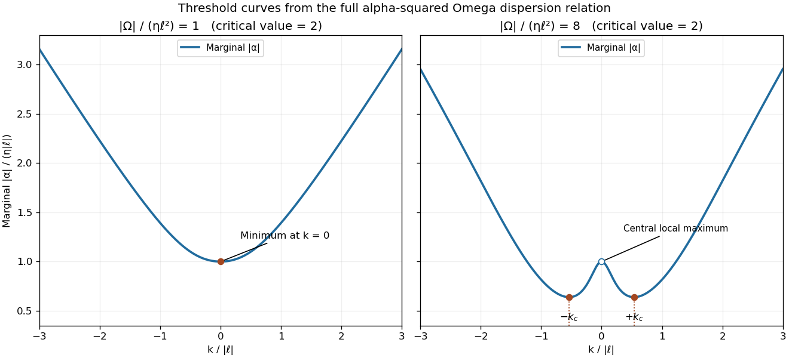

<h1 id="2/ii/solution">Solution</h1>

↑ **Parent:** [Ii](../ii.md)

Include temporal dependence $e^{\sigma t}$ and put $p=k^2+\ell^2$. The two Fourier amplitudes obey

$$
(\sigma+\eta p)A=\alpha B,\qquad
(\sigma+\eta p)B=(ik\Omega+\alpha p)A.
$$

Consequently the [dispersion relation](../../../../../../dispersion-relation.md) and its branches are

$$
\boxed{(\sigma+\eta p)^2=\alpha^2p+i\alpha\Omega k,\qquad
\sigma=-\eta p\pm\sqrt{\alpha^2p+i\alpha\Omega k}.}
$$

For $\eta>0$ and $\ell\ne0$, the branch with positive real square root is the potentially unstable one. At marginal stability set $\sigma=i\omega$; comparing real and imaginary parts gives

$$
\eta^2p^2-\omega^2=\alpha^2p,\qquad 2\eta p\omega=\alpha\Omega k.
$$

Eliminating $\omega$ produces the [alpha-squared Omega dynamo threshold](../../../../../../alpha-squared-omega-dynamo-threshold.md)

$$
\boxed{\alpha_m^2(k)=\frac{4\eta^4(k^2+\ell^2)^4}{4\eta^2(k^2+\ell^2)^3+\Omega^2k^2},\qquad
\omega=\frac{\alpha_m\Omega k}{2\eta(k^2+\ell^2)}.}
$$

Either sign of $\alpha_m$ is allowed; it changes the wave's propagation sign. Larger $|\alpha|$ increases the real part of the growing branch through zero.

To minimize the threshold differentiate with respect to $x=k^2$. The sign of this derivative is the sign of

$$
F(x)=4\eta^2(x+\ell^2)^3+\Omega^2(3x-\ell^2).
$$

Its derivative is strictly positive for $x\geq0$, so there is at most one interior minimum. Its value at zero changes sign at

$$
\boxed{\Omega_0^2=4\eta^2\ell^4.}
$$

For $\Omega^2\leq\Omega_0^2$, $F(x)\geq0$ and the minimum is $\boxed{k_c=0}$, with $|\alpha_c|=\eta|\ell|$. For stronger shear, the minimizing positive wavenumber is the unique root

$$
\boxed{4\eta^2(k_c^2+\ell^2)^3+\Omega^2(3k_c^2-\ell^2)=0,\qquad 0<k_c^2<\ell^2/3.}
$$

An explicit form follows by setting $s=\Omega^2/(4\eta^2\ell^4)>1$ and $y=1+k_c^2/\ell^2$. The cubic becomes $y^3+3sy-4s=0$, with real solution

$$
\boxed{k_c=|\ell|\sqrt{2\sqrt s\,\sinh\left[\frac13\operatorname{arsinh}\left(\frac2{\sqrt s}\right)\right]-1}.}
$$

The negative wavenumber $-k_c$ has the same threshold. In the strong-shear limit $k_c\to|\ell|/\sqrt3$.

The threshold curve is even in $k$ and behaves as $\eta|k|$ at large $|k|$. Below the shear threshold it increases monotonically away from its central minimum. Above the threshold, zero is a local maximum flanked by the two nonzero minima. At equality the central minimum has vanishing quadratic curvature but remains a minimum. These two cases are sketched from the derived formula below. If $\ell=0$, the zero-wavenumber uniform/gauge mode is degenerate and the positive-wavenumber threshold tends to zero as $k\to0$; the nonzero-$\ell$ minimum formula must not be used as a nondegenerate onset criterion there.

**[Figure 1](#2/ii/image-marginal-alpha-squared-omega-dynamo-thresholds-below-and-above-the-critical-shear-with-the-minimizing-wavenumbers). Marginal alpha-squared Omega dynamo thresholds below and above the critical shear, with the minimizing wavenumbers**.

## ↑ Ancestors (11)

1. [Ii](../ii.md)
2. [2](../../2.md)
3. [Paper 65](../../../paper-65-split.md)
4. [Iii](../../../split.md)
5. [2004](../../../../split.md)
6. [Past exam of the mathematics course of the University of Cambridge](../../../../../split.md)
7. [Mathematics course of the University of Cambridge](../../../../../../mathematics-course-of-the-university-of-cambridge.md)
8. [Course of the University of Cambridge](../../../../../../course-of-the-university-of-cambridge.md)
9. [University of Cambridge](../../../../../../university-of-cambridge-split.md)
10. [List of universities](../../../../../../list-of-universities.md)
11. [Codex Wiki](../../../../../../split.md)
