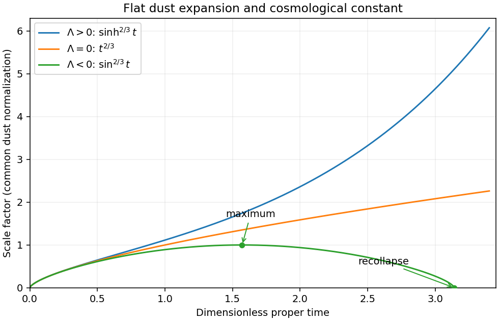

<h1 id="1/a/solution">Solution</h1>

↑ **Parent:** [A](../a.md)

Take $c=1$ and normalize the [Big Bang](../../../../../../big-bang.md) to $t=0$. The [cosmological perfect-fluid continuity equation](../../../../../../cosmological-perfect-fluid-continuity-equation.md) for [pressureless matter](../../../../../../pressureless-matter.md) makes $C=8\pi G\rho_m a^3/3$ a positive constant. The flat [Friedmann equation](../../../../../../friedmann-equations.md) consequently reads

$$
\dot a^2=\frac Ca+\frac{\Lambda a^2}{3}.
$$

Putting $u=a^{3/2}$ gives $\dot u^2=\tfrac94(C+\Lambda u^2/3)$, which is directly integrable. The expanding [flat dust universe with a cosmological constant](../../../../../../flat-dust-universe-with-a-cosmological-constant.md) has

$$
\boxed{
 a(t)=\begin{cases}
 (3C/\Lambda)^{1/3}\sinh^{2/3}(\sqrt{3\Lambda}\,t/2),&\Lambda>0,\\
 (9C/4)^{1/3}t^{2/3},&\Lambda=0,\\
 (3C/|\Lambda|)^{1/3}\sin^{2/3}(\sqrt{3|\Lambda|}\,t/2),&\Lambda<0.
 \end{cases}}
$$

For negative [cosmological constant](../../../../../../cosmological-constant.md), the last expression describes expansion and contraction on $0<t<2\pi/\sqrt{3|\Lambda|}$. Its maximum is $a_m=(3C/|\Lambda|)^{1/3}$ at $t_m=\pi/\sqrt{3|\Lambda|}$; it reaches zero again at $2t_m$. Positive or zero [cosmological constant](../../../../../../cosmological-constant.md) gives unbounded expansion and no finite maximum. All three have [infimum](../../../../../../infimum.md) zero at their initial singularity; negative [cosmological constant](../../../../../../cosmological-constant.md) also gives zero at the final singularity, with no positive minimum.

For positive [cosmological constant](../../../../../../cosmological-constant.md), expanding the hyperbolic sine shows $a\sim(9C/4)^{1/3}t^{2/3}$ at early times: [pressureless matter](../../../../../../pressureless-matter.md) dominates. At late times,

$$
a\sim\left(\frac{3C}{4\Lambda}\right)^{1/3}e^{\sqrt{\Lambda/3}\,t},\qquad H\longrightarrow\sqrt{\Lambda/3}.
$$

Thus the expansion changes from matter-dominated deceleration to exponential acceleration. Indeed $\ddot a/a=-C/(2a^3)+\Lambda/3$ changes sign at $a^3=3C/(2\Lambda)$.

**[Figure 1](#1/a/image-flat-dust-expansion-for-positive-zero-and-negative-cosmological-constant-with-a-common-early-time-normalization). Flat dust expansion for positive, zero and negative cosmological constant, with a common early-time normalization**.

## ↑ Ancestors (11)

1. [A](../a.md)
2. [1](../../1.md)
3. [Paper 67](../../../paper-67-split.md)
4. [Iii](../../../split.md)
5. [2004](../../../../split.md)
6. [Past exam of the mathematics course of the University of Cambridge](../../../../../split.md)
7. [Mathematics course of the University of Cambridge](../../../../../../mathematics-course-of-the-university-of-cambridge.md)
8. [Course of the University of Cambridge](../../../../../../course-of-the-university-of-cambridge.md)
9. [University of Cambridge](../../../../../../university-of-cambridge-split.md)
10. [List of universities](../../../../../../list-of-universities.md)
11. [Codex Wiki](../../../../../../split.md)
