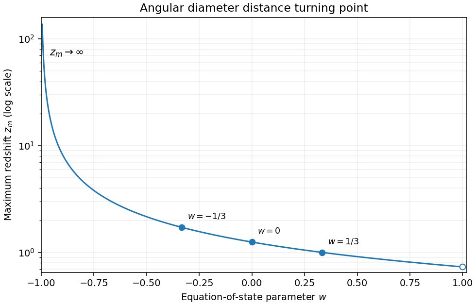

<h1 id="1/c/solution">Solution</h1>

↑ **Parent:** [C](../c.md)

The [cosmological perfect-fluid continuity equation](../../../../../../cosmological-perfect-fluid-continuity-equation.md) gives $\rho\propto a^{-3(1+w)}$. In a flat universe the [Friedmann equation](../../../../../../friedmann-equations.md) then gives $H(z)=H_0(1+z)^\alpha$, where $\alpha=3(1+w)/2>0$. Writing $u=1+z$, the [angular diameter distance](../../../../../../angular-diameter-distance.md) obtained from the [luminosity distance](../../../../../../luminosity-distance.md) is

$$
d_A=\frac1{H_0u}\int_1^u v^{-\alpha}\,dv
=\begin{cases}
\dfrac{u^{-\alpha}-u^{-1}}{H_0(1-\alpha)},&\alpha\ne1,\\[4pt]
\dfrac{\log u}{H_0u},&\alpha=1.
\end{cases}
$$

It is positive for $u>1$, starts at zero and tends to zero as $u\to\infty$ for every $\alpha>0$, including $\alpha<1$ where the radial [comoving distance](../../../../../../comoving-radial-distance.md) itself is unbounded. Differentiation gives the [constant-equation-of-state angular diameter distance maximum](../../../../../../constant-equation-of-state-angular-diameter-distance-maximum.md):

$$
\boxed{z_m=\alpha^{1/(\alpha-1)}-1,\quad \alpha=\frac32(1+w),\qquad z_m=e-1\text{ when }\alpha=1.}
$$

For $\alpha\ne1$ the stationary equation is $u^{\alpha-1}=\alpha$, which has exactly one solution greater than one. For $\alpha=1$ the [derivative](../../../../../../derivative.md) has the sign of $1-\log u$. Hence this stationary point is always the unique maximum.

To determine the sketch's shape, differentiate $\log(1+z_m)=\log\alpha/(\alpha-1)$:

$$
\frac{d\log(1+z_m)}{d\alpha}
=\frac{1-1/\alpha-\log\alpha}{(\alpha-1)^2}<0,
$$

with limiting value $-1/2$ at $\alpha=1$. The inequality follows because $\log\alpha-1+1/\alpha$ has its unique minimum zero at one. Thus $z_m$ decreases from infinity as $w\downarrow-1$ to $\sqrt3-1$ as $w\uparrow1$. Useful points are $z_m=e-1$ at $w=-1/3$, $5/4$ at $w=0$, and $1$ at $w=1/3$. The endpoint $w=-1$ is excluded: there $d_A=z/[H_0(1+z)]$ increases to an asymptote and has no finite turning point.

**[Figure 2](#1/c/image-redshift-of-the-angular-diameter-distance-maximum-versus-the-constant-equation-of-state-parameter). Redshift of the angular diameter distance maximum versus the constant equation-of-state parameter**.

## ↑ Ancestors (11)

1. [C](../c.md)
2. [1](../../1.md)
3. [Paper 67](../../../paper-67-split.md)
4. [Iii](../../../split.md)
5. [2004](../../../../split.md)
6. [Past exam of the mathematics course of the University of Cambridge](../../../../../split.md)
7. [Mathematics course of the University of Cambridge](../../../../../../mathematics-course-of-the-university-of-cambridge.md)
8. [Course of the University of Cambridge](../../../../../../course-of-the-university-of-cambridge.md)
9. [University of Cambridge](../../../../../../university-of-cambridge-split.md)
10. [List of universities](../../../../../../list-of-universities.md)
11. [Codex Wiki](../../../../../../split.md)
