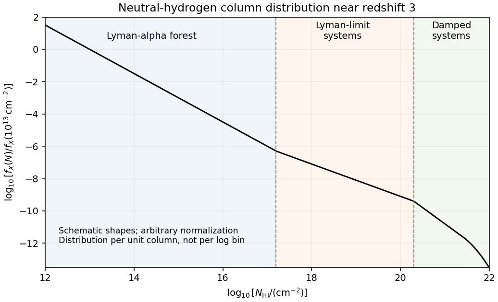

<h1 id="4/b/solution">Solution</h1>

↑ **Parent:** [B](../b.md)

A useful description of the low-column [Lyman-alpha forest](../../../../../../lyman-alpha-forest.md) at $z\simeq3$ is a [power law](../../../../../../power-law.md) $f_X(N,z)=A(z)N^{-\beta}$, with $\beta$ around $1.4$–$1.5$ over the ordinary unsaturated forest range. The same column dependence holds for $f_z$ at a fixed redshift. It is not a universal unbroken [power law](../../../../../../power-law.md): saturation, increased neutral fraction and changing absorber populations produce breaks. [Lyman limit systems](../../../../../../lyman-limit-system.md) become optically thick at $N\simeq10^{17.2}\,\mathrm{cm}^{-2}$ because $N\sigma_{912}\simeq1$ with $\sigma_{912}\simeq6.3\times10^{-18}\,\mathrm{cm}^2$. [Damped Lyman-alpha systems](../../../../../../damped-lyman-alpha-system.md) have $N\gtrsim2\times10^{20}\,\mathrm{cm}^{-2}$ and strong radiative damping wings. They are rare in number but contain substantial neutral mass. The highest-column distribution steepens or cuts off rather than extending indefinitely.

**[Figure 3](#4/b/image-schematic-neutral-hydrogen-column-distribution-showing-the-forest-optically-thick-lyman-limit-systems-and-damped-systems). Schematic neutral-hydrogen column distribution showing the forest, optically thick Lyman-limit systems and damped systems**.

This sketch shows representative shapes and transition scales, not an observational fit; its ordinate is distribution per unit column, not counts per logarithmic bin. In an [Einstein-de Sitter universe](../../../../../../einstein-de-sitter-universe.md), $H=H_0(1+z)^{3/2}$, so a fixed comoving population with fixed physical cross-section above a fixed column threshold has $d\mathcal N/dz\propto(1+z)^{1/2}$. Thus

$$
\boxed{\frac{(d\mathcal N/dz)_{z=4}}{(d\mathcal N/dz)_{z=1.5}}
=\left(\frac5{2.5}\right)^{1/2}=\sqrt2\simeq1.414.}
$$

The observed [redshift evolution of the Lyman-alpha forest](../../../../../../redshift-evolution-of-the-lyman-alpha-forest.md) is much stronger for commonly selected forest lines. For example, [Kim, Cristiani and D'Odorico's absorption survey](https://arxiv.org/abs/astro-ph/0101005) finds an index about $2.19$ in $d\mathcal N/dz\propto(1+z)^\gamma$ for $10^{13.64}<N/\mathrm{cm}^{-2}<10^{16}$ over $1.5<z<4$, corresponding to an increase by approximately $2^{2.19}\simeq4.56$. This number is selection-dependent. Expansion changes the gas [density](../../../../../../density.md), and the evolving [cosmic ionizing background](../../../../../../cosmic-ionizing-background.md) changes its neutral fraction through [photoionization equilibrium](../../../../../../photoionization-equilibrium.md), moving systems across a fixed neutral-column threshold. Structure also evolves. A non-evolving population with fixed physical cross-section is therefore not an adequate physical model of the observed forest.

## ↑ Ancestors (11)

1. [B](../b.md)
2. [4](../../4.md)
3. [Paper 67](../../../paper-67-split.md)
4. [Iii](../../../split.md)
5. [2004](../../../../split.md)
6. [Past exam of the mathematics course of the University of Cambridge](../../../../../split.md)
7. [Mathematics course of the University of Cambridge](../../../../../../mathematics-course-of-the-university-of-cambridge.md)
8. [Course of the University of Cambridge](../../../../../../course-of-the-university-of-cambridge.md)
9. [University of Cambridge](../../../../../../university-of-cambridge-split.md)
10. [List of universities](../../../../../../list-of-universities.md)
11. [Codex Wiki](../../../../../../split.md)
