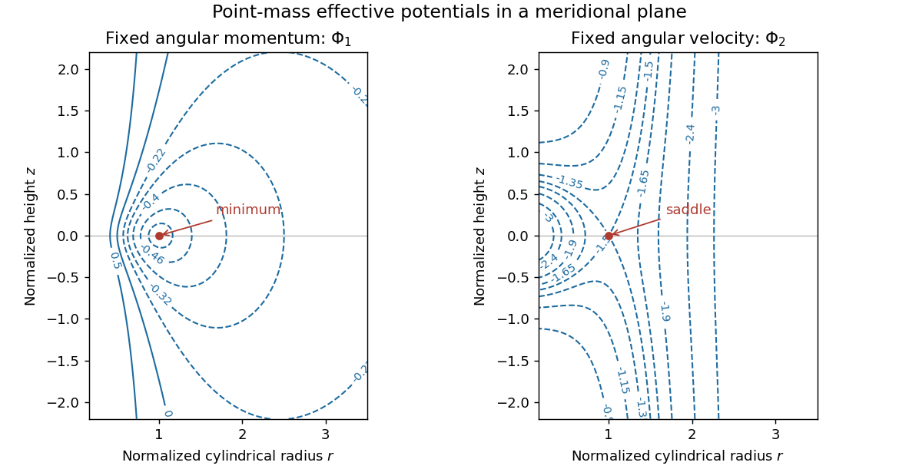

<h1 id="1/a/solution">Solution</h1>

↑ **Parent:** [A](../a.md)

In cylindrical coordinates the particle's radial and vertical equations are $\ddot r-r\dot\phi^2=-\Phi_r$ and $\ddot z=-\Phi_z$. Axisymmetry gives [conservation of angular momentum](../../../../../../conservation-of-angular-momentum.md), with [specific angular momentum](../../../../../../specific-angular-momentum.md) $h=r^2\dot\phi$. Eliminating the cyclic azimuthal motion therefore gives

$$
\ddot r=-\partial_r\left(\Phi+\frac{h^2}{2r^2}\right),\qquad\ddot z=-\partial_z\left(\Phi+\frac{h^2}{2r^2}\right).
$$

Thus **$\boxed{\Phi_1=\Phi+h^2/(2r^2)}$** governs the meridional motion. Its conserved energy is $\tfrac12(\dot r^2+\dot z^2)+\Phi_1$. The additional term is the [centrifugal barrier](../../../../../../centrifugal-barrier.md) appropriate to fixed angular momentum.

For a [point mass](../../../../../../point-mass.md), $\Phi=-GM/\sqrt{r^2+z^2}$. If $h\ne0$, the vertical derivative vanishes only at $z=0$, and the radial stationary condition there gives $r_0=h^2/(GM)$. This is the sole stationary point with $r>0$, at energy $-GM/(2r_0)$. Its [Hessian matrix](../../../../../../hessian-matrix.md) is

$$
\left.\nabla^2_{r,z}\Phi_1\right|_{(r_0,0)}=\frac{GM}{r_0^3}\begin{pmatrix}1&0\\0&1\end{pmatrix}.
$$

Consequently the local contours are closed, approximately circular curves about a strict minimum. Finite negative-energy contours above the minimum remain closed; the centrifugal barrier prevents approach to the axis and the negative energy prevents escape to infinity. The zero contour satisfies $z^2=4r^4/r_0^2-r^2$, while positive-energy contours can be unbounded. The left panel illustrates these features; portions of the outer contours extend outside the plotting window.

**[Figure 1](#1/a/image-meridional-contours-of-fixed-angular-momentum-and-fixed-angular-velocity-point-mass-potentials). Meridional contours of fixed-angular-momentum and fixed-angular-velocity point-mass potentials**.

Each panel uses its own circular radius as length unit and $GM/r_0$ as potential unit. Linearizing near the minimum gives

$$
\delta\ddot r=-\Omega_K^2\delta r,\qquad\delta\ddot z=-\Omega_K^2\delta z,\qquad\Omega_K^2=\frac{GM}{r_0^3}.
$$

The radial and [vertical epicyclic frequencies](../../../../../../vertical-epicyclic-frequency.md) both equal the circular orbital frequency. **Circular [Kepler orbits](../../../../../../kepler-orbit.md) are stable to small meridional perturbations of a freely moving particle.** With no dissipation the oscillations persist rather than decay. A change in h shifts the circular radius to a nearby orbit; azimuthal phase itself is neutral by rotational symmetry. If $h=0$, there is no stationary point or centrifugal barrier and this circular-orbit stability discussion does not apply.

## ↑ Ancestors (11)

1. [A](../a.md)
2. [1](../../1.md)
3. [Paper 68](../../../paper-68-split.md)
4. [Iii](../../../split.md)
5. [2004](../../../../split.md)
6. [Past exam of the mathematics course of the University of Cambridge](../../../../../split.md)
7. [Mathematics course of the University of Cambridge](../../../../../../mathematics-course-of-the-university-of-cambridge.md)
8. [Course of the University of Cambridge](../../../../../../course-of-the-university-of-cambridge.md)
9. [University of Cambridge](../../../../../../university-of-cambridge-split.md)
10. [List of universities](../../../../../../list-of-universities.md)
11. [Codex Wiki](../../../../../../split.md)
