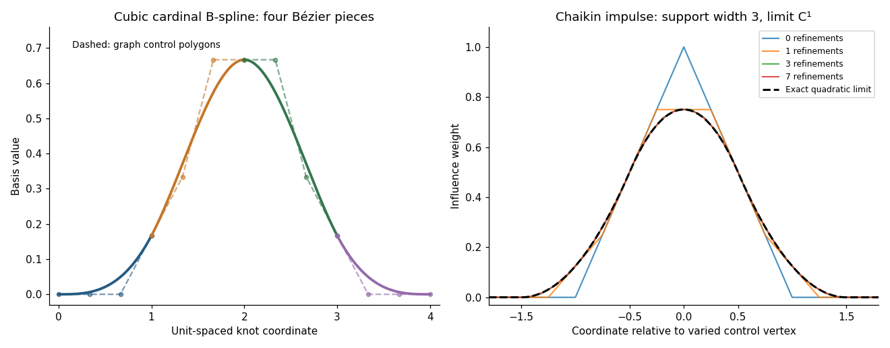

<h1 id="3/iv/solution">Solution</h1>

↑ **Parent:** [Iv](../iv.md)

The rule is linear in the ordinates and translation invariant on the uniform grid, so write $s(x)=\sum_i y_i\beta((x-x_i)/h)$. Find its [Chaikin basis function](../../../../../../chaikin-basis-function.md) by setting $y_0=1$ and every other ordinate to zero. The central local piece just derived has $D_0=-2$ and gives $\beta(t)=3/4-t^2$ for $|t|\leq1/2$. On the next interval, the interpolating quadratic through values $1,0,0$ at abscissae $0,1,2$ is $\tfrac12(t-1)(t-2)$. Adding its limiting offset $1/8$ gives $\tfrac12(3/2-t)^2$. Reflection gives the left interval, and locality gives zero outside. Thus

$$
\boxed{\beta(t)=\begin{cases}
\frac34-t^2,&|t|\leq\frac12,\\
\frac12(\frac32-|t|)^2,&\frac12\leq|t|\leq\frac32,\\
0,&|t|\geq\frac32.
\end{cases}}
$$

This is a centered [quadratic cardinal B-spline](../../../../../../quadratic-cardinal-b-spline.md). It is nonnegative, and its integer translates form a [partition of unity](../../../../../../partition-of-unity.md) because refinement preserves constant data. Its support has width three, and its first [derivative](../../../../../../derivative.md) agrees at the half-integer knots while its second generally jumps, consistent with the earlier calculations.

**[Figure 1](#3/iv/image-four-cubic-b-spline-bezier-pieces-and-the-convergence-of-a-chaikin-impulse-to-its-quadratic-basis-function). Four cubic B-spline Bézier pieces and the convergence of a Chaikin impulse to its quadratic basis function**.

## ↑ Ancestors (11)

1. [Iv](../iv.md)
2. [3](../../3.md)
3. [Paper 70](../../../paper-70-split.md)
4. [Iii](../../../split.md)
5. [2004](../../../../split.md)
6. [Past exam of the mathematics course of the University of Cambridge](../../../../../split.md)
7. [Mathematics course of the University of Cambridge](../../../../../../mathematics-course-of-the-university-of-cambridge.md)
8. [Course of the University of Cambridge](../../../../../../course-of-the-university-of-cambridge.md)
9. [University of Cambridge](../../../../../../university-of-cambridge-split.md)
10. [List of universities](../../../../../../list-of-universities.md)
11. [Codex Wiki](../../../../../../split.md)
