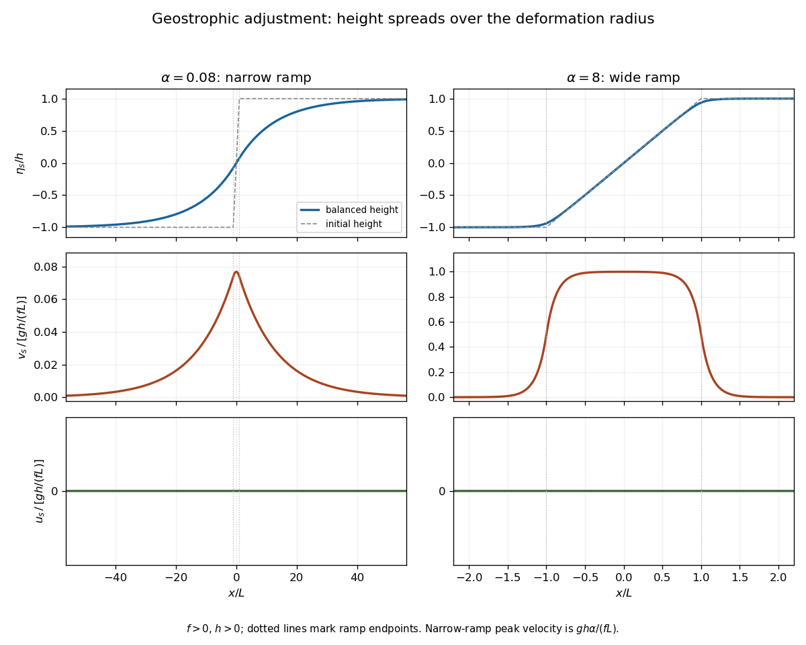

<h1 id="1/solution">Solution</h1>

↑ **Parent:** [1](../1.md)

Write $c=\sqrt{gH}$ and $R_d=c/|f|$, with $f\ne0$. For the profiles below take $f>0$, so $\alpha=L/R_d$ agrees with the stated parameter; changing the sign of $f$ reverses the balanced meridional [velocity](../../../../../velocity.md) but not the height profile. The linearized [shallow water equations](../../../../../shallow-water-equations.md) are

$$
u_t-fv=-g\eta_x,\qquad v_t+fu=-g\eta_y,\qquad \eta_t+H(u_x+v_y)=0.
$$

Taking the horizontal curl gives $(v_x-u_y)_t=-f(u_x+v_y)=f\eta_t/H$. Hence the signed linear [shallow-water potential vorticity](../../../../../shallow-water-potential-vorticity.md) anomaly is conserved:

$$
\boxed{\partial_t\left(v_x-u_y-\frac fH\eta\right)=0.}
$$

The initial data are independent of $y$, so the solution remains independent of $y$ and $v_x=f(\eta-\eta_0)/H$. Differentiating continuity in time and using the zonal momentum equation gives

$$
\eta_{tt}=-H(fv_x-g\eta_{xx}),\qquad
\boxed{\eta_{tt}-c^2\eta_{xx}+f^2\eta=f^2\eta_0,\quad \eta(0)=\eta_0,\quad\eta_t(0)=0.}
$$

For a horizontal [Fourier mode](../../../../../fourier-mode.md) with wavenumber $k$, put $\Omega_k^2=f^2+c^2k^2$. The solution splits into a balanced component and [inertia-gravity waves](../../../../../inertia-gravity-wave.md):

$$
\widehat\eta_s=\frac{f^2}{\Omega_k^2}\widehat\eta_0,\qquad
\widehat\eta(t)=\widehat\eta_s+(\widehat\eta_0-\widehat\eta_s)\cos(\Omega_k t).
$$

These waves have frequencies $|\omega|\ge|f|$, [phase velocity](../../../../../phase-velocity.md) $\omega/k$, and [group velocity](../../../../../group-velocity.md) $c^2k/\omega$, whose magnitude is less than $c$. They have zero perturbation [potential vorticity](../../../../../potential-vorticity.md) and carry the unbalanced part away. On the unbounded line, the localized difference between the initial and balanced profiles disperses, leaving a local steady limit. No damping is needed for this local [geostrophic adjustment](../../../../../geostrophic-adjustment.md); in a closed periodic domain, undamped waves would persist and a literal pointwise steady limit would generally not exist.

The bounded steady height satisfies the [modified Helmholtz equation](../../../../../modified-helmholtz-equation.md)

$$
R_d^2\eta_s''-\eta_s=-\eta_0.
$$

Oddness removes the even homogeneous solution in the central region. The exterior solution is bounded and tends to the appropriate plateau. Matching both height and its first derivative at $x=\pm L$ gives the [geostrophic adjustment of a finite-width height ramp](../../../../../geostrophic-adjustment-of-a-finite-width-height-ramp.md):

$$
\boxed{\frac{\eta_s(x)}h=
\begin{cases}
\displaystyle\frac{x}{L}-\frac{e^{-\alpha}}{\alpha}\sinh\frac{x}{R_d},&|x|\le L,\\
\displaystyle\operatorname{sgn}(x)\left[1-\frac{\sinh\alpha}{\alpha}e^{-|x|/R_d}\right],&|x|\ge L.
\end{cases}}
$$

For example, writing the interior solution as $hx/L+B\sinh(x/R_d)$, matching its slope to the decaying exterior at $L$ gives $B=-he^{-\alpha}/\alpha$.

The steady meridional momentum equation gives $u_s=0$, and the zonal equation gives the [geostrophic balance](../../../../../geostrophic-balance.md) $fv_s=g\eta_s'$. Thus

$$
\boxed{u_s=0,\qquad v_s(x)=\frac{gh}{fL}
\begin{cases}
1-e^{-\alpha}\cosh(x/R_d),&|x|\le L,\\
\sinh\alpha\,e^{-|x|/R_d},&|x|\ge L.
\end{cases}}
$$

The height is odd and monotone, and the meridional current is even, with maximum $v_s(0)=gh(1-e^{-\alpha})/(fL)$ for $h>0$.

For $\alpha\ll1$, the initial ramp is narrow compared with the [Rossby deformation radius](../../../../../rossby-deformation-radius.md). To leading order,

$$
\eta_s\simeq h\operatorname{sgn}(x)(1-e^{-|x|/R_d}),\qquad
v_s\simeq\frac{gh}{c}e^{-|x|/R_d}
=\frac{gh\alpha}{fL}e^{-|x|/R_d}.
$$

Near the origin the height rises with slope $h/R_d$, rather than $h/L$; the current has width $R_d=L/\alpha$ and peak $gh\alpha/(fL)$. For $\alpha\gg1$, the central height remains nearly $hx/L$ and the central [velocity](../../../../../velocity.md) nearly $gh/(fL)$. Around each end of the ramp there is a matching layer of width $R_d=L/\alpha$, with height correction of order $h/\alpha$; the exterior current decays over the same width. At $x=\pm L$ the current is approximately half its central value. In both limits the zonal current is zero. These are the broad rotational adjustment of a narrow disturbance and the weak edge adjustment of a broad disturbance, respectively.

**[Figure 1](#1/image-balanced-height-and-velocity-profiles-for-narrow-and-wide-initial-ramps-with-scales-shown-on-each-axis). Balanced height and velocity profiles for narrow and wide initial ramps, with scales shown on each axis**.

Use the [energy](../../../../../energy.md) normalization specified for the height [energy](../../../../../energy.md): the linear total [energy](../../../../../energy.md) [density](../../../../../density.md) is $(u^2+v^2)/2+g\eta^2/(2H)$. The linear equations imply

$$
\partial_t\left[\frac{u^2+v^2}{2}+\frac{g\eta^2}{2H}\right]+\partial_x(g\eta u)=0.
$$

For $\alpha\ll1$, let the [potential energy](../../../../../potential-energy.md) loss mean the positive difference between the initial and final values, per unit transverse length. Although both absolute potential energies diverge on the infinite line, their difference is finite. The leading step approximation gives

$$
\Delta V=\frac{gh^2}{2H}\int_{-\infty}^{\infty}\left[2e^{-|x|/R_d}-e^{-2|x|/R_d}\right]dx
\simeq\boxed{\frac{3gh^2R_d}{2H}=\frac{3gh^2L}{2H\alpha}}.
$$

The finite ramp changes this leading expression by a relative $O(\alpha)$ correction. The initial [kinetic energy](../../../../../kinetic-energy.md) is zero and the final gain is

$$
\Delta T=\frac12\left(\frac{gh}{c}\right)^2\int_{-\infty}^{\infty}e^{-2|x|/R_d}\,dx
\simeq\boxed{\frac{gh^2R_d}{2H}=\frac{gh^2L}{2H\alpha}},\qquad
\boxed{\frac{\Delta T}{\Delta V}\longrightarrow\frac13}.
$$

The remainder $\Delta V-\Delta T\simeq gh^2R_d/H$ is [energy](../../../../../energy.md) carried away by the outgoing [inertia-gravity waves](../../../../../inertia-gravity-wave.md). This explains why the ratio is less than one without invoking dissipation: [conservation of energy](../../../../../conservation-of-energy.md) includes the waves, not only the final balanced flow.

## ↑ Ancestors (10)

1. [1](../1.md)
2. [Paper 73](../../paper-73-split.md)
3. [Iii](../../split.md)
4. [2004](../../../split.md)
5. [Past exam of the mathematics course of the University of Cambridge](../../../../split.md)
6. [Mathematics course of the University of Cambridge](../../../../../mathematics-course-of-the-university-of-cambridge.md)
7. [Course of the University of Cambridge](../../../../../course-of-the-university-of-cambridge.md)
8. [University of Cambridge](../../../../../university-of-cambridge-split.md)
9. [List of universities](../../../../../list-of-universities.md)
10. [Codex Wiki](../../../../../split.md)
