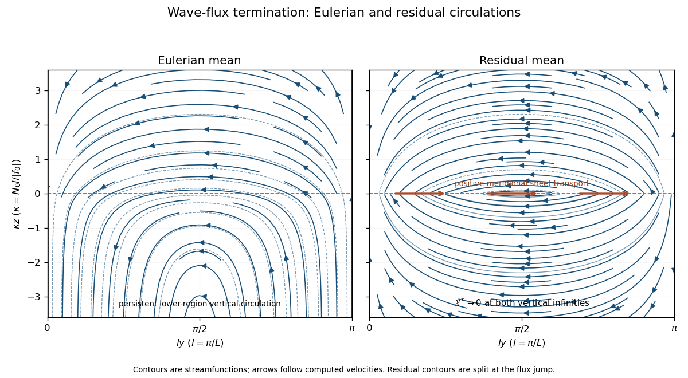

<h1 id="4/i/solution">Solution</h1>

↑ **Parent:** [Circulation application](../i.md)

Use the [meridional overturning streamfunction](../../../../../../meridional-overturning-streamfunction.md) convention

$$
\overline v_a=-\mathcal X_z,\quad\overline w_a=\mathcal X_y,\qquad
v^*=-\mathcal X_z^*,\quad w^*=\mathcal X_y^*,\qquad
\boxed{\mathcal X^*=\mathcal X+F/S.}
$$

Differentiating geostrophic and hydrostatic balance gives the [thermal wind](../../../../../../thermal-wind.md) relation $f_0\overline u_z=(g/\rho_0)\overline\rho_y$. Differentiate it in time and use the mean momentum and [density](../../../../../../density.md) equations. The resulting diagnostic [elliptic boundary value problem](../../../../../../elliptic-boundary-value-problem-split.md) is

$$
\boxed{(f_0^2\partial_z^2+N_0^2\partial_y^2)\mathcal X
=\frac g{\rho_0}F_{yy}-f_0R_{yz}.}
$$

For the transformed circulation it becomes the [Eliassen equation for residual circulation](../../../../../../eliassen-equation-for-residual-circulation.md), with signs appropriate to the convention above:

$$
\boxed{(f_0^2\partial_z^2+N_0^2\partial_y^2)\mathcal X^*
=f_0\partial_z\left(-R_y+f_0\partial_z(F/S)\right).}
$$

At the rigid meridional walls, impermeability requires each [streamfunction](../../../../../../stream-function.md) to be constant along each wall. Set those constants to zero, choosing the solution with no imposed net vertical throughflow. Since the prescribed [density](../../../../../../density.md) flux vanishes at both walls, the same conditions apply to $\mathcal X^*$.

There is a genuine data limitation: prescribing $F$ alone does not prescribe $R$. The term $-f_0R_{yz}$ remains in both circulation equations. To give the usual explicit step-flux circulation, assume **vanishing meridional momentum-flux divergence**, $R_y=0$, with no independently imposed circulation. The formulas below are conditional on that assumption, not a unique consequence of the [density](../../../../../../density.md) flux alone.

Let $l=\pi/L$, $\kappa=N_0l/|f_0|$ and $A_0=-1/S>0$, using the flux unit in which its lower plateau is $-1$. The bounded solution has $\mathcal X=\sin(ly)\chi(z)$. Its vertical equation is

$$
\chi''-\kappa^2\chi=-\frac{gl^2}{\rho_0f_0^2}\mathcal F(z).
$$

At vertical infinity require bounded Eulerian flow and vanishing residual flow. Requiring the Eulerian vertical [velocity](../../../../../../velocity.md) to vanish also at lower infinity would be inconsistent with the continuing lower-region flux divergence. At $z=0$, continuity of $\chi$ and $\chi'$ follows because the forcing has a step but no delta function. The [step-flux residual circulation in a stratified channel](../../../../../../step-flux-residual-circulation-in-a-stratified-channel.md) is therefore

$$
\boxed{\chi(z)=
\begin{cases}
-A_0(1-\tfrac12e^{\kappa z}),&z<0,\\
-\tfrac12A_0e^{-\kappa z},&z>0,
\end{cases}\qquad
\chi^*(z)=
\begin{cases}
\tfrac12A_0e^{\kappa z},&z<0,\\
-\tfrac12A_0e^{-\kappa z},&z>0.
\end{cases}}
$$

Here $\mathcal X^*=\sin(ly)\chi^*$, because $F/S=A_0\sin(ly)$ below zero and vanishes above it. The residual [streamfunction](../../../../../../stream-function.md) decays at both infinities, whereas the Eulerian [streamfunction](../../../../../../stream-function.md) tends to $-A_0\sin(ly)$ below and to zero above.

For $z\ne0$, the Eulerian [velocity](../../../../../../velocity.md) is

$$
\overline v_a=-\frac{A_0\kappa}{2}e^{-\kappa|z|}\sin(ly),\qquad
\overline w_a=
\begin{cases}
-A_0l(1-\tfrac12e^{\kappa z})\cos(ly),&z<0,\\
-\tfrac12A_0le^{-\kappa z}\cos(ly),&z>0.
\end{cases}
$$

The flow descends near the $y=0$ wall and rises near $y=L$, with a negative meridional return flow concentrated near $z=0$. Below the dissipation level its vertical flow balances the continuing divergence of eddy [density](../../../../../../density.md) transport. There is no independently added throughflow, but opposing vertical transports at lower infinity are required by this idealized forcing.

Away from the discontinuity the residual meridional [velocity](../../../../../../velocity.md) equals the Eulerian value, while

$$
w^*=
\begin{cases}
\tfrac12A_0le^{\kappa z}\cos(ly),&z<0,\\
-\tfrac12A_0le^{-\kappa z}\cos(ly),&z>0.
\end{cases}
$$

Thus the [residual mean circulation](../../../../../../residual-mean-circulation.md) forms two oppositely rotating cells, confined within vertical distance $O(1/\kappa)$ of the termination of the wave flux. Its [streamfunction](../../../../../../stream-function.md) jumps by $-A_0\sin(ly)$ at zero. Distributionally this supplies the horizontal return transport

$$
\boxed{v^*=-\frac{A_0\kappa}{2}e^{-\kappa|z|}\sin(ly)+A_0\sin(ly)\delta(z).}
$$

The [Dirac delta](../../../../../../dirac-delta-function.md) sheet is a consequence of the discontinuous imposed flux, not an extra [boundary condition](../../../../../../boundary-condition.md). Smoothing the flux termination replaces it by a thin finite return current. Streamlines must not be drawn as continuously crossing the jump without that transport.

The physical [Eulerian mean flow](../../../../../../eulerian-mean-flow.md) is continuous. In the transformed momentum equation, the sheet contribution to $f_0v^*$ cancels the sheet in the flux divergence, leaving the smooth mean acceleration

$$
\overline u_t=-\frac{f_0A_0\kappa}{2}e^{-\kappa|z|}\sin(ly),\qquad
\int_{-\infty}^{\infty}\overline u_t\,dz=-f_0A_0\sin(ly).
$$

Thus termination of the vertical [Eliassen–Palm flux](../../../../../../eliassen-palm-flux.md) produces a finite column-integrated wave drag, redistributed over depth by the [residual mean circulation](../../../../../../residual-mean-circulation.md).

**[Figure 2](#4/i/image-eulerian-and-residual-circulations-for-zero-momentum-flux-divergence-the-residual-flux-termination-sheet-closes-two-opposite-cells). Eulerian and residual circulations for zero momentum-flux divergence; the residual flux-termination sheet closes two opposite cells**.

For completeness, the general bounded response can be calculated without setting $R_y$ to zero. Expand $R_{yz}$ in wall-compatible sine modes, with coefficients $B_n(z)$, $l_n=n\pi/L$ and $\kappa_n=N_0l_n/|f_0|$. Add to either displayed [streamfunction](../../../../../../stream-function.md) the same correction

$$
\mathcal X_R(y,z)=\sum_{n\ge1}\sin(l_ny)\frac1{2f_0\kappa_n}
\int_{-\infty}^{\infty}e^{-\kappa_n|z-z'|}B_n(z')\,dz',
$$

for decaying momentum-flux forcing. The [Green function](../../../../../../green-s-function.md) sign follows from $(\partial_z^2-\kappa_n^2)e^{-\kappa_n|z-z'|}=-2\kappa_n\delta(z-z')$.

An explicit counterexample to uniqueness is the additional [momentum flux](../../../../../../momentum-flux.md) $R=\epsilon[1-\cos(2ly)]e^{-a|z|}$, with $a>0$. It vanishes at both walls and leaves the prescribed [density](../../../../../../density.md) flux unchanged. For $a\ne2\kappa$ it adds

$$
\mathcal X_R=\frac{2l\epsilon a}{f_0(a^2-4\kappa^2)}\sin(2ly)\operatorname{sgn}(z)
\left(e^{-a|z|}-e^{-2\kappa|z|}\right)
$$

to both circulations. This nonzero bounded, wall-impermeable solution verifies that the original mean equations need an additional momentum-flux specification to select a unique sketch.

## ↑ Ancestors (11)

1. [Circulation application](../i.md)
2. [4](../../4.md)
3. [Paper 73](../../../paper-73-split.md)
4. [Iii](../../../split.md)
5. [2004](../../../../split.md)
6. [Past exam of the mathematics course of the University of Cambridge](../../../../../split.md)
7. [Mathematics course of the University of Cambridge](../../../../../../mathematics-course-of-the-university-of-cambridge.md)
8. [Course of the University of Cambridge](../../../../../../course-of-the-university-of-cambridge.md)
9. [University of Cambridge](../../../../../../university-of-cambridge-split.md)
10. [List of universities](../../../../../../list-of-universities.md)
11. [Codex Wiki](../../../../../../split.md)
