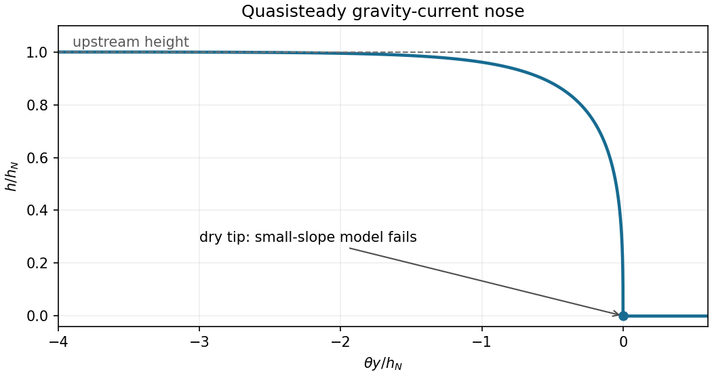

<h1 id="2/solution">Solution</h1>

↑ **Parent:** [2](../2.md)

Take $x$ downslope and $z$ normal to the plane. To leading order in the [lubrication approximation](../../../../../lubrication-theory.md), [Newtonian gravity](../../../../../gravitational-acceleration.md) gives the [hydrostatic pressure](../../../../../hydrostatic-pressure.md) $p=p_{\mathrm{atm}}+\rho g(h-z)$. The downslope [Stokes equation](../../../../../stokes-equation.md) is therefore $\mu u_{zz}=\rho g(h_x-\theta)$. Imposing the [no-slip boundary condition](../../../../../no-slip-boundary-condition.md) at $z=0$ and the [stress-free boundary condition](../../../../../stress-free-boundary-condition.md) at $z=h$ gives

$$
u=\frac g\nu(\theta-h_x)\left(hz-\frac{z^2}{2}\right),\qquad q=\int_0^h u\,dz=\frac g{3\nu}h^3(\theta-h_x).
$$

Here $\nu=\mu/\rho$ is the [kinematic viscosity](../../../../../kinematic-viscosity.md); $u$ is the downslope [velocity](../../../../../velocity.md). Applying [mass conservation](../../../../../mass-conservation.md) to this [lubrication gravity-current flux](../../../../../lubrication-gravity-current-flux.md),

$$
\boxed{h_t=\frac g{3\nu}\partial_x[h^3(h_x-\theta)]}.
$$

For typical thickness $H=\hat h$ and length $L=\hat x$, the transverse [velocity](../../../../../velocity.md) is $O(UH/L)$ by [incompressibility](../../../../../incompressible-flow.md). Both convective terms are then $O(U^2/L)$, while transverse viscous acceleration is $O(\nu U/H^2)$. Thus the [inertia criterion for an inclined viscous film](../../../../../inertia-criterion-for-an-inclined-viscous-film.md) is $UH^2/(\nu L)\ll1$, in addition to $H/L\ll1$. With evolution time $T\sim L/U$ the same condition controls unsteady inertia. If a faster time is independently imposed, also require $H^2/(\nu T)\ll1$. Estimating $U$ from the [velocity](../../../../../velocity.md) profile gives the two requested limits:

$$
\boxed{H\ll\theta L:\quad U\sim\frac{g\theta H^2}{\nu},\quad \frac{g\theta H^4}{\nu^2L}\ll1;\qquad H\gg\theta L:\quad U\sim\frac{gH^3}{\nu L},\quad \frac{gH^5}{\nu^2L^2}\ll1.}
$$

At long times, $h\sim A/x_N$ and the ratio of hydrostatic-gradient forcing to downslope [Newtonian gravity](../../../../../gravitational-acceleration.md) in the bulk is $h_x/\theta=O(A/(\theta x_N^2))\ll1$. Put $K=g\theta/(3\nu)$; the bulk [conservation law](../../../../../conservation-law.md) is $h_t+(Kh^3)_x=0$. The [finite-volume gravity-driven thin-film current](../../../../../finite-volume-gravity-driven-thin-film-current.md) scales as $x\sim t^{1/3}$, $h\sim t^{-1/3}$. More explicitly, writing $h=t^{-1/3}f(\xi)$, $\xi=x/t^{1/3}$, gives

$$
-\frac13(f+\xi f')+K(f^3)'=0,\qquad Kf^3-\frac13\xi f=0.
$$

The [constant of integration](../../../../../constant-of-integration.md) is zero for the zero-flux dry tail. Consequently

$$
\boxed{h(x,t)\simeq\sqrt{\frac{x}{3Kt}}=\sqrt{\frac{\nu x}{g\theta t}},\qquad 0<x<x_N(t)}.
$$

The reduced bulk solution is zero outside this interval. Its thin nose region is resolved below. Integrating to impose the conserved area,

$$
A=\int_0^{x_N}\sqrt{\frac{x}{3Kt}}\,dx=\frac{2x_N^{3/2}}{3\sqrt{3Kt}},\qquad \boxed{x_N^3=\frac{27}{4}KA^2t=\frac{9g\theta A^2t}{4\nu}}.
$$

The bulk front height is $h_N=3A/(2x_N)$, with $h_N^2=x_N/(3Kt)$. Differentiation of the front law gives

$$
\boxed{\dot x_N=\frac{x_N}{3t}=Kh_N^2=\frac{g\theta h_N^2}{3\nu}}.
$$

Equivalently, this is the [Rankine-Hugoniot condition](../../../../../rankine-hugoniot-conditions.md) for the bulk [shock wave](../../../../../shock-wave.md), whose speed is flux divided by height.

In moving coordinate $y=x-x_N(t)$, the full [thin-film equation](../../../../../thin-film-equation.md) becomes $h_t|_y-\dot x_N h_y+q_y=0$. A nose thickness $h_N$ and slope $\theta$ give axial scale $\ell_N=h_N/\theta$. Since $\ell_N/x_N=O(A/(\theta x_N^2))\ll1$, the explicit time derivative is smaller than translation by that ratio. The [travelling front of a gravity-driven thin film](../../../../../travelling-front-of-a-gravity-driven-thin-film.md) is therefore quasisteady. Integrate once with dry-tip flux zero to obtain $q=\dot x_N h$, or

$$
h_y=\theta\left(1-\frac{h_N^2}{h^2}\right).
$$

With $f=h/h_N$, separation of variables and the convention $y=0$ at $f=0$ give

$$
\boxed{\frac{\theta y}{h_N}=f-\operatorname{atanh}f=f+\frac12\log\frac{1-f}{1+f},\qquad 0\le f<1}.
$$

The nose approaches $h_N$ exponentially far behind its tip, then falls to zero with a vertical tangent in this small-slope model. The requested sketch shows this monotone profile:

**[Figure 1](#2/image-quasisteady-gravity-current-nose-with-a-dry-tip-and-an-asymptotically-uniform-upstream-film). Quasisteady gravity-current nose, with a dry tip and an asymptotically uniform upstream film**.

Expanding the [inverse hyperbolic tangent](../../../../../inverse-hyperbolic-tangent.md), $f-\operatorname{atanh}f=-f^3/3+O(f^5)$, so $h\sim(-3\theta h_N^2y)^{1/3}$. Its slope has magnitude $\theta/f^2$ near the tip. The [small-slope breakdown at an inclined-current nose](../../../../../small-slope-breakdown-at-an-inclined-current-nose.md) occurs at $f=O(\sqrt\theta)$, which gives

$$
\boxed{h=O(\sqrt\theta h_N),\qquad |y|=O(\sqrt\theta h_N)}.
$$

Finally, [surface tension](../../../../../surface-tension.md) produces a pressure-gradient scale $\gamma h_N/\ell_N^3$, whereas downslope [Newtonian gravity](../../../../../gravitational-acceleration.md) gives $\rho g\theta$. Their ratio is $\gamma\theta^2/(\rho g h_N^2)$. Thus [surface tension](../../../../../surface-tension.md) changes the principal nose length when

$$
\boxed{h_N\sim\theta\sqrt{\frac{\gamma}{\rho g}}}.
$$

This is a bulk-nose crossover; capillarity and contact-line physics can already affect a smaller region very close to the dry tip even when the bulk nose is [Newtonian gravity](../../../../../gravitational-acceleration.md) dominated.

## ↑ Ancestors (10)

1. [2](../2.md)
2. [Paper 74](../../paper-74-split.md)
3. [Iii](../../split.md)
4. [2004](../../../split.md)
5. [Past exam of the mathematics course of the University of Cambridge](../../../../split.md)
6. [Mathematics course of the University of Cambridge](../../../../../mathematics-course-of-the-university-of-cambridge.md)
7. [Course of the University of Cambridge](../../../../../course-of-the-university-of-cambridge.md)
8. [University of Cambridge](../../../../../university-of-cambridge-split.md)
9. [List of universities](../../../../../list-of-universities.md)
10. [Codex Wiki](../../../../../split.md)
