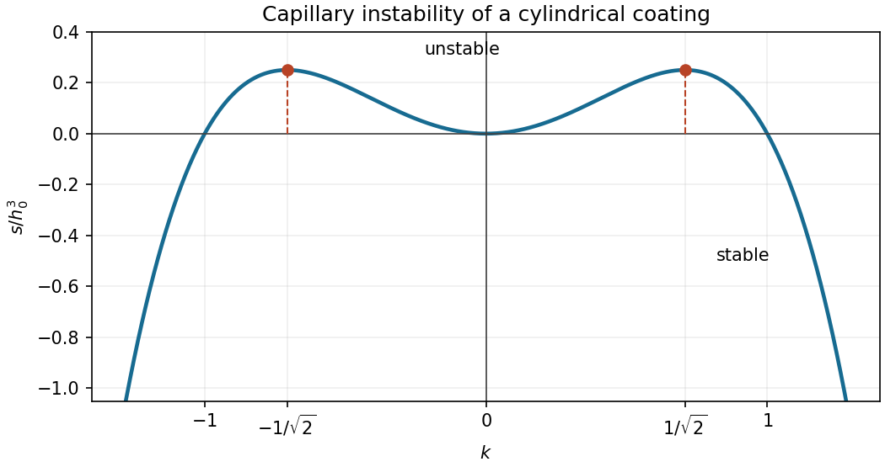

<h1 id="4/solution">Solution</h1>

↑ **Parent:** [4](../4.md)

Let $\delta=H/L\ll1$. [Incompressibility](../../../../../incompressible-flow.md) makes the transverse [velocity](../../../../../velocity.md) $O(\delta U)$. In the axial [Navier-Stokes equation](../../../../../navier-stokes-equation.md), transverse viscous stress scales as $\mu U/H^2$, longitudinal viscous stress as $\mu U/L^2$, and convective inertia as $\rho U^2/L$. Thus [lubrication theory](../../../../../lubrication-theory.md) requires

$$
\boxed{\delta\ll1,\qquad \frac{\rho UH^2}{\mu L}\ll1},\qquad p\sim\frac{\mu UL}{H^2}.
$$

Unsteady inertia is also negligible if $\rho H^2/(\mu T)\ll1$; this coincides with the preceding condition when $T=L/U$. The transverse [pressure](../../../../../pressure.md) variation is smaller than this [pressure](../../../../../pressure.md) scale by $O(\delta^2)$, and viscous normal stress at the free surface is similarly smaller. Consequently [pressure](../../../../../pressure.md) is uniform across the film to leading order, while axial viscous shear balances its axial gradient. These estimates justify the [lubrication approximation](../../../../../lubrication-theory.md) with small surface slopes and a slowly varying rigid wall.

Write the physical cylindrical-film thickness as $d=\epsilon\bar h$, so that $\bar h=O(a)$, and use $\bar z,\bar t$ for dimensional coordinates. For a surface of radius $a+d$, its outward [mean curvature](../../../../../mean-curvature.md), with the convention giving cylindrical curvature $1/a$, is

$$
\kappa=\frac1{(a+d)\sqrt{1+d_{\bar z}^2}}-\frac{d_{\bar z\bar z}}{(1+d_{\bar z}^2)^{3/2}}=\frac1a-\frac d{a^2}-d_{\bar z\bar z}+O(\epsilon^2/a).
$$

The [Young–Laplace equation](../../../../../young-laplace-equation.md) gives $p=p_{\mathrm{ext}}+\gamma\kappa$. With local normal coordinate $y$ measured from the rigid cylinder, the axial [velocity](../../../../../velocity.md) solves $\mu u_{yy}=p_{\bar z}$, with [no-slip boundary condition](../../../../../no-slip-boundary-condition.md) at $y=0$ and [stress-free boundary condition](../../../../../stress-free-boundary-condition.md) at $y=d$. Therefore

$$
u=\frac{p_{\bar z}}{2\mu}(y^2-2dy),\qquad q=-\frac{d^3}{3\mu}p_{\bar z}=\frac{\gamma d^3}{3\mu}\left(\frac{d_{\bar z}}{a^2}+d_{\bar z\bar z\bar z}\right).
$$

The factors of circumference in axisymmetric [mass conservation](../../../../../mass-conservation.md) cancel at leading thin-film order, giving $d_{\bar t}+q_{\bar z}=0$. Introduce

$$
\boxed{h=\frac{d}{\epsilon a}=\frac{\bar h}{a},\qquad z=\frac{\bar z}{a},\qquad t=\frac{\gamma\epsilon^3}{3\mu a}\bar t}.
$$

This produces the [capillary instability of a thin film on a rigid cylinder](../../../../../capillary-instability-of-a-thin-film-on-a-rigid-cylinder.md) governed by

$$
\boxed{h_t+\partial_z[h^3(h_z+h_{zzz})]=0}.
$$

The curvature term $h_z$ destabilizes long waves; the axial-curvature term $h_{zzz}$ smooths short waves.

Linearize about $h_0$ using $h=h_0+\eta e^{st+ikz}$ with small $\eta$. The linear equation is $s+h_0^3(-k^2+k^4)=0$, so

$$
\boxed{s(k)=h_0^3(k^2-k^4)}.
$$

The [growth rate](../../../../../growth-rate.md) is positive for $0<|k|<1$, zero at $k=0,\pm1$, and negative for $|k|>1$. Its derivative is $2h_0^3k(1-2k^2)$, giving

$$
\boxed{|k_{\max}|=\frac1{\sqrt2},\qquad s_{\max}=\frac{h_0^3}{4},\qquad \lambda_{\max}^{\mathrm{physical}}=2\pi\sqrt2\,a}.
$$

The requested sketch is even in $k$:

**[Figure 2](#4/image-growth-rate-curve-for-the-capillary-instability-of-a-thin-coating-on-a-rigid-cylinder). Growth-rate curve for the capillary instability of a thin coating on a rigid cylinder**.

For the [Rayleigh–Plateau instability](../../../../../rayleigh-plateau-instability.md) of an entire liquid cylinder in the purely viscous limit with negligible exterior viscosity, the fastest mode tends to infinite wavelength. The rigid-wall coating instead selects a finite wavelength. The difference comes from the flow resistance: a coating must shear across its thickness, so its long-wave growth vanishes as $k^2$; a free liquid cylinder can undergo nearly plug-like axial extension. For example, the long-wave free-cylinder balances $\eta_t+(a/2)u_z=0$ and $3\mu u_{zz}=-\gamma(\eta_z/a^2+\eta_{zzz})$ give $s\sim\gamma(1-a^2k^2)/(6\mu a)$, which does not vanish as $k\to0$. This comparison is for the creeping-flow, negligible-exterior-viscosity limit; finite inertia or exterior viscosity changes the wavelength selection. The full free-cylinder dispersion relation is discussed in [Plateau-Rayleigh Instability of a Cylinder of Viscous Liquid](https://arxiv.org/abs/1712.07069).

The collar is a [quasisteady sliding collar on a coated cylinder](../../../../../quasisteady-sliding-collar-on-a-coated-cylinder.md). It must slowly grow as well as translate: an exact [travelling wave](../../../../../travelling-wave.md) would obey $q-ch=\text{constant}$, whereas its stationary uniform far films have $q=0$ and would require $-ch_+=-ch_-$. Thus the stipulated unequal films require the stated slow evolution of the collar amplitude. In its $h=O(1)$ core, $c\ll1$ and the volume flux is small, so the leading [pressure](../../../../../pressure.md) gradient vanishes: $h'+h'''=0$. Integration gives a constant plus sine and cosine terms. Choose the collar centre at its maximum to remove the sine term, and parameterize its edge height as $B$. Then

$$
\boxed{h=A(1+\cos x)+B,\qquad -\pi<x<\pi}.
$$

The core is a local capillary equilibrium. In the moving frame, swept-up volume minus deposited volume gives the growth rate $c(h_+-h_-)$. Its leading excess volume is $2\pi A$, and for constant $B$,

$$
2\pi\dot A\simeq c(h_+-h_-).
$$

Thus the printed rate is the rate of collar volume, or an order-of-magnitude amplitude rate; interpreted as an exact equation for $\dot A$, it lacks $1/(2\pi)$. This slow change is smaller than the translational core terms by the small far-film thickness and does not alter the leading local matching below.

Near either edge $x_f=\pm\pi$, let $h_f$ denote the adjacent film thickness, $h_-$ at the rear and $h_+$ at the front. Across the short transition region the collar's slow growth is higher order, so local [mass conservation](../../../../../mass-conservation.md) integrates to $q=c(h-h_f)$. The axial third derivative dominates the first derivative in the capillary flux, giving

$$
h^3h'''=c(h-h_f).
$$

For [collar-to-film capillary matching](../../../../../collar-to-film-capillary-matching.md), choose

$$
h=h_fH,\qquad x-x_f=\frac{h_f}{c^{1/3}}X.
$$

The two sides become $ch_fH^3H'''$ and $ch_f(H-1)$ respectively, and hence

$$
\boxed{H^3H'''=H-1}.
$$

The resulting transition length is small compared with the core length: the matching relations below imply $h_f=O(c^{2/3}/A)$, so $h_f/c^{1/3}=O(c^{1/3}/A)$ for an order-one core amplitude.

To count admissible branches, put $H=1+\zeta$ and linearize. The [characteristic equation](../../../../../characteristic-equation-of-a-constant-coefficient-differential-equation.md) is $r^3=1$, with roots

$$
r=1,\qquad r=-\frac12\pm i\frac{\sqrt3}{2}.
$$

At the rear, decay as $X\to-\infty$ permits only $\zeta\sim D e^X$. For the nontrivial branch growing into a positive collar, $D>0$; translation rescales $D$, leaving one orbit. This branch has positive $H',H'',H'''$. It exists for all forward $X$, since $0<H'''=(H-1)/H^3\le4/27$ for $H\ge1$, and once $H''>0$, $H$ grows at least quadratically. Then $H'''=O(X^{-4})$, so successive integrations give a quadratic asymptote with a finite constant term; translation removes the linear term. The constant solution is not a rear-to-collar match. On the downward branch, $H<1$ gives $H'''<0$ while $H'$ and $H''$ are initially negative; the slope remains negative and $H$ reaches zero, so it cannot match a positive collar. **Uniqueness here refers to the positive, nontrivial rear matching branch, modulo translations.**

At the front, decay as $X\to+\infty$ permits the two real amplitudes in

$$
\zeta\sim e^{-X/2}\left[D_1\cos\frac{\sqrt3X}{2}+D_2\sin\frac{\sqrt3X}{2}\right].
$$

Translation removes one degree of freedom, leaving one parameter $\lambda$. These oscillatory branches account for the small capillary ripples ahead of the collar. This local [stable manifold](../../../../../stable-manifold.md) count gives the family of front branches; admissible global branches must also remain positive and reach a parabolic core asymptote. It does not, by itself, prove the global uniqueness of the matching parameter supplied in the question.

Write the rear and front core asymptotes, after translation removes their linear terms, as $a_-X^2+b_-$ and $a_+(\lambda)X^2+b_+(\lambda)$. Expanding the outer collar near either edge gives

$$
h=B+\frac A2(x-x_f)^2+O((x-x_f)^4),
$$

whereas the inner expansion gives

$$
h=b_\pm h_\pm+\frac{a_\pm c^{2/3}}{h_\pm}(x-x_f)^2+\cdots.
$$

Matching the constant and quadratic coefficients therefore yields

$$
B=b_-h_-=b_+h_+,\qquad \frac A2=\frac{a_-c^{2/3}}{h_-}=\frac{a_+c^{2/3}}{h_+}.
$$

Eliminate $h_-/h_+$ to obtain $a_+(\lambda)b_+(\lambda)=a_-b_-$. Using the specified selected root $\lambda_0$ and writing $\alpha=a_+(\lambda_0)$, $\beta=b_+(\lambda_0)$,

$$
\boxed{c=\left(\frac{Ah_+}{2\alpha}\right)^{3/2},\qquad B=\beta h_+,\qquad h_-=\frac{a_-}{\alpha}h_+}.
$$

The physical branch has $\alpha>a_-$, as required by $h_-<h_+$. No numerical values of these universal matching coefficients are needed for the requested relations.

Finally, the energy source is **decreasing capillary [surface energy](../../../../../surface-energy.md)**, not [Newtonian gravity](../../../../../gravitational-acceleration.md). This can be checked through the [volume-constrained capillary energy of a cylindrical coating](../../../../../volume-constrained-capillary-energy-of-a-cylindrical-coating.md). The exact liquid volume per axial length is $\pi[(a+d)^2-a^2]$, and the free-surface area is $2\pi\int(a+d)\sqrt{1+d_{\bar z}^2}\,d\bar z$. Expanding the latter and eliminating $\int d$ with fixed exact volume gives the nonconstant quadratic part

$$
\gamma\pi a\int\left[d_{\bar z}^2-\frac{d^2}{a^2}\right]d\bar z.
$$

Apart from its positive dimensional factor, this is the [surface energy](../../../../../surface-energy.md) $\mathcal E=\tfrac12\int(h_z^2-h^2)\,dz$. Its variational derivative is $-h-h_{zz}$, and the [thin-film equation](../../../../../thin-film-equation.md) is a conserved [gradient flow](../../../../../gradient-flow.md). With periodic or zero-energy-flux boundaries, integration by parts gives

$$
\boxed{\frac{d\mathcal E}{dt}=-\int h^3(h_z+h_{zzz})^2\,dz\le0}.
$$

For an isolated collar between unequal infinite films, use the corresponding local energy balance, including far-film fluxes and subtracting background energies; the unsubtracted total energy is infinite. Collecting film into the growing collar lowers [surface energy](../../../../../surface-energy.md), which supplies the [viscous dissipation](../../../../../viscous-dissipation.md) sustaining its slow motion.

## ↑ Ancestors (10)

1. [4](../4.md)
2. [Paper 74](../../paper-74-split.md)
3. [Iii](../../split.md)
4. [2004](../../../split.md)
5. [Past exam of the mathematics course of the University of Cambridge](../../../../split.md)
6. [Mathematics course of the University of Cambridge](../../../../../mathematics-course-of-the-university-of-cambridge.md)
7. [Course of the University of Cambridge](../../../../../course-of-the-university-of-cambridge.md)
8. [University of Cambridge](../../../../../university-of-cambridge-split.md)
9. [List of universities](../../../../../list-of-universities.md)
10. [Codex Wiki](../../../../../split.md)
