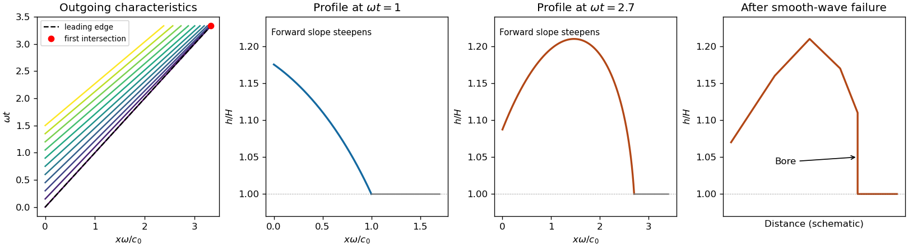

<h1 id="1/b/solution">Solution</h1>

↑ **Parent:** [B](../b.md)

Before [surface-wave breaking](../../../../../../surface-wave-breaking.md) or reflected waves return, the [shallow water equations](../../../../../../shallow-water-equations.md) are $h_t+(hu)_x=0$ and $u_t+uu_x+gh_x=0$. Set $c=\sqrt{gh}$ and $c_0=\sqrt{gH}$. Their [Riemann invariants](../../../../../../riemann-invariant.md) are $u\pm2c$ along $dx/dt=u\pm c$. An outgoing [simple wave](../../../../../../simple-wave.md) entering resting water has $u-2c=-2c_0$, so the imposed boundary [velocity](../../../../../../velocity.md) gives

$$
\boxed{h(0,t)=\frac1g\left[c_0+\frac U2\sin(\omega t)\right]^2}.
$$

This formula requires $c_0+u/2>0$ and an appropriate inflow/outflow [characteristic curve](../../../../../../characteristic-curve.md) count. In particular $U<2c_0/3$ ensures that only the outgoing family enters the domain throughout the cycle; stronger forcing can change the boundary problem.

A [characteristic curve](../../../../../../characteristic-curve.md) emitted at time $s$ carries constant $u=U\sin\omega s$ and $h=h(0,s)$ and follows

$$
x=v(s)(t-s),\qquad v(s)=c_0+\frac32U\sin(\omega s).
$$

Increasing boundary [velocity](../../../../../../velocity.md) produces faster following [characteristic curves](../../../../../../characteristic-curve.md), steepening the advancing side of a crest; decreasing boundary [velocity](../../../../../../velocity.md) spreads the curves and produces a [rarefaction wave](../../../../../../rarefaction-wave.md). A trough has reduced depth and smaller propagation speed. Once the compressive curves intersect, the single-valued [simple wave](../../../../../../simple-wave.md) must be replaced by an admissible [hydraulic bore](../../../../../../hydraulic-bore.md), with [mass conservation](../../../../../../mass-conservation.md) and [momentum conservation](../../../../../../momentum-conservation.md) across it and loss of mechanical [energy](../../../../../../energy.md). In a very weak or dispersive wavetrain an undular bore can replace the ideal discontinuity.

For a bore of speed $s_b$ entering undisturbed depth $H$, the [Rankine-Hugoniot condition](../../../../../../rankine-hugoniot-conditions.md) gives $s_b[h]=[hu]$ and $s_b[hu]=[hu^2+gh^2/2]$. If $h_2>H$ is its depth just behind, elimination of the behind-bore [velocity](../../../../../../velocity.md) yields $s_b^2=gh_2(h_2+H)/(2H)$ and $u_2=s_b(h_2-H)/h_2$. Thus the newly formed front travels faster than $c_0$, carries a depth jump, and dissipates [energy](../../../../../../energy.md); the behind-bore state must satisfy these balances rather than continuing intersecting smooth curves. The final sketch is schematic and does not claim a solved post-breaking boundary-value problem.

There is a numerical defect in the printed leading-edge claim. The first leading edge is the $s=0$ curve $x=c_0t$. The envelope condition $\partial_s x=0$ gives

$$
t=s+\frac{v(s)}{v'(s)},\qquad x_b(s)=\frac{v(s)^2}{v'(s)}.
$$

At the leading edge,

$$
\boxed{t_{\rm lead}=\frac{2c_0}{3U\omega},\qquad x_{\rm lead}=\frac{2gH}{3U\omega}}.
$$

This follows directly from the specified boundary acceleration and the exact [Riemann invariant](../../../../../../riemann-invariant.md). The printed coefficient $4/9$ is incompatible with these data: at that distance the leading-edge [characteristic curves](../../../../../../characteristic-curve.md) have not yet intersected. For the first compression interval, $0<\omega s<\pi/2$, one has $v''<0$. Consequently $d(s+v/v')/ds=2-vv''/v'^2>0$, so the first envelope occurs at $s=0$. This [boundary-driven shallow-water wave steepening](../../../../../../boundary-driven-shallow-water-wave-steepening.md) calculation also establishes that no later characteristic in the initial compression forms a bore earlier.

**[Figure 1](#1/b/image-outgoing-shallow-water-characteristics-and-profiles-before-the-leading-edge-bore). Outgoing shallow-water characteristics and profiles before the leading-edge bore**.

## ↑ Ancestors (11)

1. [B](../b.md)
2. [1](../../1.md)
3. [Paper 75](../../../paper-75-split.md)
4. [Iii](../../../split.md)
5. [2004](../../../../split.md)
6. [Past exam of the mathematics course of the University of Cambridge](../../../../../split.md)
7. [Mathematics course of the University of Cambridge](../../../../../../mathematics-course-of-the-university-of-cambridge.md)
8. [Course of the University of Cambridge](../../../../../../course-of-the-university-of-cambridge.md)
9. [University of Cambridge](../../../../../../university-of-cambridge-split.md)
10. [List of universities](../../../../../../list-of-universities.md)
11. [Codex Wiki](../../../../../../split.md)
