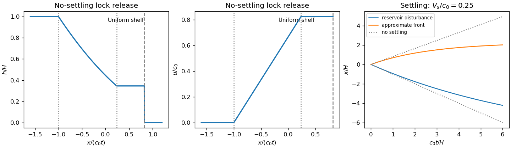

<h1 id="3/d/solution">Solution</h1>

↑ **Parent:** [D](../d.md)

Without settling, $b=b_0=G\phi_0$ and $c_0=\sqrt{b_0H}$. The left-running [rarefaction wave](../../../../../../rarefaction-wave.md) has the unchanged [Riemann invariant](../../../../../../riemann-invariant.md) $u+2c=2c_0$ and similarity coordinate $\xi=x/t=u-c$. Hence

$$
u(\xi)=\frac23(c_0+\xi),\qquad c(\xi)=\frac13(2c_0-\xi),\qquad h(\xi)=\frac{(2c_0-\xi)^2}{9b_0}.
$$

Matching to the [Froude number](../../../../../../froude-number.md) condition $u_f=Fc_f$ gives

$$
\boxed{c_f=\frac{2c_0}{F+2},\qquad h_f=\frac{4H}{(F+2)^2},\qquad u_f=\frac{2Fc_0}{F+2},\qquad x_f=u_ft}.
$$

The full outer profiles are $(h,u)=(H,0)$ for $x/t<-c_0$; the displayed fan for $-c_0<x/t<\xi_s$; and $(h,u)=(h_f,u_f)$ for $\xi_s<x/t<u_f$, where

$$
\xi_s=u_f-c_f=\frac{2(F-1)c_0}{F+2}.
$$

Ahead of $x_f$ there is only ambient fluid, so the particle-laden layer has zero depth. The shelf width is $(u_f-\xi_s)t=c_ft>0$ for every finite positive $F$. It disappears only in the formal $F\to\infty$ dry-front limit, where $u_f\to2c_0$. For $F<1$, the fan/shelf junction lies to the left of the initial barrier; the profiles remain consistent. This is the [finite-Froude lock-release rarefaction](../../../../../../finite-froude-lock-release-rarefaction.md), valid while the reservoir can be treated as semi-infinite.

**[Figure 2](#3/d/image-lock-release-depth-and-velocity-profiles-with-settling-attenuation-of-the-reservoir-disturbance-and-approximate-front). Lock-release depth and velocity profiles, with settling attenuation of the reservoir disturbance and approximate front**.

## ↑ Ancestors (11)

1. [D](../d.md)
2. [3](../../3.md)
3. [Paper 75](../../../paper-75-split.md)
4. [Iii](../../../split.md)
5. [2004](../../../../split.md)
6. [Past exam of the mathematics course of the University of Cambridge](../../../../../split.md)
7. [Mathematics course of the University of Cambridge](../../../../../../mathematics-course-of-the-university-of-cambridge.md)
8. [Course of the University of Cambridge](../../../../../../course-of-the-university-of-cambridge.md)
9. [University of Cambridge](../../../../../../university-of-cambridge-split.md)
10. [List of universities](../../../../../../list-of-universities.md)
11. [Codex Wiki](../../../../../../split.md)
