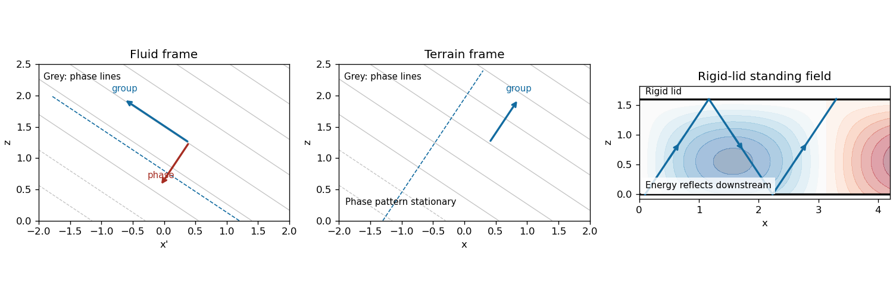

<h1 id="5/b/solution">Solution</h1>

↑ **Parent:** [B](../b.md)

Assume $U>0$, $k=\alpha>0$, constant $N$, negligible rotation, dissipation and reflection from infinity, small $k\eta_0$ and $m\eta_0$, and no wave overturning. The terrain is stationary, so laboratory frequency is zero and [intrinsic frequency](../../../../../../intrinsic-frequency.md) is $\widehat\omega=-kU$. Propagation requires $kU<N$. Put

$$
m=\sqrt{\frac{N^2}{U^2}-k^2}>0,\qquad \chi=kx+mz.
$$

The [kinematic boundary condition](../../../../../../kinematic-boundary-condition.md) at the linearized bed is $w(x,0)=U\eta_x=-kU\eta_0\sin(kx)$. The upward [radiation condition](../../../../../../radiation-condition.md) selects the positive $m$ branch because $c_{gz}=-\widehat\omega m/(k^2+m^2)>0$. Thus

$$
w(x,z)=-kU\eta_0\sin\chi,\qquad u'(x,z)=mU\eta_0\sin\chi.
$$

The [internal-wave polarization](../../../../../../internal-wave-polarization.md) and every other perturbation follow from this vertical [velocity](../../../../../../velocity.md) and the linear equations.

In the frame moving with the fluid, $x'=x-Ut$, the phase is $kx'+mz+kUt$, and

$$
\mathbf c_p^{\rm fluid}=-\frac{Uk(k,m)}{k^2+m^2},\qquad \mathbf c_g^{\rm fluid}=\left(-\frac{Um^2}{k^2+m^2},\frac{Ukm}{k^2+m^2}\right).
$$

The intrinsic energy ray slopes upward and upstream, $dz/dx'=-k/m$, along a [constant-phase line of an internal gravity wave](../../../../../../constant-phase-line-of-an-internal-gravity-wave.md). At fixed intrinsic frequency the spatial wave equation is hyperbolic, with the two [characteristic curve](../../../../../../characteristic-curve.md) line slopes $dz/dx'=\pm k/m$; the [radiation condition](../../../../../../radiation-condition.md) selects the upward ray of the appropriate horizontal propagation branch.

In the terrain frame, phase lines remain fixed and the pattern [phase velocity](../../../../../../phase-velocity.md) is zero. A transported packet has

$$
\boxed{\mathbf c_g^{\rm ground}=(U,0)+\mathbf c_g^{\rm fluid}=\left(\frac{Uk^2}{k^2+m^2},\frac{Ukm}{k^2+m^2}\right)}.
$$

Its energy path slopes upward and downstream, $dz/dx=m/k$, and need not coincide with a stationary phase line. One should not add $(U,0)$ to the chosen normal intrinsic [phase velocity](../../../../../../phase-velocity.md) and call that the normal ground-frame phase velocity: tangential motion along a phase line is arbitrary; zero laboratory frequency makes the entire crest pattern stationary. The sketch distinguishes stationary crests, intrinsic characteristics and transported energy.

If $kU>N$, $m$ is imaginary and the bounded field is an [evanescent wave](../../../../../../evanescent-wave.md); at $kU=N$ the vertical group velocity vanishes and an ordinary upward radiation interpretation degenerates.

**[Figure 3](#5/b/image-phase-lines-and-energy-rays-of-topographic-internal-waves-in-fluid-and-terrain-frames-with-rigid-lid-reflection). Phase lines and energy rays of topographic internal waves in fluid and terrain frames, with rigid-lid reflection**.

## ↑ Ancestors (11)

1. [B](../b.md)
2. [5](../../5.md)
3. [Paper 75](../../../paper-75-split.md)
4. [Iii](../../../split.md)
5. [2004](../../../../split.md)
6. [Past exam of the mathematics course of the University of Cambridge](../../../../../split.md)
7. [Mathematics course of the University of Cambridge](../../../../../../mathematics-course-of-the-university-of-cambridge.md)
8. [Course of the University of Cambridge](../../../../../../course-of-the-university-of-cambridge.md)
9. [University of Cambridge](../../../../../../university-of-cambridge-split.md)
10. [List of universities](../../../../../../list-of-universities.md)
11. [Codex Wiki](../../../../../../split.md)
