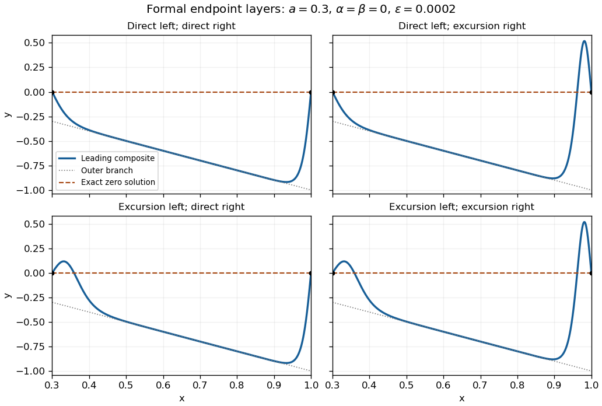

<h1 id="3/solution">Solution</h1>

↑ **Parent:** [3](../3.md)

The [outer solution](../../../../../outer-expansion.md) satisfies $y(x)[x+y(x)]=0$, so on a connected interior interval the nonoscillatory branches are $y=0$ and $y=-x$. Both happen to solve the [differential equation](../../../../../differential-equation-split.md) exactly away from any endpoint mismatch. For a fixed positive endpoint coordinate $q$ ($q=a$ or $q=1$), introduce the inward distance $\xi=(x-a)/\sqrt\epsilon$ on the left or $\xi=(1-x)/\sqrt\epsilon$ on the right. The leading [nonlinear endpoint layer with a quadratic reaction](../../../../../nonlinear-endpoint-layer-with-a-quadratic-reaction.md) obeys

$$
Y''+qY+Y^2=0,\qquad
\frac12(Y')^2+\frac q2Y^2+\frac13Y^3=E.
$$

Matching to zero fixes $E=0$, so $(Y')^2=-qY^2-2Y^3/3$. It is negative for every sufficiently small nonzero $Y$. Thus no real nonconstant layer can approach zero: **the zero outer branch requires $\alpha=\beta=0$**, and then $y=0$ is an exact solution.

Matching to $-q$ fixes $E=q^3/6$. The [first integral](../../../../../first-integral.md) factors as

$$
\boxed{(Y')^2=\frac13(q-2Y)(Y+q)^2}.
$$

Consequently an endpoint value $\eta$ can match this branch only if $\eta\le q/2$. For $-q<\eta<q/2$, there are two choices: a direct approach to $-q$, and an initial excursion to $q/2$ followed by a return to $-q$. Both are translations of

$$
Y(\xi)=-q+\frac{3q}{2}\operatorname{sech}^2\left[\frac{\sqrt q}{2}(\xi-\xi_0)\right],\qquad
\xi_0=\pm\frac2{\sqrt q}\operatorname{arcosh}\sqrt{\frac{3q}{2(\eta+q)}}.
$$

The negative translation gives the direct layer; the positive translation gives the excursion. At $\eta=q/2$ the two coincide, with the maximum at the wall. For $\eta<-q$, the unique admissible direction is a monotone approach from below:

$$
Y(\xi)=-q-\frac{3q}{2}\operatorname{csch}^2\left[\frac{\sqrt q}{2}(\xi+\xi_0)\right],\qquad
\xi_0>0,
$$

where $\xi_0$ is fixed by $Y(0)=\eta$. At $\eta=-q$ only the constant leading layer matches at a finite inward coordinate; a pulse translated infinitely far from the wall is outside this endpoint-layer classification.

Thus the leading admissibility condition for the negative outer branch is **$\alpha\le a/2$ and $\beta\le1/2$**. Under strict inequalities, each endpoint has two choices when its datum lies between $-q$ and $q/2$, and one choice below $-q$. Their independent combinations give one, two or four formal matched profiles. In particular, for $\alpha=\beta=0$ there are four negative-bulk profiles in addition to the exact zero solution, so uniqueness certainly cannot be inferred from the outer equation. The endpoint equalities and the constant-layer cases are degenerate; higher-order endpoint matching is needed to decide exact finite-$\epsilon$ counts at these cutoffs. These conditions and counts concern leading families under the stated exclusion of interior layers and rapid oscillations.

A [matched asymptotic expansion](../../../../../matched-asymptotic-expansion.md) for the negative branch is

$$
y_{\rm comp}(x)=-x+[Y_L((x-a)/\sqrt\epsilon)+a]
+[Y_R((1-x)/\sqrt\epsilon)+1].
$$

The following sketch shows the four choices for zero endpoint data, together with the exact zero solution. It plots leading composite profiles, not numerical claims of exact finite-$\epsilon$ multiplicity.

**[Figure 1](#3/image-four-leading-endpoint-layer-profiles-with-negative-outer-branch-and-the-exact-zero-solution). Four leading endpoint-layer profiles with negative outer branch, and the exact zero solution**.

Additional interior layers cannot be excluded merely by counting the outer roots. Freezing $x=q$ gives a [homoclinic orbit](../../../../../homoclinic-orbit.md) to $-q$ with the same hyperbolic-secant pulse. Its location would require a further matching or [solvability condition](../../../../../solvability-condition.md); it is not an arbitrary parameter in the original variable-coefficient problem. Indeed, put $z=y+x$. The exact equation and an energy identity are

$$
\epsilon z''-xz+z^2=0,\qquad
\frac d{dx}\left[\frac\epsilon2(z')^2-\frac x2z^2+\frac13z^3\right]= -\frac12z^2.
$$

An isolated order-one pulse with exponentially small tails on both sides would decrease this energy by an algebraic amount, whereas its two tail energies would be exponentially small. This obstructs a freely standing isolated pulse well away from the walls. It does not by itself classify oscillatory solutions or pulse interactions with endpoint layers, so a complete global uniqueness claim would exceed this leading construction.

When $a=\alpha=0$, the two outer roots meet at the left endpoint. Let $x=\epsilon^pX$, $y=\epsilon^qY$. Balancing $xy$ with $y^2$ gives $p=q$, and balancing $\epsilon y''$ with them gives $1-q=2q$. The [one-third-power scaling at a nonlinear turning endpoint](../../../../../one-third-power-scaling-at-a-nonlinear-turning-endpoint.md) is therefore

$$
\boxed{x=\epsilon^{1/3}X,\quad y=\epsilon^{1/3}Y,\quad Y''+XY+Y^2=0}.
$$

Its left condition is $Y(0)=0$. Matching to the negative branch requires $Y(X)+X\to0$ and $Y'(X)+1\to0$ as $X\to\infty$; the right endpoint is then handled by the earlier $q=1$ layer. Write $Y=-X+u$. In the intermediate matching region a small correction satisfies $u''-Xu=0$, so $u=C\operatorname{Ai}(X)+D\operatorname{Bi}(X)$. The growing [Airy function](../../../../../airy-function.md) excludes $D$; the decaying [Airy function](../../../../../airy-function.md) supplies a permissible stable matching direction. In fact $Y=-X$ is an exact inner solution satisfying $Y(0)=0$, establishing existence of an inner match without solving a nonlinear shooting problem. Since $\operatorname{Ai}(0)\ne0$, the wall condition excludes an infinitesimal nonzero decaying correction about this solution; it does not prove absence of other finite-amplitude inner solutions. The right wall still requires $\beta\le1/2$ at leading order.

Matching instead to zero requires $Y\to0$. Its linearized equation is $Y''+XY=0$, with solutions $\operatorname{Ai}(-X)$ and $\operatorname{Bi}(-X)$. Their large-$X$ forms have envelope $X^{-1/4}$ and phase $2X^{3/2}/3$; although their values decay, they generate rapid spatial oscillations in the overlap region. The imposed nonoscillatory assumption removes these nonzero tails. The exact $Y=0$ remains, and a globally zero outer branch again requires $\beta=0$. The PDF's integration hint uses an inverse hyperbolic tangent; the converted TeX's inverse tangent would give a different and incorrect primitive.

## ↑ Ancestors (10)

1. [3](../3.md)
2. [Paper 76](../../paper-76-split.md)
3. [Iii](../../split.md)
4. [2004](../../../split.md)
5. [Past exam of the mathematics course of the University of Cambridge](../../../../split.md)
6. [Mathematics course of the University of Cambridge](../../../../../mathematics-course-of-the-university-of-cambridge.md)
7. [Course of the University of Cambridge](../../../../../course-of-the-university-of-cambridge.md)
8. [University of Cambridge](../../../../../university-of-cambridge-split.md)
9. [List of universities](../../../../../list-of-universities.md)
10. [Codex Wiki](../../../../../split.md)
