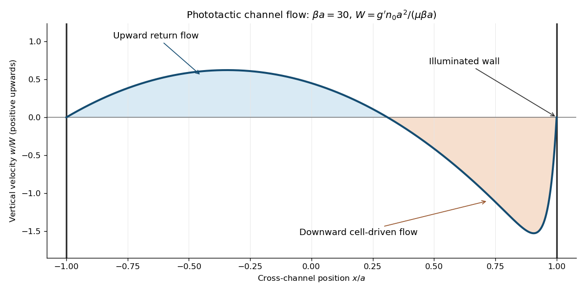

<h1 id="3/ii/solution">Solution</h1>

↑ **Parent:** [Ii](../ii.md)

The [cell conservation equation](../../../../../../cell-conservation-in-a-swimming-suspension.md) equates the change of cell number density $n$ to minus the divergence of its total flux. The flux $n\mathbf u$ is advection by the water, $nV_s\langle\mathbf p\rangle$ is the mean swimming flux, and $-\mathbf D\cdot\nabla n$ is the dispersal flux. The tensor $\mathbf D$ describes effective translational [diffusion](../../../../../../diffusion.md), whereas $D_r$ in part (i) describes [rotational diffusion](../../../../../../rotational-diffusion.md); they have different dimensions. This conservation law neglects birth, death and sources at the walls.

The equation $\nabla\cdot\mathbf u=0$ expresses [incompressible flow](../../../../../../incompressible-flow.md). In the momentum equation, $\rho$ is the reference suspension density, $\rho[\partial_t\mathbf u+(\mathbf u\cdot\nabla)\mathbf u]$ is material acceleration times density, $-\nabla p_e$ is the pressure force after subtracting the pure-water hydrostatic pressure, and $\mu\nabla^2\mathbf u$ is the viscous force for constant [dynamic viscosity](../../../../../../dynamic-viscosity.md) $\mu$ in a [Newtonian fluid](../../../../../../newtonian-fluid.md). Since $n$ counts cells per volume, $g'$ in $-g'n\mathbf e_z$ is excess downward weight per cell; it is not an acceleration. The small cell-fluid density difference permits the [Boussinesq approximation](../../../../../../boussinesq-approximation.md): retain that difference in [buoyancy](../../../../../../buoyancy.md) while using constant $\rho$ elsewhere. Diluteness permits neglect of cell-cell interactions, changes of viscosity, and active cell stresses. Any separate settling speed is assumed negligible or already incorporated in the specified mean drift. The light strength and swimming speed are uniform.

Consider the intended long-channel bulk approximation. At the sidewalls impose zero normal cell flux and the [no-slip boundary condition](../../../../../../no-slip-boundary-condition.md). The closed ends require zero total fluid flux through each horizontal section, so $\int_{-a}^a w\,dx=0$; localized turning regions are omitted from the bulk equations. The mean concentration is $\int_{-a}^a n\,dx=2an_0$. The final paragraph below distinguishes these bulk conditions from exact closed-end cell conservation.

For $\mathbf u=w(x)\mathbf e_z$, the [vorticity](../../../../../../vorticity.md) is $-w'(x)\mathbf e_y$. Hence $\varepsilon=-w'/(2D_r)$, and the leading horizontal mean swimming direction is $K_0\mathbf e_x$. With $\mathbf D=DI$ and $n=n(x)$, steady [cell conservation equation](../../../../../../cell-conservation-in-a-swimming-suspension.md) says that $J_x=V_sK_0n-Dn'$ is constant. Its wall value is zero, so $n'=\beta n$ with $\beta=V_sK_0/D$. The [phototactic concentration in a vertical channel](../../../../../../phototactic-concentration-in-a-vertical-channel.md) is therefore

$$
\boxed{\beta=\frac{V_sK_0}{D},\qquad n(x)=n_1e^{\beta x},\qquad n_1=\frac{n_0a\beta}{\sinh(a\beta)}.}
$$

This result neglects the $O(\varepsilon^2)$ correction to horizontal swimming. For positive phototaxis, $\beta>0$ and cells accumulate towards the illuminated wall $x=a$.

The steady inertial terms vanish for $w=w(x)$, since $\mathbf u\cdot\nabla=w\partial_z$. The horizontal momentum equation gives $\partial_xp_e=0$. The vertical momentum equation then requires a constant excess pressure gradient $G=\partial_zp_e$ and gives $\mu w''=G+g'n_1e^{\beta x}$. Twice integrating produces

$$
w(x)=Ce^{\beta x}+\frac{G}{2\mu}x^2+Ax+B,\qquad C=\frac{g'n_1}{\mu\beta^2}.
$$

Set $b=a\beta$. The two [no-slip boundary conditions](../../../../../../no-slip-boundary-condition.md) give $A=-C\sinh b/a$ and $B=-C\cosh b-Ga^2/(2\mu)$. The zero fluid-flux condition follows by integrating this expression:

$$
0=2C\left(\frac{\sinh b}{\beta}-a\cosh b\right)-\frac{2Ga^3}{3\mu}.
$$

Consequently the remaining constants are

$$
\boxed{G=\frac{3g'n_0}{b^2}(1-b\coth b),\qquad A=-\frac{g'n_0}{\mu\beta},\qquad B=-\frac{g'n_1\cosh b}{\mu\beta^2}-\frac{Ga^2}{2\mu}.}
$$

The resulting velocity can also be written without separate polynomial constants as

$$
\boxed{w=C\left[e^{\beta x}-\cosh b-\frac xa\sinh b\right]+\frac{G}{2\mu}(x^2-a^2).}
$$

Here $G$ is the [zero-flux pressure gradient in a cell-driven channel](../../../../../../zero-flux-pressure-gradient-in-a-cell-driven-channel.md). It is negative for $b>0$: pressure decreases upwards, creating the upward pressure force that balances the excess cell weight and drives the return flow. Its magnitude is determined by zero net fluid transport, not by prescribing pressure independently. In the zero-light limit, the continuous result is $n=n_0$, $G=-g'n_0$ and $w=0$.

For the requested large-$b$ sketch, cells occupy a [boundary layer](../../../../../../boundary-layer.md) of thickness $\beta^{-1}$ near $x=a$. Put $\xi=x/a$ and $W=g'n_0a^2/(\mu b)$. The exact dimensionless profile above is

$$
\frac wW=\frac{e^{b\xi}}{\sinh b}-\coth b-\xi+\frac32\left(\coth b-\frac1b\right)(1-\xi^2).
$$

Away from the illuminated-wall layer it tends to $(1+\xi)(1-3\xi)/2$. There is broad upward return flow for $-1<\xi<1/3$ and downward flow on the illuminated side. The outer maximum is $2W/3$ at $\xi=-1/3$. Near $\xi=1$, the exponential term is approximately $2e^{-b(1-\xi)}$ and restores the [no-slip boundary condition](../../../../../../no-slip-boundary-condition.md) from the negative outer velocity to zero at the wall. The finite-$b$ profile shown below retains that layer. The small-[vorticity](../../../../../../vorticity.md) assumption must still be enforced, for example by sufficiently weak excess weight or a sufficiently dilute suspension; $b\gg1$ alone does not ensure $|w'|/(2D_r)\ll1$.

**[Figure 1](#3/ii/image-downward-flow-near-the-illuminated-wall-and-upward-return-flow-in-a-phototactic-channel). Downward flow near the illuminated wall and upward return flow in a phototactic channel**.

There is a genuine global qualification to the bulk construction. For an exactly steady channel with impermeable ends as well as impermeable sidewalls, the [closed-channel cell-flux constraint](../../../../../../closed-channel-cell-flux-constraint.md) also requires $\int J_z\,dx=0$ at every height. In this bulk ansatz the first-order orientation closure gives

$$
J_z=n\left(w-\frac{V_sK_1}{2D_r}w'\right),\qquad \int_{-a}^aJ_zdx=\left(1+\frac{V_s\beta K_1}{2D_r}\right)\int_{-a}^anw\,dx,
$$

since [integration by parts](../../../../../../integration-by-parts.md), $n'=\beta n$ and $w(\pm a)=0$ imply $\int nw'=-\beta\int nw$. Moreover, multiply $\mu w''=G+g'n$ by $w$ and integrate. The wall values and zero fluid flux give

$$
g'\int_{-a}^anw\,dx=-\mu\int_{-a}^a(w')^2dx<0
$$

for a nontrivial profile. Thus zero axial cell flux generally fails unless the extra factor $1+V_s\beta K_1/(2D_r)$ vanishes, or the flow is trivial. A complete steady closed-channel solution generically needs axial concentration variation. **The explicit profile solves the stated bulk equations, sidewall conditions, concentration normalization and zero fluid-flux condition; it is not, for arbitrary parameters, an exact globally closed steady cell distribution.** Ignoring end regions gives the intended bulk approximation, but does not by itself prove the stronger global existence claim.

## ↑ Ancestors (11)

1. [Ii](../ii.md)
2. [3](../../3.md)
3. [Paper 77](../../../paper-77-split.md)
4. [Iii](../../../split.md)
5. [2004](../../../../split.md)
6. [Past exam of the mathematics course of the University of Cambridge](../../../../../split.md)
7. [Mathematics course of the University of Cambridge](../../../../../../mathematics-course-of-the-university-of-cambridge.md)
8. [Course of the University of Cambridge](../../../../../../course-of-the-university-of-cambridge.md)
9. [University of Cambridge](../../../../../../university-of-cambridge-split.md)
10. [List of universities](../../../../../../list-of-universities.md)
11. [Codex Wiki](../../../../../../split.md)
