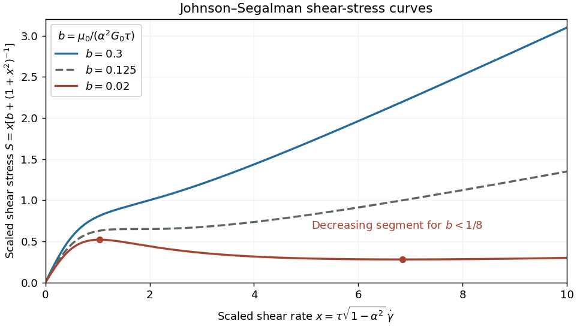

<h1 id="1/solution">Solution</h1>

↑ **Parent:** [1](../1.md)

Let two observers be related by $\mathbf x^*=\mathbf c(t)+Q(t)\mathbf x$, with Q a proper [rotation matrix](../../../../../rotation-matrix.md). A spatial second-rank [tensor](../../../../../tensor.md) has [material frame indifference](../../../../../material-frame-indifference.md) if its values at corresponding events satisfy **$\boxed{J^*=QJQ^T}$**. This defines an [objective second-rank tensor](../../../../../objective-second-rank-tensor.md), and allows the observer's rotation to depend on time.

For [Cauchy stress tensor](../../../../../cauchy-stress-tensor.md), consider a material surface element with unit normal n and contact traction $\mathbf t=\sigma\mathbf n$. A rigid observer change preserves its area and rotates both its normal and actual contact force: $\mathbf n^*=Q\mathbf n$, $\mathbf t^*=Q\mathbf t$. Thus $\sigma^*Q\mathbf n=Q\sigma\mathbf n$ for every n, proving $\sigma^*=Q\sigma Q^T$. Fictitious body forces of an accelerated observer do not alter this transformation of physical contact traction.

To keep the vorticity convention explicit, write $L_{ij}=\partial_jv_i$, $E=(L+L^T)/2$ and $\Omega=(L^T-L)/2$, the negative of the usual component-first [spin tensor](../../../../../spin-tensor.md). Equivalently, with the derivative-index-first $\nabla v$ used in the paper, $\Omega=[\nabla v-(\nabla v)^T]/2$. Put $R=\dot Q Q^T$, which is antisymmetric. The transformed velocity is $\mathbf v^*=\dot{\mathbf c}+\dot Q\mathbf x+Q\mathbf v$, and direct differentiation gives

$$
L^*=QLQ^T+R,\qquad E^*=QEQ^T,\qquad\Omega^*=Q\Omega Q^T-R.
$$

The additional observer spin cancels from the symmetric part, proving that the [rate-of-strain tensor](../../../../../strain-rate-tensor.md) is objective.

Along the same material particle, differentiating $J^*=QJQ^T$ gives

$$
\frac{D^*J^*}{Dt}=Q\frac{DJ}{Dt}Q^T+RJ^*-J^*R.
$$

The two extra terms cancel those from $\Omega^*J^*-J^*\Omega^*$. Moreover $E^*J^*+J^*E^*=Q(EJ+JE)Q^T$. Hence the complete [objective time derivative](../../../../../objective-time-derivative.md) satisfies

$$
\boxed{\mathcal D_\alpha J^*=Q(\mathcal D_\alpha J)Q^T,\qquad\mathcal D_\alpha J=\frac{DJ}{Dt}+\Omega J-J\Omega-\alpha(EJ+JE).}
$$

This proves covariance for every constant scalar $\alpha$; changing the spin convention without changing the commutator sign would not. It is a [Gordon--Schowalter derivative](../../../../../gordon-schowalter-derivative.md) with the paper's slip-parameter convention.

For the [Johnson-Segalman fluid](../../../../../johnson-segalman-oldroyd-model.md), first use the standard [uniaxial extensional flow](../../../../../uniaxial-extensional-flow.md) $\mathbf v=(\dot\epsilon x,-\dot\epsilon y/2,-\dot\epsilon z/2)$, with $\dot\epsilon>0$. Here $\Omega=0$ and E is diagonal. The steady conformation equation gives

$$
A_{xx}=\frac1{1-2\alpha\tau\dot\epsilon},\qquad A_{yy}=A_{zz}=\frac1{1+\alpha\tau\dot\epsilon},
$$

with vanishing off-diagonal components on the stable steady branch. The tensile [normal-stress difference](../../../../../normal-stress-difference.md) is $\alpha G_0(A_{xx}-A_{yy})+3\mu_0\dot\epsilon$. Dividing by the extension rate gives the [Johnson-Segalman extensional response](../../../../../johnson-segalman-extensional-response.md):

$$
\boxed{\eta_E(\dot\epsilon)=3\mu_0+\frac{3\alpha^2G_0\tau}{(1-2\alpha\tau\dot\epsilon)(1+\alpha\tau\dot\epsilon)}.}
$$

The [conformation tensor](../../../../../conformation-tensor.md) evolution in each principal direction is $\dot A_{ii}+(1/\tau-2\alpha E_{ii})A_{ii}=1/\tau$. Therefore a positive, attracting steady conformation requires both displayed denominators positive. For $\alpha>0$ the first pole is at $\dot\epsilon=1/(2\alpha\tau)$; for $\alpha<0$ it is at $\dot\epsilon=1/(|\alpha|\tau)$ in the transverse components. At a pole the corresponding component grows linearly in time, and beyond it generically grows exponentially. **The model has a finite-rate extensional catastrophe; the algebraic viscosity cannot be continued as a physical steady response past the first pole.** At zero rate, $\eta_E=3(\mu_0+\alpha^2G_0\tau)$, giving [Trouton ratio](../../../../../trouton-ratio.md) three. For $\alpha=0$ the polymer contribution to stress disappears and the response is simply Newtonian.

The question does not specify extension geometry. If a planar convention $\mathbf v=(\dot\epsilon x,-\dot\epsilon y,0)$ is intended instead, the same diagonal calculation gives $(\sigma_{xx}-\sigma_{yy})/\dot\epsilon=4\mu_0+4\alpha^2G_0\tau/[1-4\alpha^2\tau^2\dot\epsilon^2]$, valid on the stable branch $|2\alpha\tau\dot\epsilon|<1$. The preceding boxed formula uses the standard uniaxial definition of [extensional viscosity](../../../../../extensional-viscosity.md).

For [simple shear flow](../../../../../simple-shear-flow.md) $v_x=\dot\gamma y$, write $A_{xx}=X$, $A_{yy}=Y$, $A_{xy}=A_{yx}=Z$, and $A_{zz}=1$. The xx, yy and xy components of the steady constitutive equation give

$$
X=1+(1+\alpha)\tau\dot\gamma Z,\qquad Y=1-(1-\alpha)\tau\dot\gamma Z,\qquad\frac Z\tau=\frac{\dot\gamma}{2}[(1+\alpha)Y-(1-\alpha)X].
$$

Substituting the first two relations into the third yields $Z=\alpha\tau\dot\gamma/D$, with $D=1+(1-\alpha^2)\tau^2\dot\gamma^2$. Define the [viscometric functions](../../../../../viscometric-functions.md) by $\sigma_{xy}=\mu\dot\gamma$, $N_1=\psi_1\dot\gamma^2$ and $N_2=\psi_2\dot\gamma^2$, using x for flow, y for the shear gradient and z for vorticity. The [Johnson-Segalman steady viscometric functions](../../../../../johnson-segalman-steady-viscometric-functions.md) are therefore

$$
\boxed{\mu(\dot\gamma)=\mu_0+\frac{\alpha^2G_0\tau}{D},\qquad\psi_1(\dot\gamma)=\frac{2\alpha^2G_0\tau^2}{D},\qquad\psi_2(\dot\gamma)=-\frac{(1-\alpha)\alpha^2G_0\tau^2}{D}.}
$$

The solvent creates no [normal-stress differences](../../../../../normal-stress-difference.md) in this flow. For nonzero $\alpha$, the fluid is shear thinning with positive first and negative second [normal-stress differences](../../../../../normal-stress-difference.md).

To classify the stress curves, set $x=\tau\sqrt{1-\alpha^2}\dot\gamma$ and $b=\mu_0/(\alpha^2G_0\tau)$. The scaled shear stress is $S=x[b+(1+x^2)^{-1}]$, and

$$
\frac{dS}{dx}=b+\frac{1-x^2}{(1+x^2)^2}.
$$

The second term has minimum $-1/8$ at $x^2=3$. Thus **the shear stress is monotone for $b\geq1/8$ and has a decreasing segment for $\boxed{0<b<1/8}$**. At equality it has a horizontal tangent but no decreasing interval. Below the threshold, its maximum and minimum occur at

$$
x_\pm^2=\frac{1-2b\pm\sqrt{1-8b}}{2b},
$$

with the smaller root giving the maximum. Negative-rate curves are obtained by odd reflection.

**[Figure 1](#1/image-monotone-marginal-and-nonmonotone-johnson-segalman-shear-stress-curves). Monotone, marginal and nonmonotone Johnson-Segalman shear-stress curves**.

For small b, polymer stress dominates the low-rate response, while the solvent restores a positive high-rate slope. The [Johnson-Segalman negative-slope shear threshold](../../../../../johnson-segalman-negative-slope-shear-threshold.md) signals a constitutive instability of homogeneous shear: different local shear rates can carry the same shear stress, permitting [shear banding](../../../../../shear-banding.md). A stress plateau or a selected interface position cannot be inferred from the local curve alone; spatial regularization and boundary/history information matter. This limitation is illustrated in a [primary diffusive Johnson-Segalman study](https://arxiv.org/abs/cond-mat/9805286). If $\alpha=0$, the scaling by b is inapplicable and the stress is just $\mu_0\dot\gamma$.

## ↑ Ancestors (10)

1. [1](../1.md)
2. [Paper 78](../../paper-78-split.md)
3. [Iii](../../split.md)
4. [2004](../../../split.md)
5. [Past exam of the mathematics course of the University of Cambridge](../../../../split.md)
6. [Mathematics course of the University of Cambridge](../../../../../mathematics-course-of-the-university-of-cambridge.md)
7. [Course of the University of Cambridge](../../../../../course-of-the-university-of-cambridge.md)
8. [University of Cambridge](../../../../../university-of-cambridge-split.md)
9. [List of universities](../../../../../list-of-universities.md)
10. [Codex Wiki](../../../../../split.md)
