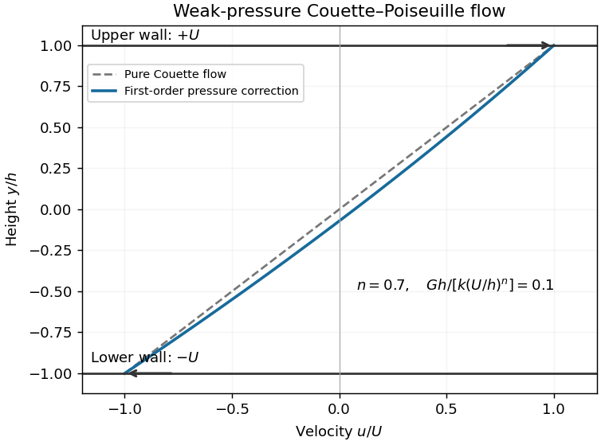

<h1 id="2/solution">Solution</h1>

↑ **Parent:** [2](../2.md)

A [generalized Newtonian fluid](../../../../../generalized-newtonian-fluid.md) can approximate the shear response of a fluid with [viscoelasticity](../../../../../viscoelasticity.md) when the flow varies slowly relative to its stress-memory time scales and elastic stresses are negligible, or in locally steady unidirectional flow where a fitted steady [shear viscosity](../../../../../dynamic-viscosity.md) captures the relevant stress and elastic normal stresses do not significantly influence the motion. It is not a general replacement in rapidly changing flows or in flows controlled by elastic stresses. Two specific failures are **[stress relaxation](../../../../../stress-relaxation.md) after deformation stops**, since this law has no memory, and **nonzero [normal-stress differences](../../../../../normal-stress-difference.md) in steady [simple shear flow](../../../../../simple-shear-flow.md)**, since the only nonzero nonpressure components are off diagonal. A rate-dependent viscosity alone cannot repair either limitation.

Take the usual physical [power-law fluid](../../../../../power-law-fluid.md) range $k>0$, $n>0$, and $G>0$. The steady unidirectional [Couette-Poiseuille flow](../../../../../couette-poiseuille-flow.md) satisfies $0=G+\partial_y\sigma_{xy}$. The stated upper-wall stress thus gives

$$
\sigma_{xy}(y)=G(\alpha h-y),\qquad k|u_y|^{n-1}u_y=G(\alpha h-y).
$$

Put $Y=y/h$. Inverting this monotone stress law gives $u_y=(Gh/k)^{1/n}\operatorname{sgn}(\alpha-Y)|\alpha-Y|^{1/n}$. Integration from the lower [no-slip boundary condition](../../../../../no-slip-boundary-condition.md) $u(-h)=-U$ gives the [power-law Couette-Poiseuille flow](../../../../../power-law-couette-poiseuille-flow.md) profile

$$
\boxed{u(y)=-U+\frac{hn}{n+1}\left(\frac{Gh}{k}\right)^{1/n}\left[|\alpha+1|^{1+1/n}-|\alpha-y/h|^{1+1/n}\right].}
$$

The upper [no-slip boundary condition](../../../../../no-slip-boundary-condition.md) requires

$$
\boxed{2U=\frac{hn}{n+1}\left(\frac{Gh}{k}\right)^{1/n}\left[|\alpha+1|^{1+1/n}-|\alpha-1|^{1+1/n}\right].}
$$

The bracket is a strictly increasing function of $\alpha$ with value zero at $\alpha=0$, so the equation determines a unique positive $\alpha$. The absolute values are essential: for sufficiently strong pressure driving, the shear can reverse inside the channel. For a [Newtonian fluid](../../../../../newtonian-fluid.md), $n=1$, $\mu=k$, and the bracket reduces to $4\alpha$, yielding

$$
\boxed{\alpha=\frac{kU}{Gh^2},\qquad u(y)=\frac Uh y+\frac G{2k}(h^2-y^2).}
$$

For zero pressure gradient the limit is pure [Couette flow](../../../../../couette-flow.md); the parameterization of wall stress by $Gh\alpha$ then becomes singular rather than indicating zero Couette stress.

For weak pressure forcing, let $s_0=U/h$ and $s_c=ks_0^n$. Write the center-plane shear stress as $s_c+\delta s$. Linearization of the power-law relation about the positive base shear gives

$$
u_y=s_0+\frac{\delta s-Gy}{nk s_0^{n-1}}+\cdots.
$$

Integrating $u_y$ across the channel must still give $2U$. The Gy term has zero mean, so $\delta s=0$ at first order. Hence the [weak-pressure Couette-Poiseuille expansion](../../../../../weak-pressure-couette-poiseuille-expansion.md) is

$$
\boxed{u(y)=\frac Uh y+\frac{G}{2nk(U/h)^{n-1}}(h^2-y^2)+\cdots.}
$$

It is a small positive parabolic displacement of the straight Couette profile, preserving both wall velocities. For fixed positive n the stated $Gh\ll k(U/h)^n$ controls the expansion; when n is very small one needs the stronger incremental condition $Gh\ll nk(U/h)^n$.

**[Figure 2](#2/image-weak-pressure-driving-adds-a-positive-parabolic-correction-to-opposing-wall-couette-flow). Weak pressure driving adds a positive parabolic correction to opposing-wall Couette flow**.

The volume flux per unit spanwise width is $Q=\int_{-h}^{h}u(y)\,dy$. The odd Couette part contributes zero and the parabola contributes $4h^3/3$ times its coefficient, so

$$
\boxed{Q=\frac{2Gh^3}{3nk(U/h)^{n-1}}+\cdots.}
$$

This correctly reduces to the exact Newtonian flux $2Gh^3/(3k)$ at $n=1$.

The extension to a general smooth [generalized Newtonian fluid](../../../../../generalized-newtonian-fluid.md) uses its [differential shear viscosity](../../../../../differential-shear-viscosity.md), rather than its secant viscosity. Let $\mathcal T(s)=s\mu(s)$ for positive shear rate, and assume

$$
\eta_d=\mathcal T'(s_0)=\mu(s_0)+s_0\mu'(s_0)\ne0.
$$

Linearizing the stress law repeats the preceding calculation with $nk s_0^{n-1}$ replaced by $\eta_d$. Thus

$$
\boxed{u(y)=\frac Uh y+\frac G{2\eta_d}(h^2-y^2)+\cdots,\qquad Q=\frac{2Gh^3}{3[\mu(U/h)+(U/h)\mu'(U/h)]}+\cdots.}
$$

The expansion requires small rate changes, $Gh\ll s_0|\eta_d|$, and a smooth constitutive law on the perturbed rates. At zero differential viscosity the regular first-order expansion fails. A negative differential viscosity is still locally invertible mathematically, so the formula is formally applicable, but belongs to a decreasing, mechanically unstable constitutive branch. The usual stable-flow interpretation requires positive differential viscosity. Thus “any” generalized-Newtonian law needs these local qualifications.

## ↑ Ancestors (10)

1. [2](../2.md)
2. [Paper 78](../../paper-78-split.md)
3. [Iii](../../split.md)
4. [2004](../../../split.md)
5. [Past exam of the mathematics course of the University of Cambridge](../../../../split.md)
6. [Mathematics course of the University of Cambridge](../../../../../mathematics-course-of-the-university-of-cambridge.md)
7. [Course of the University of Cambridge](../../../../../course-of-the-university-of-cambridge.md)
8. [University of Cambridge](../../../../../university-of-cambridge-split.md)
9. [List of universities](../../../../../list-of-universities.md)
10. [Codex Wiki](../../../../../split.md)
