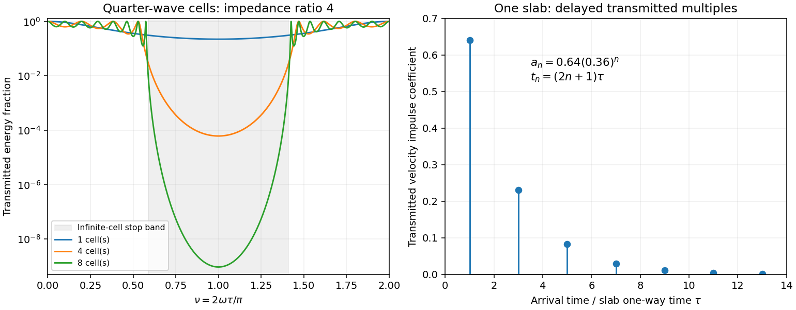

<h1 id="1/solution">Solution</h1>

↑ **Parent:** [1](../1.md)

Choose depth $z$ positive downwards and harmonic time dependence $e^{-i\omega t}$. At normal incidence, [P waves](../../../../../p-wave.md) and the two polarizations of [S waves](../../../../../s-wave.md) are independent scalar problems: a [P wave](../../../../../p-wave.md) uses the longitudinal modulus $\rho\alpha^2$, and an [S wave](../../../../../s-wave.md) uses the [shear modulus](../../../../../shear-modulus.md) $\rho\beta^2$. In a uniform layer with [wave speed](../../../../../wave-speed.md) $c$ and [seismic impedance](../../../../../seismic-impedance.md) $q=\rho c$, write [velocity](../../../../../velocity.md) and compressive [traction](../../../../../traction.md) as

$$
V=Ae^{i\omega z/c}+Be^{-i\omega z/c},\qquad
P=-T=q\left(Ae^{i\omega z/c}-Be^{-i\omega z/c}\right).
$$

At a perfectly bonded interface the [velocity](../../../../../velocity.md) and [traction](../../../../../traction.md) are continuous. For incident [velocity](../../../../../velocity.md) [wave amplitude](../../../../../wave-amplitude.md) one from medium 1 into medium 2, these two conditions are $1+r_v=t_v$ and $q_1(1-r_v)=q_2t_v$. Thus

$$
\boxed{r_v=\frac{q_1-q_2}{q_1+q_2},\qquad t_v=\frac{2q_1}{q_1+q_2}.}
$$

Reflection is determined by [seismic impedance](../../../../../seismic-impedance.md), not by speed alone. A step to larger [seismic impedance](../../../../../seismic-impedance.md) reverses the reflected [velocity](../../../../../velocity.md)/[displacement field](../../../../../displacement-field-mechanics.md) waveform; the pressure [reflection coefficient](../../../../../reflection-coefficient.md) has the opposite sign. Its transmitted pressure coefficient is $t_p=2q_2/(q_1+q_2)$. Equal [seismic impedance](../../../../../seismic-impedance.md) eliminates the reflection even when speed and [wavelength](../../../../../wavelength.md) change. At a free surface [traction](../../../../../traction.md) vanishes and [velocity](../../../../../velocity.md) reflects with coefficient $+1$; at a rigid surface [velocity](../../../../../velocity.md) reflects with coefficient $-1$.

The mean [elastic-wave energy flux](../../../../../elastic-wave-energy-flux.md) is $\tfrac12\operatorname{Re}(PV^*)=q(|A|^2-|B|^2)/2$ for positive real $q$. Therefore the reflected and transmitted [energy](../../../../../energy.md) fractions are

$$
\mathcal R=|r_v|^2,\qquad \mathcal T=\frac{q_2}{q_1}|t_v|^2,\qquad
\boxed{\mathcal R+\mathcal T=1.}
$$

A [displacement field](../../../../../displacement-field-mechanics.md) [transmission coefficient](../../../../../transmission-coefficient.md) greater than one is compatible with [conservation of energy](../../../../../conservation-of-energy.md); its flux must be weighted by the receiving [seismic impedance](../../../../../seismic-impedance.md).

For many layers, use the [seismic layer transfer matrix](../../../../../seismic-layer-transfer-matrix.md). A layer of thickness $h_j$ has [wave phase](../../../../../phase-waves.md) thickness $\delta_j=\omega h_j/c_j$ and

$$
\begin{pmatrix}V\\P\end{pmatrix}_{z+h_j}
=M_j\begin{pmatrix}V\\P\end{pmatrix}_{z},\qquad
M_j=\begin{pmatrix}\cos\delta_j&i\sin\delta_j/q_j\\iq_j\sin\delta_j&\cos\delta_j\end{pmatrix},\qquad\det M_j=1.
$$

This follows either by eliminating $A,B$ between the two faces or by integrating $V'=i\omega P/(\rho c^2)$ and $P'=i\omega\rho V$. For the complete stack put $M=M_N\cdots M_1=\begin{pmatrix}A&B\\C&D\end{pmatrix}$. With upper and lower [half-space](../../../../../half-space.md) impedances $q_a,q_b$, an outgoing lower wave satisfies $P_b=q_bV_b$. Solving this condition gives the input [seismic impedance](../../../../../seismic-impedance.md)

$$
Z_{\rm in}=\frac{q_bA-C}{D-q_bB},\qquad
\boxed{R=\frac{q_a-Z_{\rm in}}{q_a+Z_{\rm in}},\quad
T=\frac{2q_a}{q_aD+q_bA-C-q_aq_bB}.}
$$

Here $T$ is lower-face [velocity](../../../../../velocity.md) divided by upper-face incident [velocity](../../../../../velocity.md), including the propagation [wave phase](../../../../../phase-waves.md). For lossless layers and real [frequency](../../../../../frequency.md), $|R|^2+(q_b/q_a)|T|^2=1$. This supplies a sensitive check on any spreadsheet or numerical implementation; it is not correct simply to multiply the individual interface transmissions and discard the [elastic waves](../../../../../elastic-wave.md).

The physical reason is repeated [wave interference](../../../../../interference-wave-propagation.md). In one layer between media 0 and 2, let $r_{ij},t_{ij}$ denote the [velocity](../../../../../velocity.md) coefficients above and $\delta=\omega h/c_1$. The first transmitted wave has [wave amplitude](../../../../../wave-amplitude.md) $t_{01}t_{12}e^{i\delta}$. Every extra round trip supplies $r_{10}r_{12}e^{2i\delta}$. Summing the [geometric series](../../../../../geometric-series.md) gives

$$
T=\frac{t_{01}t_{12}e^{i\delta}}{1-r_{10}r_{12}e^{2i\delta}},\qquad
R=r_{01}+\frac{t_{01}t_{10}r_{12}e^{2i\delta}}{1-r_{10}r_{12}e^{2i\delta}}.
$$

In the time domain the successive arrivals are delayed by $2h/c_1$, producing reverberation. In the [frequency](../../../../../frequency.md) domain the same delayed terms produce resonant maxima and minima. For a layer between identical [half-spaces](../../../../../half-space.md) of impedance $q_0$,

$$
\boxed{\mathcal T=\left[1+\frac14\left(\frac{q_1}{q_0}-\frac{q_0}{q_1}\right)^2\sin^2\delta\right]^{-1}.}
$$

At $\delta=n\pi$ the layer transmits all the incident [energy](../../../../../energy.md): the internally [elastic waves](../../../../../elastic-wave.md) cancel the direct reflection. Halfway between these resonances, a large impedance contrast gives strong reflection. For unequal exterior impedances, a quarter-wave layer with $q_1^2=q_aq_b$ transforms its lower load to $Z_{\rm in}=q_1^2/q_b=q_a$, again giving zero reflection at its design [frequency](../../../../../frequency.md). This matching is narrow-band.

Periodic alternation produces a [periodic seismic multilayer stop band](../../../../../periodic-seismic-multilayer-stop-band.md). For a cell of two layers with total thickness $d$, the cell [matrix](../../../../../matrix.md) has reciprocal [eigenvalues](../../../../../eigenvalue.md) $e^{\pm iKd}$, so

$$
\cos Kd=\frac12\operatorname{tr}(M_2M_1)
=\cos\delta_1\cos\delta_2-\frac12\left(\frac{q_1}{q_2}+\frac{q_2}{q_1}\right)\sin\delta_1\sin\delta_2.
$$

When the absolute value of this expression exceeds one, the infinite periodic medium has no propagating cell mode; a long finite stack has exponentially small transmission. The [energy](../../../../../energy.md) is reflected, not absorbed. Pass bands instead contain oscillatory transmission peaks, becoming more numerous as the stack length increases. Disorder removes the exact cell periodicity but not multiple scattering or frequency-selective interference.

For a concrete reproducible investigation, take $q_H/q_L=4$, equal one-way travel times $\tau$ in both layer types, exterior impedance $q_L$, and [frequency](../../../../../frequency.md) coordinate $\nu=2\omega\tau/\pi$. At $\nu=1$ each layer is a quarter [wavelength](../../../../../wavelength.md); one cell has diagonal [matrix](../../../../../matrix.md) entries $-4,-1/4$. For $N$ cells,

$$
\mathcal T(1)=\frac4{(4^N+4^{-N})^2}.
$$

It is about $0.22145$ for one cell, $6.10\times10^{-5}$ for four cells and $9.31\times10^{-10}$ for eight cells. The infinite-cell stop band is $2\arcsin(0.8)/\pi<\nu<2-2\arcsin(0.8)/\pi$. The accompanying calculation also shows the first transmitted arrivals for a single high-impedance slab: their [wave amplitudes](../../../../../wave-amplitude.md) are $0.64(0.36)^n$ at times $(2n+1)\tau$. Their sum is one, consistent with unit zero-frequency transmission. These calculations illustrate both the spectrum and the pulse train without assuming access to the course's spreadsheet.

**[Figure 1](#1/image-original-transfer-matrix-calculations-showing-a-periodic-stack-stop-band-and-the-transmitted-reverberation-train-of-one-slab). Original transfer-matrix calculations showing a periodic stack stop band and the transmitted reverberation train of one slab**.

Finally, as $\omega\to0$ for a fixed finite stack, every $M_j\to I$, so the response approaches that of a direct interface between the exterior [half-spaces](../../../../../half-space.md). Equal exterior impedances give $R\to0,T\to1$. For [wavelengths](../../../../../wavelength.md) much longer than a repeating cell, expansion of $M_j$ to first order instead gives an effective medium with averaged [mass density](../../../../../density.md) $\rho_{\rm eff}=\sum h_j\rho_j/d$ and harmonic-mean modulus $M_{\rm eff}^{-1}=\sum h_j/M_j^{\rm mod}/d$, where $M_j^{\rm mod}=\rho_jc_j^2$. Its speed is $\sqrt{M_{\rm eff}/\rho_{\rm eff}}$, not generally the arithmetic mean of the layer speeds. Attenuation makes the [energy](../../../../../energy.md) balance an inequality, while for a fixed oblique horizontal slowness the scalar SH calculation uses $q_j=\mu_jp_{\beta,j}$ and $\delta_j=\omega p_{\beta,j}h_j$. Oblique P-SV waves require coupled [displacement field](../../../../../displacement-field-mechanics.md) and [traction](../../../../../traction.md) [matrices](../../../../../matrix.md) because of [mode conversion at a planar elastic interface](../../../../../mode-conversion-at-a-planar-elastic-interface.md). Thick evanescent layers require scattering or impedance recursion rather than exponentially ill-conditioned transfer-matrix products.

## ↑ Ancestors (10)

1. [1](../1.md)
2. [Paper 79](../../paper-79-split.md)
3. [Iii](../../split.md)
4. [2004](../../../split.md)
5. [Past exam of the mathematics course of the University of Cambridge](../../../../split.md)
6. [Mathematics course of the University of Cambridge](../../../../../mathematics-course-of-the-university-of-cambridge.md)
7. [Course of the University of Cambridge](../../../../../course-of-the-university-of-cambridge.md)
8. [University of Cambridge](../../../../../university-of-cambridge-split.md)
9. [List of universities](../../../../../list-of-universities.md)
10. [Codex Wiki](../../../../../split.md)
