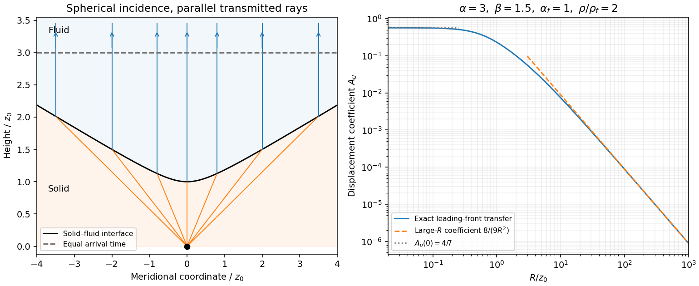

<h1 id="2/iv/solution">Solution</h1>

↑ **Parent:** [Iv](../iv.md)

The leading source [displacement field](../../../../../../displacement-field-mechanics.md) is

$$
\mathbf u_{\rm inc}=-\frac{\widehat{\mathbf r}}{\alpha r}f'(t-r/\alpha)
-\frac{\widehat{\mathbf r}}{r^2}f(t-r/\alpha).
$$

The second term is one [derivative](../../../../../../derivative.md) smoother at the leading arrival. At each surface point, use its tangent plane, the angles from (i)–(ii), and the local [solid-fluid P-wave transmission coefficient](../../../../../../solid-fluid-p-wave-transmission-coefficient.md). The incident potential coefficient is $1/r(R)$, so the transmitted leading potential coefficient is

$$
A_\phi(R)=\frac{T_P(R)}{r(R)}.
$$

Transport this coefficient along the vertical fluid rays. Their transverse area does not change with height, so [ray-tube conservation for a P-wave jump](../../../../../../ray-tube-conservation-for-a-p-wave-jump.md) gives no further geometrical spreading. The leading [displacement field](../../../../../../displacement-field-mechanics.md) coefficient is consequently

$$
\boxed{u_z^{\rm lead}(R,z,t)=-A_u(R)f'(t-\tau),\qquad
A_u(R)=\frac{T_P(R)}{\alpha_fr(R)}.}
$$

This is the [transmitted jump at a collimating solid-fluid interface](../../../../../../transmitted-jump-at-a-collimating-solid-fluid-interface.md). Radial [derivatives](../../../../../../derivative.md) of $A_\phi$ multiply $f$, and therefore do not contribute to the first [derivative](../../../../../../derivative.md) jump carried by $f'$. A varying transverse [wave amplitude](../../../../../../wave-amplitude.md) does generate smoother later terms, so this construction is a leading-front result, not a complete global plane-wave field.

Since the source is zero before $t=0$ and is $C^2$ there, $f(0)=f'(0)=f''(0)=0$. Thus [displacement field](../../../../../../displacement-field-mechanics.md) itself does not jump. If $J=[f^{(3)}(0)]$ exists and is the first nonzero jump, the leading discontinuity is the acceleration jump $[\partial_t^2\mathbf u]=-A_u(R)J\mathbf e_z$. More generally, a first jump in $f^{(m)}$ gives $[\partial_t^{m-1}\mathbf u]=-A_u(R)[f^{(m)}]\mathbf e_z$. The supplied regularity alone does not guarantee a nonzero discontinuity: a source smooth to all orders may have none. The geometrical transfer factor $A_u$ is nevertheless determined.

At $R=0$, $r=z_0$ and all three angles vanish. Hence

$$
\boxed{A_\phi(0)=\frac{2\rho\alpha_f}{z_0(\rho\alpha+\rho_f\alpha_f)},\qquad
A_u(0)=\frac{2\rho}{z_0(\rho\alpha+\rho_f\alpha_f)}.}
$$

For large $R$, put $C_\infty=1-2\beta^2/\alpha^2$ and retain $s=z_0(\alpha-\alpha_f)$, $d=\sqrt{\alpha^2-\alpha_f^2}$. The relevant limits are

$$
r=\frac{\alpha R}{d}+O(1),\quad
\cos\theta_P=\frac{s}{\alpha R}+O(R^{-3}),\quad
\cos\theta_f=\frac d\alpha+O(R^{-2}),\quad
\cos2\theta_S=C_\infty+O(R^{-2}).
$$

When $C_\infty\ne0$, the square-bracket factor in the denominator of $T_P$ is $C_\infty^2+O(R^{-1})$, so

$$
T_P=\frac{2\alpha_fs}{\alpha d C_\infty R}+O(R^{-2}),\qquad
\boxed{A_\phi(R)=\frac{2\alpha_fs}{\alpha^2C_\infty R^2}+O(R^{-3}),\quad
A_u(R)=\frac{2s}{\alpha^2C_\infty R^2}+O(R^{-3}).}
$$

These are signed waveform coefficients; their absolute values give [wave amplitude](../../../../../../wave-amplitude.md) magnitudes. The leading [displacement field](../../../../../../displacement-field-mechanics.md) decays as $R^{-2}$ rather than $R^{-1}$ because grazing incidence adds a small transmission factor to spherical spreading. The leading coefficient is independent of fluid and solid [mass densities](../../../../../../density.md), although the exact [wave amplitude](../../../../../../wave-amplitude.md) and its higher-order terms depend on them.

The assumptions do not exclude $\beta^2=\alpha^2/2$, where $C_\infty=0$ and the preceding division is invalid. In this special case $\cos2\theta_S=\cos^2\theta_P$ exactly, and the square-bracket factor is $\cos\theta_P+O(\cos^3\theta_P)$. Keeping both denominator terms gives

$$
\boxed{A_u(R)=\frac{2\rho s^2d}{\alpha^3(\rho_f\alpha_f+\rho d)R^3}+O(R^{-4}),\qquad A_\phi=\alpha_fA_u.}
$$

It has no $R^{-2}$ term. This exceptional case matters when requesting an asymptotic formula without an additional restriction on the elastic moduli.

**[Figure 2](#2/iv/image-hyperbolic-refraction-into-vertical-rays-and-the-leading-transmitted-displacement-field-coefficient-compared-with-its-grazing-incidence-asymptote). Hyperbolic refraction into vertical rays and the leading transmitted displacement field coefficient compared with its grazing-incidence asymptote**.

## ↑ Ancestors (11)

1. [Iv](../iv.md)
2. [2](../../2.md)
3. [Paper 79](../../../paper-79-split.md)
4. [Iii](../../../split.md)
5. [2004](../../../../split.md)
6. [Past exam of the mathematics course of the University of Cambridge](../../../../../split.md)
7. [Mathematics course of the University of Cambridge](../../../../../../mathematics-course-of-the-university-of-cambridge.md)
8. [Course of the University of Cambridge](../../../../../../course-of-the-university-of-cambridge.md)
9. [University of Cambridge](../../../../../../university-of-cambridge-split.md)
10. [List of universities](../../../../../../list-of-universities.md)
11. [Codex Wiki](../../../../../../split.md)
