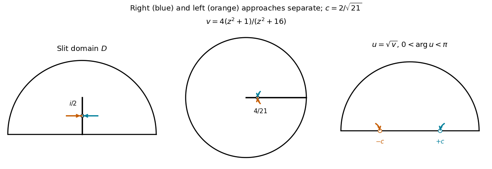

# Paper 9

↑ **Parent:** [Iii](../iii.md)

[https://www.maths.cam.ac.uk/postgrad/part-iii/files/pastpapers/2004/Paper9.pdf](https://www.maths.cam.ac.uk/postgrad/part-iii/files/pastpapers/2004/Paper9.pdf)

**Table of contents**

- [1](#1)
  - [Solution](#1/solution)
- [2](#2)
  - [Solution](#2/solution)
- [3](#3)
  - [Solution](#3/solution)
- [4](#4)
  - [i](#4/i)
    - [Solution](#4/i/solution)
  - [ii](#4/ii)
    - [Solution](#4/ii/solution)
- [5](#5)
  - [Solution](#5/solution)
- [6](#6)
  - [Solution](#6/solution)

## 1

↑ **Parent:** [Paper 9](paper-9.md)

<h3 id="1/solution">Solution</h3>

↑ **Parent:** [1](#1)

With determinant-one normalization, the necessary and sufficient condition for [sphere rotations as special-unitary Möbius transformations](../../../complex-analysis.md#sphere-rotations-as-special-unitary-mobius-transformations) is

$$
\boxed{c=-\overline b,\qquad d=\overline a,\qquad |a|^2+|b|^2=1.}
$$

Equivalently, the matrix $M=\begin{pmatrix}a&b\\c&d\end{pmatrix}$ belongs to the [special unitary group](../../../topological-group.md#special-unitary-group) $SU(2)$. The two determinant-one representatives $M$ and $-M$ induce the same [Möbius transformation](../../../group-theory.md#mobius-transformation), and both satisfy this condition.

Use north-pole [stereographic projection](../../../complex-analysis.md#stereographic-projection) in the direction from the plane to the [sphere](../../../geometry-and-topology.md#sphere):

$$
\varphi(z)=\frac{(2\operatorname{Re}z,2\operatorname{Im}z,|z|^2-1)}{1+|z|^2},\qquad
\varphi(\infty)=(0,0,1).
$$

Its chord-distance identity is $|\varphi(z)-\varphi(w)|=2\chi(z,w)$, where $\chi$ is the [chordal metric](../../../complex-analysis.md#chordal-metric). Direct subtraction, using $ad-bc=1$, gives

$$
\chi(g(z),g(w))=
\frac{|z-w|}{\sqrt{H(z)H(w)}},\qquad
H(z)=|az+b|^2+|cz+d|^2.
$$

This is first calculated away from [poles](../../../isolated-singularity.md#pole) and then extended continuously to the [Riemann sphere](../../../complex-analysis.md#riemann-sphere). A [sphere](../../../geometry-and-topology.md#sphere) [rotation](../../../riemannian-geometry.md#rotation-mathematics) preserves chord distances, so for distinct finite nonpole points

$$
\frac{H(z)}{1+|z|^2}\frac{H(w)}{1+|w|^2}=1.
$$

Using three distinct points shows all these positive ratios equal one. Hence $H(z)=1+|z|^2$ everywhere. Comparing its coefficients gives

$$
|a|^2+|c|^2=1,\quad |b|^2+|d|^2=1,\quad
 a\overline b+c\overline d=0.
$$

Thus $M$ is a [unitary matrix](../../../linear-operator-theory.md#unitary-matrix). Comparing $M^{-1}=M^*$ with $M^{-1}=\begin{pmatrix}d&-b\\-c&a\end{pmatrix}$ proves the boxed relations.

Conversely, these relations give $H(z)=1+|z|^2$, so the induced [sphere](../../../geometry-and-topology.md#sphere) map $T=\varphi g\varphi^{-1}$ preserves all Euclidean chord distances. Such a [bijection](../../../function.md#bijection) of the unit [sphere](../../../geometry-and-topology.md#sphere) is the restriction of an [orthogonal matrix](../../../linear-algebra.md#orthogonal-matrix): let $v_j=T(e_j)$; preservation of distances makes these an orthonormal basis, and $T(p)\cdot v_j=p\cdot e_j$ forces $T(p)=\sum_jp_jv_j$. Finally the [Möbius transformation](../../../group-theory.md#mobius-transformation) is holomorphic with positive real Jacobian at every ordinary coordinate point. Conjugating by [stereographic projection](../../../complex-analysis.md#stereographic-projection) preserves orientation, so this [orthogonal matrix](../../../linear-algebra.md#orthogonal-matrix) has determinant $+1$. It is therefore a genuine [rotation in three dimensions](../../../linear-algebra.md#rotation-in-three-dimensions), proving sufficiency rather than just spherical [isometry](../../../riemannian-geometry.md#isometry).

For the [circle](../../../topology.md#circle) assertion, a nondegenerate [generalized circle](../../../group-theory.md#generalized-circle-under-a-mobius-transformation) has an equation

$$
A|z|^2+Bz+\overline B\,\overline z+C=0,
\qquad A,C\in\mathbb R,\quad |B|^2-AC>0.
$$

For $A\ne0$ this is an ordinary [circle](../../../topology.md#circle), and for $A=0$ it is a line with infinity included. On the [sphere](../../../geometry-and-topology.md#sphere) write coordinates $(p_1,p_2,p_3)$, with $z=(p_1+ip_2)/(1-p_3)$ and $|z|^2=(1+p_3)/(1-p_3)$. Multiplication by $1-p_3$ gives the plane

$$
2\operatorname{Re}B\,p_1-2\operatorname{Im}B\,p_2+(A-C)p_3+(A+C)=0.
$$

If $n=(2\operatorname{Re}B,-2\operatorname{Im}B,A-C)$ and $h=-(A+C)$, then $|n|^2-h^2=4(|B|^2-AC)>0$. Thus the plane intersects the unit [sphere](../../../geometry-and-topology.md#sphere) in a proper [circle](../../../topology.md#circle). It contains the north pole exactly when $A=0$, accounting for the point at infinity on a line.

Conversely, a [circle](../../../topology.md#circle) on the [sphere](../../../geometry-and-topology.md#sphere) is the intersection with a plane $n\cdot p=h$, $|h|<|n|$. Set $A=(n_3-h)/2$, $C=(-n_3-h)/2$ and $B=(n_1-in_2)/2$. The preceding equation is recovered and has $|B|^2-AC=(|n|^2-h^2)/4>0$. Its inverse stereographic image is an ordinary [circle](../../../topology.md#circle) or a line with infinity attached. This proves both directions of the [circle-plane relation under stereographic projection](../../../complex-analysis.md#circle-plane-relation-under-stereographic-projection).

## 2

↑ **Parent:** [Paper 9](paper-9.md)

<h3 id="2/solution">Solution</h3>

↑ **Parent:** [2](#2)

Use the extended-value convention for a [normal family](../../../complex-dynamics.md#normal-family), which is essential here: every sequence in the holomorphic family has a subsequence converging uniformly on [compact](../../../topology.md#compact-space) subsets either to a finite [holomorphic function](../../../complex-analysis.md#holomorphic-function) or to infinity. Convergence to infinity means $\inf_K|f_n|\to\infty$ for every [compact](../../../topology.md#compact-space) $K\subset D$. Equivalently one uses local [uniform convergence](../../../real-analysis.md#uniform-convergence) in the [chordal metric](../../../complex-analysis.md#chordal-metric). For [holomorphic functions](../../../complex-analysis.md#holomorphic-function) a nonconstant meromorphic limit cannot acquire a [pole](../../../isolated-singularity.md#pole): near a supposed [pole](../../../isolated-singularity.md#pole), the reciprocals of sufficiently large-index functions are holomorphic and nowhere zero, and converge to a [holomorphic function](../../../complex-analysis.md#holomorphic-function) with a zero. [Hurwitz's theorem](../../../complex-analysis.md#hurwitz-s-theorem) would force that reciprocal limit to vanish identically, giving the constant infinite limit instead.

Restriction proves that global normality implies normality near each point. For the converse, choose a countable cover by [connected](../../../geometry-and-topology.md#connected-space) discs $U_j$ on which the family is normal, with smaller discs covering $D$ and having [compact](../../../topology.md#compact-space) closure inside the corresponding $U_j$. Such a cover exists from the countable rational-disc basis and local normality. Starting with any sequence, extract a subsequence converging on $U_1$, then a further subsequence converging on $U_2$, and so on. The diagonal sequence converges on each $U_j$. On an overlap the limits agree; a finite holomorphic limit and infinity cannot both occur there. The overlap graph of this cover is [connected](../../../geometry-and-topology.md#connected-space), since otherwise its components would partition the [connected](../../../geometry-and-topology.md#connected-space) domain into disjoint open subsets. Therefore all local limits are of the same type and patch to one [holomorphic function](../../../complex-analysis.md#holomorphic-function) or to infinity throughout $D$. Every [compact set](../../../topology.md#compact-space) has a finite cover by the smaller discs, so convergence on their [compact](../../../topology.md#compact-space) closures gives [uniform convergence](../../../real-analysis.md#uniform-convergence) on that [compact set](../../../topology.md#compact-space). This proves that [normality is a local property](../../../complex-dynamics.md#normality-is-a-local-property).

For the counterexample take the [unit disc](../../../topology.md#unit-disc) and the family $f_n(z)=n(1+z^2/2)$. Since $|1+z^2/2|\ge1-|z|^2/2>1/2$, $f_n$ tends uniformly to infinity. Any sequence from this family either has a constant subsequence or has indices tending to infinity, so the family is normal. Its [derivatives](../../../calculus.md#derivative) are $nz$. No subsequence of these [derivatives](../../../calculus.md#derivative) can have a finite locally uniform limit, because their values at any fixed nonzero point grow without bound; nor can they tend locally uniformly to infinity, since every [derivative](../../../calculus.md#derivative) vanishes at zero. Thus **a holomorphic [normal family](../../../complex-dynamics.md#normal-family) need not have a normal [derivative](../../../calculus.md#derivative) family**.

Now impose the point bound at $z_0$. For any sequence of [derivatives](../../../calculus.md#derivative) choose corresponding functions from the original family. Normality supplies a locally uniformly convergent subsequence, and the point bound excludes the infinite limit. Let its finite holomorphic limit be $f$. The [Cauchy integral formula](../../../analysis.md#cauchy-integral-formula) gives convergence of [derivatives](../../../calculus.md#derivative) uniformly on [compact](../../../topology.md#compact-space) subsets. Explicitly, for [compact](../../../topology.md#compact-space) $K\subset D$ choose $\rho>0$ so its closed $\rho$-neighborhood lies in a [compact](../../../topology.md#compact-space) $L\subset D$; then

$$
\sup_{z\in K}|f_n'(z)-f'(z)|\le\rho^{-1}\sup_{\zeta\in L}|f_n(\zeta)-f(\zeta)|\longrightarrow0.
$$

Every sequence of [derivatives](../../../calculus.md#derivative) therefore has a locally uniform subsequential limit. This [pointwise anchoring of a holomorphic normal family](../../../complex-dynamics.md#pointwise-anchoring-of-a-holomorphic-normal-family) proves **the [derivative](../../../calculus.md#derivative) family is normal under the stated bound**.

## 3

↑ **Parent:** [Paper 9](paper-9.md)

<h3 id="3/solution">Solution</h3>

↑ **Parent:** [3](#3)

For a plane domain, the following are equivalent descriptions of a [simply connected domain](../../../complex-analysis.md#simply-connected-domain): every [based loop](../../../algebraic-topology.md#based-loop) contracts in the domain with its basepoint fixed; any two [paths](../../../geometry-and-topology.md#continuous-path) with the same endpoints are [homotopic](../../../algebraic-topology.md#homotopy) while those endpoints stay fixed; its complement in the [Riemann sphere](../../../complex-analysis.md#riemann-sphere) is [connected](../../../geometry-and-topology.md#connected-space); every [holomorphic function](../../../complex-analysis.md#holomorphic-function) has a single-valued primitive; and every nowhere-zero [holomorphic function](../../../complex-analysis.md#holomorphic-function) has a [holomorphic logarithm](../../../complex-analysis.md#holomorphic-logarithm). The complement must be taken in the extended plane, including infinity. An equivalent [winding number](../../../complex-analysis.md#winding-number) formulation is that every closed curve has index zero about every point outside the domain.

Here is a direct equivalence proof for the first two topological formulations. If all [paths](../../../geometry-and-topology.md#continuous-path) with given endpoints are [homotopic](../../../algebraic-topology.md#homotopy) relative to those endpoints, apply this to a loop based at $a$ and the constant [path](../../../geometry-and-topology.md#continuous-path) at $a$, obtaining a contraction. Conversely, let $\gamma_0,\gamma_1$ join $a$ to $b$. The loop $\gamma_0*\gamma_1^{-1}$ contracts with basepoint fixed. Concatenating this contraction with $\gamma_1$ produces a [homotopy](../../../algebraic-topology.md#homotopy) from $\gamma_0*\gamma_1^{-1}*\gamma_1$ to $\gamma_1$, relative to $a,b$. The middle retracing excursion contracts by shortening its traversal in both directions, giving a [homotopy](../../../algebraic-topology.md#homotopy) from that first [path](../../../geometry-and-topology.md#continuous-path) to $\gamma_0$. Hence $\gamma_0$ and $\gamma_1$ are [homotopic](../../../algebraic-topology.md#homotopy) relative to their endpoints. Planar domains are [path-connected](../../../geometry-and-topology.md#path-connected-space), so no extra path-component condition is needed.

The analytic descriptions follow from [path independence](../../../calculus.md#path-independence) of the holomorphic integral. Local primitives exist on discs by integrating [power series](../../../real-analysis.md#power-series); a [homotopy](../../../algebraic-topology.md#homotopy) can be subdivided into pieces lying in such discs, and local [path](../../../geometry-and-topology.md#continuous-path) integrals cancel along its common edges. Thus integrals over [homotopic](../../../algebraic-topology.md#homotopy) [paths](../../../geometry-and-topology.md#continuous-path) agree, giving a global primitive. Applied to $h'/h$ for a nowhere-zero function, a primitive $H$ makes $he^{-H}$ constant and hence supplies a [holomorphic logarithm](../../../complex-analysis.md#holomorphic-logarithm). These observations are also the tools used in the mapping proof below.

The [Riemann mapping theorem](../../../complex-analysis.md#riemann-mapping-theorem) states that every nonempty [simply connected](../../../algebraic-topology.md#simply-connected-space) proper domain $D\subsetneq\mathbb C$ admits a [conformal bijection](../../../complex-analysis.md#biholomorphism) onto the [unit disc](../../../topology.md#unit-disc). Given $z_0\in D$, there is exactly one such map with $f(z_0)=0$ and $f'(z_0)>0$. The exclusion of the whole plane is necessary: an [entire](../../../complex-analysis.md#entire-function) map into the disc would be constant by [Liouville's theorem](../../../complex-analysis.md#liouville-theorem).

An extremal proof has the following concrete steps. First construct an [injective](../../../algebra.md#injective-function) bounded holomorphic map. Choose $a\notin D$ and a [holomorphic square root](../../../complex-analysis.md#holomorphic-square-root) $h$ of $z-a$. It is [injective](../../../algebra.md#injective-function), since equality of its values implies equality of their squares. Its image is disjoint from its negative: $h(z)=-h(w)$ would imply $z=w$ and then $h(z)=0$, impossible. If $b=h(z_0)$, choose $r>0$ with $B(b,r)\subset h(D)$; the disc $B(-b,r)$ is omitted. Therefore $1/(h+b)$ is [injective](../../../algebra.md#injective-function) and bounded. Scaling it and applying an [automorphism of the unit disk](../../../topology.md#automorphism-of-the-unit-disk) gives a map into the disc taking $z_0$ to zero; a [rotation](../../../riemannian-geometry.md#rotation-mathematics) makes its [derivative](../../../calculus.md#derivative) positive.

Let $\mathcal U$ consist of all [injective](../../../algebra.md#injective-function) maps $D\to\mathbb D$ with this normalization. It is nonempty. The [derivative](../../../calculus.md#derivative) at $z_0$ is bounded above by the [Cauchy integral formula](../../../analysis.md#cauchy-integral-formula) on a small disc compactly contained in $D$. Choose $f_n\in\mathcal U$ with [derivatives](../../../calculus.md#derivative) tending to their positive supremum $L$. Boundedness, the [Cauchy estimates](../../../analysis.md#cauchy-estimate) and a diagonal [Arzelà-Ascoli theorem](../../../topological-analysis.md#arzela-ascoli-theorem) argument give a subsequence converging locally uniformly to $f$; this is the bounded-family form of the [Montel theorem](../../../complex-dynamics.md#montel-s-theorem). Then $f(z_0)=0$, $f'(z_0)=L>0$, and the [maximum modulus principle](../../../complex-analysis.md#maximum-modulus-principle) puts its image in the open disc. The limit is [injective](../../../algebra.md#injective-function): if distinct $z,w$ had $f(z)=f(w)$, apply [Hurwitz's theorem](../../../complex-analysis.md#hurwitz-s-theorem) near $w$ to $f_n(\cdot)-f_n(z)$, which has no zero there; the limit would vanish identically, contradicting $f'(z_0)>0$.

Finally suppose $a\in\mathbb D$ is omitted by $f$. It is nonzero since $f(z_0)=0$. Let $T_a(w)=(w-a)/(1-\overline a w)$ and choose a [holomorphic square root](../../../complex-analysis.md#holomorphic-square-root) $h$ of $T_a\circ f$. It is [injective](../../../algebra.md#injective-function) and takes values in the disc. Put $b=h(z_0)$, so $|b|=\sqrt{|a|}$, and normalize $T_b\circ h$ by a [rotation](../../../riemannian-geometry.md#rotation-mathematics). The new map's [derivative](../../../calculus.md#derivative) magnitude at $z_0$ is

$$
\frac{(1-|a|^2)L}{2\sqrt{|a|}(1-|a|)}
=\frac{1+|a|}{2\sqrt{|a|}}L>L.
$$

This [square-root improvement of a normalized conformal map](../../../complex-analysis.md#square-root-improvement-of-a-normalized-conformal-map) contradicts extremality. Thus $f$ is onto. Two normalized [bijections](../../../function.md#bijection) differ by a [disc automorphism](../../../topology.md#automorphism-of-the-unit-disk) fixing zero; [Schwarz lemma](../../../analysis.md#schwarz-lemma) applied to it and its inverse makes it a [rotation](../../../riemannian-geometry.md#rotation-mathematics), and positivity of the normalized [derivatives](../../../calculus.md#derivative) forces that [rotation](../../../riemannian-geometry.md#rotation-mathematics) to be the identity. This completes the requested proof outline.

## 4

↑ **Parent:** [Paper 9](paper-9.md)

<h3 id="4/i">i</h3>

↑ **Parent:** [4](#4)

<h4 id="4/i/solution">Solution</h4>

↑ **Parent:** [I](#4/i)

For a [harmonic function](../../../partial-differential-equation.md#harmonic-function) $u$, put $g=u_x-iu_y$. Its [Wirtinger derivative](../../../analysis.md#wirtinger-derivatives) is

$$
\frac{\partial g}{\partial\overline z}
=\frac12\bigl(u_{xx}+u_{yy}+i(u_{xy}-u_{yx})\bigr)=0,
$$

so the [Cauchy-Riemann equations](../../../analysis.md#cauchy-riemann-equations) make $g$ holomorphic. In the [simply connected domain](../../../complex-analysis.md#simply-connected-domain) it has a single-valued primitive

$$
F(z)=\int_{z_0}^{z}g(\zeta)\,d\zeta.
$$

The integral is [path independent](../../../calculus.md#path-independence): local [holomorphic primitives](../../../complex-analysis.md#holomorphic-primitive) make its value invariant under [path](../../../geometry-and-topology.md#continuous-path) [homotopies](../../../algebraic-topology.md#homotopy), and being [simply connected](../../../algebraic-topology.md#simply-connected-space) makes any two [paths](../../../geometry-and-topology.md#continuous-path) with the given endpoints [homotopic](../../../algebraic-topology.md#homotopy), as in Question 3.

Since $F'=g$, the [real part](../../../complex-analysis.md#real-part) satisfies $(\operatorname{Re}F)_x=u_x$ and $(\operatorname{Re}F)_y=\operatorname{Re}(ig)=u_y$. Hence $\operatorname{Re}F-u$ is constant on the [connected](../../../geometry-and-topology.md#connected-space) domain. Adding a real constant corrects it, producing **a single-valued holomorphic $f$ with $\operatorname{Re}f=u$**. The [imaginary part](../../../complex-analysis.md#imaginary-part) is a [harmonic conjugate](../../../partial-differential-equation.md#harmonic-conjugate) and is unique up to an additive real constant. This is the [global harmonic conjugate criterion by vanishing periods](../../../partial-differential-equation.md#global-harmonic-conjugate-criterion-by-vanishing-periods) in the [simply connected](../../../algebraic-topology.md#simply-connected-space) case.

<h3 id="4/ii">ii</h3>

↑ **Parent:** [4](#4)

<h4 id="4/ii/solution">Solution</h4>

↑ **Parent:** [Ii](#4/ii)

Take **$u(z)=\log|z|$**. In [polar coordinates](../../../calculus.md#polar-coordinates) its [Laplacian](../../../calculus.md#laplacian) is $u_{rr}+r^{-1}u_r=-r^{-2}+r^{-2}=0$, so it is [harmonic](../../../partial-differential-equation.md#harmonic-function) on the [annulus](../../../topology.md#annulus-mathematics). If $u=\operatorname{Re}f$ for a single-valued [holomorphic function](../../../complex-analysis.md#holomorphic-function), the [Cauchy-Riemann equations](../../../analysis.md#cauchy-riemann-equations) would give $f'=u_x-iu_y=1/z$. But for $1<\rho<2$,

$$
\oint_{|z|=\rho}f'(z)\,dz=0,\qquad
\oint_{|z|=\rho}\frac{dz}{z}=2\pi i.
$$

The first equality follows by evaluating the primitive $f$ around a closed curve. This contradiction verifies the absence of a global [harmonic conjugate](../../../partial-differential-equation.md#harmonic-conjugate).

For the final function, the quotient of squared distances is $|z+1|^2/|z-1|^2$. On $|z|>1$, both $1+1/z$ and $1-1/z$ lie in the open right half-plane, so their [principal logarithms](../../../analysis.md#principal-complex-logarithm) are single-valued and holomorphic. Define

$$
\boxed{f(z)=2\operatorname{Log}(1+1/z)-2\operatorname{Log}(1-1/z)
=4\sum_{m=0}^{\infty}\frac{z^{-(2m+1)}}{2m+1}.}
$$

The series converges locally uniformly outside the unit [circle](../../../topology.md#circle), and

$$
\operatorname{Re}f(z)=2\log|z+1|-2\log|z-1|
=\log\frac{(x+1)^2+y^2}{(x-1)^2+y^2}.
$$

Thus this is the required single-valued [holomorphic function](../../../complex-analysis.md#holomorphic-function), even on the larger domain $|z|>1$. Its [derivative](../../../calculus.md#derivative) is $2/(z+1)-2/(z-1)$, whose two periods around the holes cancel. The [logarithmic cancellation on an exterior annulus](../../../partial-differential-equation.md#logarithmic-cancellation-on-an-exterior-annulus) explains why this example succeeds while $\log|z|$ fails; using independent multivalued logarithms of $z+1$ and $z-1$ would conceal that cancellation.

## 5

↑ **Parent:** [Paper 9](paper-9.md)

<h3 id="5/solution">Solution</h3>

↑ **Parent:** [5](#5)

An [explicit disk map of a slit half disk](../../../geometry-and-topology.md#explicit-disk-map-of-a-slit-half-disk) makes the two [boundary](../../../topology.md#boundary-of-a-set) approaches visible without assuming an extension theorem for the [boundary](../../../topology.md#boundary-of-a-set). We construct the map as a succession of [bijections](../../../function.md#bijection) and then determine its limits.

First $w=z^2$ maps the upper half-disc of radius two bijectively onto $|w|<4$ slit along $[0,4)$. Indeed, its inverse chooses the [square root](../../../algebra.md#square-root) whose argument lies in $(0,\pi)$. The removed segment on the [imaginary axis](../../../complex-analysis.md#imaginary-axis) becomes $[-1,0)$, so the image of $D$ is precisely

$$
\Omega=\{w:|w|<4\}\setminus[-1,4).
$$

The [Möbius transformation](../../../group-theory.md#mobius-transformation) $v=4(w+1)/(w+16)$ maps the radius-four disc bijectively onto the [unit disc](../../../topology.md#unit-disc), taking $-1$ to zero and $4$ to one. This follows also by writing it as $(w/4+1/4)/(1+w/16)$, an [automorphism of the unit disk](../../../topology.md#automorphism-of-the-unit-disk) after the scaling. It takes the removed real interval to $[0,1)$, so the image is the unit disc with this radial slit removed. Choosing $0<\arg v<2\pi$ defines a single-valued [square root](../../../algebra.md#square-root) $u=\sqrt v$ and maps that slit disc bijectively onto

$$
U=\{u:|u|<1,\ \operatorname{Im}u>0\}.
$$

All these maps have nonzero [derivatives](../../../calculus.md#derivative) on their respective domains, since their potentially problematic zero or branch point is on the removed slit.

Next the [Joukowski map](../../../geometry-and-topology.md#joukowski-map) $J(u)=u+1/u$ is a [conformal bijection](../../../complex-analysis.md#biholomorphism) from $U$ onto the [lower half-plane](../../../complex-analysis.md#lower-half-plane). For $u\in U$,

$$
\operatorname{Im}J(u)=\operatorname{Im}u\,(1-|u|^{-2})<0.
$$

If $J(u)=J(t)$, then $(u-t)(1-1/(ut))=0$, and $|ut|<1$ rules out the second factor vanishing. To prove surjectivity, take $q$ in the [lower half-plane](../../../complex-analysis.md#lower-half-plane) and consider $u^2-qu+1=0$. Neither root lies on the unit [circle](../../../topology.md#circle), where $u+1/u$ is real. Their product is one, so exactly one has modulus less than one. For that root the displayed imaginary-part identity forces $\operatorname{Im}u>0$. Thus it lies in $U$. Also $J'(u)=1-u^{-2}$ cannot vanish there. Finally $C(q)=(q+i)/(q-i)$ maps the [lower half-plane](../../../complex-analysis.md#lower-half-plane) bijectively onto the [unit disc](../../../topology.md#unit-disc): the inequality $|q+i|<|q-i|$ is exactly $\operatorname{Im}q<0$, and its inverse is $q=i(\zeta+1)/(\zeta-1)$. Consequently

$$
F(z)=\frac{u(z)+u(z)^{-1}+i}{u(z)+u(z)^{-1}-i},\qquad
u(z)^2=\frac{4(z^2+1)}{z^2+16},\qquad 0<\arg u(z)<\pi,
$$

is a [conformal bijection](../../../complex-analysis.md#biholomorphism) of $D$ onto the disc.

At the slit point $z_0=i/2$ the continuous rational expression for $v$ tends to $4/21$. In a sufficiently small neighborhood of $z_0$, points of $D$ have nonzero [real part](../../../complex-analysis.md#real-part). Since $\operatorname{Im}(z^2)=2\operatorname{Re}z\operatorname{Im}z$ and the real-coefficient [Möbius map](../../../group-theory.md#mobius-transformation) $w\mapsto v$ preserves the sign of the [imaginary part](../../../complex-analysis.md#imaginary-part), right-side approach gives $\arg v\to0$, while left-side approach gives $\arg v\to2\pi$. Hence

$$
u(z)\longrightarrow\begin{cases}c=2/\sqrt{21},&\operatorname{Re}z>0,\\-c,&\operatorname{Re}z<0,\end{cases}
\qquad
J(u(z))\longrightarrow\begin{cases}L=25/(2\sqrt{21}),&\operatorname{Re}z>0,\\-L,&\operatorname{Re}z<0.\end{cases}
$$

The two limits of $F$ are therefore

$$
\gamma_+=\frac{L+i}{L-i},\qquad \gamma_-=\frac{-L+i}{-L-i}.
$$

They have modulus one and are distinct, since $L>0$ and the [Möbius map](../../../group-theory.md#mobius-transformation) $C$ is [injective](../../../algebra.md#injective-function) on the extended real line. The [two-sided cluster set at an interior slit point](../../../geometry-and-topology.md#two-sided-cluster-set-at-an-interior-slit-point) is a geometric consequence of opening the slit into two [boundary](../../../topology.md#boundary-of-a-set) intervals.

**[Figure 1](#5/image-two-sides-of-the-slit-at-i-2-become-distinct-boundary-points-after-squaring-a-disk-automorphism-and-a-square-root). Two sides of the slit at i/2 become distinct boundary points after squaring, a disk automorphism and a square root**.

For the given map $f$, the composition $B=f\circ F^{-1}$ is an [automorphism of the unit disk](../../../topology.md#automorphism-of-the-unit-disk). To see its precise [boundary](../../../topology.md#boundary-of-a-set) behavior, let $a=B^{-1}(0)$ and compose $B$ with the inverse of $T_a(\zeta)=(\zeta-a)/(1-\overline a\zeta)$. This gives a [disc automorphism](../../../topology.md#automorphism-of-the-unit-disk) fixing zero. Applying [Schwarz lemma](../../../analysis.md#schwarz-lemma) to it and its inverse shows it is a [rotation](../../../riemannian-geometry.md#rotation-mathematics). Thus

$$
B(\zeta)=e^{i\theta}\frac{\zeta-a}{1-\overline a\zeta},\qquad |a|<1.
$$

Its denominator never vanishes on the closed disc, and its inverse has the same property; it therefore extends to a continuous [bijection](../../../function.md#bijection) of the unit [circle](../../../topology.md#circle). Put **$\alpha=B(\gamma_+)$ and $\beta=B(\gamma_-)$**. These are distinct points of that [circle](../../../topology.md#circle), independent of the approaching sequence.

For any sequence approaching $z_0$, every infinite right-side subsequence has image tending to $\alpha$, and every infinite left-side subsequence has image tending to $\beta$. At least one side occurs infinitely often. Conversely, any convergent image subsequence has a further subsequence confined to one side, so its limit must be the corresponding one of these two points. The cluster set is therefore **exactly $\{\alpha\}$, $\{\beta\}$ or $\{\alpha,\beta\}$**, according to which sides occur infinitely often. Both sides really occur in the domain, for example along $i/2\pm\varepsilon_n$ with positive $\varepsilon_n\downarrow0$.

## 6

↑ **Parent:** [Paper 9](paper-9.md)

<h3 id="6/solution">Solution</h3>

↑ **Parent:** [6](#6)

We first derive the exterior [area theorem for univalent functions](../../../complex-analysis.md#area-theorem-conformal-mapping) directly from [Green's theorem](../../../calculus.md#green-theorem), then obtain the coefficient bound needed for the [Koebe quarter theorem](../../../complex-analysis.md#koebe-quarter-theorem).

Suppose $G$ is [univalent](../../../complex-analysis.md#univalent-function) on $|\zeta|>1$ and has a [Laurent series](../../../analysis.md#laurent-series)

$$
G(\zeta)=\zeta+b_0+\sum_{n=1}^{\infty}b_n\zeta^{-n}.
$$

For $R>1$, the image of $Re^{it}$, $0\le t\le2\pi$, is a regular simple closed curve. By the [Jordan curve theorem](../../../topology.md#jordan-curve-theorem) the curve has one bounded and one unbounded complementary component. The image of $|\zeta|>R$ lies in the unbounded component, since it is connected, avoids the curve by injectivity and contains points near infinity. It fills that component: any finite boundary limit of the image has preimages bounded by $G(\zeta)/\zeta\to1$, and a convergent preimage subsequence must land on $|\zeta|=R$ or else give an interior image point. Thus no boundary of the image lies inside that complementary component. The curve is positively oriented about its bounded interior, since the exterior is on the right of $Re^{it}$ and a holomorphic map with nonzero [derivative](../../../calculus.md#derivative) preserves orientation. Green's formula gives its enclosed area as

$$
A_R=\frac1{2i}\int_0^{2\pi}\overline{G(Re^{it})}\,\frac{d}{dt}G(Re^{it})\,dt
=\pi\left(R^2-\sum_{n=1}^{\infty}n|b_n|^2R^{-2n}\right).
$$

For completeness, the positive [Fourier mode](../../../fourier-analysis.md#fourier-mode) is $Re^{it}$ and the negative modes are $b_nR^{-n}e^{-int}$. On multiplying by the conjugate series and integrating, all unequal-frequency products integrate to zero by [Fourier orthogonality](../../../fourier-series.md#fourier-orthogonality). The equal-frequency products give $iR^2$ and $-in|b_n|^2R^{-2n}$, respectively; the constant term gives zero. The [Laurent series](../../../analysis.md#laurent-series) and its differentiated series converge uniformly on the [circle](../../../topology.md#circle), since $R>1$, so these operations are justified. Nonnegativity of $A_R$ yields $\sum n|b_n|^2R^{-2n}\le R^2$. Letting $R\downarrow1$, or first doing so for every finite partial sum, gives

$$
\boxed{\sum_{n=1}^{\infty}n|b_n|^2\le1.}
$$

No regularity of the map on the unit [circle](../../../topology.md#circle) has been assumed.

Now let $f(z)=z+a_2z^2+\cdots$ be a [normalized univalent function](../../../complex-analysis.md#normalized-univalent-function). Its only zero is at zero, so $f(z)/z$, extended there by the value one, is holomorphic and nowhere zero. On the [simply connected](../../../algebraic-topology.md#simply-connected-space) disc it has a [holomorphic square root](../../../complex-analysis.md#holomorphic-square-root) with value one at zero. Its [odd square-root transform](../../../complex-analysis.md#odd-square-root-transform-of-a-normalized-univalent-function) is

$$
h(z)=z\sqrt{\frac{f(z^2)}{z^2}}=z+\frac{a_2}{2}z^3+\cdots.
$$

This is an [odd function](../../../calculus.md#odd-function) which is holomorphic and normalized. It is also [univalent](../../../complex-analysis.md#univalent-function): $h(z)=h(w)$ gives $f(z^2)=f(w^2)$ and hence $z=\pm w$. If $z=-w$, oddness gives $h(z)=-h(z)$, so $h(z)=0$, forcing $z=w=0$. Thus $G(\zeta)=1/h(1/\zeta)$ is [univalent](../../../complex-analysis.md#univalent-function) on the exterior disc, with expansion

$$
G(\zeta)=\zeta-\frac{a_2}{2}\zeta^{-1}+\cdots.
$$

Applying the area bound to its first negative coefficient proves the [second coefficient bound for normalized univalent functions](../../../complex-analysis.md#second-coefficient-bound-for-normalized-univalent-functions), **$|a_2|\le2$**.

Let $w_0$ be any point omitted by $f$. It is nonzero. Postcomposition with a [Möbius map](../../../group-theory.md#mobius-transformation) gives another [normalized univalent function](../../../complex-analysis.md#normalized-univalent-function)

$$
f_{w_0}(z)=\frac{f(z)}{1-f(z)/w_0}
=z+\left(a_2+\frac1{w_0}\right)z^2+\cdots,
$$

whose denominator does not vanish. Applying the second coefficient bound both to $f$ and to $f_{w_0}$ gives

$$
\frac1{|w_0|}\le\left|a_2+\frac1{w_0}\right|+|a_2|\le4.
$$

Every omitted point therefore has modulus at least $1/4$, proving

$$
\boxed{\{w:|w|<1/4\}\subset f(\mathbb D).}
$$

This establishes the [Koebe quarter theorem](../../../complex-analysis.md#koebe-quarter-theorem) from the allowed area formula.

Sharpness is witnessed by the [Koebe function](../../../complex-analysis.md#koebe-function) $k(z)=z/(1-z)^2$. It has the required value and [derivative](../../../calculus.md#derivative) at zero. The equality $k(z)=k(w)$ simplifies to $(z-w)(1-zw)=0$, and $|zw|<1$ makes it [injective](../../../algebra.md#injective-function). Moreover,

$$
k(z)+\frac14=\frac{(1+z)^2}{4(1-z)^2}\ne0\qquad(|z|<1).
$$

Thus $-1/4$ is omitted, so **no larger universal radius is possible**. In fact $4k(z)+1=((1+z)/(1-z))^2$ shows its image is the plane slit along $(-\infty,-1/4]$.

Without univalence take a real $\lambda>4$ and

$$
\boxed{f_\lambda(z)=\frac{e^{\lambda z}-1}{\lambda}.}
$$

It is [entire](../../../complex-analysis.md#entire-function), with $f_\lambda(0)=0$ and $f_\lambda'(0)=1$, but it omits $-1/\lambda$, a point of modulus less than $1/4$, since the exponential never vanishes. It is genuinely not [univalent](../../../complex-analysis.md#univalent-function) on the disc: the distinct points $\pm\pi i/\lambda$ lie there and both give exponential value $-1$. Even its [derivative](../../../calculus.md#derivative) never vanishes, illustrating why local conformality alone does not give the quarter-disc inclusion.

## ↑ Ancestors (8)

1. [Iii](../iii.md)
2. [2004](../../2004.md)
3. [Past exam of the mathematics course of the University of Cambridge](../../../past-exam-of-the-mathematics-course-of-the-university-of-cambridge.md)
4. [Mathematics course of the University of Cambridge](../../../university-of-cambridge.md#mathematics-course-of-the-university-of-cambridge)
5. [Course of the University of Cambridge](../../../university-of-cambridge.md#course-of-the-university-of-cambridge)
6. [University of Cambridge](../../../university-of-cambridge.md)
7. [List of universities](../../../README.md#list-of-universities)
8. [Codex Wiki](../../../README.md)
