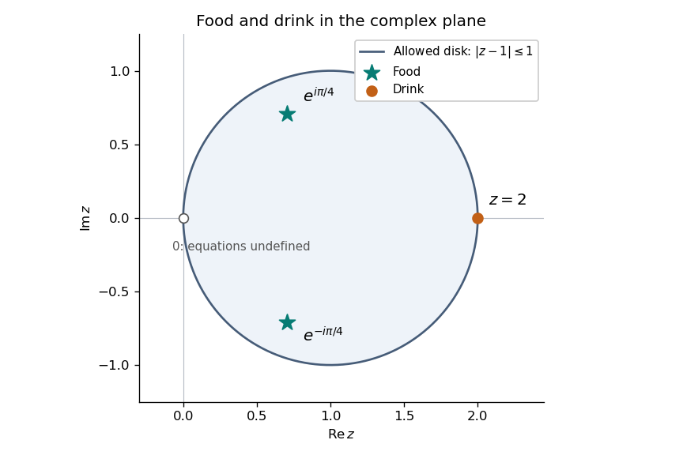

# Paper 1

↑ **Parent:** [Ia](../ia.md)

[https://www.maths.cam.ac.uk/undergrad/pastpapers/files/2005/PaperIA_1.pdf](https://www.maths.cam.ac.uk/undergrad/pastpapers/files/2005/PaperIA_1.pdf)

**Table of contents**

- [1C](#1c)
  - [i](#1c/i)
    - [Solution](#1c/i/solution)
  - [ii](#1c/ii)
    - [Solution](#1c/ii/solution)
  - [iii](#1c/iii)
    - [Solution](#1c/iii/solution)
  - [iv](#1c/iv)
    - [Solution](#1c/iv/solution)
  - [v](#1c/v)
    - [Solution](#1c/v/solution)
  - [Solution](#1c/solution)
- [2B](#2b)
  - [Solution](#2b/solution)
- [3F](#3f)
  - [Solution](#3f/solution)
- [4D](#4d)
  - [Solution](#4d/solution)
- [5C](#5c)
  - [i](#5c/i)
    - [Solution](#5c/i/solution)
  - [ii](#5c/ii)
    - [Solution](#5c/ii/solution)
  - [iii](#5c/iii)
    - [Solution](#5c/iii/solution)
  - [iv](#5c/iv)
    - [Solution](#5c/iv/solution)
  - [v](#5c/v)
    - [Solution](#5c/v/solution)
  - [Solution](#5c/solution)
- [6B](#6b)
  - [Solution](#6b/solution)
- [7A](#7a)
  - [Solution](#7a/solution)
- [8A](#8a)
  - [Solution](#8a/solution)
- [9F](#9f)
  - [i](#9f/i)
    - [Solution](#9f/i/solution)
  - [ii](#9f/ii)
    - [Solution](#9f/ii/solution)
  - [iii](#9f/iii)
    - [Solution](#9f/iii/solution)
  - [iv](#9f/iv)
    - [Solution](#9f/iv/solution)
- [10D](#10d)
  - [Solution](#10d/solution)
- [11E](#11e)
  - [Solution](#11e/solution)
- [12E](#12e)
  - [Solution](#12e/solution)

## 1C

↑ **Parent:** [Paper 1](paper-1.md)

<h3 id="1c/i">i</h3>

↑ **Parent:** [1C](#1c)

<h4 id="1c/i/solution">Solution</h4>

↑ **Parent:** [I](#1c/i)

The two free indices are the row and column indices of a [matrix](../../../vector-space.md#matrix). The [Kronecker delta](../../../linear-algebra.md#kronecker-delta) has value one on its diagonal and zero off it, so the answer is **the $3\times3$ [identity matrix](../../../vector-space.md#identity-matrix) $I$**.

<h3 id="1c/ii">ii</h3>

↑ **Parent:** [1C](#1c)

<h4 id="1c/ii/solution">Solution</h4>

↑ **Parent:** [Ii](#1c/ii)

**This is the incorrectly formed expression.** In the [Einstein summation convention](../../../linear-algebra.md#einstein-notation), an index in a term is either free and occurs once, or summed and occurs twice. Here $i$ occurs three times in the same product, so it cannot consistently be classified as either. Renaming a dummy index before multiplying would give a valid different expression, such as $\delta_{kk}\delta_{ij}=3\delta_{ij}$, but does not make the printed expression valid.

<h3 id="1c/iii">iii</h3>

↑ **Parent:** [1C](#1c)

<h4 id="1c/iii/solution">Solution</h4>

↑ **Parent:** [Iii](#1c/iii)

The contracted [Kronecker delta](../../../linear-algebra.md#kronecker-delta) is $\delta_{ll}=3$. The other scalar contraction is $a_iC_{ij}b_j=\mathbf a^TC\mathbf b$, while $C_{ik}d_i$ is the $k$th component of the [matrix transpose](../../../vector-space.md#transpose) applied to $\mathbf d$. Hence the resulting [vector](../../../vector-space.md#vector) is

$$
\boxed{3(\mathbf a^TC\mathbf b)\mathbf d-C^T\mathbf d.}
$$

Both terms have the same single free index $k$, as required by the [Einstein summation convention](../../../linear-algebra.md#einstein-notation).

<h3 id="1c/iv">iv</h3>

↑ **Parent:** [1C](#1c)

<h4 id="1c/iv/solution">Solution</h4>

↑ **Parent:** [Iv](#1c/iv)

Compare with $(\mathbf b\times\mathbf a)_i=\epsilon_{ijk}b_ja_k$. The scalar factors commute, so the answer is

$$
\boxed{\mathbf b\times\mathbf a=-\mathbf a\times\mathbf b.}
$$

The order of the contracted indices matters because the [Levi-Civita symbol](../../../calculus.md#levi-civita-symbol) is antisymmetric.

<h3 id="1c/v">v</h3>

↑ **Parent:** [1C](#1c)

<h4 id="1c/v/solution">Solution</h4>

↑ **Parent:** [V](#1c/v)

Interchange the two dummy indices $j,k$. The product $a_ja_k$ is symmetric under this interchange, while the [Levi-Civita symbol](../../../calculus.md#levi-civita-symbol) changes sign. Thus the contraction equals its negative and is **the zero [vector](../../../vector-space.md#vector)**, equivalently $\mathbf a\times\mathbf a=\mathbf0$.

<h3 id="1c/solution">Solution</h3>

↑ **Parent:** [1C](#1c)

For the unheaded continuation, write the [vector triple product](../../../calculus.md#vector-triple-product) as

$$
[\mathbf a\times(\mathbf b\times\mathbf c)]_i=\epsilon_{ijk}a_j\epsilon_{klm}b_lc_m.
$$

The [Levi-Civita symbol](../../../calculus.md#levi-civita-symbol) contraction is $\epsilon_{ijk}\epsilon_{klm}=\delta_{il}\delta_{jm}-\delta_{im}\delta_{jl}$. One way to check its sign is to fix distinct $i,j$: the only nonzero term has $k$ the remaining index, and the pairs $(l,m)=(i,j),(j,i)$ contribute $+1,-1$ respectively. When $i=j$, both sides vanish. Contracting with the [vectors](../../../vector-space.md#vector) now gives both requested notations:

$$
\boxed{[\mathbf a\times(\mathbf b\times\mathbf c)]_i=b_i a_jc_j-c_i a_jb_j,\qquad \mathbf a\times(\mathbf b\times\mathbf c)=\mathbf b(\mathbf a\cdot\mathbf c)-\mathbf c(\mathbf a\cdot\mathbf b).}
$$

If $\mathbf a$ and $\mathbf b$ are [orthogonal](../../../linear-algebra.md#orthogonal-vectors), then $\mathbf a\cdot\mathbf b=0$. With the specified $\mathbf c$, the perpendicularity of the [cross product](../../../vector-space.md#cross-product) gives $\mathbf a\cdot\mathbf c=|\mathbf a|^2$. Therefore

$$
\boxed{\mathbf a\times(\mathbf b\times\mathbf c)=|\mathbf a|^2\mathbf b.}
$$

The same answer covers the degenerate case in which one of these two [vectors](../../../vector-space.md#vector) is zero.

## 2B

↑ **Parent:** [Paper 1](paper-1.md)

<h3 id="2b/solution">Solution</h3>

↑ **Parent:** [2B](#2b)

Expanding the [cross product](../../../vector-space.md#cross-product) component by component gives its [cross-product matrix](../../../linear-algebra.md#cross-product-matrix):

$$
\boxed{A=\begin{pmatrix}0&-n_3&n_2\\n_3&0&-n_1\\-n_2&n_1&0\end{pmatrix}.}
$$

It is a real [skew-symmetric matrix](../../../linear-algebra.md#skew-symmetric-matrix) and annihilates $\mathbf n$. By the [vector triple product](../../../calculus.md#vector-triple-product),

$$
A^2\mathbf x=\mathbf n\times(\mathbf n\times\mathbf x)=\mathbf n(\mathbf n\cdot\mathbf x)-\mathbf x,
$$

so $A^2=\mathbf n\mathbf n^T-I$ for a [unit vector](../../../vector-space.md#unit-vector) $\mathbf n$. Choose a [unit vector](../../../vector-space.md#unit-vector) $\mathbf u\perp\mathbf n$ and put $\mathbf v=\mathbf n\times\mathbf u$. Then $(\mathbf u,\mathbf v,\mathbf n)$ is an orthonormal basis and $A\mathbf u=\mathbf v$, $A\mathbf v=-\mathbf u$, $A\mathbf n=0$. Thus the characteristic polynomial is $\lambda(\lambda^2+1)$ and the [cross-product matrix spectrum](../../../linear-algebra.md#cross-product-matrix-spectrum) is

$$
\boxed{\lambda=0,\ i,\ -i.}
$$

Over the complex numbers, corresponding [eigenvectors](../../../linear-operator-theory.md#eigenvector) are $\mathbf n$, $\mathbf u-i\mathbf v$, and $\mathbf u+i\mathbf v$. Only the zero [eigenvalue](../../../linear-operator-theory.md#eigenvalue) has real [eigenvectors](../../../linear-operator-theory.md#eigenvector).

For the specified third coordinate axis, direct multiplication gives

$$
A=\begin{pmatrix}0&-1&0\\1&0&0\\0&0&0\end{pmatrix},\qquad \boxed{A^2=\operatorname{diag}(-1,-1,0).}
$$

Its zero [eigenspace](../../../linear-operator-theory.md#eigenspace) is $\operatorname{span}\{(0,0,1)\}$, and its $-1$ [eigenspace](../../../linear-operator-theory.md#eigenspace) is the whole plane $\operatorname{span}\{(1,0,0),(0,1,0)\}$. Hence the [eigenvalues](../../../linear-operator-theory.md#eigenvalue) of $A^2$ are $-1,-1,0$, with every nonzero [vector](../../../vector-space.md#vector) in the appropriate [eigenspace](../../../linear-operator-theory.md#eigenspace) an [eigenvector](../../../linear-operator-theory.md#eigenvector).

## 3F

↑ **Parent:** [Paper 1](paper-1.md)

<h3 id="3f/solution">Solution</h3>

↑ **Parent:** [3F](#3f)

A real number $s$ is the [supremum](../../../real-analysis.md#supremum) of a nonempty set $A\subset\mathbb R$ if every $a\in A$ satisfies $a\le s$ and no smaller real number is an [upper bound](../../../set.md#upper-bound-in-a-partially-ordered-set). Equivalently, for every $\eta>0$ there is $a\in A$ with $s-\eta<a\le s$. A [greatest element](../../../set.md#greatest-element), or maximum, additionally belongs to $A$.

Let $s=\sup A$ and suppose $s\notin A$. Fix $\varepsilon>0$. The approximation property gives at least one element of $A$ in $(s-\varepsilon,s)$. If there were only finitely many, they would have a largest value $m<s$. Every other element of $A$ is at most $s-\varepsilon$, so $\max\{m,s-\varepsilon\}<s$ would be an [upper bound](../../../set.md#upper-bound-in-a-partially-ordered-set) for the whole set. This contradicts the definition of the [supremum](../../../real-analysis.md#supremum). Therefore **there are infinitely many such elements**, the [accumulation below an unattained supremum](../../../real-analysis.md#accumulation-below-an-unattained-supremum).

For a counterexample when the [supremum](../../../real-analysis.md#supremum) is attained, take **$A=\{0\}$**. Its [supremum](../../../real-analysis.md#supremum) and [greatest element](../../../set.md#greatest-element) are both zero, while every interval $(-\varepsilon,0)$ contains no elements of $A$.

## 4D

↑ **Parent:** [Paper 1](paper-1.md)

<h3 id="4d/solution">Solution</h3>

↑ **Parent:** [4D](#4d)

Suppose, towards a contradiction, that $|a_nz^n|\le M$ for every $n$, where $|z|>R$. Choose a radius $\rho$ strictly between $R$ and $|z|$, and take any $w$ with $|w|=\rho$. Then

$$
|a_nw^n|=|a_nz^n|\left|\frac wz\right|^n\le M\left(\frac\rho{|z|}\right)^n.
$$

The [geometric series](../../../real-analysis.md#geometric-series) on the right converges because its ratio lies in $[0,1)$. The [comparison test for series](../../../real-analysis.md#comparison-test-for-series) therefore gives [absolute convergence](../../../real-analysis.md#absolute-convergence) of the [power series](../../../real-analysis.md#power-series) at $w$, contrary to the defining property of its [radius of convergence](../../../real-analysis.md#radius-of-convergence). Thus **$|a_nz^n|$ is unbounded in $n$ whenever $|z|>R$**. This is the [bounded power-series terms force interior absolute convergence](../../../real-analysis.md#bounded-power-series-terms-force-interior-absolute-convergence) principle. The case $R=\infty$ has no points outside its convergence disk and the assertion is vacuous there.

Every possible [radius of convergence](../../../real-analysis.md#radius-of-convergence) is realized by an explicit [power series](../../../real-analysis.md#power-series):

$$
\boxed{\begin{array}{c|c}R&\text{series}\\\hline 0&\displaystyle\sum_{n=0}^\infty n!z^n\\0<R<\infty&\displaystyle\sum_{n=0}^\infty(z/R)^n\\\infty&\displaystyle\sum_{n=0}^\infty z^n/n!\end{array}}
$$

For the first, consecutive absolute terms have ratio $(n+1)|z|$, so at every $z\ne0$ they eventually grow and do not tend to zero; at zero the series is defined. The middle [geometric series](../../../real-analysis.md#geometric-series) converges absolutely exactly for $|z|<R$, and outside that disk its terms grow. The last has consecutive-term ratio $|z|/(n+1)\to0$, so the [ratio test](../../../real-analysis.md#ratio-test) gives [absolute convergence](../../../real-analysis.md#absolute-convergence) for every finite $z$. These arguments use the necessary zero-term condition for convergence, the [comparison test for series](../../../real-analysis.md#comparison-test-for-series), and [absolute convergence](../../../real-analysis.md#absolute-convergence) of a [geometric series](../../../real-analysis.md#geometric-series) with ratio less than one; they do not assume convergence on the boundary.

## 5C

↑ **Parent:** [Paper 1](paper-1.md)

<h3 id="5c/i">i</h3>

↑ **Parent:** [5C](#5c)

<h4 id="5c/i/solution">Solution</h4>

↑ **Parent:** [I](#5c/i)

The [complex exponential function](../../../calculus.md#complex-exponential-function) factorizes as $e^{x+iy}=e^xe^{iy}=e^x(\cos y+i\sin y)$. Hence

$$
\boxed{\operatorname{Re}(e^z)=e^x\cos y,\qquad \operatorname{Im}(e^z)=e^x\sin y.}
$$

The real exponential multiplies both components; it does not change the [argument](../../../complex-analysis.md#argument-complex-analysis).

<h3 id="5c/ii">ii</h3>

↑ **Parent:** [5C](#5c)

<h4 id="5c/ii/solution">Solution</h4>

↑ **Parent:** [Ii](#5c/ii)

Using $\cos z=(e^{iz}+e^{-iz})/2$ and collecting real and imaginary terms gives the [complex cosine](../../../geometry-and-topology.md#complex-cosine) identity $\cos(x+iy)=\cos x\cosh y-i\sin x\sinh y$. Thus

$$
\boxed{\operatorname{Re}(\cos z)=\cos x\cosh y,\qquad \operatorname{Im}(\cos z)=-\sin x\sinh y.}
$$

The sign follows from the factors $e^{-y}$ and $e^y$ in the two [complex exponentials](../../../calculus.md#complex-exponential-function).

<h3 id="5c/iii">iii</h3>

↑ **Parent:** [5C](#5c)

<h4 id="5c/iii/solution">Solution</h4>

↑ **Parent:** [Iii](#5c/iii)

For $z\ne0$, write $z=re^{i\theta}$ with $r=\sqrt{x^2+y^2}>0$. The [complex logarithm](../../../analysis.md#complex-logarithm) has values $\ln r+i(\theta+2\pi k)$, $k\in\mathbb Z$. Therefore

$$
\boxed{\operatorname{Re}(\log z)=\tfrac12\ln(x^2+y^2),\qquad \operatorname{Im}(\log z)=\theta+2\pi k.}
$$

For a specified single-valued branch, choose the corresponding continuous determination of the [argument](../../../complex-analysis.md#argument-complex-analysis). In particular, the principal value uses $\operatorname{Arg}z\in(-\pi,\pi]$; it is not represented correctly by $\arctan(y/x)$ in every quadrant. The [complex logarithm](../../../analysis.md#complex-logarithm) is undefined at zero.

<h3 id="5c/iv">iv</h3>

↑ **Parent:** [5C](#5c)

<h4 id="5c/iv/solution">Solution</h4>

↑ **Parent:** [Iv](#5c/iv)

For $z\ne0$, rationalizing the denominators gives $1/z=(x-iy)/(x^2+y^2)$ and $1/\overline z=(x+iy)/(x^2+y^2)$. Their imaginary parts cancel, so

$$
\boxed{\operatorname{Re}\left(\frac1z+\frac1{\overline z}\right)=\frac{2x}{x^2+y^2},\qquad \operatorname{Im}\left(\frac1z+\frac1{\overline z}\right)=0.}
$$

This also follows because the summands are [complex conjugates](../../../complex-analysis.md#complex-conjugate).

<h3 id="5c/v">v</h3>

↑ **Parent:** [5C](#5c)

<h4 id="5c/v/solution">Solution</h4>

↑ **Parent:** [V](#5c/v)

The cubic terms are the expansion of $(z+\overline z)^3=(2x)^3$. Subtracting $\overline z=x-iy$ therefore gives

$$
\boxed{\operatorname{Re}=8x^3-x,\qquad \operatorname{Im}=y.}
$$

Here the expression is a [polynomial](../../../polynomial.md) in $z$ and its [complex conjugate](../../../complex-analysis.md#complex-conjugate), rather than a holomorphic polynomial in $z$ alone.

<h3 id="5c/solution">Solution</h3>

↑ **Parent:** [5C](#5c)

For the unheaded continuation, set $w=\log z$ in the food equation. The two square roots are $w=\pm i\pi/4$, so exponentiating gives

$$
\boxed{z=e^{i\pi/4},\ e^{-i\pi/4}=\frac{1\pm i}{\sqrt2}\quad\text{(food)}.}
$$

Both values have $|z-1|^2=2-\sqrt2<1$ and hence lie strictly inside the disk. Both also have the indicated principal logarithms. Allowing the multivalued [complex logarithm](../../../analysis.md#complex-logarithm) produces no additional points: the only permitted values of $w$ are still the two square roots already used.

For drink, the PDF squares only the denominator. Put $z=x+iy$. Its numerator is $(3x+iy)/2$ and its unsquared denominator is $(x+3iy)/2$, which is nonzero unless $z=0$. Multiplying the equation by this denominator squared and equating the [real part](../../../complex-analysis.md#real-part) and [imaginary part](../../../complex-analysis.md#imaginary-part) yields

$$
\frac32x=\frac34x^2-\frac{27}4y^2,\qquad\frac12y=\frac92xy,
$$

that is $x^2-9y^2=2x$ and $y(1-9x)=0$. If $y=0$, the real equation gives $x=0$ or $x=2$, and zero is excluded. If $y\ne0$, then $x=1/9$, but the real equation would require $9y^2=-17/81$, impossible for real $y$. Thus

$$
\boxed{z=2\quad\text{is the only drink point}.}
$$

It lies on the allowed disk boundary, and direct substitution gives $3/1^2=3$. The denominator-only square matters: squaring the entire quotient would define a different locus.

**[Figure 1](#5c/image-food-points-inside-the-allowed-complex-disk-and-the-unique-drink-point-on-its-boundary). Food points inside the allowed complex disk and the unique drink point on its boundary**.

## 6B

↑ **Parent:** [Paper 1](paper-1.md)

<h3 id="6b/solution">Solution</h3>

↑ **Parent:** [6B](#6b)

The [matrix rank](../../../vector-space.md#matrix-rank) $r$ is the [dimension](../../../vector-space.md#dimension-vector-space) of its [column space](../../../vector-space.md#column-space), equivalently the dimension of the image of the corresponding [linear map](../../../vector-space.md#linear-map). The equation is solvable precisely when $\mathbf b\in\operatorname{col}A$, equivalently when the augmented matrix has the same rank as $A$. If $\mathbf x_0$ is one solution, every solution is $\mathbf x_0+\mathbf u$ with $\mathbf u\in\ker A$, since subtracting any two solutions gives a kernel element. The [rank-nullity theorem](../../../linear-algebra.md#rank-nullity-theorem) gives $\dim\ker A=3-r$.

Consequently, for rank three there is one solution for every $\mathbf b$, namely $A^{-1}\mathbf b$. For rank two there are no solutions outside the column plane, and an [affine solution space of a linear equation](../../../linear-algebra.md#affine-solution-space-of-a-linear-equation) of dimension one when consistent. For rank one, consistency requires $\mathbf b$ to lie on the column line and the solution set is an affine plane of dimension two. For rank zero, $A=0$: the solution set is all of $\mathbb R^3$ if $\mathbf b=0$, and empty otherwise. These descriptions include homogeneous systems, whose solution spaces pass through the origin.

The [sphere](../../../geometry-and-topology.md#sphere) has normal $\nabla(x_1^2+x_2^2+x_3^2)=(0,2,2)$ at the specified point, so its [tangent plane](../../../differential-geometry.md#tangent-plane) is

$$
\boxed{x_2+x_3=2.}
$$

A general [straight line](../../../geometry-and-topology.md#straight-line) through the origin is $\mathbf x=t\mathbf d$, $t\in\mathbb R$, for a fixed nonzero direction $\mathbf d=(d_1,d_2,d_3)$. To express the intersection using a $3\times3$ [matrix](../../../vector-space.md#matrix), choose independent [vectors](../../../vector-space.md#vector) $\mathbf u,\mathbf v$ spanning $\mathbf d^\perp$. The line is exactly the intersection of $\mathbf u\cdot\mathbf x=0$ and $\mathbf v\cdot\mathbf x=0$, hence

$$
\boxed{\begin{pmatrix}u_1&u_2&u_3\\v_1&v_2&v_3\\0&1&1\end{pmatrix}\mathbf x=\begin{pmatrix}0\\0\\2\end{pmatrix}.}
$$

The first two rows have rank two. The third is independent of them exactly when $(0,1,1)\cdot\mathbf d=d_2+d_3\ne0$. In that case the rank is three and the unique intersection is

$$
\boxed{\mathbf x=\frac{2\mathbf d}{d_2+d_3}.}
$$

Geometrically the line crosses the tangent plane transversely. If $d_2+d_3=0$, the matrix rank is two: its third row is a linear combination of the first two, but the corresponding right-hand-side combination would be zero rather than two. The system is inconsistent and **there is no intersection**. The line is parallel to the tangent plane and cannot lie in it, since it contains the origin while the plane does not. Thus no choice of a genuine direction produces an infinite intersection in this particular problem.

## 7A

↑ **Parent:** [Paper 1](paper-1.md)

<h3 id="7a/solution">Solution</h3>

↑ **Parent:** [7A](#7a)

For $\mathbf b\ne0$, define the [orthogonal projection](../../../hilbert-space.md#orthogonal-projection) of $\mathbf a$ onto its span by

$$
\mathbf a_{\parallel}=\frac{\mathbf a\cdot\mathbf b}{|\mathbf b|^2}\mathbf b,\qquad \mathbf a_{\perp}=\mathbf a-\mathbf a_{\parallel}.
$$

The first is parallel or antiparallel to $\mathbf b$, or zero, and $\mathbf a_\perp\cdot\mathbf b=0$. This proves the decomposition. If $\mathbf a\ne0$ as well, comparison with $\mathbf a_\parallel=|\mathbf a|\cos\theta\,\widehat{\mathbf b}$ yields

$$
\boxed{\cos\theta=\frac{\mathbf a\cdot\mathbf b}{|\mathbf a||\mathbf b|}.}
$$

Indeed $|\mathbf a|^2=|\mathbf a_\parallel|^2+|\mathbf a_\perp|^2$ shows that the ratio lies in $[-1,1]$. There is a unique $\theta\in[0,\pi]$ with this cosine. The definition is symmetric in the two [vectors](../../../vector-space.md#vector), unchanged by orthogonal coordinate changes and positive rescaling, and agrees with ordinary plane geometry in their span: projecting a unit vector onto the other gives its cosine. Parallel, perpendicular and antiparallel directions give $0,\pi/2,\pi$ respectively. The zero vector has no defined angle; if $\mathbf b=0$, the nonzero-axis projection formula itself must not be used.

The vertices of the centered [hypercube](../../../geometry-and-topology.md#hypercube) are sign vectors $\mathbf u\in\{-1,1\}^n$. A body diagonal identifies $\mathbf u$ and $-\mathbf u$, hence there are $2^{n-1}$ such diagonals. If two sign vectors disagree in $h$ positions, their [dot product](../../../linear-algebra.md#dot-product) is $n-h-h=n-2h$. For odd $n$ this integer is odd and cannot be zero. Thus **no two body diagonals are perpendicular in odd dimension**, by the [orthogonality of hypercube body diagonals](../../../geometry-and-topology.md#orthogonality-of-hypercube-body-diagonals).

In four dimensions, mutually [orthogonal](../../../linear-algebra.md#orthogonal-vectors) nonzero [vectors](../../../vector-space.md#vector) are linearly independent, so at most four mutually perpendicular diagonals are possible. Four are achieved by the directions

$$
\boxed{(1,1,1,1),\quad(1,-1,1,-1),\quad(1,1,-1,-1),\quad(1,-1,-1,1).}
$$

Each has squared norm four and every distinct pair has zero [dot product](../../../linear-algebra.md#dot-product); these are the rows of a [Hadamard matrix](../../../vector-space.md#hadamard-matrix). Therefore **the maximum is four**.

For distinct diagonals, the [Hamming distance](../../../coding-theory.md#hamming-distance) is $h=1,2,3$; $h=0,4$ would represent the same line. Oriented vertex directions therefore give cosines $1/2,0,-1/2$. The angles are

$$
\boxed{\pi/3,\ \pi/2,\ 2\pi/3\quad\text{for oriented directions}.}
$$

For unoriented diagonals, the usual smaller angle between the lines is **$\pi/3$ or $\pi/2$**; the supplementary intersection angle $2\pi/3$ also occurs when the two rays are chosen oppositely. Stating this convention avoids counting a line and its reverse as different diagonals.

## 8A

↑ **Parent:** [Paper 1](paper-1.md)

<h3 id="8a/solution">Solution</h3>

↑ **Parent:** [8A](#8a)

Use [matrix](../../../vector-space.md#matrix) notation and set $s=\mathbf v^T\mathbf v>0$, $t=\mathbf v^TT\mathbf v$, $\tau=\operatorname{tr}T$. Contracting the proposed decomposition with $\mathbf v$ and taking its [trace](../../../linear-algebra.md#matrix-trace), using the stipulated transverse and trace conditions, gives

$$
T\mathbf v=(A+Bs)\mathbf v+s\mathbf C,\qquad t=sA+s^2B,\qquad\tau=3A+sB.
$$

These relations determine both scalars and the transverse [vector](../../../vector-space.md#vector) uniquely:

$$
\boxed{A=\frac12\left(\tau-\frac ts\right),\qquad B=\frac{3t-s\tau}{2s^2},\qquad\mathbf C=\frac{T\mathbf v-(t/s)\mathbf v}{s}.}
$$

The last expression obeys $\mathbf C^T\mathbf v=0$ directly.

To construct and check the remaining [symmetric matrix](../../../linear-algebra.md#symmetric-matrix), use the [orthogonal projection matrix](../../../linear-algebra.md#orthogonal-projection-matrix) $P=I-\mathbf v\mathbf v^T/s$ onto $\mathbf v^\perp$, and define

$$
\boxed{D=PTP-AP.}
$$

Both terms are symmetric, $D\mathbf v=0$, and

$$
\operatorname{tr}D=\operatorname{tr}(TP)-A\operatorname{tr}P=\tau-\frac ts-2A=0.
$$

Expand $T=(P+Q)T(P+Q)$ with $Q=\mathbf v\mathbf v^T/s$. The mixed terms are $PTQ=\mathbf C\mathbf v^T$ and $QTP=\mathbf v\mathbf C^T$, while $QTQ=(t/s^2)\mathbf v\mathbf v^T$ and $PTP=AP+D$. Consequently

$$
T=AI+\left(\frac t{s^2}-\frac As\right)\mathbf v\mathbf v^T+\mathbf C\mathbf v^T+\mathbf v\mathbf C^T+D,
$$

and the displayed coefficient equals $B$. This proves existence as well as the [axis decomposition of a symmetric matrix](../../../linear-algebra.md#axis-decomposition-of-a-symmetric-matrix) formulas.

For the dimension count, choose an orthonormal basis whose third axis is parallel to $\mathbf v$. The [vector](../../../vector-space.md#vector) $\mathbf C$ has two transverse components. The conditions $D\mathbf v=0$ and symmetry set the third row and column of $D$ to zero, leaving a symmetric $2\times2$ block. Its zero [trace](../../../linear-algebra.md#matrix-trace) leaves two independent entries, of the form $\bigl(\begin{smallmatrix}d&e\\e&-d\end{smallmatrix}\bigr)$. Together with the two independent scalars $A,B$, the total is **$1+1+2+2=6$ parameters**, exactly $3(3+1)/2$, the [dimension](../../../vector-space.md#dimension-vector-space) of real symmetric $3\times3$ matrices. The recovery formulas also prove uniqueness, so this is an actual parameterization without redundant degrees of freedom.

## 9F

↑ **Parent:** [Paper 1](paper-1.md)

<h3 id="9f/i">i</h3>

↑ **Parent:** [9F](#9f)

<h4 id="9f/i/solution">Solution</h4>

↑ **Parent:** [I](#9f/i)

For $n\ge2$, $0<n^{-2}\le[n(n-1)]^{-1}=1/(n-1)-1/n$. The upper bound has telescoping partial sums, bounded by one. The positive partial sums of the original [series](../../../real-analysis.md#series-mathematics) are consequently bounded by two and increasing, so they converge as a [monotone bounded sequence](../../../real-analysis.md#monotone-bounded-sequence). **The series converges absolutely.** This also supplies the $p=2$ case of a [p-series](../../../real-analysis.md#p-series) without requiring its exact sum.

<h3 id="9f/ii">ii</h3>

↑ **Parent:** [9F](#9f)

<h4 id="9f/ii/solution">Solution</h4>

↑ **Parent:** [Ii](#9f/ii)

For odd $n$, the denominator is $(n+1)^2$; for even $n$, it is $(n-1)^2$. There is no zero denominator in the printed index range. For all $n\ge2$,

$$
0<\frac1{n^2+(-1)^{n+1}2n+1}\le\frac1{(n-1)^2}\le\frac4{n^2}.
$$

The [comparison test for series](../../../real-analysis.md#comparison-test-for-series) with the convergent [p-series](../../../real-analysis.md#p-series) gives **absolute convergence**. In fact the consecutive pair $n=2k-1,2k$ contributes $1/(2k)^2+1/(2k-1)^2$, so the sum is the same as $\sum_{m=1}^\infty m^{-2}$. Positivity justifies this paired reordering; an alternating-sign appearance in the denominator does not make this an alternating series.

<h3 id="9f/iii">iii</h3>

↑ **Parent:** [9F](#9f)

<h4 id="9f/iii/solution">Solution</h4>

↑ **Parent:** [Iii](#9f/iii)

Let $a_n$ denote the summand. Its denominator is positive for every $n\ge1$: odd $n$ gives $n^4+n^2$, while even $n\ge2$ gives $n^4-n^2$. Dividing numerator and denominator by their highest powers gives

$$
na_n=\frac{1+8(-1)^n/n+1/n^3}{1+(-1)^{n+1}/n^2}\longrightarrow1.
$$

The terms are positive for sufficiently large $n$, so the [limit comparison test](../../../real-analysis.md#limit-comparison-test) with the divergent [harmonic series](../../../real-analysis.md#harmonic-series) gives **divergence to $+\infty$**. More explicitly, for $n\ge16$ the numerator is at least $n^3/2$ and the denominator is at most $2n^4$, giving $a_n\ge1/(4n)$. Any finitely many early negative terms change partial sums by only a finite constant and cannot prevent divergence of this positive tail.

<h3 id="9f/iv">iv</h3>

↑ **Parent:** [9F](#9f)

<h4 id="9f/iv/solution">Solution</h4>

↑ **Parent:** [Iv](#9f/iv)

The PDF has the doubly exponential denominator $e^{e^n}$. For its positive summands, the successive-term ratio is

$$
\frac{a_{n+1}}{a_n}=\left(1+\frac1n\right)^3\exp\bigl(e^n-e^{n+1}\bigr)=\left(1+\frac1n\right)^3e^{-(e-1)e^n}\longrightarrow0.
$$

Thus the [ratio test](../../../real-analysis.md#ratio-test) proves **absolute convergence**. Concretely, the tail is eventually dominated by a [geometric series](../../../real-analysis.md#geometric-series) of ratio $1/2$; the polynomial numerator cannot offset the doubly exponential decay.

## 10D

↑ **Parent:** [Paper 1](paper-1.md)

<h3 id="10d/solution">Solution</h3>

↑ **Parent:** [10D](#10d)

For a bounded real function on $[a,b]$, take a partition $a=t_0<\cdots<t_m=b$. Its lower and upper [Darboux sums](../../../real-analysis.md#darboux-sum) are

$$
L(f,P)=\sum_{j=1}^m\inf_{[t_{j-1},t_j]}f\,(t_j-t_{j-1}),\qquad U(f,P)=\sum_{j=1}^m\sup_{[t_{j-1},t_j]}f\,(t_j-t_{j-1}).
$$

The function is [Riemann integrable](../../../real-analysis.md#riemann-integrable-function) when $\sup_P L(f,P)=\inf_P U(f,P)$; the common value is its [Riemann integral](../../../real-analysis.md#riemann-integral). Equivalently, for every $\varepsilon>0$ there is a partition with $U(f,P)-L(f,P)<\varepsilon$. A [continuous function](../../../calculus.md#continuous-function) is bounded and [Riemann integrable](../../../real-analysis.md#riemann-integrable-function) on each compact interval, so all the following integrals exist.

Set $h(x)=x^{-1}\int_0^xf(t)dt$ for $x>0$. Strict decrease gives $f(x)<f(t)<f(0)$ for $0<t<x$. Integrating, with strict inequalities because the difference is positive on interior subintervals, gives

$$
f(x)<h(x)<f(0).
$$

The [intermediate value theorem](../../../calculus.md#intermediate-value-theorem) produces $g(x)\in(0,x)$ with $f(g(x))=h(x)$, and strict monotonicity makes this point unique. Thus **there is exactly one such $g(x)$ in $(0,x)$**.

For the given [exponential function](../../../calculus.md#exponential-function), $h(x)=(1-e^{-x})/x$, so

$$
\boxed{g(x)=\log\left(\frac{x}{1-e^{-x}}\right).}
$$

The preceding strict bounds already prove $0<g(x)<x$; no limiting value at zero needs to be included in its domain.

For differentiability, a continuous strictly monotone function has a continuous inverse on its range. If it is differentiable at an interior point $t$ with $f'(t)\ne0$, the inverse is differentiable at $y=f(t)$, with derivative $1/f'(t)$. Indeed, setting $u=f^{-1}(y')$, inverse continuity gives $u\to t$ as $y'\to y$, and

$$
\frac{f^{-1}(y')-f^{-1}(y)}{y'-y}=\left(\frac{f(u)-f(t)}{u-t}\right)^{-1}\longrightarrow\frac1{f'(t)}.
$$

This one-dimensional inverse result needs no assumption that $f'$ is continuous. It is enough here that $f$ is differentiable and $f'<0$ at every positive argument.

The [fundamental theorem of calculus](../../../calculus.md#fundamental-theorem-of-calculus) and the quotient rule give

$$
h'(x)=\frac{xf(x)-\int_0^xf(t)dt}{x^2}=\frac{f(x)-h(x)}x<0.
$$

Now $g=f^{-1}\circ h$ and $g(x)>0$, so the inverse derivative formula applies at every relevant point. The [monotone mean-value point of an integral average](../../../calculus.md#monotone-mean-value-point-of-an-integral-average) satisfies

$$
\boxed{g'(x)=\frac{h'(x)}{f'(g(x))}=\frac{f(x)-f(g(x))}{xf'(g(x))}>0.}
$$

Both numerator and denominator are negative. For the exponential example, this also agrees with $g'(x)=1/x-1/(e^x-1)>0$, since $e^x>1+x$ for $x>0$.

## 11E

↑ **Parent:** [Paper 1](paper-1.md)

<h3 id="11e/solution">Solution</h3>

↑ **Parent:** [11E](#11e)

To prove the required zero-existence statement directly, let $S=\{x\in[a,b]:f(x)\le0\}$ and $c=\sup S$. This set is nonempty and bounded. Continuity and the strict signs at the endpoints give a right neighbourhood of $a$ with negative values and a left neighbourhood of $b$ with positive values; consequently $a<c<b$. If $f(c)<0$, continuity would give points of $S$ to the right of $c$, contradicting its upper-bound property. If $f(c)>0$, continuity would give an interval immediately to the left of $c$ containing no points of $S$, contradicting the approximation property of its [supremum](../../../real-analysis.md#supremum). Hence **$f(c)=0$ for some $c\in(a,b)$**, proving this form of the [intermediate value theorem](../../../calculus.md#intermediate-value-theorem).

For the half-interval claim, put $H(x)=g(x+1/2)-g(x)$ on $[0,1/2]$. It is a [continuous function](../../../calculus.md#continuous-function) and

$$
H(1/2)=g(1)-g(1/2)=g(0)-g(1/2)=-H(0).
$$

If either endpoint value is zero, it supplies the answer. Otherwise the signs are opposite, so the [intermediate value theorem](../../../calculus.md#intermediate-value-theorem), applied also to $-H$ if necessary, gives an interior zero. Thus **$g(c+1/2)=g(c)$ for some $c\in[0,1/2]$**.

For general positive integer $n$, define $H_n(x)=g(x+1/n)-g(x)$ on $[0,(n-1)/n]$. At its grid points,

$$
\sum_{k=0}^{n-1}H_n(k/n)=\sum_{k=0}^{n-1}\bigl[g((k+1)/n)-g(k/n)\bigr]=g(1)-g(0)=0.
$$

If a sampled value is zero, it is the desired point. If none is zero, not all sampled values can have the same sign, so two have opposite signs; continuity gives a zero between their grid points. This proves the [horizontal chord of reciprocal-integer length](../../../calculus.md#horizontal-chord-of-reciprocal-integer-length):

$$
\boxed{\exists c_n\in[0,(n-1)/n]\quad g(c_n+1/n)=g(c_n).}
$$

For $n=1$ the interval is the single point zero, which works by the endpoint equality itself. The proof does not require a differentiable function or a periodic extension.

## 12E

↑ **Parent:** [Paper 1](paper-1.md)

<h3 id="12e/solution">Solution</h3>

↑ **Parent:** [12E](#12e)

[Rolle theorem](../../../calculus.md#rolle-theorem) states that if $a<b$, $f$ is continuous on $[a,b]$, differentiable on $(a,b)$, and $f(a)=f(b)$, then there is $c\in(a,b)$ with $f'(c)=0$.

If $f$ is constant, any interior point works. Otherwise the [extreme value theorem](../../../real-analysis.md#extreme-value-theorem) gives an attained maximum and minimum on the interval, and at least one of them differs from the common endpoint value. That extremum must occur at an interior point $c$. At an interior maximum, for small positive $h$ the difference quotient $[f(c+h)-f(c)]/h$ is nonpositive, while for negative $h$ it is nonnegative. Existence of the common derivative forces it to be both nonpositive and nonnegative, hence zero. The same argument with inequalities reversed applies to an interior minimum. This proves [Rolle theorem](../../../calculus.md#rolle-theorem), including the derivative-at-an-extremum step rather than assuming it.

Now let the nonconstant [polynomial](../../../polynomial.md) $p$ have distinct real roots $r_1<\cdots<r_k$, with [multiplicities](../../../polynomial.md#multiplicity-mathematics) $m_1,\ldots,m_k$ adding to its degree $n$. If $p(x)=(x-r_j)^{m_j}q_j(x)$ and $q_j(r_j)\ne0$, differentiation gives

$$
p'(x)=(x-r_j)^{m_j-1}\bigl[m_jq_j(x)+(x-r_j)q_j'(x)\bigr].
$$

The bracket is nonzero at $r_j$, so its [multiplicity](../../../polynomial.md#multiplicity-mathematics) as a root of $p'$ is exactly $m_j-1$. These roots already contribute $\sum_j(m_j-1)=n-k$ real roots counted with multiplicity. [Rolle theorem](../../../calculus.md#rolle-theorem) supplies an additional root of $p'$ in each of the $k-1$ disjoint intervals $(r_j,r_{j+1})$. These additional roots are distinct from each other and from all the $r_j$.

We have therefore exhibited at least $(n-k)+(k-1)=n-1$ real roots counted with multiplicity. The derivative has degree $n-1$, so there is no room for any additional nonreal roots. **Every root of $p'$ is real.** This is the [Rolle root count with multiplicities](../../../calculus.md#rolle-root-count-with-multiplicities); for $n=1$ the nonzero constant derivative has no roots, as expected.

For failure of the converse, take

$$
\boxed{p(x)=x^3+1,\qquad p'(x)=3x^2.}
$$

The derivative has only the real root zero, of multiplicity two. But $p(x)=(x+1)(x^2-x+1)$ and the quadratic factor has roots $(1\pm i\sqrt3)/2$, which are nonreal. Thus real-rootedness of the derivative does not imply real-rootedness of the original [polynomial](../../../polynomial.md).

## ↑ Ancestors (8)

1. [Ia](../ia.md)
2. [2005](../../2005.md)
3. [Past exam of the mathematics course of the University of Cambridge](../../../past-exam-of-the-mathematics-course-of-the-university-of-cambridge.md)
4. [Mathematics course of the University of Cambridge](../../../university-of-cambridge.md#mathematics-course-of-the-university-of-cambridge)
5. [Course of the University of Cambridge](../../../university-of-cambridge.md#course-of-the-university-of-cambridge)
6. [University of Cambridge](../../../university-of-cambridge.md)
7. [List of universities](../../../README.md#list-of-universities)
8. [Codex Wiki](../../../README.md)
