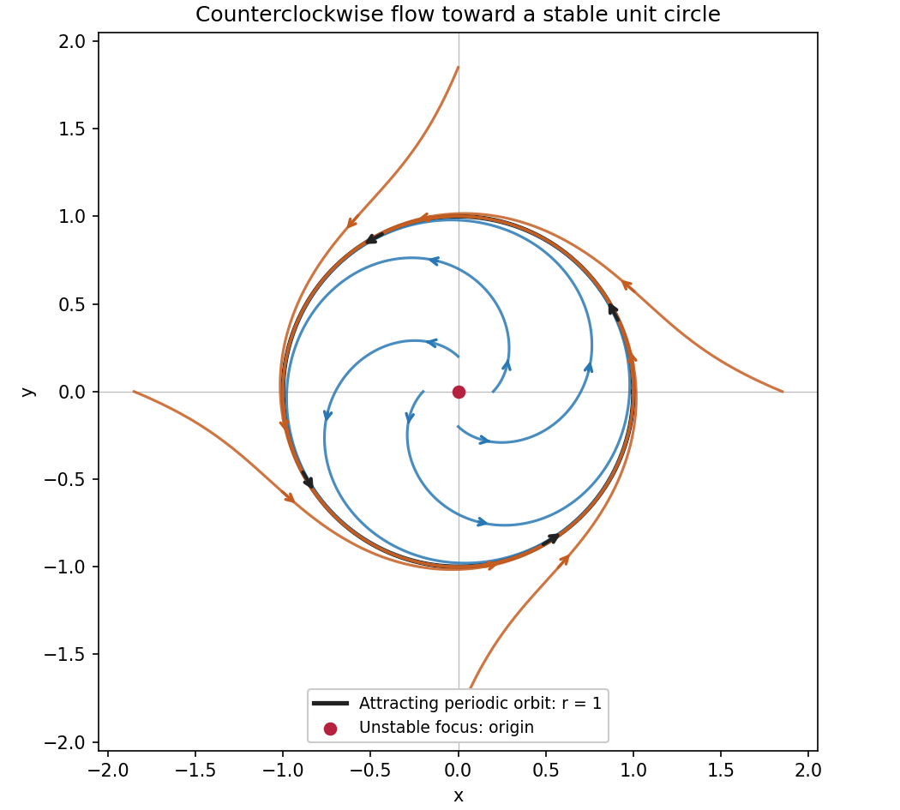

<h1 id="7b/solution">Solution</h1>

↑ **Parent:** [7B](../7b.md)

For $r>0$, the [polar coordinates](../../../../../polar-coordinates.md) satisfy

$$
\dot r=\frac{x\dot x+y\dot y}{r}=r(1-r^2),
\qquad \dot\theta=\frac{x\dot y-y\dot x}{r^2}=1.
$$

A positive constant radius must therefore be one. The nonconstant [periodic solutions](../../../../../periodic-solution.md) are

$$
\boxed{x(t)=\cos(t+\theta_0),\qquad y(t)=\sin(t+\theta_0),}
$$

with least [period](../../../../../period-of-a-function.md) $2\pi$ and counterclockwise orientation. The origin is also a stationary solution, hence periodic in the degenerate sense of a constant function; it is a point rather than a nontrivial closed [orbit](../../../../../orbit-dynamical-system.md). There are no other constant-radius solutions.

For $r_0>0$, put $v=r^2$. Then $\dot v=2v(1-v)$, a [logistic differential equation](../../../../../logistic-differential-equation.md). Solving this [separable differential equation](../../../../../separable-differential-equation.md) gives

$$
\boxed{r(t)=\left[1+(r_0^{-2}-1)e^{-2t}\right]^{-1/2},
\qquad \theta(t)=\theta_0+t,\qquad t\geq0.}
$$

The denominator is positive for every forward time. When $0<r_0<1$, the radius increases monotonically to one; when $r_0>1$, it decreases monotonically to one; and when $r_0=1$ it stays there. Thus every nonzero [orbit](../../../../../orbit-dynamical-system.md) approaches the unit circle while continuing to rotate. More precisely, its distance from the phase-matched circular solution tends to zero; its Cartesian coordinates do not converge to a single point. For $r_0=0$, the solution stays at the origin.

The origin is the only [equilibrium point](../../../../../equilibrium-point-of-a-dynamical-system.md). Its [Jacobian matrix](../../../../../jacobian-matrix.md) is

$$
J(0)=\begin{pmatrix}1&-1\\1&1\end{pmatrix},
$$

whose [eigenvalues](../../../../../eigenvalue.md) are $1\pm i$. It is an unstable [focus](../../../../../focus-dynamical-systems.md). The unit circle is an attracting [limit cycle](../../../../../limit-cycle.md), rather than a curve of equilibria: on it the vector field remains nonzero. Linearizing the radial equation at $r=1$ gives $\dot{\delta r}=-2\delta r+O(\delta r^2)$, confirming radial attraction. All other radii are strictly monotone, so there are no additional nontrivial [periodic orbits](../../../../../periodic-orbit.md).

**[Figure 1](#7b/image-counterclockwise-spirals-approach-an-attracting-unit-circle-around-an-unstable-equilibrium). Counterclockwise spirals approach an attracting unit circle around an unstable equilibrium**.

## ↑ Ancestors (10)

1. [7B](../7b.md)
2. [Paper 2](../../paper-2-split.md)
3. [Ia](../../split.md)
4. [2005](../../../split.md)
5. [Past exam of the mathematics course of the University of Cambridge](../../../../split.md)
6. [Mathematics course of the University of Cambridge](../../../../../mathematics-course-of-the-university-of-cambridge.md)
7. [Course of the University of Cambridge](../../../../../course-of-the-university-of-cambridge.md)
8. [University of Cambridge](../../../../../university-of-cambridge-split.md)
9. [List of universities](../../../../../list-of-universities.md)
10. [Codex Wiki](../../../../../split.md)
