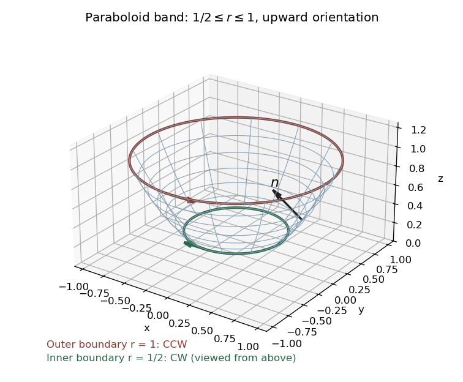

<h1 id="10a/solution">Solution</h1>

↑ **Parent:** [10A](../10a.md)

For an oriented piecewise [smooth surface](../../../../../smooth-surface.md) $S$ and a [continuously differentiable](../../../../../continuously-differentiable-function.md) [vector field](../../../../../vector-field.md), [Stokes theorem](../../../../../stokes-theorem.md) states

$$
\int_S(\nabla\times B)\cdot n\,dS
=\oint_{\partial S}B\cdot dr,
$$

where the [boundary orientation](../../../../../boundary-orientation.md) is induced by $n$ through the [right-hand rule](../../../../../right-hand-rule.md). Choose the upward orientation of the [elliptic paraboloid](../../../../../elliptic-paraboloid.md). Its band has [cylindrical radius](../../../../../cylindrical-radius.md) $1/2\leq r\leq1$, and a parametrization is

$$
X(r,\varphi)=(r\cos\varphi,r\sin\varphi,r^2),
\qquad 0\leq\varphi<2\pi.
$$

Its [oriented surface element](../../../../../oriented-surface-element.md) and scalar area element are

$$
\boxed{d\mathbf S=(X_r\times X_\varphi)\,dr\,d\varphi
=(-2r^2\cos\varphi,-2r^2\sin\varphi,r)\,dr\,d\varphi,}
$$

$$
dS=r\sqrt{1+4r^2}\,dr\,d\varphi.
$$

The requested sketch shows the open band, not a capped solid.

**[Figure 2](#10a/image-upward-oriented-annular-paraboloid-band-with-counterclockwise-outer-boundary-and-clockwise-inner-boundary). Upward-oriented annular paraboloid band, with counterclockwise outer boundary and clockwise inner boundary**.

For the specified [vector field](../../../../../vector-field.md), direct [differentiation](../../../../../differentiation.md) gives $\nabla\times B=(0,0,3x^2+3y^2)$. Hence

$$
I=\int_0^{2\pi}\int_{1/2}^1 3r^3\,dr\,d\varphi
=\boxed{\frac{45\pi}{32}}.
$$

To check this by [Stokes theorem](../../../../../stokes-theorem.md), parametrize a counterclockwise circle of radius $\rho$ at height $\rho^2$ by $r_\rho(\varphi)=(\rho\cos\varphi,\rho\sin\varphi,\rho^2)$. Along it $dz=0$, and

$$
B\cdot dr_\rho
=\rho^4(\sin^4\varphi+\cos^4\varphi)\,d\varphi.
$$

Using $\int_0^{2\pi}\sin^4\varphi\,d\varphi =\int_0^{2\pi}\cos^4\varphi\,d\varphi=3\pi/4$ gives $3\pi\rho^4/2$. The induced outer circle is counterclockwise as viewed from above, and the inner circle is clockwise. Therefore

$$
I=\oint_{C_1}B\cdot dr-\oint_{C_{1/2}}B\cdot dr
=\frac{3\pi}{2}\left(1-\frac1{16}\right)
=\boxed{\frac{45\pi}{32}}.
$$

This verifies the direct [surface integral](../../../../../surface-integral.md) and the [Stokes flux through an annular paraboloid](../../../../../stokes-flux-through-an-annular-paraboloid.md). Reversing the chosen surface orientation reverses the final sign.

## ↑ Ancestors (10)

1. [10A](../10a.md)
2. [Paper 3](../../paper-3-split.md)
3. [Ia](../../split.md)
4. [2005](../../../split.md)
5. [Past exam of the mathematics course of the University of Cambridge](../../../../split.md)
6. [Mathematics course of the University of Cambridge](../../../../../mathematics-course-of-the-university-of-cambridge.md)
7. [Course of the University of Cambridge](../../../../../course-of-the-university-of-cambridge.md)
8. [University of Cambridge](../../../../../university-of-cambridge-split.md)
9. [List of universities](../../../../../list-of-universities.md)
10. [Codex Wiki](../../../../../split.md)
