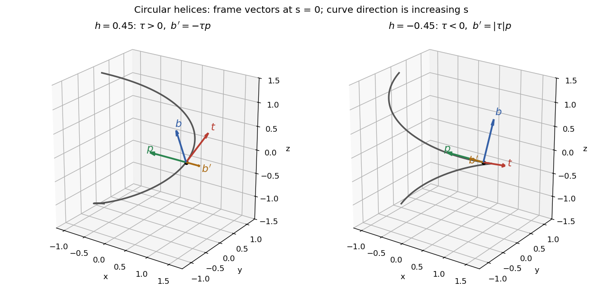

<h1 id="4a/solution">Solution</h1>

↑ **Parent:** [4A](../4a.md)

For the unit-speed [curve](../../../../../curve.md), the [unit tangent vector](../../../../../unit-tangent-vector.md), [curvature of a space curve](../../../../../curvature-of-a-space-curve.md), [principal normal vector](../../../../../principal-normal-vector.md) and [binormal vector](../../../../../binormal-vector.md) are

$$
\boxed{t=\gamma',\qquad \kappa=|\gamma''|,\qquad
p=\frac{\gamma''}{|\gamma''|},\qquad b=t\times p.}
$$

Differentiating $t\cdot t=1$ gives $t\cdot\gamma''=0$, so $t,p,b$ form a positively oriented [orthonormal basis](../../../../../orthonormal-basis.md). The hypothesis $\gamma''\ne0$ makes the [principal normal vector](../../../../../principal-normal-vector.md) well-defined.

To determine the sign of the [torsion of a space curve](../../../../../torsion-of-a-curve.md) without relying on a pictorial handedness convention, take $R>0$, $h\ne0$, $L=\sqrt{R^2+h^2}$ and use the unit-speed [circular helix](../../../../../circular-helix.md)

$$
\gamma_h(s)=\bigl(R\cos(s/L),\,R\sin(s/L),\,hs/L\bigr).
$$

Writing $u=s/L$, direct [differentiation](../../../../../differentiation.md) gives its [Frenet frame](../../../../../frenet-frame.md):

$$
\begin{aligned}
t&=\frac1L(-R\sin u,R\cos u,h),&
p&=(-\cos u,-\sin u,0),\\
b&=\frac1L(h\sin u,-h\cos u,R),&
b'&=\frac h{L^2}(\cos u,\sin u,0).
\end{aligned}
$$

Consequently

$$
\boxed{\kappa=\frac R{R^2+h^2},\qquad
\tau=-b'\cdot p=\frac h{R^2+h^2}.}
$$

At $s=0$ the marked point is $(R,0,0)$, with $t=(0,R/L,h/L)$, $p=(-1,0,0)$, $b=(0,-h/L,R/L)$ and $b'=(h/L^2,0,0)$. For $h>0$, $b'$ points opposite to $p$ and the [torsion of a space curve](../../../../../torsion-of-a-curve.md) is positive. Replacing $h$ by $-h$ reflects the [circular helix](../../../../../circular-helix.md) across the horizontal plane and makes the [torsion of a space curve](../../../../../torsion-of-a-curve.md) negative; then $b'$ points in the same direction as $p$. The direction of increasing $s$ is fixed in both panels.

**[Figure 1](#4a/image-unit-speed-circular-helices-of-opposite-torsion-with-tangent-principal-normal-binormal-and-binormal-derivative-at-the-marked-point). Unit-speed circular helices of opposite torsion, with tangent, principal normal, binormal and binormal derivative at the marked point**.

## ↑ Ancestors (10)

1. [4A](../4a.md)
2. [Paper 3](../../paper-3-split.md)
3. [Ia](../../split.md)
4. [2005](../../../split.md)
5. [Past exam of the mathematics course of the University of Cambridge](../../../../split.md)
6. [Mathematics course of the University of Cambridge](../../../../../mathematics-course-of-the-university-of-cambridge.md)
7. [Course of the University of Cambridge](../../../../../course-of-the-university-of-cambridge.md)
8. [University of Cambridge](../../../../../university-of-cambridge-split.md)
9. [List of universities](../../../../../list-of-universities.md)
10. [Codex Wiki](../../../../../split.md)
