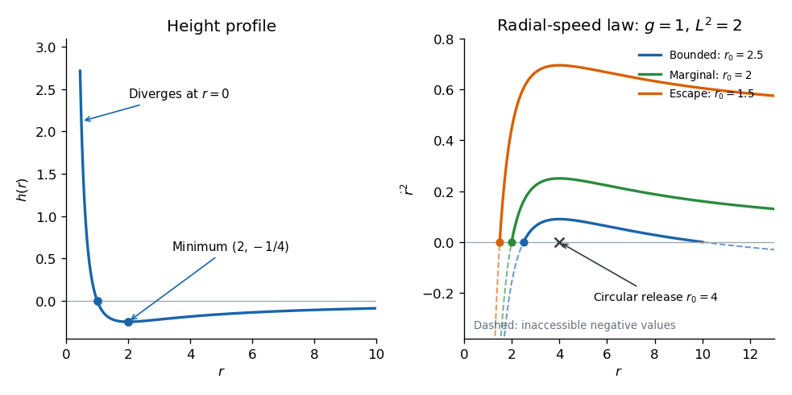

<h1 id="11c/solution">Solution</h1>

↑ **Parent:** [11C](../11c.md)

For a particle constrained to $z=h(x,y)$, the [kinetic energy](../../../../../kinetic-energy.md) and [potential energy](../../../../../potential-energy.md) are

$$
T=\frac m2\left[|\dot{\mathbf r}|^2+(\nabla h\cdot\dot{\mathbf r})^2\right],\qquad V=mgh.
$$

In the stipulated gentle-surface small-slope approximation, the second kinetic term is higher order. The leading [Euler-Lagrange equations](../../../../../euler-lagrange-equation.md) for $T-V$ therefore give the [small-slope particle motion on a height graph](../../../../../small-slope-particle-motion-on-a-height-graph.md):

$$
\boxed{\ddot{\mathbf r}=-g\nabla h.}
$$

This is also the small-slope component of gravity along the surface, with $\sin\phi\simeq\tan\phi$. Geometric acceleration terms must remain negligible at the speeds considered; the approximation is not asserted for arbitrarily fast motion on a sharply curved surface.

For $h=\alpha x^2$, the equations are $\ddot x+2g\alpha x=0$, $\ddot y=0$. If $\alpha>0$, put $\omega=\sqrt{2g\alpha}$. For arbitrary initial data the motion is

$$
\boxed{x=x_0\cos\omega t+\frac{v_{x0}}\omega\sin\omega t,\qquad y=y_0+v_{y0}t.}
$$

It is [simple harmonic motion](../../../../../simple-harmonic-motion.md) across the trough and uniform motion along it. If $\alpha=0$, both coordinates move uniformly; if $\alpha<0$, the same formula uses $\cosh(\sqrt{-2g\alpha}\,t)$ and $\sinh(\sqrt{-2g\alpha}\,t)/\sqrt{-2g\alpha}$ instead.

For the radial height profile, $h(r)=(1-r)/r^2$ is positive for $r<1$, zero at $1$, and negative for $r>1$. Its derivative is $(r-2)/r^3$, so the minimum is $h(2)=-1/4$. It diverges to positive infinity as $r\downarrow0$ and tends to $0$ from below as $r\to\infty$. The requested profile sketch is shown below.

The equations in [polar coordinates](../../../../../polar-coordinates.md) in the planar approximation are

$$
\ddot r-r\dot\theta^2=\frac{2g}{r^3}-\frac g{r^2},\qquad
r\ddot\theta+2\dot r\dot\theta=0.
$$

Multiplying the second equation by $r$ gives $d(r^2\dot\theta)/dt=0$. Thus the specific [angular momentum](../../../../../angular-momentum.md) $L=r^2\dot\theta$ is conserved, and

$$
\ddot r=\frac{L^2+2g}{r^3}-\frac g{r^2}.
$$

At release with negligible radial velocity, the initial specific [kinetic energy](../../../../../kinetic-energy.md) is indeed

$$
\boxed{E_0=\frac12r_0^2\dot\theta_0^2=\frac{L^2}{2r_0^2}.}
$$

It is not the total energy. Put $A=L^2+2g$. The conserved specific total [energy](../../../../../energy.md) and [effective potential](../../../../../effective-potential.md) are

$$
\mathcal E=\frac12\dot r^2+V_{{\rm eff}}(r),\qquad
V_{{\rm eff}}(r)=\frac A{2r^2}-\frac gr,\qquad
\mathcal E=\frac A{2r_0^2}-\frac g{r_0}.
$$

The [radial turning points for an inverse-square height well](../../../../../radial-turning-points-for-an-inverse-square-height-well.md) follow from

$$
\boxed{\dot r^2=2\mathcal E+\frac{2g}{r}-\frac A{r^2}
=\frac{(r-r_0)[Ar_0+(A-2gr_0)r]}{r^2r_0^2}.}
$$

As a function of $r$, this expression tends to $-\infty$ at zero, has its maximum at $r=A/g$, and tends to $2\mathcal E$ at infinity. Only regions where it is nonnegative are dynamically accessible. If $\mathcal E<0$, there are two positive turning radii,

$$
r_0,\qquad r_1=\frac{Ar_0}{2gr_0-A},
$$

and the radial coordinate is confined between them. They merge at $r_0=A/g$, the circular orbit. If $\mathcal E=0$, the particle escapes to arbitrarily large radius with radial speed tending to zero; if $\mathcal E>0$, it escapes with positive limiting radial speed. Consequently the bounded-orbit condition, including the circular case, is

$$
\boxed{\mathcal E<0\quad\Longleftrightarrow\quad 2gr_0>L^2+2g.}
$$

The circular release is at $r_0=2+L^2/g$. For $A/(2g)<r_0<A/g$, the release point is the smaller turning radius; for $r_0>A/g$, it is the larger one. These statements concern the prescribed planar small-slope model. The literal surface is steep near its central singularity, so that approximation must be valid along the particular orbit under consideration.

**[Figure 2](#11c/image-radial-height-profile-and-radial-speed-squared-curves-for-bounded-marginal-and-escaping-small-slope-puck-trajectories). Radial height profile and radial-speed-squared curves for bounded, marginal and escaping small-slope puck trajectories**.

## ↑ Ancestors (10)

1. [11C](../11c.md)
2. [Paper 4](../../paper-4-split.md)
3. [Ia](../../split.md)
4. [2005](../../../split.md)
5. [Past exam of the mathematics course of the University of Cambridge](../../../../split.md)
6. [Mathematics course of the University of Cambridge](../../../../../mathematics-course-of-the-university-of-cambridge.md)
7. [Course of the University of Cambridge](../../../../../course-of-the-university-of-cambridge.md)
8. [University of Cambridge](../../../../../university-of-cambridge-split.md)
9. [List of universities](../../../../../list-of-universities.md)
10. [Codex Wiki](../../../../../split.md)
