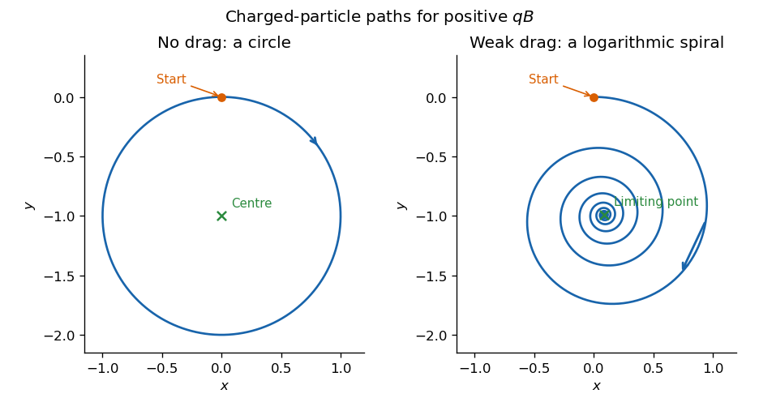

<h1 id="9c/solution">Solution</h1>

↑ **Parent:** [9C](../9c.md)

Put $\kappa=qB/m$, retaining its sign. The [Lorentz force](../../../../../lorentz-force.md) equations are

$$
\ddot x=\kappa\dot y,\qquad \ddot y=-\kappa\dot x,\qquad \ddot z=0.
$$

Thus $z=0$ remains invariant when $z(0)=\dot z(0)=0$. Also $d|\dot{\mathbf r}|^2/dt=2\dot{\mathbf r}\cdot\ddot{\mathbf r}=0$, since a vector is perpendicular to its cross product with the [magnetic field](../../../../../magnetic-field.md). Choose the initial planar [velocity](../../../../../velocity.md) along the positive $x$ axis and the initial location at $(0,0)$. Integration gives

$$
\dot x=u_0\cos\kappa t,\quad\dot y=-u_0\sin\kappa t,\qquad
x=\frac{u_0}{\kappa}\sin\kappa t,\quad y=\frac{u_0}{\kappa}(\cos\kappa t-1).
$$

This is a [circle](../../../../../circle.md) centred at $(0,-u_0/\kappa)$ with radius $u_0/|\kappa|$. The [cyclotron frequency](../../../../../cyclotron-frequency.md) is $|qB|/m$. Equivalently, choosing this centre as the polar origin gives

$$
\boxed{r=\frac{mu_0}{|qB|},\qquad \dot\theta=-\frac{qB}{m},\qquad z=0.}
$$

The rotation is clockwise viewed from positive $z$ when $qB>0$, and reverses when $qB<0$. In the PDF hint, $\dot r=\ddot r=0$ are radial conditions with this centred origin; they do not require zero particle velocity. If $qB=0$, the limiting motion is a straight line instead.

With [linear drag](../../../../../linear-drag.md), put $a=\mu/m>0$. The governing equations for [damped cyclotron motion](../../../../../damped-cyclotron-motion.md) become

$$
\ddot x=\kappa\dot y-a\dot x,\qquad
\ddot y=-\kappa\dot x-a\dot y,\qquad \ddot z=-a\dot z.
$$

Taking the scalar product with the velocity gives $\tfrac12d|\dot{\mathbf r}|^2/dt=-a|\dot{\mathbf r}|^2$, hence

$$
\boxed{|\dot{\mathbf r}(t)|=u_0e^{-\mu t/m}.}
$$

For the planar path, let $w=\dot x+i\dot y$ and $\zeta=x+iy$. Then $\dot w=-(a+i\kappa)w$, so for arbitrary initial planar data

$$
w=w_0e^{-(a+i\kappa)t},\qquad
\zeta=\zeta_0+\frac{w_0}{a+i\kappa}\bigl(1-e^{-(a+i\kappa)t}\bigr).
$$

Let $\zeta_\infty=\zeta_0+w_0/(a+i\kappa)$. The position relative to this limiting point is

$$
\boxed{\zeta-\zeta_\infty=-\frac{w_0}{a+i\kappa}e^{-at}e^{-i\kappa t}.}
$$

Its radius shrinks exponentially while its angle rotates uniformly: the path is a [logarithmic spiral](../../../../../logarithmic-spiral.md) into $\zeta_\infty$, not a succession of circles about the original vacuum guiding centre. The weak-drag assumption is $\mu\ll|qB|$, so many revolutions occur before appreciable contraction.

**[Figure 1](#9c/image-undamped-circular-and-weakly-damped-logarithmic-spiral-charged-particle-paths-in-a-uniform-magnetic-field). Undamped circular and weakly damped logarithmic-spiral charged-particle paths in a uniform magnetic field**.

## ↑ Ancestors (10)

1. [9C](../9c.md)
2. [Paper 4](../../paper-4-split.md)
3. [Ia](../../split.md)
4. [2005](../../../split.md)
5. [Past exam of the mathematics course of the University of Cambridge](../../../../split.md)
6. [Mathematics course of the University of Cambridge](../../../../../mathematics-course-of-the-university-of-cambridge.md)
7. [Course of the University of Cambridge](../../../../../course-of-the-university-of-cambridge.md)
8. [University of Cambridge](../../../../../university-of-cambridge-split.md)
9. [List of universities](../../../../../list-of-universities.md)
10. [Codex Wiki](../../../../../split.md)
