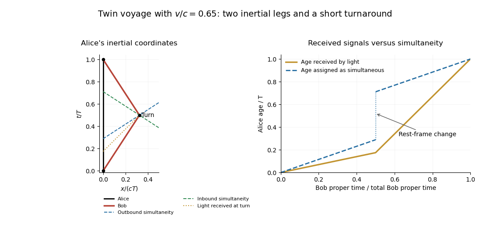

<h1 id="7g/solution">Solution</h1>

↑ **Parent:** [7G](../7g.md)

Set $T=\Delta t_A$, $\beta=v/c$ and $\gamma=(1-\beta^2)^{-1/2}$. In Alice's inertial coordinates the departure, turn and return events are $(t,x)=(0,0)$, $(T/2,vT/2)$ and $(T,0)$. Alice's [worldline](../../../../../world-line.md) is vertical; Bob's consists of two straight timelike segments of slopes $dx/dt=\pm v$, joined by the short turnaround. Equal speeds and the same endpoints give equal coordinate durations on the two legs.

The Minkowski proper-time element for Bob is $d\tau=\sqrt{1-v^2/c^2}\,dt$, while Alice at rest has $d\tau=dt$. Integrating on both legs gives

$$
\boxed{\Delta t_B=\frac T\gamma=\sqrt{1-v^2/c^2}\,\Delta t_A.}
$$

Acceleration itself need not cause a large direct change in the clock rate. Its role is to make Bob change inertial frames and reunite with Alice, so the two worldlines have different proper lengths between the same events.

To describe Bob's assignment of Alice's age, apply [relativity of simultaneity](../../../../../relativity-of-simultaneity.md) to lines of equal coordinate time in his instantaneous inertial frames. At the turn the outbound line is $t-vx/c^2=T(1-\beta^2)/2$; it intersects Alice at $t_-=T(1-\beta^2)/2$. The inbound line is $t+vx/c^2=T(1+\beta^2)/2$ and intersects her at $t_+=T(1+\beta^2)/2$. Thus the negligibly short change of rest frame advances Bob's assigned Alice age by $t_+-t_-=\beta^2T$. On each inertial leg he assigns Alice an aging rate $1/\gamma$ per unit of his own [proper time](../../../../../proper-time.md), but the frame dependence expressed by [relativity of simultaneity](../../../../../relativity-of-simultaneity.md) removes the apparent symmetric-time-dilation paradox.

If “sees” means clocks read from received light, there is no instantaneous jump in Alice's displayed age. A light signal received at Bob's event was emitted from Alice at $t_e=t-|x|/c$. On the outbound leg $t_e=(1-\beta)t$; on the inbound leg $t_e=(1+\beta)t-\beta T$. Consequently the observed aging rates per Bob [proper time](../../../../../proper-time.md) are

$$
\frac{dt_e}{d\tau}=\gamma(1-\beta)=\sqrt{\frac{1-\beta}{1+\beta}}\quad\text{outbound},\qquad
\frac{dt_e}{d\tau}=\gamma(1+\beta)=\sqrt{\frac{1+\beta}{1-\beta}}\quad\text{inbound}.
$$

He receives slowly running, redshifted clock signals on the outward leg and rapidly running, blueshifted signals on the return. Integrating both rates over the equal proper durations $T/(2\gamma)$ gives total received Alice aging $T$, with the two expressions [continuous](../../../../../continuous-function.md) at the turn.

**[Figure 1](#7g/image-twin-voyage-inertial-worldlines-turnaround-simultaneity-lines-and-alice-ages-assigned-or-optically-received-by-bob). Twin voyage: inertial worldlines, turnaround simultaneity lines, and Alice ages assigned or optically received by Bob**.

The diagram distinguishes the reassignment due to [relativity of simultaneity](../../../../../relativity-of-simultaneity.md) from the [continuous](../../../../../continuous-function.md) optical observation; both descriptions give the same ages when the twins meet again.

## ↑ Ancestors (10)

1. [7G](../7g.md)
2. [Paper 2](../../paper-2-split.md)
3. [Ib](../../split.md)
4. [2005](../../../split.md)
5. [Past exam of the mathematics course of the University of Cambridge](../../../../split.md)
6. [Mathematics course of the University of Cambridge](../../../../../mathematics-course-of-the-university-of-cambridge.md)
7. [Course of the University of Cambridge](../../../../../course-of-the-university-of-cambridge.md)
8. [University of Cambridge](../../../../../university-of-cambridge-split.md)
9. [List of universities](../../../../../list-of-universities.md)
10. [Codex Wiki](../../../../../split.md)
