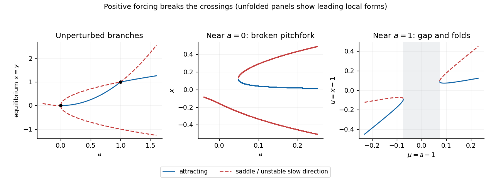
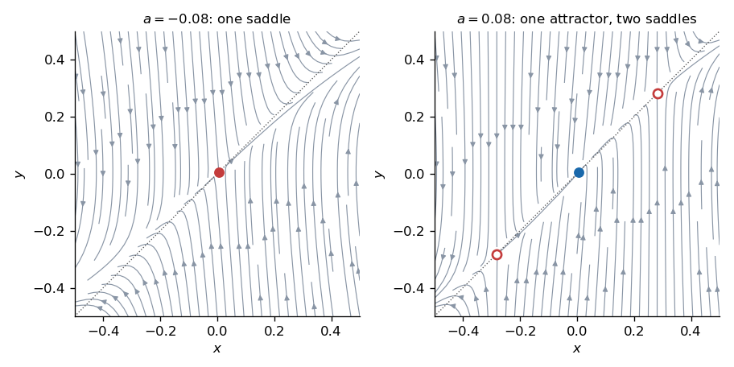

<h1 id="14b/solution">Solution</h1>

↑ **Parent:** [14B](../14b.md)

At a [fixed point](../../../../../fixed-point.md) $y=x$, and the first equation factors. The branches are

$$
\boxed{x=y=a^2\quad(a\in\mathbb R),\qquad x=y=\pm\sqrt a\quad(a\ge0).}
$$

The three branches meet at $a=0$, and the positive square-root branch meets the quadratic branch at $a=1$. The [Jacobian matrix](../../../../../jacobian-matrix.md) at a general [fixed point](../../../../../fixed-point.md) is

$$
J=\begin{pmatrix}-2x(a^2-x)&x^2-a\\1&-1\end{pmatrix}.
$$

On $x=a^2$, its trace is $-1$ and [determinant](../../../../../determinant.md) $a-a^4=a(1-a^3)$: the branch is attracting for $0<a<1$ and a saddle for $a<0$ or $a>1$. On $x=\pm\sqrt a$, the [eigenvalues](../../../../../eigenvalue.md) are $-1$ and $2a(1\mp a^{3/2})$. The negative branch is always a saddle for $a>0$; the positive branch is a saddle for $0<a<1$ and attracting for $a>1$. At the bifurcation values the zero [eigenvalue](../../../../../eigenvalue.md) requires the nonlinear analysis below.

For $a=1+\mu$, $u=x-1$, $v=y-x$, the equations are

$$
\dot u=(\mu-2u-u^2)(2\mu-u-v+\mu^2),\qquad\dot v=-v-\dot u,\qquad\dot\mu=0.
$$

The extended [centre manifold](../../../../../center-manifold.md) has $v=h(u,\mu)$ with no linear terms. Since $h_u\dot u$ has degree at least three, its invariance equation to degree two is $0=-h_2-(2\mu^2-5\mu u+2u^2)$. Thus

$$
\boxed{v=-2\mu^2+5\mu u-2u^2+O((|u|+|\mu|)^3),\qquad\dot u=2u^2-5\mu u+2\mu^2+O(3).}
$$

The reduced quadratic factors as $(u-2\mu)(2u-\mu)$. Its two roots have reduced [eigenvalues](../../../../../eigenvalue.md) $3\mu$ and $-3\mu$, respectively, and the transverse [eigenvalue](../../../../../eigenvalue.md) remains negative. They exchange [stability](../../../../../stability-of-a-numerical-method.md) at $\mu=0$, a [transcritical bifurcation](../../../../../transcritical-bifurcation.md). The exact branches have $u=2\mu+\mu^2$ and $u=\mu/2-\mu^2/8+\cdots$, consistent with this second-order evolution equation.

Near $a=0$, the slow equation has leading form $\dot x=x^3-ax$, so this is a [subcritical pitchfork bifurcation](../../../../../subcritical-pitchfork-bifurcation.md) with the parameter orientation displayed. For $a<0$ there is one nearby saddle, whose unstable direction is close to $y=x$ and stable direction close to vertical. For $a>0$ the central branch is attracting and the outer two equilibria near $\pm\sqrt a$ are saddles; their separatrices distinguish attraction toward the central equilibrium from departure outwards. The actual central location is $(a^2,a^2)$, not exactly the origin away from $a=0$.

Adding positive $\varepsilon$ breaks the pitchfork symmetry. The leading equilibrium equation near zero is $x^3-ax+\varepsilon=0$: the diagram unfolds into a single branch plus a saddle-node pair, with the latter appearing for positive $a$ of order $\varepsilon^{2/3}$. More precisely the fold is at $x=(\varepsilon/2)^{1/3}$, $a=3(\varepsilon/2)^{2/3}$ at leading order. Near one the reduced equation becomes $2u^2-5\mu u+2\mu^2+\varepsilon=0$. Its discriminant is $9\mu^2-8\varepsilon$; the crossing is replaced by **two saddle-node endpoints with a no-equilibrium gap** for $|\mu|<\sqrt{8\varepsilon}/3$ to leading order. Outside that gap, the lower reduced root is stable and the upper one unstable. These local approximations describe the sketch; the exact perturbed curves have higher-order corrections.

**[Figure 3](#14b/image-fixed-point-branches-local-phase-portraits-and-the-positive-forcing-unfoldings-of-the-pitchfork-and-transcritical-bifurcations). Fixed-point branches, local phase portraits and the positive-forcing unfoldings of the pitchfork and transcritical bifurcations**.

**[Figure 4](#14b/image-nearby-planar-flows-on-either-side-of-the-subcritical-pitchfork-with-exact-equilibrium-locations). Nearby planar flows on either side of the subcritical pitchfork, with exact equilibrium locations**.

## ↑ Ancestors (10)

1. [14B](../14b.md)
2. [Paper 1](../../paper-1-split.md)
3. [Ii](../../split.md)
4. [2005](../../../split.md)
5. [Past exam of the mathematics course of the University of Cambridge](../../../../split.md)
6. [Mathematics course of the University of Cambridge](../../../../../mathematics-course-of-the-university-of-cambridge.md)
7. [Course of the University of Cambridge](../../../../../course-of-the-university-of-cambridge.md)
8. [University of Cambridge](../../../../../university-of-cambridge-split.md)
9. [List of universities](../../../../../list-of-universities.md)
10. [Codex Wiki](../../../../../split.md)
