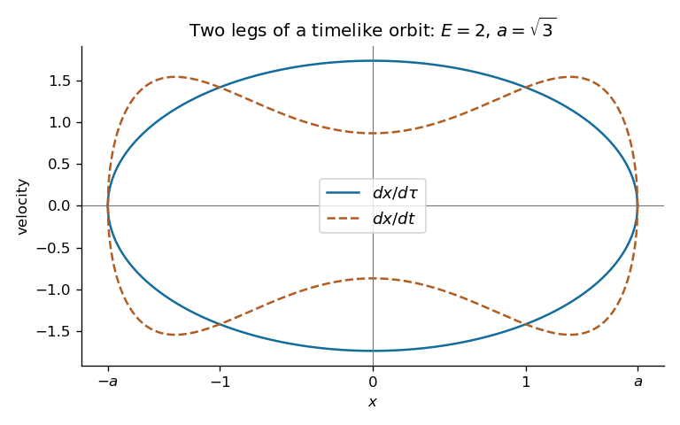

<h1 id="35c/solution">Solution</h1>

↑ **Parent:** [35C](../35c.md)

Stationarity gives the conserved [Killing energy](../../../../../killing-energy.md) per unit rest [mass](../../../../../mass.md) $E=(1+x^2)\dot t$, where dots here denote proper-time [derivatives](../../../../../derivative.md). It measures [energy](../../../../../energy.md) relative to the time-translation Killing field; a static local observer measures $E/\sqrt{1+x^2}$. Timelike normalization is

$$
\frac{\dot x^2}{1+x^2}-(1+x^2)\dot t^2=-1.
$$

Eliminating $\dot t$ and setting $a^2=E^2-1$ gives

$$
\boxed{\dot t=\frac{E}{1+x^2},\qquad\dot x=\pm\sqrt{a^2-x^2}.}
$$

Thus, on each increasing/decreasing leg respectively, $d\tau=\pm dx/\sqrt{a^2-x^2}$ and $dt=\pm E\,dx/[(1+x^2)\sqrt{a^2-x^2}]$. The printed positive [differentials](../../../../../differential-of-a-smooth-map.md) describe the increasing leg, not both legs at once. Differentiation along a leg gives $\ddot x=-x$, extending smoothly through the turning points. Hence $x=a\sin(\tau-\tau_0)$ and **the proper-time period is $2\pi$**.

The requested [velocity](../../../../../velocity.md) sketches are the branches $\dot x=\pm\sqrt{a^2-x^2}$ and $dx/dt=\pm(1+x^2)\sqrt{a^2-x^2}/E$. They share the turning points and opposite signs on the two legs; their speed ratio is $(1+x^2)/E$, smaller than one near zero and larger than one near the endpoints. The supplied [integral](../../../../../integral.md) is the coordinate time from $-a$ to $a$, equal to $\pi$. The return leg takes the same time, so **the coordinate-time period is also $2\pi$**.

**[Figure 5](#35c/image-proper-time-and-coordinate-time-velocity-branches-of-the-bounded-timelike-geodesic). Proper-time and coordinate-time velocity branches of the bounded timelike geodesic**.

For the perturbed metric the same Killing conservation gives $\dot t=E/(1+x^2)$, and normalization becomes $(1+f(x))^2\dot x^2=a^2-x^2$. Since $1+f>0$,

$$
\boxed{d\tau=\pm\frac{1+f(x)}{\sqrt{a^2-x^2}}\,dx,\qquad dt=\pm\frac{E[1+f(x)]}{(1+x^2)\sqrt{a^2-x^2}}\,dx.}
$$

Both weights without $f$ are even in $x$. Oddness of $f$ makes its [integral](../../../../../integral.md) over the symmetric excursion $[-a,a]$ vanish. Each increasing leg therefore still takes $\pi$ in either clock; the decreasing leg takes the same [integrals](../../../../../integral.md) with reversed orientation. **Both periods remain exactly $2\pi$**, although the proper-time waveform is no longer generally sinusoidal. This is the [odd radial perturbations preserve timelike-geodesic periods](../../../../../odd-radial-perturbations-preserve-timelike-geodesic-periods.md) mechanism. Smoothness of the metric and positivity of $1+f$ ensure regular turning and monotone coordinate time.

## ↑ Ancestors (10)

1. [35C](../35c.md)
2. [Paper 1](../../paper-1-split.md)
3. [Ii](../../split.md)
4. [2005](../../../split.md)
5. [Past exam of the mathematics course of the University of Cambridge](../../../../split.md)
6. [Mathematics course of the University of Cambridge](../../../../../mathematics-course-of-the-university-of-cambridge.md)
7. [Course of the University of Cambridge](../../../../../course-of-the-university-of-cambridge.md)
8. [University of Cambridge](../../../../../university-of-cambridge-split.md)
9. [List of universities](../../../../../list-of-universities.md)
10. [Codex Wiki](../../../../../split.md)
