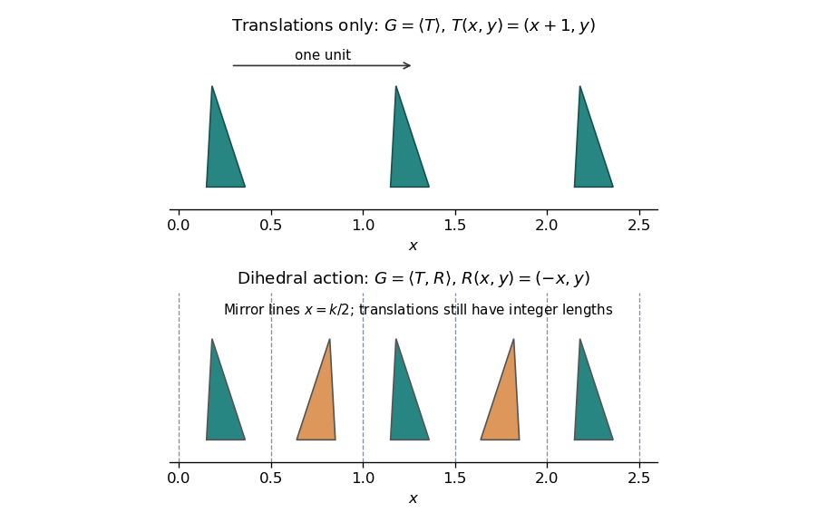

<h1 id="3g/solution">Solution</h1>

↑ **Parent:** [3G](../3g.md)

A [discrete subgroup](../../../../../discrete-subgroup.md) of the [Euclidean isometry](../../../../../euclidean-isometry.md) group has the identity isolated in the group topology. Equivalently, no sequence of distinct group elements converges to the identity; translating neighbourhoods then isolates every element. Such a [subgroup](../../../../../subgroup.md) is closed, and its intersection with any compact subset is finite: otherwise two elements of a convergent sequence would have quotient tending to the identity.

Write each [Euclidean isometry](../../../../../euclidean-isometry.md) uniquely as $x\mapsto Qx+b$, $Q\in O(2)$. Its linear part gives the [group homomorphism](../../../../../group-homomorphism.md) $G\to O(2)$, since the linear part of a composite is the product of the linear parts. Its kernel is exactly the [translation subgroup](../../../../../translation-subgroup.md) $G_T$. The translation [vectors](../../../../../vector.md) form a discrete additive [subgroup](../../../../../subgroup.md) $L\subset\mathbb R^2$.

If $L\ne\{0\}$, choose a shortest nonzero [vector](../../../../../vector.md) $a$, possible by discreteness and finiteness in compact balls. On its line, Euclidean division of a scalar coefficient by one proves $L\cap\mathbb Ra=\mathbb Za$: a nonzero remainder would be shorter than $a$. If all [vectors](../../../../../vector.md) are collinear, this finishes the proof. Otherwise orient the perpendicular coordinate so some [vector](../../../../../vector.md) has positive height. Reduce every [vector](../../../../../vector.md)'s component along $a$ modulo $a$ into a bounded interval. Among [vectors](../../../../../vector.md) with positive height at most that of a chosen [vector](../../../../../vector.md), these reduced representatives lie in a compact rectangle and are finite. Choose $b$ with the smallest such positive height. Subtracting an integer multiple of $b$ from any [vector](../../../../../vector.md) of $L$ reduces its height into $[0,b_\perp)$; minimality makes the remainder's height zero, so it is an integer multiple of $a$. Thus

$$
\boxed{L=\{0\},\quad\mathbb Za,\quad\text{or }\mathbb Za+\mathbb Zb\text{ with }a,b\text{ linearly independent}.}
$$

This derives the rank-at-most-two [translation lattice](../../../../../translation-lattice.md) rather than assuming every [discrete subgroup](../../../../../discrete-subgroup.md) of the plane is a full lattice.

Two examples with $G_T\cong\mathbb Z$ are the group generated by $T(x,y)=(x+1,y)$ alone, and the [infinite dihedral group](../../../../../infinite-dihedral-group.md) generated by $T$ together with $R(x,y)=(-x,y)$. The latter has $RTR=T^{-1}$; its elements are translations $T^k$ and reflections $T^kR$, whose mirror lines are $x=k/2$. The first group preserves the orientation of every translated motif; the second also reverses it across these mirrors.

**[Figure 1](#3g/image-translation-only-and-dihedral-plane-isometry-groups-with-a-rank-one-translation-subgroup). Translation-only and dihedral plane-isometry groups with a rank-one translation subgroup**.

## ↑ Ancestors (10)

1. [3G](../3g.md)
2. [Paper 1](../../paper-1-split.md)
3. [Ii](../../split.md)
4. [2005](../../../split.md)
5. [Past exam of the mathematics course of the University of Cambridge](../../../../split.md)
6. [Mathematics course of the University of Cambridge](../../../../../mathematics-course-of-the-university-of-cambridge.md)
7. [Course of the University of Cambridge](../../../../../course-of-the-university-of-cambridge.md)
8. [University of Cambridge](../../../../../university-of-cambridge-split.md)
9. [List of universities](../../../../../list-of-universities.md)
10. [Codex Wiki](../../../../../split.md)
