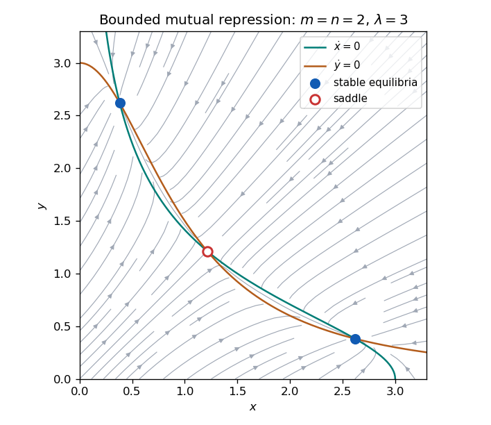

<h1 id="6e/a/solution">Solution</h1>

↑ **Parent:** [A](../a.md)

The [nullclines](../../../../../../nullcline.md) are $x=f(y)$ and $y=g(x)$, both decreasing curves in the positive quadrant. To their left/right the horizontal [velocity](../../../../../../velocity.md) is respectively positive/negative; below/above the second [nullcline](../../../../../../nullcline.md) the vertical [velocity](../../../../../../velocity.md) is positive/negative. Bounded positive synthesis functions give an inward-pointing sufficiently large rectangle, while the axes point into the quadrant. More directly, put $H(x)=f(g(x))-x$: $H(0)>0$, and $H(x)<0$ for large enough $x$. Continuity therefore gives a positive equilibrium.

At an equilibrium, the [Jacobian matrix](../../../../../../jacobian-matrix.md) is $J=\bigl(\begin{smallmatrix}-1&f'(y_*)\\g'(x_*)&-1\end{smallmatrix}\bigr)$, with [eigenvalues](../../../../../../eigenvalue.md) $-1\pm\sqrt{f'(y_*)g'(x_*)}$. Its logarithmic-slope product is

$$
\frac{y_*f'(y_*)}{f(y_*)}\frac{x_*g'(x_*)}{g(x_*)}=f'(y_*)g'(x_*),
$$

because $f(y_*)=x_*$ and $g(x_*)=y_*$. Thus a product exceeding one makes this equilibrium a saddle and gives $H'(x_*)>0$. Immediately on its left $H<0$, and immediately on its right $H>0$. Since $H(0)>0$ and $H$ is eventually negative, there must be other roots on both sides, crossing in the attracting direction. For simple roots those have $H'<0$, hence two negative Jacobian [eigenvalues](../../../../../../eigenvalue.md): **the saddle separates at least two stable steady-state alternatives**. The divergence is $-2$, so periodic attractors cannot replace these equilibria in a bounded planar region. Nongeneric flat crossings or intervals of equilibria require a nonlinear [stability](../../../../../../stability-of-a-numerical-method.md) interpretation; the strict saddle inequality alone does not guarantee that every other root is hyperbolic. This is the usual [mutual repression stability criterion](../../../../../../mutual-repression-stability-criterion.md) behind [bistability](../../../../../../bistability.md).

The conclusion also has a nonlinear trapping justification. Choose $l<u$ on the left of the saddle with $H(l)>0>H(u)$; such endpoints exist by the signs just proved. The rectangle $[l,u]\times[g(u),g(l)]$ is forward invariant: on the vertical edges, $f(y)-l\ge f(g(l))-l>0$ and $f(y)-u\le f(g(u))-u<0$, while the horizontal-edge velocities point inward or are tangent. The same construction on the right of the saddle gives a second disjoint trapping rectangle. Each contains a nonempty compact attracting invariant set, obtained by intersecting its nested forward images; strict vertical inwardness also rules out invariant boundary trajectories. If a downward crossing is isolated, endpoints can be taken arbitrarily close to it, proving nonlinear [stability](../../../../../../stability-of-a-numerical-method.md), and the absence of periodic orbits makes nearby trajectories converge to that equilibrium. Intervals of equilibria instead give attracting alternatives consisting of families, so bounded monotone functions without nondegeneracy do not necessarily produce two isolated hyperbolic attractors.

**[Figure 2](#6e/a/image-nullclines-flow-directions-and-two-stable-equilibria-separated-by-a-saddle-in-a-bounded-mutual-repression-model). Nullclines, flow directions and two stable equilibria separated by a saddle in a bounded mutual-repression model**.

## ↑ Ancestors (11)

1. [A](../a.md)
2. [6E](../../6e.md)
3. [Paper 1](../../../paper-1-split.md)
4. [Ii](../../../split.md)
5. [2005](../../../../split.md)
6. [Past exam of the mathematics course of the University of Cambridge](../../../../../split.md)
7. [Mathematics course of the University of Cambridge](../../../../../../mathematics-course-of-the-university-of-cambridge.md)
8. [Course of the University of Cambridge](../../../../../../course-of-the-university-of-cambridge.md)
9. [University of Cambridge](../../../../../../university-of-cambridge-split.md)
10. [List of universities](../../../../../../list-of-universities.md)
11. [Codex Wiki](../../../../../../split.md)
