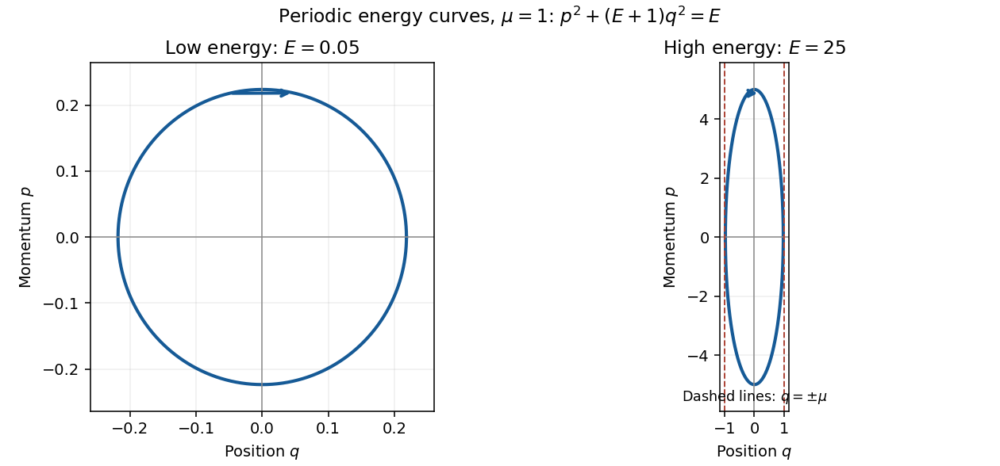

<h1 id="15c/ii/solution">Solution</h1>

↑ **Parent:** [Ii](../ii.md)

The energy equation rearranges to $p^2+(E+1)q^2=E\mu^2$, an ellipse with semiaxes $p_0=\mu\sqrt E$ and $q_0=\mu\sqrt{E/(E+1)}$. At low energy it is nearly circular with both radii $\mu\sqrt E$; at high energy it is tall and thin, with $q_0\to\mu$ while $p_0$ grows. The area enclosed is $\pi p_0q_0$, so

$$
\boxed{I(E)=\frac{\mu^2E}{2\sqrt{E+1}},\qquad T(E)=\frac{\pi\mu^2(E+2)}{2(E+1)^{3/2}}.}
$$

Consequently $T\sim\pi\mu^2/(2\sqrt E)=\boxed{\pi\mu^3/(2p_0)}$ at high energy.

**[Figure 1](#15c/ii/image-energy-ellipses-for-the-one-dimensional-hamiltonian-at-low-and-high-energy-with-mu-equal-to-one). Energy ellipses for the one-dimensional Hamiltonian at low and high energy, with mu equal to one**.

## ↑ Ancestors (11)

1. [Ii](../ii.md)
2. [15C](../../15c.md)
3. [Paper 3](../../../paper-3-split.md)
4. [Ii](../../../split.md)
5. [2005](../../../../split.md)
6. [Past exam of the mathematics course of the University of Cambridge](../../../../../split.md)
7. [Mathematics course of the University of Cambridge](../../../../../../mathematics-course-of-the-university-of-cambridge.md)
8. [Course of the University of Cambridge](../../../../../../course-of-the-university-of-cambridge.md)
9. [University of Cambridge](../../../../../../university-of-cambridge-split.md)
10. [List of universities](../../../../../../list-of-universities.md)
11. [Codex Wiki](../../../../../../split.md)
