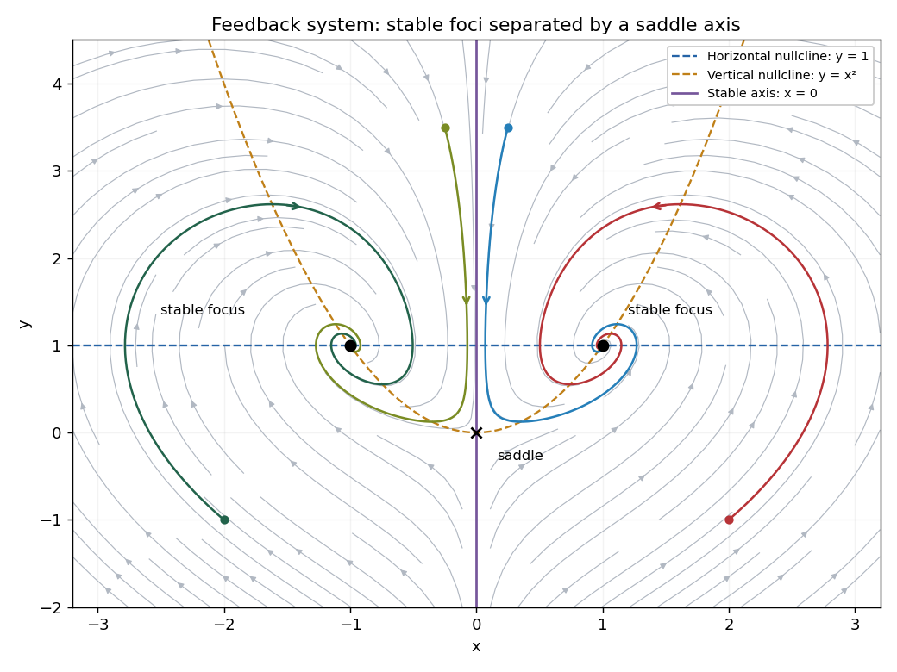

# Paper 4

↑ **Parent:** [Ii](../ii.md)

[https://www.maths.cam.ac.uk/undergrad/pastpapers/files/2005/PaperII_4.pdf](https://www.maths.cam.ac.uk/undergrad/pastpapers/files/2005/PaperII_4.pdf)

**Table of contents**

- [1H](#1h)
  - [Solution](#1h/solution)
  - [i](#1h/i)
    - [Solution](#1h/i/solution)
  - [ii](#1h/ii)
    - [Solution](#1h/ii/solution)
- [2F](#2f)
  - [i](#2f/i)
    - [Solution](#2f/i/solution)
  - [ii](#2f/ii)
    - [Solution](#2f/ii/solution)
- [3G](#3g)
  - [Solution](#3g/solution)
- [4J](#4j)
  - [Solution](#4j/solution)
- [5I](#5i)
  - [Solution](#5i/solution)
- [6E](#6e)
  - [a](#6e/a)
    - [i](#6e/a/i)
      - [Solution](#6e/a/i/solution)
    - [ii](#6e/a/ii)
      - [Solution](#6e/a/ii/solution)
  - [b](#6e/b)
    - [iii](#6e/b/iii)
      - [Solution](#6e/b/iii/solution)
  - [c](#6e/c)
    - [Solution](#6e/c/solution)
- [7B](#7b)
  - [Solution](#7b/solution)
- [8A](#8a)
  - [Solution](#8a/solution)
- [9C](#9c)
  - [Solution](#9c/solution)
  - [i](#9c/i)
    - [Solution](#9c/i/solution)
  - [ii](#9c/ii)
    - [Solution](#9c/ii/solution)
- [10D](#10d)
  - [a](#10d/a)
    - [Solution](#10d/a/solution)
  - [b](#10d/b)
    - [Solution](#10d/b/solution)
  - [c](#10d/c)
    - [Solution](#10d/c/solution)
- [11H](#11h)
  - [a](#11h/a)
    - [Solution](#11h/a/solution)
  - [b](#11h/b)
    - [Solution](#11h/b/solution)
- [12G](#12g)
  - [Solution](#12g/solution)
- [13I](#13i)
  - [i](#13i/i)
    - [Solution](#13i/i/solution)
  - [ii](#13i/ii)
    - [Solution](#13i/ii/solution)
  - [iii](#13i/iii)
    - [Solution](#13i/iii/solution)
- [14A](#14a)
  - [Solution](#14a/solution)
- [15D](#15d)
  - [Solution](#15d/solution)
- [16F](#16f)
  - [Solution](#16f/solution)
- [17F](#17f)
  - [Solution](#17f/solution)
- [18G](#18g)
  - [i](#18g/i)
    - [Solution](#18g/i/solution)
  - [ii](#18g/ii)
    - [Solution](#18g/ii/solution)
- [19G](#19g)
  - [i](#19g/i)
    - [Solution](#19g/i/solution)
  - [ii](#19g/ii)
    - [Solution](#19g/ii/solution)
- [20G](#20g)
  - [Solution](#20g/solution)
- [21H](#21h)
  - [Solution](#21h/solution)
- [22F](#22f)
  - [Solution](#22f/solution)
- [23H](#23h)
  - [Solution](#23h/solution)
- [24H](#24h)
  - [i](#24h/i)
    - [Solution](#24h/i/solution)
  - [ii](#24h/ii)
    - [Solution](#24h/ii/solution)
  - [iii](#24h/iii)
    - [Solution](#24h/iii/solution)
- [25J](#25j)
  - [Solution](#25j/solution)
- [26I](#26i)
  - [a](#26i/a)
    - [Solution](#26i/a/solution)
  - [b](#26i/b)
    - [Solution](#26i/b/solution)
  - [c](#26i/c)
    - [Solution](#26i/c/solution)
- [27I](#27i)
  - [i](#27i/i)
    - [Solution](#27i/i/solution)
  - [ii](#27i/ii)
    - [Solution](#27i/ii/solution)
- [28J](#28j)
  - [a](#28j/a)
    - [Solution](#28j/a/solution)
  - [b](#28j/b)
    - [Solution](#28j/b/solution)
  - [c](#28j/c)
    - [Solution](#28j/c/solution)
  - [d](#28j/d)
    - [i](#28j/d/i)
      - [Solution](#28j/d/i/solution)
    - [ii](#28j/d/ii)
      - [Solution](#28j/d/ii/solution)
    - [iii](#28j/d/iii)
      - [Solution](#28j/d/iii/solution)
- [29I](#29i)
  - [Solution](#29i/solution)
- [30C](#30c)
  - [Solution](#30c/solution)
- [31A](#31a)
  - [Solution](#31a/solution)
- [32D](#32d)
  - [Solution](#32d/solution)
- [33B](#33b)
  - [Solution](#33b/solution)
- [34D](#34d)
  - [Solution](#34d/solution)
- [35B](#35b)
  - [Solution](#35b/solution)
- [36C](#36c)
  - [Solution](#36c/solution)
- [37E](#37e)
  - [Solution](#37e/solution)
- [38E](#38e)
  - [Solution](#38e/solution)
- [39A](#39a)
  - [a](#39a/a)
    - [Solution](#39a/a/solution)
  - [b](#39a/b)
    - [Solution](#39a/b/solution)

## 1H

↑ **Parent:** [Paper 4](paper-4.md)

<h3 id="1h/solution">Solution</h3>

↑ **Parent:** [1H](#1h)

An odd composite integer $n>1$ coprime to $b$ is a [Fermat pseudoprime](../../../number-theory.md#fermat-pseudoprime) to base $b$ if $b^{n-1}\equiv1\pmod n$. A [Carmichael number](../../../number-theory.md#carmichael-number) is a composite integer satisfying this congruence for every integer $b$ coprime to $n$. The [Korselt criterion](../../../number-theory.md#korselt-criterion) says that a composite $n$ is a [Carmichael number](../../../number-theory.md#carmichael-number) exactly when it is [squarefree](../../../number-theory.md#squarefree-integer) and $p-1$ divides $n-1$ for every [prime](../../../number-theory.md#prime-number) divisor $p$ of $n$.

<h3 id="1h/i">i</h3>

↑ **Parent:** [1H](#1h)

<h4 id="1h/i/solution">Solution</h4>

↑ **Parent:** [I](#1h/i)

By the [Korselt criterion](../../../number-theory.md#korselt-criterion), the [prime](../../../number-theory.md#prime-number) factors are distinct. There cannot be just one [prime](../../../number-theory.md#prime-number) factor, since a [Carmichael number](../../../number-theory.md#carmichael-number) is composite. If there were exactly two, write $n=pq$ with $p<q$. Then $q-1\mid pq-1=p(q-1)+(p-1)$, so $q-1\mid p-1$, impossible because $0<p-1<q-1$. Hence **at least three distinct [prime](../../../number-theory.md#prime-number) factors are necessary**.

<h3 id="1h/ii">ii</h3>

↑ **Parent:** [1H](#1h)

<h4 id="1h/ii/solution">Solution</h4>

↑ **Parent:** [Ii](#1h/ii)

The [prime factorization](../../../number-theory.md#fundamental-theorem-of-arithmetic) is $561=3\cdot11\cdot17$, so it is composite and [squarefree](../../../number-theory.md#squarefree-integer). Moreover $3-1=2$, $11-1=10$ and $17-1=16$ all divide $560=561-1$. The [Korselt criterion](../../../number-theory.md#korselt-criterion) therefore proves that **561 is a [Carmichael number](../../../number-theory.md#carmichael-number)**.

## 2F

↑ **Parent:** [Paper 4](paper-4.md)

<h3 id="2f/i">i</h3>

↑ **Parent:** [2F](#2f)

<h4 id="2f/i/solution">Solution</h4>

↑ **Parent:** [I](#2f/i)

The complex [Taylor theorem](../../../calculus.md#taylor-theorem) says that an [analytic function](../../../complex-analysis.md#space-of-holomorphic-functions) has the expansion

$$
f(z)=\sum_{m=0}^{\infty}\frac{f^{(m)}(z_0)}{m!}(z-z_0)^m
$$

throughout every disk centred at $z_0$ contained in $D$. In particular it converges for $|z-z_0|<\operatorname{dist}(z_0,\mathbb C\setminus D)$, and uniformly on every smaller closed disk. The coefficients are uniquely its [derivatives](../../../calculus.md#derivative) divided by factorials. The convergence radius can be larger if the function extends beyond the boundary of $D$; the theorem does not say that the given domain determines its exact radius.

<h3 id="2f/ii">ii</h3>

↑ **Parent:** [2F](#2f)

<h4 id="2f/ii/solution">Solution</h4>

↑ **Parent:** [Ii](#2f/ii)

An elementary geometric-series construction suffices, without assuming a general polynomial-approximation theorem. Rotate the square by a multiple of $\pi/2$ so that $\Re w>1$. Put $c=-R$ with $R>0$. Every point of the square then satisfies $|z-c|^2\le(R+1)^2+1$, whereas

$$
|w-c|^2-\bigl[(R+1)^2+1\bigr]
=2R(\Re w-1)+|w|^2-2>0
$$

for sufficiently large $R$. Thus the whole square lies inside a disk centred at $c$ whose radius is less than $|w-c|$. The other three ways $w$ can lie outside the square are handled by the indicated rotations, after which rotating back preserves [polynomial](../../../polynomial.md) form.

Now expand

$$
\frac1{z-w}
=-\frac1{w-c}\frac1{1-(z-c)/(w-c)}
=-\sum_{j=0}^{\infty}\frac{(z-c)^j}{(w-c)^{j+1}}.
$$

Let $\rho=\max_{z\in K}|z-c|/|w-c|<1$. The tail after degree $m$ is uniformly bounded by $\rho^{m+1}/[|w-c|(1-\rho)]$, tending to zero. Hence the displayed partial sums are the required **uniform [polynomial approximations](../../../uniform-approximation.md#polynomial-approximation)**. This is the [Taylor series](../../../calculus.md#taylor-series) about a carefully chosen distant centre, rather than a potentially inadequate series about $0$.

## 3G

↑ **Parent:** [Paper 4](paper-4.md)

<h3 id="3g/solution">Solution</h3>

↑ **Parent:** [3G](#3g)

Suppose a [connected](../../../geometry-and-topology.md#connected-space) subset $C\subset F$ contains distinct points $a,b$. The distance function $x\mapsto|x-a|$ is $1$-[Lipschitz](../../../real-analysis.md#lipschitz-continuity), and its image on $C$ is [connected](../../../geometry-and-topology.md#connected-space) and contains $0$ and $|b-a|$. It therefore contains the whole interval between those values. A [Lipschitz map](../../../real-analysis.md#lipschitz-continuity) cannot increase [Hausdorff dimension](../../../measure-theory.md#hausdorff-dimension): taking images of arbitrarily fine covers multiplies their diameter powers by at most a fixed constant. Since a nondegenerate interval has [Hausdorff dimension](../../../measure-theory.md#hausdorff-dimension) one, $\dim_H C\ge1$, contradicting $\dim_HF<1$. Thus **every [connected](../../../geometry-and-topology.md#connected-space) subset is a singleton**, so $F$ is [totally disconnected](../../../arithmetic.md#totally-disconnected-space).

A [Möbius transformation](../../../group-theory.md#mobius-transformation) pairs two disks when it maps their boundary circles to one another and takes the exterior of the first disk onto the interior of the second. Two pairs of disks with disjoint interiors give the [ping-pong lemma](../../../geometric-group-theory.md#ping-pong-lemma) construction of a free two-generator group. Tangencies are allowed in the convention suggested by the question; this is often called a [Tangent-disk Schottky group](../../../topological-group.md#tangent-disk-schottky-group), rather than a strictly separated [Schottky group](../../../topological-group.md#schottky-group).

Here is a concrete configuration that also makes the dimension argument precise. Take $A(z)=z+2$ and $B(z)=z/(iz+1)$. The first pairs the half-plane disks $\Re z<-1$ and $\Re z>1$, which are disks on the sphere tangent at infinity. The second pairs $|z-i|<1$ and $|z+i|<1$, tangent at zero; their interiors are also disjoint from the half-plane disks. These pairings give a free discrete [Kleinian group](../../../topological-group.md#kleinian-group) by [ping-pong lemma](../../../geometric-group-theory.md#ping-pong-lemma), with a nonempty open fundamental region.

Set $C=ABA^{-1}B^{-1}$. Conjugating the subgroup generated by $B,C$ by $M(z)=iz/(2-z)$ gives matrices

$$
MBM^{-1}=\begin{pmatrix}1&0\\2&1\end{pmatrix},
\qquad
MCM^{-1}=\begin{pmatrix}-3&2\\-2&1\end{pmatrix}.
$$

The product of the second [matrix](../../../vector-space.md#matrix) with the first is $\begin{pmatrix}1&2\\0&1\end{pmatrix}$. These are the standard parabolic generators of the principal level-two modular group, whose ideal-quadrilateral fundamental region tiles the upper half-plane and whose [Kleinian limit set](../../../topological-group.md#limit-set-of-a-kleinian-group) is the entire extended real line. Consequently the original group's [Kleinian limit set](../../../topological-group.md#limit-set-of-a-kleinian-group) contains the circle $|z-1|=1$, as well as its image under $A$, the distinct tangent circle $|z-3|=1$.

It follows that **the limit set has [Hausdorff dimension](../../../measure-theory.md#hausdorff-dimension) at least one and is not [homeomorphic](../../../topology.md#local-homeomorphism) to a circle**. Indeed a proper subset of a circle cannot itself be a circle: after deleting a missing point it lies in a line, which cannot contain an embedded circle. A space containing two distinct complete circles thus cannot be [homeomorphic](../../../topology.md#local-homeomorphism) to a single circle. This explains why dimension at least one does not force circle topology. The tangent-circle terminology is consistent with the primary discussion of T-Schottky configurations in [https://arxiv.org/pdf/math/0701572](https://arxiv.org/pdf/math/0701572) .

## 4J

↑ **Parent:** [Paper 4](paper-4.md)

<h3 id="4j/solution">Solution</h3>

↑ **Parent:** [4J](#4j)

Reliable transmission at rate $r$ means that there is a sequence of binary block codes of lengths $n$, message counts $M_n$ with $\liminf n^{-1}\log_2M_n\ge r$, and decoding error [probabilities](../../../probability-theory.md#probability) tending to zero. The [Shannon second coding theorem](../../../coding-theory.md#noisy-channel-coding-theorem) identifies the supremum of reliable rates with the [channel capacity](../../../information-theory.md#channel-capacity).

For a [binary symmetric channel](../../../coding-theory.md#binary-symmetric-channel), the [conditional entropy](../../../information-theory.md#conditional-entropy) of the output given any input bit is $h_2(p)=-p\log_2p-(1-p)\log_2(1-p)$. The output [entropy](../../../thermodynamics.md#entropy) is at most one bit and attains one for uniform input, so the maximum [mutual information](../../../information-theory.md#mutual-information) is

$$
\boxed{C=1-h_2(p)}.
$$

All rates strictly below $C$ are achievable, and rates above $C$ are not reliable; this states the supremum without claiming achievability of every boundary rate under every convention.

For very small $p$, the capacity is close to one, with $h_2(p)=p\log_2(1/p)+p/\log 2+O(p^2)$. At $p=1/2$, the output is independent of the input and capacity is zero. For $p>1/2$, flipping every received bit converts the channel to crossover [probability](../../../probability-theory.md#probability) $1-p<1/2$; its capacity is unchanged because $h_2(p)=h_2(1-p)$. At $p=1$ the deterministic bit flip is perfectly reversible.

## 5I

↑ **Parent:** [Paper 4](paper-4.md)

<h3 id="5i/solution">Solution</h3>

↑ **Parent:** [5I](#5i)

The first two commands create [vectors](../../../vector-space.md#vector) of observed successes and corresponding numbers of trials. The next two create the class labels and convert them into an R [factor](../../../statistical-modelling.md#regression-factor), so the labels are treated categorically. The final command fits a [grouped-binomial logistic regression](../../../statistical-modelling.md#grouped-binomial-logistic-regression), using the proportions as responses and trial totals as binomial weights, and prints its summary. The model is $\log[\pi_i/(1-\pi_i)]=\beta_0+\beta_b\mathbf1_{\{S_i=b\}}$, with class a as reference.

The intercept estimates the [log odds](../../../statistical-modelling.md#log-odds) in class a. Its value corresponds to [probability](../../../probability-theory.md#probability) $39/287\approx0.1359$. The class-b coefficient is the estimated increase in [log odds](../../../statistical-modelling.md#log-odds), about $0.4999$, so the fitted [probability](../../../probability-theory.md#probability) in class b is $35/170\approx0.2059$ and the estimated [odds ratio](../../../statistical-modelling.md#odds-ratio) is $e^{0.4999}\approx1.6485$. The printed [standard errors](../../../statistical-inference.md#standard-error) measure uncertainty in these estimated coefficients. The z values are estimate divided by [standard error](../../../statistical-inference.md#standard-error): the intercept tests whether the class-a [probability](../../../probability-theory.md#probability) is $1/2$, while the class-b z value tests equal class [probabilities](../../../probability-theory.md#probability). The two-sided normal-reference [P-value](../../../statistical-modelling.md#p-value) for the latter is about $0.051$, so it is just above a conventional $5\%$ threshold; this is a borderline result rather than strong evidence of a class effect.

The residual [deviance](../../../exponential-family.md#exponential-family-deviance) compares the fitted two-parameter model with the four-probability saturated model. Its value $1.9369$ on $4-2=2$ residual degrees of freedom is small relative to a $\chi_2^2$ reference, with approximate tail [probability](../../../probability-theory.md#probability) $e^{-1.9369/2}\approx0.380$. There is no evidence of lack of fit by that check. Four [Fisher scoring](../../../statistical-modelling.md#scoring-algorithm) iterations were needed for numerical fitting. These interpretations presume independent binomial counts and the usual large-sample approximations; weights here encode trial counts, not extra independent observations.

## 6E

↑ **Parent:** [Paper 4](paper-4.md)

<h3 id="6e/a">a</h3>

↑ **Parent:** [6E](#6e)

<h4 id="6e/a/i">i</h4>

↑ **Parent:** [A](#6e/a)

<h5 id="6e/a/i/solution">Solution</h5>

↑ **Parent:** [I](#6e/a/i)

Set $s=|w|^2$. The exact [Hebbian learning](../../../statistical-learning.md#hebbian-learning) rule gives

$$
\tau\dot s=2w\cdot(yx)=2y^2\ge0.
$$

Thus the [norm](../../../functional-analysis.md#norm) never decreases, and increases whenever the output is nonzero. Because learning is slow relative to input fluctuations, its averaged equation is $\tau\dot w=Cw$, where $C=\langle xx^T\rangle$ is the input second-moment [matrix](../../../vector-space.md#matrix). It is a [covariance matrix](../../../variance.md#covariance-matrix) only if the inputs have zero mean. Diagonalizing the [positive semidefinite matrix](../../../linear-algebra.md#positive-semidefinite-matrix) $C$ gives components $w_j(t)=w_j(0)e^{\lambda_jt/\tau}$. Hence **weights grow without bound whenever the initial [vector](../../../vector-space.md#vector) has a component in an excited positive-eigenvalue direction**. A [vector](../../../vector-space.md#vector) entirely in $\ker C$, or identically zero input, is an important stationary exception.

<h4 id="6e/a/ii">ii</h4>

↑ **Parent:** [A](#6e/a)

<h5 id="6e/a/ii/solution">Solution</h5>

↑ **Parent:** [Ii](#6e/a/ii)

For the modified [Hebbian learning](../../../statistical-learning.md#hebbian-learning) rule,

$$
\tau\dot s=2y^2(1-\alpha s^2).
$$

It increases below $s_*=\alpha^{-1/2}$ and decreases above $s_*$, without crossing that equilibrium. More precisely, for a nonzero initial [norm](../../../functional-analysis.md#norm),

$$
\frac{s(t)-s_*}{s(t)+s_*}
=\frac{s(0)-s_*}{s(0)+s_*}
\exp\!\left[-\frac{4\sqrt\alpha}{\tau}\int_0^t y(u)^2\,du\right].
$$

Under persistent excitation, meaning the integral tends to infinity, this gives

$$
\boxed{|w|\longrightarrow\alpha^{-1/4}}.
$$

Without persistent excitation the limiting [norm](../../../functional-analysis.md#norm) need not reach this value; zero weights remain zero. The [quartic norm stabilization of Hebbian learning](../../../statistical-learning.md#quartic-norm-stabilization-of-hebbian-learning) bounds the [norm](../../../functional-analysis.md#norm) and supplies negative feedback at large amplitudes.

<h3 id="6e/b">b</h3>

↑ **Parent:** [6E](#6e)

<h4 id="6e/b/iii">iii</h4>

↑ **Parent:** [B](#6e/b)

<h5 id="6e/b/iii/solution">Solution</h5>

↑ **Parent:** [Iii](#6e/b/iii)

Averaging the fast fluctuations in $yx=xx^Tw$ gives

$$
\tau\dot w=Cw-|w|^2w,\qquad C=\langle xx^T\rangle.
$$

Thus a nonzero steady [vector](../../../vector-space.md#vector) satisfies

$$
\boxed{Cw=\lambda w,\qquad\lambda=|w|^2}.
$$

Its direction is an [eigenvector](../../../linear-operator-theory.md#eigenvector) of the input second-moment [matrix](../../../vector-space.md#matrix), and its magnitude is the square root of that [eigenvalue](../../../linear-operator-theory.md#eigenvalue). The zero [vector](../../../vector-space.md#vector) is also a steady state and satisfies the displayed relation with $\lambda=0$. This is an averaged steady state; the microscopic fluctuating update need not vanish at each instant.

<h3 id="6e/c">c</h3>

↑ **Parent:** [6E](#6e)

<h4 id="6e/c/solution">Solution</h4>

↑ **Parent:** [C](#6e/c)

Unmodified [Hebbian learning](../../../statistical-learning.md#hebbian-learning) reinforces correlated input and output but has no mechanism limiting synaptic strength. The second rule adds activity-dependent negative feedback and stabilizes the [norm](../../../functional-analysis.md#norm) at an input-scale-independent value, provided the input keeps exciting the output. The third has a cubic weight penalty independent of the instantaneous output; its equilibrium [norm](../../../functional-analysis.md#norm) instead depends on the strength of the input [second moment](../../../probability-theory.md#second-moment).

For the third averaged rule, an equilibrium along [eigenvector](../../../linear-operator-theory.md#eigenvector) $i$ has radial linearized [eigenvalue](../../../linear-operator-theory.md#eigenvalue) $-2\lambda_i/\tau$ and transverse [eigenvalues](../../../linear-operator-theory.md#eigenvalue) $(\lambda_j-\lambda_i)/\tau$. Thus a positive simple largest [eigenvalue](../../../linear-operator-theory.md#eigenvalue) gives stable equilibria in its two opposite directions, whereas lower eigen-directions are unstable to larger components. With generic initial weights, it learns the dominant correlation direction, linking the rule to [principal component analysis](../../../statistical-learning.md#principal-component-analysis). These are idealized normalization and feature-extraction mechanisms, not claims that biological synapses implement these exact equations.

## 7B

↑ **Parent:** [Paper 4](paper-4.md)

<h3 id="7b/solution">Solution</h3>

↑ **Parent:** [7B](#7b)

The [fixed points](../../../function.md#fixed-point) are $(0,0)$ and $(\pm1,1)$. The [Jacobian matrix](../../../calculus.md#jacobian-matrix) is

$$
J(x,y)=\begin{pmatrix}1-y&-x\\2x&-1\end{pmatrix}.
$$

At the origin its [eigenvalues](../../../linear-operator-theory.md#eigenvalue) are $1,-1$, so it is a saddle with stable direction the y-axis. At either other [fixed point](../../../function.md#fixed-point), the characteristic [polynomial](../../../polynomial.md) is $\lambda^2+\lambda+2$, giving [eigenvalues](../../../linear-operator-theory.md#eigenvalue) $(-1\pm i\sqrt7)/2$. Thus both are stable foci. The [nullclines](../../../dynamical-systems.md#nullcline) are $x=0$, $y=1$ and $y=x^2$. In the right half-plane $x$ grows below $y=1$ and decreases above it; in the left half-plane these horizontal arrows reverse. Vertically, $y$ increases below $y=x^2$ and decreases above it.

A global argument determines the requested [omega-limit sets](../../../dynamical-systems.md#omega-limit-set), rather than guessing from the local [phase portrait](../../../dynamical-systems.md#phase-portrait). For $x\ne0$, use the [quadratic-logarithmic Lyapunov function for a feedback system](../../../dynamical-systems.md#quadratic-logarithmic-lyapunov-function-for-a-feedback-system)

$$
L=x^2-1-\log(x^2)+(y-1)^2,\qquad
\dot L=-2(y-1)^2.
$$

Its sublevel sets are [compact](../../../topology.md#compact-space) and bounded away from $x=0$, so trajectories starting in either half-plane exist for all positive time and stay in such a set. Since $L$ decreases, it tends to a limit, and is constant on the [omega-limit set](../../../dynamical-systems.md#omega-limit-set). Every point of that set therefore has $y=1$. Invariance then requires $\dot y=x^2-1=0$, so only the corresponding focus can occur. Also $x(t)=x(0)\exp(\int_0^t(1-y(s))\,ds)$ preserves its sign.

Consequently

$$
\boxed{\omega(2,-1)=\{(1,1)\},\qquad
\omega(x,y)=\{(0,0)\}\ \Longleftrightarrow\ x=0}.
$$

On $x=0$, the exact solution is $y(t)=y(0)e^{-t}$. The [phase portrait](../../../dynamical-systems.md#phase-portrait) below shows this stable axis, the [nullclines](../../../dynamical-systems.md#nullcline) and the spiral attraction in each half-plane.

**[Figure 1](#7b/image-phase-portrait-with-a-saddle-at-the-origin-and-stable-foci-at-plus-or-minus-one-one). Phase portrait with a saddle at the origin and stable foci at plus or minus one, one**.

## 8A

↑ **Parent:** [Paper 4](paper-4.md)

<h3 id="8a/solution">Solution</h3>

↑ **Parent:** [8A](#8a)

At zero an [ordinary point](../../../complex-analysis.md#ordinary-point-criterion-for-a-second-order-equation) requires $p,q$ to be analytic. A [regular singular point](../../../complex-analysis.md#regular-singular-point) requires $zp$ and $z^2q$ to extend analytically to zero, with at least one of $p,q$ failing to be analytic if “singular” excludes [ordinary points](../../../complex-analysis.md#ordinary-point-criterion-for-a-second-order-equation).

Put $\zeta=1/z$ and $v(\zeta)=w(1/\zeta)$. Differentiation gives $w'=-\zeta^2v'$ and $w''=\zeta^4v''+2\zeta^3v'$, so the transformed equation is

$$
v''+\left(\frac2\zeta-\frac{p(1/\zeta)}{\zeta^2}\right)v'
+\frac{q(1/\zeta)}{\zeta^4}v=0.
$$

The point at infinity is ordinary precisely when both transformed coefficients are analytic at $\zeta=0$. Solving these conditions for the original coefficients gives

$$
\boxed{p(z)=2z^{-1}+z^{-2}P(z^{-1}),\qquad q(z)=z^{-4}Q(z^{-1})},
$$

with $P,Q$ analytic near zero; the sign can be absorbed into the arbitrary analytic $P$.

If the only singular point on the sphere is the regular singularity at zero, then $zp(z)$ and $z^2q(z)$ are entire. The condition at infinity makes the first tend to $2$ and the second to $0$. By [Liouville theorem](../../../complex-analysis.md#liouville-theorem) they are respectively the constants $2$ and $0$. Thus the unique equation is

$$
\boxed{w''+\frac2z w'=0},
$$

with general solution $w=A+B/z$. Zero is genuinely regular singular and infinity is ordinary. If “no other singular points” were restricted to finite points only, the general coefficients would instead be $p=P(z)/z$ and $q=Q(z)/z^2$ with entire $P,Q$; the preceding question about infinity indicates the spherical interpretation.

## 9C

↑ **Parent:** [Paper 4](paper-4.md)

<h3 id="9c/solution">Solution</h3>

↑ **Parent:** [9C](#9c)

A one-dimensional [canonical transformation](../../../classical-mechanics.md#canonical-transformation) is a locally invertible change of phase-space variables preserving the symplectic two-form: $dQ\wedge dP=dq\wedge dp$. Equivalently it preserves [Hamilton equations](../../../classical-mechanics.md#hamilton-s-equations) for the transformed [Hamiltonian](../../../classical-mechanics.md#hamiltonian). Expanding the two-form yields

$$
dQ\wedge dP=(Q_qP_p-Q_pP_q)\,dq\wedge dp,
$$

so

$$
\boxed{\{Q,P\}=Q_qP_p-Q_pP_q=1}.
$$

Conversely this Jacobian condition makes the transformation locally invertible and symplectic in two dimensions.

<h3 id="9c/i">i</h3>

↑ **Parent:** [9C](#9c)

<h4 id="9c/i/solution">Solution</h4>

↑ **Parent:** [I](#9c/i)

The [Poisson bracket](../../../classical-mechanics.md#poisson-bracket) is $\{Q,P\}=\alpha q^{\beta-2}$. For it to be identically one on an open region, the exponent must vanish and the coefficient must equal one:

$$
\boxed{\beta=2,\qquad\alpha=1}.
$$

The transformation is defined away from $q=0$, and its inverse there is $q=1/P$, $p=QP^2$.

<h3 id="9c/ii">ii</h3>

↑ **Parent:** [9C](#9c)

<h4 id="9c/ii/solution">Solution</h4>

↑ **Parent:** [Ii](#9c/ii)

Differentiating gives

$$
\{Q,P\}=\alpha\beta q^{2\alpha-1}(\cos^2(\beta p)+\sin^2(\beta p))
=\alpha\beta q^{2\alpha-1}.
$$

Therefore

$$
\boxed{\alpha=\frac12,\qquad\beta=2}.
$$

For real coordinates take $q>0$ and a local branch of the angle. The transformation is locally [canonical transformation](../../../classical-mechanics.md#canonical-transformation) because its determinant is one, but periodicity in $p$ prevents a globally one-to-one map if all real $p$ are retained.

## 10D

↑ **Parent:** [Paper 4](paper-4.md)

<h3 id="10d/a">a</h3>

↑ **Parent:** [10D](#10d)

<h4 id="10d/a/solution">Solution</h4>

↑ **Parent:** [A](#10d/a)

The physical [Jeans length](../../../linear-cosmological-density-perturbation.md#jeans-length) is the wavelength for which pressure and gravity balance:

$$
\boxed{\lambda_J=v_s\sqrt{\frac{\pi}{G\rho_m}}},\qquad
k_J^{\mathrm{phys}}=\frac{\sqrt{4\pi G\rho_m}}{v_s}.
$$

The physical wavelength of the comoving mode is $2\pi a/k$. Modes with wavelength larger than $\lambda_J$ have a gravitationally destabilizing coefficient and can grow; shorter wavelengths are pressure-supported and oscillate, with expansion also damping the motion. A time-dependent background makes the exact growth history depend on the epoch, not just an instantaneous sign. For pressureless matter the [Jeans length](../../../linear-cosmological-density-perturbation.md#jeans-length) vanishes.

<h3 id="10d/b">b</h3>

↑ **Parent:** [10D](#10d)

<h4 id="10d/b/solution">Solution</h4>

↑ **Parent:** [B](#10d/b)

For an [Einstein-de Sitter universe](../../../large-scale-structure-of-the-universe.md#einstein-de-sitter-universe), $H=\dot a/a=2/(3t)$. The flat matter-only [Friedmann equation](../../../cosmology.md#friedmann-equations) $H^2=8\pi G\rho_m/3$ gives $\rho_m=1/(6\pi Gt^2)$. With zero [sound speed](../../../compressible-flow.md#speed-of-sound) the perturbation equation is therefore

$$
\ddot\delta_k+\frac4{3t}\dot\delta_k-\frac2{3t^2}\delta_k=0.
$$

Substituting $t^s$ yields $s(s-1)+4s/3-2/3=0$, or $(3s-2)(s+1)=0$. Hence

$$
\boxed{\delta_k=A_kt^{2/3}+B_kt^{-1}},
$$

with growing mode proportional to the [scale factor](../../../cosmology.md#scale-factor-cosmology) and decaying mode proportional to $t^{-1}$.

<h3 id="10d/c">c</h3>

↑ **Parent:** [10D](#10d)

<h4 id="10d/c/solution">Solution</h4>

↑ **Parent:** [C](#10d/c)

For subhorizon pressureless matter during radiation domination, expansion is too rapid for significant self-gravitating growth. Neglecting the small matter-gravity term gives $\ddot\delta_m+t^{-1}\dot\delta_m\simeq0$, hence a constant plus a logarithm of time; the exact coupled radiation problem supplies the detailed amplitudes. This is the [Mészáros effect](../../../linear-cosmological-density-perturbation.md#meszaros-effect). Modes entering the horizon during radiation domination are suppressed relative to modes entering later, while after equality ordinary matter growth resumes.

The matter [power spectrum](../../../probability-and-statistics.md#power-spectrum) consequently has a turnover near the equality horizon scale $k_{\mathrm{eq}}\sim a_{\mathrm{eq}}H_{\mathrm{eq}}$ in units with $c=1$. Shorter-scale modes retain the radiation-era suppression. This statement concerns cold pressureless matter; baryons coupled to photons also show acoustic effects before recombination.

## 11H

↑ **Parent:** [Paper 4](paper-4.md)

<h3 id="11h/a">a</h3>

↑ **Parent:** [11H](#11h)

<h4 id="11h/a/solution">Solution</h4>

↑ **Parent:** [A](#11h/a)

For the continued-fraction assertion, take the standard [Pell equation](../../../number-theory.md#pell-equation) hypothesis $N>0$ nonsquare. If $(x,y)$ is a solution with $x,y>0$, then

$$
\left|\frac xy-\sqrt N\right|
=\frac1{y^2(x/y+\sqrt N)}<\frac1{2y^2}.
$$

The convergent criterion for [continued fractions](../../../number-theory.md#continued-fraction) therefore makes $x/y$ a convergent to $\sqrt N$. Write its periodic expansion as $[a_0;\overline{a_1,\ldots,a_\ell}]$, and index convergents by $p_j/q_j$ with $p_0/q_0=a_0$. The norm-one convergents occur at $j=k\ell-1$ with $k\ell$ even. In particular the fundamental positive solution comes at $\ell-1$ if $\ell$ is even, and at $2\ell-1$ if it is odd. If $\varepsilon=x_1+y_1\sqrt N>1$ is this least norm-one unit, all integer solutions are represented by $\pm\varepsilon^m$, $m\in\mathbb Z$.

The [abelian group](../../../group.md#abelian-group) law comes from multiplication of the norm-one expressions:

$$
\boxed{(x_0,y_0)\circ(x_1,y_1)
=(x_0x_1+Ny_0y_1,\ x_0y_1+x_1y_0)}.
$$

Their [field norms](../../../algebraic-number-theory.md#field-norm) multiply, so the result remains a solution. Multiplication also proves associativity and commutativity; the identity is $(1,0)$ and the inverse of $(x,y)$ is $(x,-y)$. Cubing gives

$$
\boxed{(x,y)^{\circ3}
=(x^3+3Nxy^2,\ 3x^2y+Ny^3)
=(4x^3-3x,\ (4x^2-1)y)}.
$$

The last form uses $Ny^2=x^2-1$.

For completeness, the assertion about all powers follows by dividing any positive unit by the largest power of $\varepsilon$ not exceeding it: the remainder is a norm-one unit in $[1,\varepsilon)$, and minimality forces it to be $1$. Sign changes and inverses give the remaining solutions. If the phrase “nonsquare integer” includes negative $N$, real [continued fractions](../../../number-theory.md#continued-fraction) do not apply: $x^2+|N|y^2=1$ has only $(\pm1,0)$ except for $N=-1$, when $(0,\pm1)$ also occur. The same multiplication law still works in those finite groups.

<h3 id="11h/b">b</h3>

↑ **Parent:** [11H](#11h)

<h4 id="11h/b/solution">Solution</h4>

↑ **Parent:** [B](#11h/b)

The continued-fraction algorithm gives

$$
\sqrt{11}=3+\frac{\sqrt{11}-3}{1},\qquad
\frac1{\sqrt{11}-3}=\frac{\sqrt{11}+3}{2},\qquad
\frac1{(\sqrt{11}+3)/2-3}=\sqrt{11}+3,
$$

after which the process repeats. Thus

$$
\boxed{\sqrt{11}=[3;\overline{3,6}]}.
$$

The first two convergents are $3/1$ and $10/3$, of [field norms](../../../algebraic-number-theory.md#field-norm) $-2$ and $1$ respectively. The even period gives the fundamental solution

$$
\boxed{x=10,\qquad y=3}.
$$

It is also directly the smallest positive solution: for $y=1,2$, the values $1+11y^2$ are $12,45$, neither square; $y=3$ gives $100$. Cubing by the preceding [Pell equation](../../../number-theory.md#pell-equation) group law gives

$$
\boxed{(10,3)^{\circ3}=(3970,1197)}.
$$

Indeed $3970^2-11\cdot1197^2=1$.

## 12G

↑ **Parent:** [Paper 4](paper-4.md)

<h3 id="12g/solution">Solution</h3>

↑ **Parent:** [12G](#12g)

For $s\ge0$ and $\delta>0$, define the [scale-restricted Hausdorff content](../../../measure-theory.md#scale-restricted-hausdorff-content) at scale $\delta$ by

$$
\mathcal H_\delta^s(F)=\inf\left\{\sum_j(\operatorname{diam}U_j)^s:
F\subset\bigcup_jU_j,\ \operatorname{diam}U_j\le\delta\right\},
$$

using countable covers. The [Hausdorff measure](../../../measure-theory.md#hausdorff-measure) is $\mathcal H^s(F)=\lim_{\delta\downarrow0}\mathcal H_\delta^s(F)$; the limit exists by monotonicity. A conventional dimension-dependent normalizing constant does not change the [Hausdorff dimension](../../../measure-theory.md#hausdorff-dimension)

$$
\dim_HF=\inf\{s:\mathcal H^s(F)=0\}
=\sup\{s:\mathcal H^s(F)=\infty\}.
$$

At $s=0$, a nonempty singleton has contribution one, so the measure counts points.

Let $\mathcal T(K)=\bigcup_{i=1}^kS_i(K)$ and $c=\max_i c_i<1$. For [compact](../../../topology.md#compact-space) nonempty $K,L$, matching a point of $S_i(K)$ with the image of a nearby point of $L$ gives $d_H(\mathcal T K,\mathcal T L)\le c\,d_H(K,L)$. Choose a sufficiently large closed ball $B$ with every $S_i(B)\subset B$. The nonempty [compact sets](../../../topology.md#compact-space) $\mathcal T^m(B)$ are nested, so their intersection $I$ is nonempty and [compact](../../../topology.md#compact-space). The finite union of similarity images commutes with this decreasing [compact](../../../topology.md#compact-space) intersection: a point lying in all unions has some repeated branch index, and compactness supplies a preimage in all the nested sets. Consequently $\mathcal T(I)=I$. If $J$ is another invariant [compact set](../../../topology.md#compact-space), the contraction estimate gives $d_H(I,J)\le c\,d_H(I,J)$, hence $I=J$. This proves existence and uniqueness of the invariant set of a [finite similarity iterated function system](../../../geometry-and-topology.md#finite-similarity-iterated-function-system).

Under the [open set condition](../../../geometry-and-topology.md#open-set-condition), there is a nonempty bounded open set $O$ such that the $S_i(O)$ lie inside $O$ and are pairwise disjoint. The dimension formula is

$$
\boxed{\dim_H I=s,\qquad\sum_i c_i^s=1}.
$$

Overlaps can invalidate this formula if that assumption is omitted.

For the printed template, subdivide the central straight run of length two into its two collinear unit steps. The eight directed steps, before dividing all coordinates by four, have successive vertices

$$
(0,0),(1,0),(1,1),(2,1),(2,0),(2,-1),(3,-1),(3,0),(4,0).
$$

Each step defines a similarity with ratio $1/4$, with rotation matching its direction. The open diamond $O=\{|x-1/2|+|y|<1/2\}$ is an explicit witness for the [open set condition](../../../geometry-and-topology.md#open-set-condition). Its eight image diamonds have radius $1/8$ in the $\ell^1$ metric, lie in $O$, and their centres have pairwise $\ell^1$ distance at least $1/4$; their interiors are therefore disjoint. The [Minkowski sausage](../../../geometry-and-topology.md#minkowski-sausage) dimension is consequently

$$
8(1/4)^s=1,\qquad\boxed{s=\frac32}.
$$

This makes the subdivision convention explicit. If the length-two run were instead treated as one unsplit edge replaced at scale $1/2$, there would be six maps of ratio $1/4$ and one of ratio $1/2$. The same diamond separation works, but the equation becomes $6\,4^{-s}+2^{-s}=1$, giving $s=\log_2 3$, a different fractal. The requested $3/2$ corresponds to the eight-unit-step interpretation.

## 13I

↑ **Parent:** [Paper 4](paper-4.md)

<h3 id="13i/i">i</h3>

↑ **Parent:** [13I](#13i)

<h4 id="13i/i/solution">Solution</h4>

↑ **Parent:** [I](#13i/i)

The density is that of a [Gamma distribution](../../../continuous-probability-distribution.md#gamma-distribution) with shape $\nu>0$ and rate $\nu/\mu_i$, requiring $\mu_i>0$. Direct integration gives

$$
\mathbb E(Y_i^r)
=\left(\frac{\mu_i}{\nu}\right)^r\frac{\Gamma(\nu+r)}{\Gamma(\nu)}
$$

for $\nu+r>0$. Using $\Gamma(\nu+1)=\nu\Gamma(\nu)$ and $\Gamma(\nu+2)=\nu(\nu+1)\Gamma(\nu)$,

$$
\boxed{\mathbb E Y_i=\mu_i,\qquad
\operatorname{var}Y_i=\mu_i^2/\nu}.
$$

<h3 id="13i/ii">ii</h3>

↑ **Parent:** [13I](#13i)

<h4 id="13i/ii/solution">Solution</h4>

↑ **Parent:** [Ii](#13i/ii)

Put $t_i=\beta^Tx_i=1/\mu_i>0$. Up to constants independent of $\beta$, the [log-likelihood](../../../statistical-modelling.md#log-likelihood) is

$$
\ell(\beta)=\nu\sum_i[\log t_i-Y_it_i].
$$

The [score function](../../../statistical-modelling.md#informant-function) and its [derivative](../../../calculus.md#derivative) are

$$
U(\beta)=\nu\sum_i x_i(\mu_i-Y_i),\qquad
\ell''(\beta)=-\nu\sum_i\mu_i^2x_ix_i^T.
$$

Thus an interior [maximum-likelihood estimator](../../../statistical-modelling.md#maximum-likelihood-estimator) solves

$$
\boxed{\sum_i x_i[(\widehat\beta^Tx_i)^{-1}-Y_i]=0}.
$$

For a full-rank design the Hessian is negative definite on the parameter region, so there is at most one interior solution and it is the maximum. A [Newton method](../../../mathematical-optimization.md#newton-s-method-in-optimization), also [Fisher scoring](../../../statistical-modelling.md#scoring-algorithm) here because the observed Hessian equals its expectation, is

$$
\beta_{\rm new}=\beta+
\left(\sum_i\mu_i^2x_ix_i^T\right)^{-1}\sum_i x_i(\mu_i-Y_i).
$$

Recompute the means at every step and use a line search if necessary to keep all $t_i>0$ and increase the [log-likelihood](../../../statistical-modelling.md#log-likelihood). Existence, [identifiability](../../../statistical-model.md#identifiability) and nonsingularity are regularity conditions, not consequences of the density alone.

<h3 id="13i/iii">iii</h3>

↑ **Parent:** [13I](#13i)

<h4 id="13i/iii/solution">Solution</h4>

↑ **Parent:** [Iii](#13i/iii)

The [Fisher information](../../../statistical-modelling.md#fisher-information-matrix) is

$$
I(\beta)=\nu\sum_i\mu_i^2x_ix_i^T
=\nu\begin{pmatrix}a&b\\b&c\end{pmatrix}.
$$

Under standard interior, full-rank and large-sample regularity conditions, the [maximum-likelihood estimator](../../../statistical-modelling.md#maximum-likelihood-estimator) is asymptotically normal with mean $\beta$ and covariance

$$
I(\beta)^{-1}
=\frac1{\nu(ac-b^2)}\begin{pmatrix}c&-b\\-b&a\end{pmatrix}.
$$

Therefore

$$
\boxed{\widehat\beta_2\ \dot\sim\
N\!\left(\beta_2,\frac{a}{\nu(ac-b^2)}\right)}.
$$

The sums already depend on sample size; no extra factor $1/n$ should be inserted. The variance is estimable by substituting fitted means. If all $z_i$ are the same, $ac-b^2=0$ and the two coefficients are not separately identifiable.

## 14A

↑ **Parent:** [Paper 4](paper-4.md)

<h3 id="14a/solution">Solution</h3>

↑ **Parent:** [14A](#14a)

The [Dirichlet series](../../../analytic-number-theory.md#dirichlet-series) for the [Riemann zeta function](../../../analytic-number-theory.md#riemann-zeta-function) converges for $\Re z>1$. In the Hankel [integral representation](../../../calculus.md#integral-representation) the branch is a branch of $t^{z-1}$, so the argument restriction concerns $t$, not the parameter $z$. Use the principal branch cut along the negative real axis and a positive Hankel loop with a fixed small indentation around zero. Its integral $I(z)$ is an entire function of $z$, since the tails have exponential decay and the fixed contour avoids zero. Multiplication by $\Gamma(1-z)/(2\pi i)$ gives the [meromorphic continuation](../../../complex-analysis.md#meromorphic-continuation) of $\zeta$: it is directly defined away from positive integers, has a pole at $1$, and the apparent singularities at $2,3,\ldots$ are interpreted by limits.

For a check in the initial half-plane, collapsing the indentation for $\Re z>1$ gives

$$
I(z)=2i\sin(\pi z)\int_0^\infty\frac{r^{z-1}}{e^r-1}\,dr
=2i\sin(\pi z)\Gamma(z)\zeta(z).
$$

Expansion of $(e^r-1)^{-1}$ into exponentials justifies the last equality there, and the [Gamma reflection formula](../../../complex-analysis.md#gamma-reflection-formula) recovers the printed [integral representation](../../../calculus.md#integral-representation).

Take the upper semicircle contour with the straight segment oriented from left to right, making the total orientation positive. Its enclosed poles are $t=2\pi ij$, $j=1,\ldots,N$; each has [residue](../../../analysis.md#residue) $-(2\pi ij)^{z-1}$. Thus

$$
\boxed{\int_\gamma\frac{t^{z-1}}{e^{-t}-1}\,dt
=-2\pi i(2\pi)^{z-1}e^{i\pi(z-1)/2}\sum_{j=1}^N j^{z-1}}.
$$

The reverse orientation changes the sign.

Initially take $\Re z<0$, so the series on the right converges as $N\to\infty$ and the large arcs can be discarded under the given assumption. Denote by $L_+$ and $L_-$ the integrals along horizontal lines just above and below the real axis, both from left to right. The [residue](../../../analysis.md#residue) computation and its lower-half-plane clockwise counterpart give

$$
L_+=-2\pi i(2\pi i)^{z-1}\zeta(1-z),\qquad
L_-=2\pi i(-2\pi i)^{z-1}\zeta(1-z).
$$

Contour deformation about the negative-axis branch cut gives $I=L_--L_+$. Hence

$$
I(z)=4\pi i(2\pi)^{z-1}\sin(\pi z/2)\zeta(1-z).
$$

Multiplying by $\Gamma(1-z)/(2\pi i)$ yields

$$
\boxed{\zeta(z)=2^z\pi^{z-1}\sin(\pi z/2)\Gamma(1-z)\zeta(1-z)}.
$$

It extends by [meromorphic continuation](../../../complex-analysis.md#meromorphic-continuation) to all $z\ne1$, with removable products evaluated by limits where individual factors diverge. The derivation does not assert ordinary convergence of the original positive-term series outside $\Re z>1$.

## 15D

↑ **Parent:** [Paper 4](paper-4.md)

<h3 id="15d/solution">Solution</h3>

↑ **Parent:** [15D](#15d)

In a large volume, one one-particle state occupies momentum-space volume $h^3/V$. A spherical shell of radius $p$ has volume $4\pi p^2dp$, so for spin degeneracy $g$ the [density of states](../../../statistical-physics.md#density-of-states) is $4\pi gVp^2dp/h^3$. With ultra-relativistic dispersion $E=cp$ and zero [chemical potential](../../../thermodynamics.md#chemical-potential), the [Bose-Einstein distribution](../../../statistical-physics.md#bose-einstein-distribution) gives

$$
\epsilon=\frac{4\pi gc}{h^3}\int_0^\infty\frac{p^3\,dp}{e^{cp/(kT)}-1}
=\frac{4\pi g(kT)^4}{h^3c^3}\int_0^\infty\frac{x^3\,dx}{e^x-1}.
$$

The convergent dimensionless integral is $\pi^4/15$, obtained by expansion into exponentials and summing $\sum n^{-4}$. Therefore **$\epsilon\propto T^4$ and $\alpha=4$**. Photons are massless bosons with two polarizations; equilibrium emission and absorption do not conserve photon number and force $\mu_\gamma=0$.

For recombination, [chemical equilibrium](../../../thermodynamics.md#chemical-equilibrium) imposes $\mu_p+\mu_e=\mu_H+\mu_\gamma=\mu_H$, including rest [energies](../../../classical-mechanics.md#energy) in the [chemical potentials](../../../thermodynamics.md#chemical-potential). Divide the three nonrelativistic number-density expressions to obtain

$$
\frac{n_pn_e}{n_H}
=\frac{g_pg_e}{g_H}\left(\frac{2\pi kT}{h^2}\right)^{3/2}
\left(\frac{m_pm_e}{m_H}\right)^{3/2}e^{-I/(kT)}.
$$

Here $m_pc^2+m_ec^2-m_Hc^2=I$. Neglect the relative proton/hydrogen mass difference and take the ground-state degeneracy ratio $g_pg_e/g_H=1$ ([Electron](../../../physics.md#electron) and proton spins give $2\cdot2$ and hydrogen gives $4$). [Charge neutrality](../../../electromagnetism.md#charge-neutrality) gives $n_p=n_e$. This yields the stated [Saha equation](../../../cosmology.md#saha-ionization-equation)

$$
\boxed{\frac{n_e^2}{n_H}
=\left(\frac{2\pi m_ekT}{h^2}\right)^{3/2}e^{-I/(kT)}}.
$$

With $n_e=X_en_B$ and $n_H=(1-X_e)n_B$, the ratio asked for is

$$
\boxed{\frac{1-X_e}{X_e^2}
=\eta\,16\pi\zeta(3)\left(\frac{kT}{hc}\right)^3
\left(\frac{h^2}{2\pi m_ekT}\right)^{3/2}e^{I/(kT)}}.
$$

Equivalently the prefactor is $16\pi\zeta(3)\eta(2\pi)^{-3/2}[kT/(m_ec^2)]^{3/2}$. Because photons vastly outnumber baryons, even a small high-energy tail can keep hydrogen ionized. Neutralization therefore requires exponential suppression of that tail far below $kT=I$, explaining the much lower recombination temperature. The equilibrium formula is an estimate; the actual expanding-universe recombination kinetics eventually depart from Saha equilibrium.

## 16F

↑ **Parent:** [Paper 4](paper-4.md)

<h3 id="16f/solution">Solution</h3>

↑ **Parent:** [16F](#16f)

The [propositional completeness theorem](../../../mathematical-logic.md#completeness-theorem-for-propositional-logic) states that $\Gamma\models\phi$ if and only if $\Gamma\vdash\phi$. Soundness follows by checking the axioms against truth [valuations](../../../algebra.md#valuation) and noting that [modus ponens rule](../../../mathematical-logic.md#implication-elimination-rule) preserves truth. For completeness, use the [deduction theorem for propositional logic](../../../mathematical-logic.md#deduction-theorem-for-propositional-logic): if $\Gamma\cup\{p\}\vdash q$, then $\Gamma\vdash p\Rightarrow q$. In the usual negation rules this also says that a contradiction from $\Gamma\cup\{p\}$ proves $\Gamma\vdash\neg p$.

First construct a maximal consistent set extending any consistent set $\Delta$. Enumerate all formulas, possible because the primitive propositions are countable. Starting with $\Delta_0=\Delta$, add formula $\psi_n$ at step $n$ if consistency is preserved; otherwise add $\neg\psi_n$. This latter addition is consistent: if both extensions gave contradictions, the [deduction theorem for propositional logic](../../../mathematical-logic.md#deduction-theorem-for-propositional-logic) would prove both $\neg\psi_n$ and $\neg\neg\psi_n$ from $\Delta_n$, a contradiction already in $\Delta_n$. The union $M$ is consistent because a finite proof uses only finitely many newly added premises. It decides every formula: exactly one of $\psi,\neg\psi$ belongs to $M$. It is deductively closed, since an omitted derivable formula would have its negation in $M$, contradicting consistency.

Assign a [valuation](../../../algebra.md#valuation) $v(p)=1$ exactly when the primitive proposition $p$ lies in $M$. Structural induction proves the [maximal consistent set truth lemma](../../../mathematical-logic.md#maximal-consistent-set-truth-lemma) $v(\psi)=1$ if and only if $\psi\in M$. Negation follows from the decision property. For implication, if $\psi\Rightarrow\chi\in M$ and $\psi\in M$, [modus ponens rule](../../../mathematical-logic.md#implication-elimination-rule) gives $\chi\in M$. Conversely, if $\chi\in M$, the elementary implication axioms give $\psi\Rightarrow\chi\in M$. If $\psi\notin M$, then $\neg\psi\in M$, and the usual contradiction rule proves $\psi\Rightarrow\chi$. These two alternatives match the [truth table](../../../mathematical-logic.md#truth-table). The other connectives, if primitive, are handled by their corresponding rules or defined from negation and implication. Thus every consistent set has a [valuation](../../../algebra.md#valuation) satisfying it.

Now suppose $\Gamma\not\vdash\phi$. If $\Gamma\cup\{\neg\phi\}$ were inconsistent, the [deduction theorem for propositional logic](../../../mathematical-logic.md#deduction-theorem-for-propositional-logic) would give $\Gamma\vdash\neg\neg\phi$. **Here the third axiom $\neg\neg\phi\Rightarrow\phi$ is essential:** it would give $\Gamma\vdash\phi$, a contradiction. Hence that extension is consistent and has a satisfying [valuation](../../../algebra.md#valuation). This [valuation](../../../algebra.md#valuation) satisfies $\Gamma$ and falsifies $\phi$, proving the contrapositive of completeness. In this organization of the proof, the explicit classical double-negation elimination occurs in this last consistency step; the construction and truth lemma use the ordinary negation and contradiction rules, not an unmentioned identification of $\neg\neg\phi$ with $\phi$.

The [propositional compactness theorem](../../../mathematical-logic.md#propositional-compactness-theorem) says that a set of formulas is satisfiable exactly when each finite subset is satisfiable. If it were not satisfiable, completeness would make it inconsistent. Its finite contradiction proof uses only a finite subset of premises; soundness makes that subset unsatisfiable. This contradicts the assumed finite satisfiability and proves compactness.

## 17F

↑ **Parent:** [Paper 4](paper-4.md)

<h3 id="17f/solution">Solution</h3>

↑ **Parent:** [17F](#17f)

[Extremal graph theory](../../../graph-theory.md#extremal-graph-theory) asks how many edges a graph can have while avoiding a prescribed subgraph. Define $\operatorname{ex}(n,H)$ as the maximum number of edges of an $n$-vertex simple graph containing no copy of $H$; copies need not be induced. The extremal graph often reveals the structural reason a forbidden configuration must appear.

A complete proof of [Mantel theorem](../../../graph-theory.md#mantel-theorem) illustrates this principle. In a triangle-free graph, the neighborhoods of the endpoints of any edge are disjoint, so $d(u)+d(v)\le n$. Summing over edges gives $\sum_vd(v)^2\le nm$, where $m$ is the edge count. By [Cauchy-Schwarz inequality](../../../probability-and-statistics.md#cauchy-schwarz-inequality),

$$
(2m)^2=\left(\sum_vd(v)\right)^2\le n\sum_vd(v)^2\le n^2m.
$$

Thus $m\le n^2/4$ when $m>0$, and the zero-edge case is immediate. A balanced [complete bipartite graph](../../../graph-theory.md#complete-bipartite-graph) is triangle-free and has $\lfloor n^2/4\rfloor$ edges. Therefore

$$
\boxed{\operatorname{ex}(n,K_3)=\lfloor n^2/4\rfloor}.
$$

The proof links a local forbidden triangle to a global degree inequality.

The general [Turan theorem](../../../graph-theory.md#turan-s-theorem) states that the balanced complete $(r-1)$-partite graph $T_{r-1}(n)$ maximizes the edge count among $K_r$-free graphs. Its leading density is $(1-1/(r-1))n^2/2$. A standard symmetrization explanation is to replace a lower-degree vertex by a twin of a nonadjacent higher-degree vertex: no $K_r$ is created and the edge count does not decrease. Iterating at the level of twin classes produces a [complete multipartite graph](../../../graph-theory.md#complete-multipartite-graph) with at most $r-1$ parts. Moving vertices between parts then balances the part sizes and maximizes the number of cross edges. This provides structural intuition beyond the preceding exact triangle proof.

For any fixed graph $H$ with [chromatic number](../../../graph-theory.md#chromatic-number) $r\ge2$, the [Erdős-Stone theorem](../../../graph-theory.md#erdos-stone-theorem) is

$$
\boxed{\operatorname{ex}(n,H)
=\left(1-\frac1{r-1}+o(1)\right)\frac{n^2}{2}}.
$$

The lower bound is the Turan construction: an $(r-1)$-partite graph cannot contain $H$. To describe the upper-bound proof, fix an edge-density excess above $1-1/(r-1)$. Apply a regularity partition with an error parameter much smaller than that excess and a positive density threshold. Delete irregular and low-density pairs; the resulting reduced graph still has density above the Turan threshold, so it contains $K_r$. The corresponding $r$ vertex classes form pairwise regular, positive-density pairs. The embedding argument successively chooses vertices with large neighborhoods in every remaining class; regularity discards only a small exceptional set at each choice. With the parameters sufficiently small and $n$ sufficiently large, this embeds a complete $r$-partite graph with $|V(H)|$ vertices in each part, and therefore a properly colored copy of $H$. This explains why [chromatic number](../../../graph-theory.md#chromatic-number), rather than the exact shape of $H$, controls the leading quadratic term.

For example $\chi(C_5)=3$, so forbidding a five-cycle still allows asymptotically $n^2/4$ edges, and exceeding that density by any fixed positive fraction eventually forces a five-cycle. For $K_r$ the exact [Turan theorem](../../../graph-theory.md#turan-s-theorem) strengthens the asymptotic statement. For bipartite $H$, the theorem gives only $o(n^2)$, leaving an important finer problem: for example $K_{s,t}$-free graphs have upper bounds of order $n^{2-1/s}$ from counting common neighborhoods. Extremal results consequently range from exact finite bounds to asymptotic density thresholds and stability questions about near-extremal structure.

## 18G

↑ **Parent:** [Paper 4](paper-4.md)

<h3 id="18g/i">i</h3>

↑ **Parent:** [18G](#18g)

<h4 id="18g/i/solution">Solution</h4>

↑ **Parent:** [I](#18g/i)

Let $a=\sqrt{2+\sqrt5}>0$ and $b=i/a$, so $b^2=2-\sqrt5$. The roots are $\pm a,\pm b$. The element $2+\sqrt5$ is not a square in $\mathbb Q(\sqrt5)$: its [field norm](../../../algebraic-number-theory.md#field-norm) is $-1$, whereas the [field norm](../../../algebraic-number-theory.md#field-norm) of a square is a square of a rational number and hence nonnegative. Thus $[\mathbb Q(a):\mathbb Q(\sqrt5)]=2$, and $[\mathbb Q(a):\mathbb Q]=4$. This also proves irreducibility of the quartic.

The [splitting field](../../../galois-theory.md#splitting-field) is $K=\mathbb Q(a,i)$, since $b=i/a$ and $i=ab$. Because $\mathbb Q(a)\subset\mathbb R$, adjoining $i$ doubles the degree:

$$
\boxed{[K:\mathbb Q]=8}.
$$

The [Galois group](../../../galois-theory.md#galois-group) acts faithfully on the four roots and preserves the partition into the two opposite pairs $\{a,-a\}$ and $\{b,-b\}$, possibly interchanging the pairs. The full permutation group preserving this partition has order eight and is the [dihedral group](../../../finite-group-theory.md#dihedral-group) of a square. Since the [Galois group](../../../galois-theory.md#galois-group) has order eight, it is exactly that group. Equivalently its generators can be chosen as $r:a\mapsto b,\ b\mapsto-a$ and complex conjugation $s:a\mapsto a,\ b\mapsto-b$, with $r^4=s^2=1$ and $srs=r^{-1}$.

<h3 id="18g/ii">ii</h3>

↑ **Parent:** [18G](#18g)

<h4 id="18g/ii/solution">Solution</h4>

↑ **Parent:** [Ii](#18g/ii)

The positive roots can be written

$$
a=\frac{\sqrt6+\sqrt2}{2},\qquad
b=\frac{\sqrt6-\sqrt2}{2},
$$

whose squares are $2+\sqrt3$ and $2-\sqrt3$ and whose product is one. Therefore all roots lie in $\mathbb Q(\sqrt2,\sqrt3)$. Conversely $a+b=\sqrt6$ and $a-b=\sqrt2$, giving $\sqrt3=\sqrt6/\sqrt2$ in the [splitting field](../../../galois-theory.md#splitting-field). Hence

$$
\boxed{L=\mathbb Q(\sqrt2,\sqrt3),\qquad[L:\mathbb Q]=4}.
$$

The quadratic fields $\mathbb Q(\sqrt2)$ and $\mathbb Q(\sqrt3)$ are distinct, so the compositum has this degree. Their independent sign changes are four commuting automorphisms, each nonidentity of order two. Thus

$$
\boxed{\operatorname{Gal}(L/\mathbb Q)\cong C_2\times C_2}.
$$

## 19G

↑ **Parent:** [Paper 4](paper-4.md)

<h3 id="19g/i">i</h3>

↑ **Parent:** [19G](#19g)

<h4 id="19g/i/solution">Solution</h4>

↑ **Parent:** [I](#19g/i)

Normalize [Haar measure](../../../measure-theory.md#haar-measure) on $\mathrm{SU}(2)$ to total mass one. For a [continuous](../../../calculus.md#continuous-function) class function $F$, the [Weyl integration formula for SU2](../../../measure-theory.md#weyl-integration-formula-for-su-2) is

$$
\boxed{\int_{\mathrm{SU}(2)}F(g)\,dg
=\frac2\pi\int_0^\pi
F(\operatorname{diag}(e^{i\theta},e^{-i\theta}))\sin^2\theta\,d\theta}.
$$

Equivalently it is $\pi^{-1}\int_0^{2\pi}F(t_\theta)\sin^2\theta\,d\theta$. For arbitrary [continuous](../../../calculus.md#continuous-function) $F$, replace $F(t_\theta)$ on the right by its conjugacy average $\int_{\mathrm{SU}(2)}F(ht_\theta h^{-1})\,dh$.

Here is a direct proof. Identify $\mathrm{SU}(2)$ with unit quaternions, the sphere $S^3$. Multiplication by a unit quaternion is a transformation given by an [orthogonal matrix](../../../linear-algebra.md#orthogonal-matrix) of $\mathbb R^4$, so normalized round volume is bi-invariant and is [Haar measure](../../../measure-theory.md#haar-measure). Write a quaternion as $\cos\theta+\mathbf n\sin\theta$, $0\le\theta\le\pi$, $\mathbf n\in S^2$. The round volume element is $\sin^2\theta\,d\theta\,dA(\mathbf n)$, and the total volume is $2\pi^2$. Conjugation rotates the unit imaginary [vector](../../../vector-space.md#vector) $\mathbf n$, so a class function depends only on $\theta$. Integrating over the sphere of area $4\pi$ gives the factor $4\pi/(2\pi^2)=2/\pi$. The endpoint degeneracies have measure zero. Conjugacy averaging and Haar invariance prove the more general version.

<h3 id="19g/ii">ii</h3>

↑ **Parent:** [19G](#19g)

<h4 id="19g/ii/solution">Solution</h4>

↑ **Parent:** [Ii](#19g/ii)

On the standard two-dimensional [representation](../../../representation-theory.md#group-representation), $t_\theta$ has [eigenvalues](../../../linear-operator-theory.md#eigenvalue) $e^{i\theta},e^{-i\theta}$. Its $m$th [symmetric power](../../../linear-algebra.md#symmetric-power) has monomial basis $X^{m-j}Y^j$, $j=0,\ldots,m$, of weights $m-2j$. The [character](../../../representation-theory.md#character-of-a-representation) is therefore

$$
\boxed{\chi_m(t_\theta)=\sum_{j=0}^m e^{i(m-2j)\theta}
=\frac{\sin((m+1)\theta)}{\sin\theta}}.
$$

The quotient is interpreted by [continuity](../../../calculus.md#continuous-function) at $0,\pi$, where its values are $m+1$ and $(-1)^m(m+1)$.

Apply the [Weyl integration formula for SU2](../../../measure-theory.md#weyl-integration-formula-for-su-2) to the [character](../../../representation-theory.md#character-of-a-representation) product:

$$
\langle\chi_m,\chi_n\rangle
=\frac2\pi\int_0^\pi
\sin((m+1)\theta)\sin((n+1)\theta)\,d\theta
=\delta_{mn}.
$$

The last equality follows directly by product-to-sum integration. A finite-dimensional [representation](../../../representation-theory.md#group-representation) of a [compact](../../../topology.md#compact-space) group decomposes into [irreducibles](../../../representation-theory.md#irreducible-representation), and the squared [character](../../../representation-theory.md#character-of-a-representation) [norm](../../../functional-analysis.md#norm) is the sum of squared multiplicities. Since this [norm](../../../functional-analysis.md#norm) is one, there is exactly one constituent with multiplicity one. Thus **every [symmetric power](../../../linear-algebra.md#symmetric-power) is [irreducible](../../../representation-theory.md#irreducible-representation)**, and the different powers are pairwise inequivalent.

## 20G

↑ **Parent:** [Paper 4](paper-4.md)

<h3 id="20g/solution">Solution</h3>

↑ **Parent:** [20G](#20g)

The factorization form of [Kummer-Dedekind theorem](../../../algebraic-number-theory.md#kummer-dedekind-theorem) is as follows. If $K=\mathbb Q(\theta)$ with $\theta$ integral, minimal [polynomial](../../../polynomial.md) $f$, and $p$ does not divide the index $[\mathcal O_K:\mathbb Z[\theta]]$, factor $\bar f=\prod_i\bar f_i^{e_i}$ into distinct monic [irreducibles](../../../representation-theory.md#irreducible-representation) over $\mathbb F_p$. Then

$$
p\mathcal O_K=\prod_i\mathfrak p_i^{e_i},\qquad
\mathfrak p_i=(p,f_i(\theta)),\qquad
[\mathcal O_K/\mathfrak p_i:\mathbb F_p]=\deg f_i.
$$

The index condition is essential. All integral bases used below make the index one, so it applies to every [prime](../../../number-theory.md#prime-number).

For a [squarefree](../../../number-theory.md#squarefree-integer) quadratic $d\equiv2,3\pmod4$, take $\theta=\sqrt d$, $f=X^2-d$ and field [discriminant](../../../polynomial.md#discriminant) $D=4d$. At an odd [prime](../../../number-theory.md#prime-number), a repeated factor occurs exactly when $p\mid d$, in which case $\bar f=X^2$ and $p\mathcal O_K=(p,\sqrt d)^2$. At $p=2$, reduction is $X^2$ if $d$ is even and $(X+1)^2$ if $d$ is odd, so $2$ is totally ramified in both cases. Thus the totally ramified [primes](../../../number-theory.md#prime-number) are exactly those dividing $4d$.

For $d\equiv1\pmod4$, take $\theta=(1+\sqrt d)/2$, with [polynomial](../../../polynomial.md) $X^2-X+(1-d)/4$ and [discriminant](../../../polynomial.md#discriminant) $D=d$. At an odd [prime](../../../number-theory.md#prime-number) it has a double root exactly when $p\mid d$, giving a single linear factor squared and total ramification. At $p=2$, its [derivative](../../../calculus.md#derivative) is $1$, so no repeated factor occurs. Hence again

$$
\boxed{p\text{ is totally ramified }\Longleftrightarrow p\mid D}.
$$

For the [prime](../../../number-theory.md#prime-number) [cyclotomic field](../../../galois-theory.md#cyclotomic-field), use $\Phi_q(X)=1+X+\cdots+X^{q-1}$. Modulo $q$ this is $(X-1)^{q-1}$, so $q\mathcal O_K=(q,\zeta-1)^{q-1}$, proving total ramification. For $p\ne q$, the [discriminant](../../../polynomial.md#discriminant) has no [prime](../../../number-theory.md#prime-number) factor $p$, so the reduction is [squarefree](../../../number-theory.md#squarefree-integer) and $p$ is unramified. There is an actual exponent error in the printed [discriminant](../../../polynomial.md#discriminant): the correct value is $(-1)^{(q-1)/2}q^{q-2}$, not $q^{q-1}$. To check it, at a nontrivial root $\zeta^j$,

$$
\Phi_q'(\zeta^j)=\frac{q(\zeta^j)^{q-1}}{\zeta^j-1},
$$

and multiplying these [derivatives](../../../calculus.md#derivative) and using $\prod_{j=1}^{q-1}(1-\zeta^j)=q$ gives the exponent $q-2$. The [prime](../../../number-theory.md#prime-number) support is still just $\{q\}$, so the requested ramification conclusion is unaffected.

For $\theta=\sqrt[3]2$, the [integral basis](../../../algebraic-number-theory.md#integral-basis) gives $f=X^3-2$ and $D=-108$. Modulo $2$, $\bar f=X^3$; modulo $3$, $\bar f=(X+1)^3$. Dedekind factorization gives $(2)=(2,\theta)^3$ and $(3)=(3,\theta+1)^3$. For other [primes](../../../number-theory.md#prime-number) the [polynomial](../../../polynomial.md) is [squarefree](../../../number-theory.md#squarefree-integer) because its [discriminant](../../../polynomial.md#discriminant) is not divisible by the [prime](../../../number-theory.md#prime-number). Therefore the equivalence also holds in this cubic field. This is a conclusion for these specific fields, not the false general assertion that every ramified [prime](../../../number-theory.md#prime-number) in every higher-degree number field is totally ramified.

## 21H

↑ **Parent:** [Paper 4](paper-4.md)

<h3 id="21h/solution">Solution</h3>

↑ **Parent:** [21H](#21h)

Use [relative homology](../../../homology.md#relative-homology). Every simplex of $X=B\cup C$ lies in $B$ or $C$, and those lying in both are exactly the simplices of $A$. Consequently inclusion induces a chain-complex [isomorphism](../../../algebra.md#isomorphism)

$$
C_*(B)/C_*(A)\ \cong\ C_*(X)/C_*(C).
$$

It is bijective on the respective bases of simplices and commutes with boundary because it comes from inclusion. Thus

$$
H_j(B,A)\cong H_j(X,C)\quad\text{for every }j.
$$

For any pair $(Y,Z)$, the [long exact sequence in homology](../../../homology.md#long-exact-sequence-in-homology) shows that inclusion induces [isomorphisms](../../../algebra.md#isomorphism) in every degree exactly when $H_j(Y,Z)=0$ for every $j$. To verify both directions, if all relative groups vanish, exactness makes each $H_j(Z)\to H_j(Y)$ injective and surjective. Conversely, if the inclusion maps are [isomorphisms](../../../algebra.md#isomorphism), the map from $H_j(Y)$ into the relative group is zero, while the relative connecting map is injective and has zero image because the next inclusion is injective; hence the relative group itself is zero. This includes degree zero, with the negative-degree ordinary group zero.

Apply the criterion first to $(B,A)$ and then to $(X,C)$ using the chain [isomorphism](../../../algebra.md#isomorphism). It proves

$$
\boxed{H_*A\longrightarrow H_*B\text{ is an isomorphism}
\ \Longleftrightarrow\
H_*C\longrightarrow H_*X\text{ is an isomorphism}}.
$$

## 22F

↑ **Parent:** [Paper 4](paper-4.md)

<h3 id="22f/solution">Solution</h3>

↑ **Parent:** [22F](#22f)

If a [linear map](../../../vector-space.md#linear-map) satisfies $\|Tx\|\le M\|x\|$, then $\|Tx-Tx'\|\le M\|x-x'\|$, so it is [continuous](../../../calculus.md#continuous-function). Conversely [continuity](../../../calculus.md#continuous-function) at zero gives $\delta>0$ such that $\|x\|<\delta$ implies $\|Tx\|<1$. Apply this to $\delta x/(2\|x\|)$ for $x\ne0$ to obtain $\|Tx\|\le2\|x\|/\delta$. Hence **a [linear map](../../../vector-space.md#linear-map) is [continuous](../../../calculus.md#continuous-function) exactly when it is bounded**.

For the separately [continuous](../../../calculus.md#continuous-function) [bilinear map](../../../linear-algebra.md#bilinear-map), put $T_x(y)=F(x,y)$ for $\|x\|\le1$. Every $T_x:Y\to Z$ is a bounded [linear map](../../../vector-space.md#linear-map) by the first result. For each fixed $y$, [continuity](../../../calculus.md#continuous-function) in the other variable gives $\|F(x,y)\|\le C_y\|x\|$, so $\sup_{\|x\|\le1}\|T_xy\|<\infty$. The [Uniform boundedness principle](../../../banach-space.md#uniform-boundedness-principle) therefore gives $\sup_{\|x\|\le1}\|T_x\|=M<\infty$, and bilinearity then yields

$$
\boxed{\|F(x,y)\|\le M\|x\|\|y\|}.
$$

To spell out the uniform-boundedness step, define the closed subsets $E_m=\{y:\sup_{\|x\|\le1}\|T_xy\|\le m\}$ of the [Banach space](../../../banach-space.md) $Y$. They cover $Y$. The [Baire category theorem](../../../topological-analysis.md#baire-category-theorem) gives an $E_m$ containing a ball $B(y_0,r)$. For $\|h\|<r$, both $y_0+h$ and $y_0$ lie in $E_m$, so $\sup_x\|T_xh\|\le2m$. Scaling $h=(r/2)y$ for $\|y\|\le1$ bounds all the operator [norms](../../../functional-analysis.md#norm) by $4m/r$. This proves the claimed uniform estimate without presuming joint [continuity](../../../calculus.md#continuous-function).

## 23H

↑ **Parent:** [Paper 4](paper-4.md)

<h3 id="23h/solution">Solution</h3>

↑ **Parent:** [23H](#23h)

For a nonconstant [holomorphic map](../../../complex-analysis.md#holomorphic-map) $f:X\to Y$ between [compact](../../../topology.md#compact-space) [connected](../../../geometry-and-topology.md#connected-space) [Riemann surfaces](../../../complex-analysis.md#riemann-surfaces), its [degree of a holomorphic map](../../../complex-analysis.md#degree-of-a-holomorphic-map) is the number of preimages of a regular value. More generally it is the constant sum $\sum_{p\in f^{-1}(q)}e_p$, where $e_p$ is the local multiplicity. The [Riemann-Hurwitz formula](../../../complex-analysis.md#riemann-hurwitz-formula) is

$$
2g_X-2=d(2g_Y-2)+\sum_{p\in X}(e_p-1).
$$

Negation is well-defined on the [complex torus](../../../complex-geometry.md#complex-torus) because $-\Lambda=\Lambda$. It is holomorphic with holomorphic inverse itself, so $\psi$ is [biholomorphic](../../../complex-analysis.md#biholomorphism). Its [fixed points](../../../function.md#fixed-point) satisfy $2z\in\Lambda$. If $\Lambda=\mathbb Z\omega_1+\mathbb Z\omega_2$, they are the four distinct classes

$$
\boxed{0,\ \omega_1/2,\ \omega_2/2,\ (\omega_1+\omega_2)/2}.
$$

Away from these points, choose a small coordinate disk $U$ disjoint from $\psi(U)$. The quotient map is a [homeomorphism](../../../topology.md#homeomorphism) from $U$ onto $\pi(U)$, so transfer its complex coordinate to that open set of $S'$. The transition between two such lifted charts is induced either by identity or by $\psi$, hence is holomorphic. These charts give the required Riemann-surface structure, and $\pi$ is locally a holomorphic bijection there.

The quotient has generic degree two. At a [fixed point](../../../function.md#fixed-point), a local coordinate centred there changes under $\psi$ as $u\mapsto-u$. The assumed holomorphic quotient map is invariant under this operation, so its local expansion is even and has multiplicity at least two. Since the total degree is two, it is exactly two. There are no other ramification points. The domain torus has genus one, so [Riemann-Hurwitz formula](../../../complex-analysis.md#riemann-hurwitz-formula) gives

$$
0=2(2g_S-2)+4,\qquad\boxed{g_S=0}.
$$

## 24H

↑ **Parent:** [Paper 4](paper-4.md)

<h3 id="24h/i">i</h3>

↑ **Parent:** [24H](#24h)

<h4 id="24h/i/solution">Solution</h4>

↑ **Parent:** [I](#24h/i)

An [isothermal parametrization](../../../differential-geometry.md#isothermal-coordinates) is an [immersion](../../../differential-geometry.md#immersion) with [first fundamental form](../../../differential-geometry.md#first-fundamental-form) $E\,du^2+2F\,du\,dv+G\,dv^2=\lambda^2(du^2+dv^2)$, where $\lambda>0$. Thus $E=G=\lambda^2$ and $F=0$.

Write $W=\phi_{uu}+\phi_{vv}$. Differentiating the metric identities gives

$$
W\cdot\phi_u=\tfrac12E_u-\tfrac12G_u=0,\qquad
W\cdot\phi_v=-\tfrac12E_v+\tfrac12G_v=0.
$$

For example $\phi_{vv}\cdot\phi_u=(\phi_v\cdot\phi_u)_v-\phi_v\cdot\phi_{uv}=-G_u/2$; the other identities are analogous. Hence $W$ is normal to the surface. For a unit normal $N$, its normal component is $e+g$. The supplied [mean curvature](../../../second-fundamental-form.md#mean-curvature) formula reduces to $H=(e+g)/(2\lambda^2)$. Therefore

$$
\boxed{\phi_{uu}+\phi_{vv}=2\lambda^2HN=2\lambda^2\mathbf H}.
$$

A surface is a [minimal surface](../../../second-fundamental-form.md#minimal-surface) when its [mean curvature](../../../second-fundamental-form.md#mean-curvature) [vector](../../../vector-space.md#vector) vanishes. Since $\lambda^2>0$, the preceding identity proves **minimality is equivalent to $\Delta\phi=0$ in [isothermal coordinates](../../../differential-geometry.md#isothermal-coordinates)**.

<h3 id="24h/ii">ii</h3>

↑ **Parent:** [24H](#24h)

<h4 id="24h/ii/solution">Solution</h4>

↑ **Parent:** [Ii](#24h/ii)

The null condition follows by expansion:

$$
\sum_{j=1}^3\varphi_j^2
=|\phi_u|^2-|\phi_v|^2-2i\,\phi_u\cdot\phi_v
=E-G-2iF.
$$

It vanishes exactly when $E=G$ and $F=0$; the [immersion](../../../differential-geometry.md#immersion) hypothesis ensures their common value is positive. Thus it characterizes [isothermal coordinates](../../../differential-geometry.md#isothermal-coordinates) for an [immersion](../../../differential-geometry.md#immersion).

With complex coordinate $\zeta=u+iv$, mixed [derivatives](../../../calculus.md#derivative) commute and

$$
\partial_{\bar\zeta}(x_u-ix_v)
=\tfrac12(x_{uu}+x_{vv}),
$$

and similarly for $y,z$. By the [Cauchy-Riemann equations](../../../analysis.md#cauchy-riemann-equations), each $\varphi_j$ is holomorphic exactly when the corresponding coordinate is [harmonic](../../../partial-differential-equation.md#harmonic-function). Combining with the preceding part gives **an isothermal [immersion](../../../differential-geometry.md#immersion) is minimal exactly when all three $\varphi_j$ are holomorphic**. Without [immersion](../../../differential-geometry.md#immersion) the null condition could also describe a degenerate map, so the nondegeneracy hypothesis matters.

<h3 id="24h/iii">iii</h3>

↑ **Parent:** [24H](#24h)

<h4 id="24h/iii/solution">Solution</h4>

↑ **Parent:** [Iii](#24h/iii)

Let $\zeta=u+iv$. Direct differentiation gives

$$
\boxed{\varphi_1=1-\zeta^2,\qquad
\varphi_2=i(1+\zeta^2),\qquad
\varphi_3=2\zeta}.
$$

These are holomorphic [polynomials](../../../polynomial.md) and their squared sum is

$$
(1-\zeta^2)^2-(1+\zeta^2)^2+4\zeta^2=0.
$$

Moreover direct calculation of the metric gives $E=G=(1+u^2+v^2)^2>0$ and $F=0$, so the map is genuinely an [immersion](../../../differential-geometry.md#immersion) everywhere. The preceding characterizations prove that it is an **[isothermal parametrization](../../../differential-geometry.md#isothermal-coordinates) of a [minimal surface](../../../second-fundamental-form.md#minimal-surface)**, the [Enneper surface](../../../second-fundamental-form.md#enneper-surface).

## 25J

↑ **Parent:** [Paper 4](paper-4.md)

<h3 id="25j/solution">Solution</h3>

↑ **Parent:** [25J](#25j)

The [Fubini theorem](../../../measure-theory.md#fubini-s-theorem) for an integrable Borel-measurable function states that, if $\int_{\mathbb R^2}|f|<\infty$, its sections are integrable for almost every coordinate and

$$
\int_{\mathbb R^2}f\,d(x,y)
=\int_{\mathbb R}\left(\int_{\mathbb R}f(x,y)\,dx\right)dy
=\int_{\mathbb R}\left(\int_{\mathbb R}f(x,y)\,dy\right)dx.
$$

For a nonnegative measurable function, [Tonelli theorem](../../../measure-theory.md#tonelli-theorem) gives the same equalities with infinity allowed before integrability is established.

Here $f$ is the [continuous](../../../calculus.md#continuous-function) exponential multiplied by the indicator of a [Borel set](../../../measure-theory.md#borel-set), so it is Borel-measurable and nonnegative. Tonelli and integration in $x$ give

$$
\int_{\mathbb R^2}f=\int_a^b\int_0^\infty e^{-xy}\,dx\,dy
=\int_a^b\frac{dy}{y}=\log(b/a)<\infty.
$$

This proves integrability. We may now integrate in the reverse order; for $x>0$ the inner integral is $(e^{-ax}-e^{-bx})/x$. Hence the [Frullani integral](../../../measure-theory.md#frullani-integral) is

$$
\boxed{\int_0^\infty\frac{e^{-ax}-e^{-bx}}x\,dx=\log\frac ba}.
$$

The apparent singularity at zero is removable in the integrand's limiting value $b-a$.

## 26I

↑ **Parent:** [Paper 4](paper-4.md)

<h3 id="26i/a">a</h3>

↑ **Parent:** [26I](#26i)

<h4 id="26i/a/solution">Solution</h4>

↑ **Parent:** [A](#26i/a)

The embedded [birth-death chain](../../../markov-process.md#birth-death-chain) has upward [probability](../../../probability-theory.md#probability) $p_k=(k+2)/(2(k+1))$ and downward [probability](../../../probability-theory.md#probability) $q_k=k/(2(k+1))$. To calculate a return [probability](../../../probability-theory.md#probability), solve the [harmonic](../../../partial-differential-equation.md#harmonic-function) difference equation on $\{0,\ldots,m\}$ with boundary values one at zero and zero at $m$. Successive differences have ratio $q_k/p_k=k/(k+2)$, so their weights are

$$
r_0=1,\qquad r_j=\prod_{k=1}^j\frac{k}{k+2}
=\frac2{(j+1)(j+2)}.
$$

Their total infinite sum is $2$. Letting $m\to\infty$ gives the [probability](../../../probability-theory.md#probability) of ever hitting zero from $k$:

$$
h_k=\frac{\sum_{j=k}^\infty r_j}{\sum_{j=0}^\infty r_j}
=\boxed{\frac1{k+1}}.
$$

In particular the chain leaves zero to one and returns with [probability](../../../probability-theory.md#probability) $1/2<1$, so it is **transient**. This finite-interval calculation selects the minimal nonnegative hitting-probability solution, rather than merely observing that $h_k$ is [harmonic](../../../partial-differential-equation.md#harmonic-function).

The continuous-time chain has the same embedded transitions and constant total exit rate $2/3$, so it is nonexplosive and has exactly the same return events. It too is **transient**, neither [positive recurrent](../../../markov-process.md#positive-recurrent-markov-chain) nor [null recurrent](../../../markov-process.md#null-recurrent-state).

<h3 id="26i/b">b</h3>

↑ **Parent:** [26I](#26i)

<h4 id="26i/b/solution">Solution</h4>

↑ **Parent:** [B](#26i/b)

For $k>0$, an interior horizontal position has total upward and downward rates $1/3$ each. At either edge the upward rate is $1/3+1/6=1/2$ and the downward rate is $1/6$. Thus every position has total vertical-jump rate $2/3$. Averaging over the uniform conditional horizontal law gives

$$
\lambda_k=\frac{(k-1)/3+2(1/2)}{k+1}=\frac{k+2}{3(k+1)},
\qquad
\mu_k=\frac{(k-1)/3+2(1/6)}{k+1}=\frac{k}{3(k+1)}.
$$

At zero there are two upward jumps of rate $1/3$, so $\lambda_0=2/3$ and $\mu_0=0$, agreeing with these formulas. Dividing by $2/3$ yields the two embedded transition [probabilities](../../../probability-theory.md#probability) in part (a).

The constant vertical hazard makes every vertical holding time exponential with rate $2/3$. Conditional uniformity at a new level, together with preservation of uniformity during horizontal motion, makes the next direction depend only on that level. Consequently the vertical process has the [Markov property](../../../markov-process.md#markov-property) in its own history and the generator in part (a). Part (c) proves the preservation assertion and the required conditioning on past levels, rather than assuming strong lumpability for every possible horizontal starting point.

<h3 id="26i/c">c</h3>

↑ **Parent:** [26I](#26i)

<h4 id="26i/c/solution">Solution</h4>

↑ **Parent:** [C](#26i/c)

For level $k$, let $H_k$ be the horizontal generator: neighboring horizontal sites exchange at rate $1/6$, with reflecting endpoints. It is symmetric and has zero row sums, so the uniform row [vector](../../../vector-space.md#vector) $u_k=(1/(k+1),\ldots,1/(k+1))$ satisfies $u_kH_k=0$. Removing paths as soon as they jump vertically gives the killed horizontal generator $H_k-(2/3)I$. Therefore

$$
u_ke^{t(H_k-(2/3)I)}=e^{-2t/3}u_k.
$$

Conditional on any elapsed waiting time without a vertical jump, the horizontal position remains uniform. This proves the exit-position uniformity as well as independence of that position from the vertical holding time.

Now consider the upward rate block $U_k$ from level $k$ to $k+1$. For $k>0$ each of its $k+2$ destination columns has sum $1/3$: an endpoint receives its single doubled edge jump, and each other site receives two jumps of rate $1/6$. Hence

$$
(u_kU_k)_j=\frac1{3(k+1)}
=\lambda_k\,\frac1{k+2}.
$$

Likewise every destination column of the downward block $D_k$ has sum $1/3$, so $(u_kD_k)_j=\mu_k/k$. Thus, conditional on either next vertical level, the arrival position is uniform on that new level. At the corner the two upward rates are equal, giving uniform arrival on level one directly.

Starting with the single site at level zero, induction now proves the [uniform conditional law for a triangular-wedge walk](../../../markov-process.md#uniform-conditional-law-for-a-triangular-wedge-walk): conditional on every attainable past-level sequence, arrival is uniform; the killed semigroup makes departure uniform; and the rate-block column sums make arrival at the following level uniform again. This proves both equalities of the requested property and justifies the averaging in part (b). The statement does not condition departure on the future level, which would in general bias the exit positions.

## 27I

↑ **Parent:** [Paper 4](paper-4.md)

<h3 id="27i/i">i</h3>

↑ **Parent:** [27I](#27i)

<h4 id="27i/i/solution">Solution</h4>

↑ **Parent:** [I](#27i/i)

Complete the square in the independent normal prior and [likelihood](../../../statistical-modelling.md#likelihood-function):

$$
\tau\theta_i^2+\tau_\varepsilon(X_i-\theta_i)^2
=(\tau+\tau_\varepsilon)\left(\theta_i-\frac{\tau_\varepsilon X_i}{\tau+\tau_\varepsilon}\right)^2
+\frac{\tau\tau_\varepsilon}{\tau+\tau_\varepsilon}X_i^2.
$$

Thus, conditional on the full observations, the hospital parameters remain independent and

$$
\boxed{\theta_i\mid X\sim
N\!\left(\frac{\tau_\varepsilon}{\tau+\tau_\varepsilon}X_i,\
\frac1{\tau+\tau_\varepsilon}\right)}.
$$

If $j$ is the observed minimum index and $X_j=x$, its conditional distribution is exactly this formula with $X_j=x$. No extra truncation is introduced because the selection index is already a function of the conditioned data. Its posterior mean is shrunk toward zero, so the worst measured performance is not simply identified with the worst true performance.

<h3 id="27i/ii">ii</h3>

↑ **Parent:** [27I](#27i)

<h4 id="27i/ii/solution">Solution</h4>

↑ **Parent:** [Ii](#27i/ii)

Assume $\alpha,\beta,\kappa>0$, with the given gamma using shape and rate. Put

$$
m_i=\frac{\kappa}{1+\kappa}X_i,\qquad
A=\alpha+\frac n2,\qquad
B=\beta+\frac{\kappa}{2(1+\kappa)}\sum_iX_i^2.
$$

The joint posterior density before normalization is

$$
\pi(\theta,\tau\mid X)\propto
\tau^{\alpha+n-1}
\exp\!\left[-\tau\left\{\beta+\frac12\sum_i[\theta_i^2+\kappa(X_i-\theta_i)^2]\right\}\right].
$$

Complete each square and integrate over all $\theta_i$. The Gaussian integral contributes $\tau^{-n/2}$, giving

$$
\boxed{\tau\mid X\sim\operatorname{Gamma}(A,B),\qquad
\theta\mid\tau,X\sim
N_n\!\left(m,\frac1{(1+\kappa)\tau}I_n\right)}.
$$

This hierarchical form completely specifies the [normal-gamma distribution](../../../exponential-family.md#normal-gamma-distribution) of the posterior. For comparison, $\tau\mid\theta,X$ has shape $\alpha+n$ and rate $\beta+\tfrac12\sum_i[\theta_i^2+\kappa(X_i-\theta_i)^2]$; confusing this conditional shape with the marginal shape would lose the Gaussian-integration factor.

Marginally $\theta$ has a multivariate Student distribution with $2A=2\alpha+n$ degrees of freedom and scale [matrix](../../../vector-space.md#matrix) $B/[A(1+\kappa)]\,I_n$. The coordinates are conditionally independent given $\tau$, but are generally dependent after integrating their shared precision. This is conjugate shrinkage with uncertainty in the overall noise scale.

## 28J

↑ **Parent:** [Paper 4](paper-4.md)

<h3 id="28j/a">a</h3>

↑ **Parent:** [28J](#28j)

<h4 id="28j/a/solution">Solution</h4>

↑ **Parent:** [A](#28j/a)

For positive spot, strike, volatility and maturity, the [Black-Scholes formula](../../../mathematical-finance.md#black-scholes-formula) is

$$
\boxed{C=S_0\Phi(d_1)-Ke^{-rT}\Phi(d_2),\qquad
P=Ke^{-rT}\Phi(-d_2)-S_0\Phi(-d_1)},
$$

where $d_1=[\log(S_0/K)+(r+\sigma^2/2)T]/(\sigma\sqrt T)$ and $d_2=d_1-\sigma\sqrt T$. Degenerate zero-volatility or zero-maturity cases are obtained by limits.

<h3 id="28j/b">b</h3>

↑ **Parent:** [28J](#28j)

<h4 id="28j/b/solution">Solution</h4>

↑ **Parent:** [B](#28j/b)

At zero interest, interchanging spot and strike gives $d_1(K,S_0)=-d_2(S_0,K)$ and $d_2(K,S_0)=-d_1(S_0,K)$. Substitution into the put formula therefore gives

$$
\boxed{C(S_0,K)=P(K,S_0)}.
$$

Scaling both positive arguments by $\alpha$ leaves $\log(S_0/K)$ and both $d$ values unchanged, while multiplying every price prefactor by $\alpha$. Thus

$$
\boxed{C(\alpha S_0,\alpha K)=\alpha C(S_0,K)}.
$$

These are [Put-call symmetry in the Black-Scholes model](../../../mathematical-finance.md#put-call-symmetry-in-the-black-scholes-model) and degree-one homogeneity.

<h3 id="28j/c">c</h3>

↑ **Parent:** [28J](#28j)

<h4 id="28j/c/solution">Solution</h4>

↑ **Parent:** [C](#28j/c)

Assume a positive barrier $B\le K<S_0$. Under the zero-rate risk-neutral [Black-Scholes model](../../../mathematical-finance.md#black-scholes-model), $X_t=\log(S_t/B)$ starts at $x=\log(S_0/B)>0$ and is [Brownian motion](../../../brownian-motion.md) with variance rate $\sigma^2$ and drift $\mu=-\sigma^2/2$. The drifted transition density killed at zero is

$$
p^{\rm kill}(t,x,y)=p_\mu(t,y-x)
-e^{-2\mu x/\sigma^2}p_\mu(t,y+x),\qquad y>0.
$$

To see the factor, multiply the zero-drift reflected Gaussian difference by $\exp[\mu(y-x)/\sigma^2-\mu^2t/(2\sigma^2)]$; its second term is the ordinary drifted Gaussian from starting point $-x$ times $e^{-2\mu x/\sigma^2}$.

Integrate the payoff $(Be^y-K)_+$ against this density. The first term is $C(S_0,K)$. Since $K\ge B$, the payoff is zero for $y\le0$, so the second integral may be extended to all real $y$ and equals the ordinary call price from reflected spot $Be^{-x}=B^2/S_0$. The reflection weight is $e^x=S_0/B$. Thus the [down-and-out European call](../../../mathematical-finance.md#down-and-out-european-call) value is

$$
\boxed{C(S_0,K)-\frac{S_0}{B}C(B^2/S_0,K)}.
$$

This assumes [continuous](../../../calculus.md#continuous-function) monitoring and knock-out on first hitting, with no rebate.

<h3 id="28j/d">d</h3>

↑ **Parent:** [28J](#28j)

<h4 id="28j/d/i">i</h4>

↑ **Parent:** [D](#28j/d)

<h5 id="28j/d/i/solution">Solution</h5>

↑ **Parent:** [I](#28j/d/i)

At $B=K$, homogeneity gives

$$
\frac{S_0}{K}C(K^2/S_0,K)=C(K,S_0)=P(S_0,K).
$$

The price is therefore $C(S_0,K)-P(S_0,K)$. Zero-rate [put-call parity](../../../mathematical-finance.md#put-call-parity) yields

$$
\boxed{C_{\rm out}=S_0-K}.
$$

<h4 id="28j/d/ii">ii</h4>

↑ **Parent:** [D](#28j/d)

<h5 id="28j/d/ii/solution">Solution</h5>

↑ **Parent:** [Ii](#28j/d/ii)

The [zero-rate barrier-strike call hedge](../../../mathematical-finance.md#zero-rate-barrier-strike-call-hedge) gives

$$
\boxed{\text{fair value}=100-80=20,\qquad\Delta=1}.
$$

Hold one share and borrow $80$. Stop and liquidate when the price first hits $80$: [continuity](../../../calculus.md#continuous-function) makes the portfolio value exactly zero then, so it meets the knocked-out payoff. If no hit occurs before maturity, the stock remains above $80$ and the portfolio pays $S_T-80$, exactly the call payoff. There is no dependence on the stated volatility or maturity in this special contract.

<h4 id="28j/d/iii">iii</h4>

↑ **Parent:** [D](#28j/d)

<h5 id="28j/d/iii/solution">Solution</h5>

↑ **Parent:** [Iii](#28j/d/iii)

The hedge is pathwise, so it works for other continuously evolving stock models, including stochastic or time-dependent volatility, as long as the interest rate and dividends are zero and trading/monitoring are [continuous](../../../calculus.md#continuous-function) and frictionless. It does not require lognormal terminal prices.

A downward jump can overshoot the barrier: liquidation then leaves $S_\tau-K<0$ instead of the required zero, creating gap risk. Discrete monitoring or delayed execution can likewise destroy the stopping replication. Nonzero interest, dividends, transaction costs, funding differences and trading constraints require a changed portfolio or pricing model. Thus **[continuous](../../../calculus.md#continuous-function) barrier hitting and zero carry are the key assumptions**, not constant volatility.

## 29I

↑ **Parent:** [Paper 4](paper-4.md)

<h3 id="29i/solution">Solution</h3>

↑ **Parent:** [29I](#29i)

Use the minimization convention for [Pontryagin maximum principle](../../../control-theory.md#pontryagin-maximum-principle): $H=c(x,t)+\lambda^Ta(x,u)$, with $\dot x=H_\lambda$, $\dot\lambda=-H_x$, and $u$ minimizing $H$ over its allowed set. The initial state is fixed; since terminal time is fixed and terminal state is free, the transversality condition is $\lambda(T)=\nabla K(x(T))$. No free-terminal-time condition $H(T)=0$ is imposed.

For the advertising problem, $\lambda_1(T)=\lambda_2(T)=0$ and $\dot\lambda_1=0$, so $\lambda_1=0$. Write $z=x_2>0$ and $\lambda=\lambda_2$. Then

$$
H=z+u(3-\lambda z),\qquad
\dot z=-uz,\qquad\dot\lambda=-1+u\lambda.
$$

The switching function $s=3-\lambda z$ satisfies $\dot s=z>0$, while $s(T)=3>0$. Thus there is at most one switch, from $u=1$ to $u=0$, and no singular interval. If $u$ were always zero, then $\lambda(t)=T-t$ and $s(0)=3-z(0)T<0$, contradicting [Hamiltonian](../../../classical-mechanics.md#hamiltonian) minimization. Hence a switch occurs at some $0<t_*<T$.

Before it, $z=z(0)e^{-t}$; after it, $\lambda=T-t$ and $z=z(0)e^{-t_*}$. Setting $s(t_*)=0$ gives

$$
\boxed{u(t)=
\begin{cases}1,&t<t_*,\\0,&t>t_*,\end{cases}
\qquad3e^{t_*}=z(0)(T-t_*)}.
$$

The left side increases and the right side decreases, so the switch is unique.

Sufficiency can also be proved directly. For any control with total effort $a=\int_0^Tu\,dt$, the cumulative effort by time $t$ is at most $\min(t,a)$. Since $z(t)=z(0)e^{-\int_0^tu}$, the best arrangement for that fixed effort is to advertise immediately at full strength for time $a$. Its cost is

$$
J(a)=z(0)(1-e^{-a})+z(0)(T-a)e^{-a}+3a.
$$

Its [derivative](../../../calculus.md#derivative) is $3-z(0)(T-a)e^{-a}$ and its second [derivative](../../../calculus.md#derivative) is $z(0)(T-a+1)e^{-a}>0$ on $[0,T]$. The unique minimizer is exactly the preceding $t_*$. This verifies a global optimum, not only a necessary extremal.

## 30C

↑ **Parent:** [Paper 4](paper-4.md)

<h3 id="30c/solution">Solution</h3>

↑ **Parent:** [30C](#30c)

For $t>0$, the three-dimensional [Kirchhoff formula](../../../wave-equation.md#kirchhoff-formula) with zero displacement is

$$
\boxed{u(t,x)=\frac1{4\pi t}\int_{|y-x|=t}g(y)\,dS_y
=\frac t{4\pi}\int_{S^2}g(x+t\omega)\,d\omega}.
$$

The [Strong Huygens principle](../../../wave-equation.md#strong-huygens-principle) says that the value depends only on the initial velocity on the sphere of radius $t$, not on points strictly inside it. In particular a compactly supported disturbance leaves no tail at a [fixed point](../../../function.md#fixed-point) after the sphere has passed the support.

For [method of descent for the wave equation](../../../wave-equation.md#method-of-descent-for-the-wave-equation), extend the two-dimensional initial velocity independently of the third coordinate. Projecting the three-dimensional sphere onto its planar disk gives two sheets, each with area element $t\,dy/\sqrt{t^2-|y-x|^2}$. Therefore

$$
\boxed{u(t,x)=\frac1{2\pi}\int_{|y-x|<t}
\frac{g(y)}{\sqrt{t^2-|y-x|^2}}\,dy}.
$$

The local argument can use [compact](../../../topology.md#compact-space) cutoffs in the extra coordinate, so global Schwartz decay there is unnecessary. The [weak Huygens principle](../../../wave-equation.md#weak-huygens-principle) is [finite propagation speed](../../../wave-equation.md#finite-propagation-speed): only data in the closed disk of radius $t$ can influence the point. Unlike the three-dimensional free equation, the full interior contributes and a tail can persist.

For the equation with potential $|x|^2$, multiply by $u_t$ and use the product rule:

$$
\partial_t\left[\tfrac12(u_t^2+|\nabla u|^2+|x|^2u^2)\right]
-\nabla\cdot(u_t\nabla u)=u_t(u_{tt}-\Delta u+|x|^2u)=0.
$$

This is the claimed local [energy](../../../classical-mechanics.md#energy) conservation with flux $p=-u_t\nabla u$.

Fix $(t_0,x_0)$ and let $E(t)$ be the integral of $e$ over the shrinking ball $|x-x_0|\le t_0-t$, $0\le t\le t_0-a$ with $a>0$. Its boundary moves inward at speed one. The [divergence theorem](../../../calculus.md#divergence-theorem) gives

$$
E'(t)=\int_{\partial B}(u_t\partial_\nu u-e)\,dS\le0,
$$

because the negative integrand is

$$
-\tfrac12(u_t-\partial_\nu u)^2
-\tfrac12|\nabla_{\rm tan}u|^2-\tfrac12|x|^2u^2.
$$

All initial data are zero, so $E(0)=0$. Nonnegativity then forces $E(t)=0$. Letting the small terminal ball approach the cone tip proves $u=0$ there; alternatively $u_t=0$ throughout the cone and the initial value fixes $u$. The same argument applied to a difference of solutions whose data agree on the initial ball proves local domain of dependence. Thus **the potential equation has propagation speed at most one and satisfies the [weak Huygens principle](../../../wave-equation.md#weak-huygens-principle)**, without requiring finite total [energy](../../../classical-mechanics.md#energy) on all space. It does not assert the strong no-tail property.

## 31A

↑ **Parent:** [Paper 4](paper-4.md)

<h3 id="31a/solution">Solution</h3>

↑ **Parent:** [31A](#31a)

Assume the change of variable is locally invertible with $\xi'>0$; the Liouville-Green choice below requires $q>0$ away from [turning points](../../../classical-mechanics.md#turning-point). Write $r=dx/d\xi$ and $w=\sqrt r\,W$. With dots denoting $\xi$ [derivatives](../../../calculus.md#derivative),

$$
w_x=r^{-1/2}\dot W+\frac{\dot r}{2r^{3/2}}W,\qquad
w_{xx}=r^{-3/2}\ddot W+
\left(\frac{\ddot r}{2r^{5/2}}-\frac{3\dot r^2}{4r^{7/2}}\right)W.
$$

The first-derivative terms cancel. Substitution into $w_{xx}=qw$ gives

$$
\boxed{\ddot W=
\left[r^2q-\frac{\ddot r}{2r}+\frac{3\dot r^2}{4r^2}\right]W
=\left[r^2q+r^{1/2}\frac{d^2}{d\xi^2}(r^{-1/2})\right]W}.
$$

For $\xi'=\sqrt q$, we have $r=q^{-1/2}$ and $r^2q=1$. Expressing the [derivative](../../../calculus.md#derivative) correction in $x$ yields

$$
\boxed{\ddot W=(1+\varphi)W,\qquad
\varphi=-q^{-3/4}(q^{-1/4})''
=\frac{q''}{4q^2}-\frac{5(q')^2}{16q^3}}.
$$

If this correction is negligible over the relevant scale, $W$ is approximately $e^{\pm\xi}$, so the [Liouville-Green exponential ansatz](../../../analysis.md#liouville-green-exponential-ansatz) is

$$
\boxed{w_\pm=q^{-1/4}\exp\!\left(\pm\int\sqrt q\,dx\right)}.
$$

Zeros of $q$ are [turning points](../../../classical-mechanics.md#turning-point) at which this coordinate and approximation need separate treatment.

For the stated Whittaker equation put $\kappa=s(s-1)$. At large positive $x$, $q=1/4+\kappa/x^2>0$, $q^{-1/4}\to\sqrt2$, and

$$
\int\sqrt q\,dx=x/2-\kappa/x+O(x^{-3}).
$$

After normalizing the arbitrary leading constants, this suggests the two exponentials times inverse-power series given in the question.

To derive the coefficients, write $w_A=e^{x/2}F(x)$ with $F=\sum_{n\ge0}a_nx^{-n}$ and $a_0=1$. The equation becomes $F''+F'=\kappa x^{-2}F$. Matching the coefficient of $x^{-n-1}$ gives

$$
-na_n+[n(n-1)-\kappa]a_{n-1}=0,\qquad
a_n=-\frac{(s-n)(s+n-1)}n\,a_{n-1}.
$$

Thus

$$
\boxed{a_n=\frac{(-1)^n}{n!}
(s-n)(s-n+1)\cdots(s+n-1)}.
$$

Similarly $w_B=e^{-x/2}G$ gives $G''-G'=\kappa x^{-2}G$, so $b_n=(-1)^na_n$. These are asymptotic series, not generally convergent series; for integer values making a recurrence factor zero they terminate. The coefficient comparison uses exactly the stated permission to differentiate asymptotically term by term.

## 32D

↑ **Parent:** [Paper 4](paper-4.md)

<h3 id="32d/solution">Solution</h3>

↑ **Parent:** [32D](#32d)

Define the [interaction picture](../../../quantum-mechanics.md#interaction-picture) by

$$
|\psi_I(t)\rangle=e^{iH_0t/\hbar}|\psi_S(t)\rangle,\qquad
V_I(t)=e^{iH_0t/\hbar}V(t)e^{-iH_0t/\hbar}.
$$

Differentiating and using the [Schrödinger equation](../../../physics.md#schrodinger-equation) cancels the $H_0$ terms, leaving

$$
\boxed{i\hbar\frac d{dt}|\psi_I(t)\rangle=\lambda V_I(t)|\psi_I(t)\rangle}.
$$

Its integral equation, iterated once from the initial $|a\rangle$, gives $|\psi_I(t)\rangle=|a\rangle-(i\lambda/\hbar)\int_0^tV_I(t')|a\rangle\,dt'+O(\lambda^2)$.

Since $a,b$ are [orthogonal](../../../linear-algebra.md#orthogonal-vectors) [energy eigenstates](../../../quantum-mechanics.md#energy-eigenstate) with distinct [energies](../../../classical-mechanics.md#energy), the zeroth-order transition amplitude is zero, while

$$
\langle b|V_I(t')|a\rangle
=e^{i(E_b-E_a)t'/\hbar}\langle b|V(t')|a\rangle.
$$

Returning to the Schrodinger picture changes this component only by a unit-modulus phase. Squaring the first-order amplitude therefore gives

$$
\boxed{P_{a\to b}(t)=\frac{\lambda^2}{\hbar^2}
\left|\int_0^t\langle b|V(t')|a\rangle
e^{i(E_b-E_a)t'/\hbar}\,dt'\right|^2+O(\lambda^3)}.
$$

For exponential switching, put $\Delta=E_b-E_a$. The integral is

$$
\langle b|W|a\rangle\,
\frac{\hbar[1-e^{(-\mu+i\Delta)t/\hbar}]}{\mu-i\Delta}.
$$

Because $\mu>0$, its exponential vanishes at late time, yielding

$$
\boxed{P_{a\to b}(\infty)\simeq
\frac{\lambda^2|\langle b|W|a\rangle|^2}{\mu^2+\Delta^2}}.
$$

This is the leading weak-perturbation result, not an exact [probability](../../../probability-theory.md#probability) formula at arbitrary coupling.

## 33B

↑ **Parent:** [Paper 4](paper-4.md)

<h3 id="33b/solution">Solution</h3>

↑ **Parent:** [33B](#33b)

In the nondegenerate regime, $\mu$ lies well inside the gap, with $\mu\gg kT$ and $E_g-\mu\gg kT$. Then conduction occupations are approximately $e^{(\mu-E)/(kT)}$, while the hole [probability](../../../probability-theory.md#probability) in a valence state is approximately $e^{(E-\mu)/(kT)}$. Using the near-edge [density of states](../../../statistical-physics.md#density-of-states) and the supplied [Gamma integral](../../../complex-analysis.md#gamma-integral) gives

$$
n=N_ce^{(\mu-E_g)/(kT)},\qquad
p=N_ve^{-\mu/(kT)},\qquad
N_{c,v}=\frac{\sqrt\pi}{2}A_{c,v}(kT)^{3/2}.
$$

Therefore

$$
\boxed{np=N_cN_ve^{-E_g/(kT)}}.
$$

This assumes the edge approximations are valid over the thermally populated ranges. For an intrinsic [semiconductor](../../../physics.md#semiconductor) $n=p$, so each carrier density is proportional to $T^{3/2}e^{-E_g/(2kT)}$. Both mobile conduction [Electrons](../../../physics.md#electron) and holes contribute to conductivity, $\sigma=|e|(nb_e+pb_h)$ with mobilities $b_e,b_h$. The exponentially varying carrier densities explain strong temperature dependence even when the mobilities vary only algebraically.

Donors supply [Electrons](../../../physics.md#electron) and acceptors remove [Electrons](../../../physics.md#electron) to create holes. With complete ionization and negligible minority carriers, the majority densities are $n\simeq N_d$ on the n side and $p\simeq N_a$ on the p side. The corresponding isolated [chemical potentials](../../../thermodynamics.md#chemical-potential) are

$$
\mu_n=E_g+kT\log(N_d/N_c),\qquad
\mu_p=kT\log(N_v/N_a).
$$

Carrier diffusion at contact leaves positively charged donors and negatively charged acceptors in a depletion layer. At equilibrium the electrochemical potential is constant; the [Electron](../../../physics.md#electron) [energy](../../../classical-mechanics.md#energy) shift is $-|e|\phi$. Hence the n-minus-p electric potential is

$$
\boxed{V_{np}=\frac{\mu_n-\mu_p}{|e|}
=\frac1{|e|}\left[E_g-kT\log\frac{N_vN_c}{N_dN_a}\right]}.
$$

All $N$ quantities must have a consistent normalization: if $N_c,N_v$ are state densities per volume, $N_d,N_a$ are dopant densities rather than bare atom counts. The formula neglects incomplete ionization, degeneracy and changes in band structure.

At a common temperature the two equilibrium junction/contact effects do not drive a perpetual current. At different junction temperatures, [Electrons](../../../physics.md#electron) and holes transport [entropy](../../../thermodynamics.md#entropy) differently, giving different [Seebeck coefficients](../../../electromagnetism.md#seebeck-coefficient) on the two sides. The loop has a thermoelectric electromotive force, oriented as $\int_{T_1}^{T_2}(S_n-S_p)\,dT$, and therefore generally carries current when closed. This is the [Seebeck effect](../../../electromagnetism.md#seebeck-effect): [energy](../../../classical-mechanics.md#energy) is supplied by heat flow from hot to cold. The temperature dependence of the junction barrier is useful intuition, but an exact terminal voltage is not obtained simply by subtracting two equilibrium built-in potentials; it also depends on bulk transport and contact conditions. The given equilibrium density-of-states data do not determine the numerical thermopowers.

## 34D

↑ **Parent:** [Paper 4](paper-4.md)

<h3 id="34d/solution">Solution</h3>

↑ **Parent:** [34D](#34d)

The classical one-particle [partition function](../../../statistical-physics.md#canonical-partition-function), with phase-space cell $h^3$, is

$$
Z_1=\frac1{h^3}\int d^3p\,d^3x\,
e^{-[p^2/(2m)+U(x)]/(kT)}
=\left(\frac{2\pi mkT}{h^2}\right)^{3/2}
\int e^{-U/(kT)}\,d^3x.
$$

For the homogeneous trap, rescale $r=V^{1/3}(kT)^{1/(2n)}u$. The spatial measure contributes $V(kT)^{3/(2n)}$, so

$$
\boxed{Z_1=VI_n(kT)^a,\qquad
a=\frac32+\frac3{2n}=\frac{3(n+1)}{2n}}.
$$

Here $I_n=(2m\pi/h^2)^{3/2}\int_0^\infty4\pi u^2e^{-u^{2n}}\,du$, as specified; the last integral is $2\pi\Gamma(3/(2n))/n$.

Using the printed convention $Z_N=Z_1^N$, the [free energy](../../../thermodynamics.md#thermodynamic-free-energy) is

$$
\boxed{F=-NkT[\log V+a\log(kT)+\log I_n]}.
$$

This convention treats the particles as labeled. For indistinguishable classical particles, $Z_N=Z_1^N/N!$ adds $kT\log N!$ to $F$. It changes the [entropy](../../../thermodynamics.md#entropy) by $-k\log N!$ but leaves the following force, [energy](../../../classical-mechanics.md#energy) and [heat capacities](../../../thermodynamics.md#heat-capacity) unchanged. This normalization qualification is required to distinguish the printed expression from the usual Gibbs-corrected gas [free energy](../../../thermodynamics.md#thermodynamic-free-energy).

The generalized force conjugate to the external parameter $V$ is $P=-(\partial F/\partial V)_T$, hence

$$
\boxed{P=\frac{NkT}{V},\qquad PV=NkT}.
$$

It is the same equation of state as a hard-wall ideal gas, although $V$ now dilates a soft confining potential rather than being the occupied geometric volume.

Writing $L=\log V+a\log(kT)+\log I_n$, thermodynamic differentiation gives

$$
\boxed{S=Nk(L+a),\qquad E=F+TS=aNkT,\qquad C_V=aNk}.
$$

The mean [kinetic energy](../../../classical-mechanics.md#kinetic-energy) is $3NkT/2$ and the trap potential contributes $3NkT/(2n)$. At fixed $P$, $V=NkT/P$, so $\partial_TL|_P=(a+1)/T$. Consequently

$$
\boxed{C_P=T(\partial S/\partial T)_P=(a+1)Nk=C_V+Nk}.
$$

The same result follows from [enthalpy](../../../thermodynamics.md#enthalpy) $E+PV=(a+1)NkT$. These identities describe the [classical ideal gas in a homogeneous soft trap](../../../statistical-physics.md#classical-ideal-gas-in-a-homogeneous-soft-trap).

## 35B

↑ **Parent:** [Paper 4](paper-4.md)

<h3 id="35b/solution">Solution</h3>

↑ **Parent:** [35B](#35b)

There is a sign inconsistency in the printed starting [energy](../../../classical-mechanics.md#energy): its kinetic term uses $\nabla+iq_sA/\hbar$, while the requested field equation, current and later zero-covariant-derivative condition use $\nabla-iq_sA/\hbar$. Both conventions can be derived explicitly. Set $D_\eta=\nabla-i\eta q_sA/\hbar$ for $\eta=\pm1$; the intended later equations take $\eta=1$, whereas the literal printed [energy](../../../classical-mechanics.md#energy) takes $\eta=-1$.

The magnetic term is $B^2/(2\mu_0)$, because $A_{k,j}(A_{k,j}-A_{j,k})=|\nabla\times A|^2$. Vary $\psi^*$ independently with compactly supported variations. [Integration by parts](../../../calculus.md#integration-by-parts) in the kinetic term gives

$$
\boxed{-\frac{\hbar^2}{2m_s}D_\eta^2\psi+
(\alpha+\beta|\psi|^2)\psi=0}.
$$

In particular $\eta=1$ gives the requested equation. Its conjugate follows from variation in $\psi$.

For variation in $A$, $\delta D_\eta\psi=-i\eta q_s\delta A\,\psi/\hbar$. The kinetic variation is $-j_\eta\cdot\delta A$, where

$$
j_\eta=\frac{\eta q_s\hbar}{m_s}\operatorname{Im}(\psi^*\nabla\psi)
-\frac{q_s^2}{m_s}|\psi|^2A.
$$

The magnetic variation is $(\nabla\times B)\cdot\delta A/\mu_0$ after [integration by parts](../../../calculus.md#integration-by-parts). Therefore

$$
\boxed{\nabla\times B=\mu_0j_\eta}.
$$

For $\eta=1$ this current equals the two displayed forms in the question. For the literal plus-sign [energy](../../../classical-mechanics.md#energy), $\eta=-1$, the phase-gradient current term has the opposite sign and the field equation contains $D_{-1}^2$. Thus the requested set follows after correcting that one [energy](../../../classical-mechanics.md#energy) sign, not from silently varying inconsistent expressions. This is the [gauge-coupling sign in Ginzburg-Landau superconductivity](../../../statistical-physics.md#gauge-coupling-sign-in-ginzburg-landau-superconductivity).

Now use the intended convention and write $\psi=\sqrt{n_s}e^{i\theta}$ with $n_s>0$. Dividing $D_1\psi=0$ by $\psi$ separates real and imaginary parts:

$$
\nabla\sqrt{n_s}=0,\qquad
\boxed{\hbar\nabla\theta=q_sA}.
$$

Thus $n_s$ is constant on each [connected](../../../geometry-and-topology.md#connected-space) region. The remaining field equation requires $\alpha+\beta n_s=0$, so for $T<T_c$,

$$
\boxed{n_s=-\alpha/\beta>0}.
$$

The current is $j=(q_sn_s/m_s)(\hbar\nabla\theta-q_sA)=0$. Taking the curl locally gives $B=0$, hence also solves the Maxwell equation.

For a closed curve on which the [order parameter](../../../critical-phenomenon.md#order-parameter) is nonzero and $D_1\psi=0$, Stokes' theorem gives

$$
\Phi=\oint_C A\cdot dl=\frac{\hbar}{q_s}\oint_C\nabla\theta\cdot dl
=\frac{\hbar}{q_s}[\theta]_C.
$$

Single-valuedness of $\psi$ permits phase change $2\pi N$, so the flux quantum magnitude is $h/|q_s|$ (for Cooper pairs, $h/(2|e|)$). There is an important geometric qualification: if the entire spanning surface lies in the smooth zero-field superconducting region assumed above, its flux and the total boundary winding are zero. Nonzero quantized flux occurs through a hole or vortex core where those assumptions do not hold over the spanning surface. More generally, without $j=0$ along the curve, the exact quantized quantity is the fluxoid

$$
\boxed{\oint_C\left(A+\frac{m_s}{q_s^2n_s}j\right)\cdot dl
=\frac h{q_s}N}.
$$

Thus [fluxoid and flux quantization in a superconductor](../../../quantum-theory.md#fluxoid-and-flux-quantization-in-a-superconductor) are related but are not interchangeable without the current condition.

## 36C

↑ **Parent:** [Paper 4](paper-4.md)

<h3 id="36c/solution">Solution</h3>

↑ **Parent:** [36C](#36c)

[Birkhoff theorem](../../../general-relativity.md#birkhoff-s-theorem) states that every spherically symmetric vacuum solution of Einstein's equations with zero cosmological constant is locally Schwarzschild, with a constant mass parameter. In particular its exterior vacuum geometry is locally static even if the spherical material source moves. Assuming no exterior matter or outgoing matter radiation, the region outside the collapsing star is vacuum with its conserved total mass $M$, so the given [Schwarzschild metric](../../../general-relativity.md#schwarzschild-spacetime) is appropriate there. Spherical gravitational radiation does not provide an extra time-dependent vacuum degree of freedom. Matter emission would invalidate the vacuum premise.

Use units $G=c=1$ and signature $(-,+,+,+)$ as in the displayed metric. For a radial [timelike geodesic](../../../general-relativity.md#timelike-geodesic), stationarity gives conserved [energy](../../../classical-mechanics.md#energy) per unit mass $\mathcal E=F\dot t$. Proper-time normalization gives

$$
-1=-F\dot t^2+\frac{\dot r^2}{F},\qquad
\dot r=-\sqrt{\mathcal E^2-F}
$$

on the ingoing branch. At the horizon $F\to0$, so $\dot r\to-\mathcal E$, with $\mathcal E>0$ for an infaller from the exterior. Hence

$$
\Delta\tau=\int_{2M}^{r_0}\frac{dr}{\sqrt{\mathcal E^2-F(r)}}
$$

is finite near the horizon. If release is from rest at a finite radius, the integrable square-root behavior at the release point also gives finite elapsed [proper time](../../../special-relativity.md#proper-time). Thus **the observer crosses the horizon in finite [proper time](../../../special-relativity.md#proper-time)**; the Schwarzschild coordinate singularity is not a physical barrier.

By contrast

$$
\frac{dt}{dr}=-\frac{\mathcal E}{F\sqrt{\mathcal E^2-F}}
\sim-\frac1F\sim-\frac{2M}{r-2M},
$$

so $t\sim-2M\log(r-2M)+\text{constant}$ diverges. Schwarzschild time is the limiting [proper time](../../../special-relativity.md#proper-time) of stationary observers at infinity. For actual signals, an outward radial null ray adds a propagation delay involving $r_*=r+2M\log(r/(2M)-1)$; signals emitted ever closer to the horizon reach a distant observer ever later and increasingly redshifted. No signal emitted at or inside the [event horizon](../../../general-relativity.md#event-horizon) reaches that observer. Thus “seeing crossing only after infinite time” means an asymptotic observational limit, not an eventual finite-time sighting.

## 37E

↑ **Parent:** [Paper 4](paper-4.md)

<h3 id="37e/solution">Solution</h3>

↑ **Parent:** [37E](#37e)

For an incompressible [Newtonian fluid](../../../viscous-fluid-flow.md#newtonian-fluid) the [viscous stress](../../../fluid-mechanics.md#viscous-stress-tensor) is $\tau_{ij}=2\mu e_{ij}$, where $e_{ij}=(u_{i,j}+u_{j,i})/2$. Its work converted to heat per unit volume is $\tau_{ij}u_{i,j}$. The antisymmetric part of the velocity gradient has zero contraction with symmetric $e_{ij}$, so

$$
\boxed{\Phi=2\mu e_{ij}e_{ij}\ge0}.
$$

For [potential flow](../../../fluid-mechanics.md#potential-flow), $u_i=\phi_{,i}$ and mixed [derivatives](../../../calculus.md#derivative) commute, giving $e_{ij}=\phi_{,ij}$ and $\Phi=2\mu\sum_{i,j}\phi_{,ij}^2$.

Use the given linear wave potential with $z$ increasing downward and $\theta=kx-\omega t$. The nonzero strain components are

$$
e_{xx}=\omega ak e^{-kz}\sin\theta,\qquad
e_{zz}=-\omega ak e^{-kz}\sin\theta,\qquad
e_{xz}=e_{zx}=\omega ak e^{-kz}\cos\theta.
$$

Their squared contraction is $2\omega^2a^2k^2e^{-2kz}$, independent of the phase. Thus the time-averaged dissipation density is

$$
\boxed{\overline\Phi=4\mu\omega^2a^2k^2e^{-2kz}}.
$$

Depth integration gives dissipation $2\mu\omega^2a^2k$ per unit horizontal area, or $4\pi\mu\omega^2a^2$ per wavelength and unit transverse width.

The velocity components are $u_x=-\omega ae^{-kz}\cos\theta$ and $u_z=\omega ae^{-kz}\sin\theta$. Hence the depth-integrated mean [kinetic energy](../../../classical-mechanics.md#kinetic-energy) per wavelength is

$$
\boxed{\overline K=\frac{\rho}{2}\frac{2\pi}{k}
\int_0^\infty\omega^2a^2e^{-2kz}\,dz
=\frac{\pi\rho\omega^2a^2}{2k^2}}.
$$

Equal mean potential and [kinetic energies](../../../classical-mechanics.md#kinetic-energy) give total [energy](../../../classical-mechanics.md#energy) $\mathcal E=\pi\rho\omega^2a^2/k^2$. Dividing the dissipation by that [energy](../../../classical-mechanics.md#energy) yields

$$
\boxed{\dot{\mathcal E}=-\frac{4\mu k^2}{\rho}\mathcal E,\qquad
\mathcal E(t)\sim\mathcal E(0)e^{-4\mu k^2t/\rho}}.
$$

The amplitude decays at half this exponent. The small-viscosity and deep-water assumptions justify evaluating the leading dissipation in the inviscid wave field, extending the depth to infinity and neglecting higher-order amplitude corrections.

## 38E

↑ **Parent:** [Paper 4](paper-4.md)

<h3 id="38e/solution">Solution</h3>

↑ **Parent:** [38E](#38e)

For inviscid barotropic flow, conservation gives $\rho_t+\nabla\cdot(\rho u)=0$ and $\rho(u_t+u\cdot\nabla u)=-\nabla p$. Linearizing about uniform rest $\rho_0,p_0$ gives

$$
\rho'_t+\rho_0\nabla\cdot u=0,\qquad
\rho_0u_t=-\nabla p',\qquad
p'=c_0^2\rho',\qquad
\boxed{c_0^2=(dp/d\rho)_{\rho_0}},
$$

with the [derivative](../../../calculus.md#derivative) adiabatic for ordinary sound.

Taking curl gives $\partial_t(\nabla\times u)=0$. Therefore the acoustic velocity is irrotational if the initial [vorticity](../../../fluid-mechanics.md#vorticity) is zero. Uniform rest as the background does not alone forbid a superposed stationary vortical perturbation: for example $u=\varepsilon(\sin y,0,0)$, $\rho'=p'=0$ solves the linearized equations but has nonzero curl. Thus the printed irrotational conclusion requires the usual restriction to the longitudinal acoustic mode. In that mode set $u=\nabla\phi$ and absorb a time-only gauge into $\phi$, so $p'=-\rho_0\phi_t$. [Continuity](../../../calculus.md#continuous-function) gives

$$
\boxed{\phi_{tt}-c_0^2\Delta\phi=0}.
$$

This separates the sound wave from the [stationary vorticity mode in linear acoustics](../../../linear-acoustics.md#stationary-vorticity-mode-in-linear-acoustics).

Define the quadratic [acoustic energy density](../../../linear-acoustics.md#acoustic-energy-density) and [acoustic energy flux](../../../continuum-mechanics.md#acoustic-energy-flux) by

$$
e=\frac{\rho_0}2|u|^2+\frac{(p')^2}{2\rho_0c_0^2},\qquad
j=p'u.
$$

Multiplying momentum by $u$ and the pressure form of [continuity](../../../calculus.md#continuous-function) by $p'/(\rho_0c_0^2)$ gives

$$
\boxed{\partial_t e+\nabla\cdot j=0}.
$$

For any progressive [plane wave](../../../quantum-mechanics.md#plane-wave), not necessarily sinusoidal, let $\phi=F(\xi)$ with $\xi=\widehat k\cdot x-c_0t$. Then $u=F'(\xi)\widehat k$ and $p'=\rho_0c_0F'(\xi)$. Its kinetic and compressional [energy](../../../classical-mechanics.md#energy) densities both equal $\rho_0(F')^2/2$, so

$$
\boxed{j=c_0\widehat k\,e}.
$$

The [energy](../../../classical-mechanics.md#energy) is transported at the [sound speed](../../../compressible-flow.md#speed-of-sound) in the propagation direction. A superposition of oppositely traveling waves can form a standing wave and need not have this pointwise equality; the statement concerns a single progressive wave.

For a spherical outgoing wave, $\phi=F(r-c_0t)/r$. Its radial velocity and pressure are

$$
u_r=\frac{F'}r-\frac F{r^2},\qquad p'=\rho_0c_0\frac{F'}r.
$$

Therefore

$$
\boxed{e_K=\frac{\rho_0}2\left(\frac{F'}r-\frac F{r^2}\right)^2,\qquad
e_P=\frac{\rho_0}2\left(\frac{F'}r\right)^2}.
$$

They are generally unequal because of the additional near-field velocity term; their difference is $\rho_0[F^2/r^4-2FF'/r^3]/2$. They agree only to leading far-field order, or for special profile values. This is the [near-field energy imbalance in a spherical acoustic wave](../../../linear-acoustics.md#near-field-energy-imbalance-in-a-spherical-acoustic-wave).

## 39A

↑ **Parent:** [Paper 4](paper-4.md)

<h3 id="39a/a">a</h3>

↑ **Parent:** [39A](#39a)

<h4 id="39a/a/solution">Solution</h4>

↑ **Parent:** [A](#39a/a)

At step $k=1,\ldots,n-2$, isolate the active column tail $a=A_{k+1:n,k}$. If its subtail is already zero, no reflection is needed. Otherwise choose a [Householder reflection](../../../linear-algebra.md#householder-transformation) $H=I-2vv^T/(v^Tv)$ on the active coordinates such that $Ha$ has only its first component nonzero. A cancellation-resistant choice is $v=a+\operatorname{sgn}(a_1)\|a\|e_1$, with an arbitrary positive sign if $a_1=0$. Embed $H$ as $P=\operatorname{diag}(I_k,H)$ and replace $A$ by $P^TAP$. Previous reduced columns are untouched, and column $k$ now has no entries below the first subdiagonal.

Similarity by an [orthogonal matrix](../../../linear-algebra.md#orthogonal-matrix) preserves skew symmetry. Consequently an upper-Hessenberg result also has zeros above the first superdiagonal, so it is tridiagonal with zero diagonal and opposite-sign corresponding off-diagonal entries.

For the active skew-symmetric block $D$, compute $w=2Dv/(v^Tv)$. Because $v^TDv=0$, expanding the two-sided reflection simplifies to

$$
\boxed{HDH=D+vw^T-wv^T}.
$$

Store and update just one triangle, obtain the other by negation, and keep the diagonal exactly zero. Matrix-vector multiplication can likewise use each stored entry once to contribute to two output coordinates. This is [skew-symmetric Householder tridiagonalization](../../../numerical-analysis.md#skew-symmetric-householder-tridiagonalization); there is no need for two dense matrix-matrix multiplications.

<h3 id="39a/b">b</h3>

↑ **Parent:** [39A](#39a)

<h4 id="39a/b/solution">Solution</h4>

↑ **Parent:** [B](#39a/b)

Let the active block have size $m$. Using a stored skew triangle, the product $Dv$ costs $m(m-1)$ scalar multiplications: two for each unordered off-diagonal pair. Updating its stored triangle with $vw^T-wv^T$ costs another $m(m-1)$ products. Reflector construction, scalings and the active column take only $O(m)$ additional products. Summing over $m=n-1,\ldots,2$ gives

$$
\boxed{\text{skew-symmetric cost}=\frac23n^3+O(n^2)\text{ products}}.
$$

For a symmetric block, an optimized matrix-vector calculation costs $m^2$ products, and the symmetric rank-two update of one triangle costs $m(m+1)$ products. The additional scalar $v^TDv$ and its correction to the update [vector](../../../vector-space.md#vector) cost only $O(m)$ per step. Thus

$$
\boxed{\text{symmetric cost}=\frac23n^3+O(n^2)\text{ products}}.
$$

The leading terms are the same under the requested product-count convention. Skew symmetry removes the diagonal work and the scalar correction, giving lower-order savings, not a factor-of-two leading advantage over an already symmetry-aware implementation. Counting additions as well would change the reported flop constants; it is not the convention requested here.

## ↑ Ancestors (8)

1. [Ii](../ii.md)
2. [2005](../../2005.md)
3. [Past exam of the mathematics course of the University of Cambridge](../../../past-exam-of-the-mathematics-course-of-the-university-of-cambridge.md)
4. [Mathematics course of the University of Cambridge](../../../university-of-cambridge.md#mathematics-course-of-the-university-of-cambridge)
5. [Course of the University of Cambridge](../../../university-of-cambridge.md#course-of-the-university-of-cambridge)
6. [University of Cambridge](../../../university-of-cambridge.md)
7. [List of universities](../../../README.md#list-of-universities)
8. [Codex Wiki](../../../README.md)
