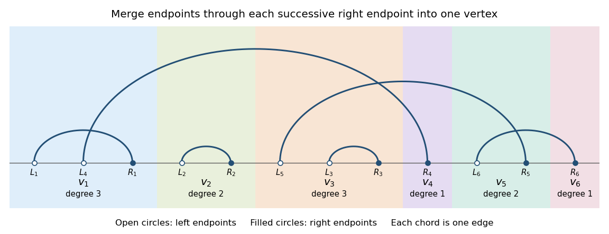

# Paper 12

↑ **Parent:** [Iii](../iii.md)

[https://www.maths.cam.ac.uk/postgrad/part-iii/files/pastpapers/2005/Paper12.pdf](https://www.maths.cam.ac.uk/postgrad/part-iii/files/pastpapers/2005/Paper12.pdf)

**Table of contents**

- [1](#1)
  - [Solution](#1/solution)
- [2](#2)
  - [Solution](#2/solution)
- [3](#3)
  - [a](#3/a)
    - [Solution](#3/a/solution)
  - [b](#3/b)
    - [Solution](#3/b/solution)
- [4](#4)
  - [Solution](#4/solution)
- [5](#5)
  - [a](#5/a)
    - [Solution](#5/a/solution)
  - [b](#5/b)
    - [Solution](#5/b/solution)
  - [c](#5/c)
    - [Solution](#5/c/solution)
- [6](#6)
  - [Solution](#6/solution)
  - [a](#6/a)
    - [Solution](#6/a/solution)
  - [b](#6/b)
    - [Solution](#6/b/solution)
  - [c](#6/c)
    - [Solution](#6/c/solution)

## 1

↑ **Parent:** [Paper 12](paper-12.md)

<h3 id="1/solution">Solution</h3>

↑ **Parent:** [1](#1)

Write $N=\sum_{i=1}^n\mathbf1_{E_i}$, and put $S_0=1$, $S_j=\sum_{|I|=j}\Pr(\bigcap_{i\in I}E_i)$ for $j\ge1$. Counting the $j$-subsets of the events that occur gives $S_j=\mathbb E\binom Nj$. Set $S_j=0$ for $j>n$. The [Jordan-Bonferroni exact-occurrence inequalities](../../../combinatorics.md#jordan-bonferroni-exact-occurrence-inequalities) are

$$
\boxed{\sum_{r=0}^{2s+1}(-1)^r\binom{k+r}kS_{k+r}\le\Pr(N=k)\le\sum_{r=0}^{2s}(-1)^r\binom{k+r}kS_{k+r}\quad(s\ge0).}
$$

Here $k\ge0$ is an integer. To prove both bounds, evaluate the truncated expression before taking its [expectation](../../../probability-theory.md#expected-value). At an integer value $N=j\ge k$ it equals

$$
\binom jk\sum_{r=0}^m(-1)^r\binom{j-k}r.
$$

For $j=k$ this is one. For $j>k$, [Pascal's identity](../../../combinatorics.md#pascal-s-rule), or an induction on $m$, gives

$$
\sum_{r=0}^m(-1)^r\binom{j-k}r=\begin{cases}(-1)^m\binom{j-k-1}m,&m<j-k,\\0,&m\ge j-k.\end{cases}
$$

For $j<k$ the original expression is zero. Thus its difference from $\mathbf1_{\{N=k\}}$ is everywhere nonnegative for even $m$ and nonpositive for odd $m$. Taking [expectations](../../../probability-theory.md#expected-value) proves the inequalities, including $k=0$.

For a general nonnegative integer-valued [random variable](../../../random-variable.md), define its [factorial moment](../../../markov-process.md#factorial-moment) by $\mathbb E_r(X)=\mathbb E(X)_r$, where $(X)_r$ is the [falling factorial](../../../combinatorics.md#falling-factorial) and $\mathbb E_0(X)=1$. The same pointwise calculation applies to $X$, so put

$$
T_m=\frac1{k!}\sum_{r=0}^m\frac{(-1)^r\mathbb E_{k+r}(X)}{r!}.
$$

Every required moment is finite under the given limit assumption: eventual finiteness of higher [factorial moments](../../../markov-process.md#factorial-moment) implies finiteness of the lower ones. The neighbouring upper and lower bounds differ in absolute value by

$$
|T_{m+1}-T_m|=\frac{\mathbb E_{k+m+1}(X)}{k!(m+1)!}=\frac1{k!}\frac{\mathbb E_s(X)s^k}{s!}\frac{(s)_k}{s^k},\qquad s=k+m+1.
$$

The last ratio tends to one, and the first factor involving the moment tends to zero. Since $\Pr(X=k)$ lies between every two such neighbouring bounds, each $T_m$ tends to it. Consequently the [factorial-moment inversion](../../../markov-process.md#factorial-moment-inversion) is

$$
\boxed{\Pr(X=k)=\frac1{k!}\sum_{r=0}^\infty\frac{(-1)^r\mathbb E_{k+r}(X)}{r!}.}
$$

This proves convergence of the signed [series](../../../real-analysis.md#series-mathematics) without an unjustified interchange with an [expectation](../../../probability-theory.md#expected-value).

For any prescribed $r\ge1$, take $\Pr(X=j)=C_rj^{-(r+2)}$ for $j=1,2,\ldots$, with $C_r=[\sum_{j\ge1}j^{-(r+2)}]^{-1}$. Since $(j)_r\sim j^r$ and $(j)_{r+1}\sim j^{r+1}$, the two moment sums have tails comparable respectively to $\sum j^{-2}$ and $\sum j^{-1}$. Thus **$\mathbb E_r(X)<\infty$ but $\mathbb E_{r+1}(X)=\infty$**, as required.

## 2

↑ **Parent:** [Paper 12](paper-12.md)

<h3 id="2/solution">Solution</h3>

↑ **Parent:** [2](#2)

Take $c>0$ and $e>0$, as required for the displayed sparse scaling and the later normalization. A [strictly balanced graph](../../../graph-theory.md#strictly-balanced-graph) satisfies $e(F)/v(F)<e/v$ for every proper nonempty [subgraph](../../../graph-theory.md#subgraph) $F\subset H$. This forces $H$ to be connected and to have no isolated [vertices](../../../graph.md#vertex-graph-theory): otherwise a component of at least the average density, or deletion of the isolated [vertices](../../../graph.md#vertex-graph-theory), violates strict balance. Copies here are [subgraphs](../../../graph-theory.md#subgraph), not induced [subgraphs](../../../graph-theory.md#subgraph).

For fixed $r$, the [factorial moment](../../../markov-process.md#factorial-moment) $\mathbb E_r(X_H)$ counts ordered $r$-tuples of distinct copies all present in the [binomial random graph](../../../graph-theory.md#binomial-random-graph). The contribution of vertex-disjoint copies is exactly

$$
\frac{(n)_{rv}}{a^r}p^{re}\longrightarrow\left(\frac{c^e}{a}\right)^r.
$$

The factor $a^{-r}$ removes the multiple embeddings of each copy coming from its [graph automorphisms](../../../graph.md#graph-automorphism). For an overlapping tuple, let $U$ be its union. There are $O(n^{v(U)})$ placements of each fixed union type, and the [probability](../../../probability-theory.md#probability) its [edges](../../../graph-theory.md#edge-of-a-graph) are present is $p^{e(U)}$. When adding a copy meeting the earlier union in $f$ [vertices](../../../graph.md#vertex-graph-theory) and $g$ [edges](../../../graph-theory.md#edge-of-a-graph), the exponent $v(U)-(v/e)e(U)$ changes by

$$
-f+(v/e)g\le0.
$$

It is strictly negative if this intersection is a proper nonempty [subgraph](../../../graph-theory.md#subgraph), and zero only for an empty intersection or a whole copy. In particular the first vertex-overlapping copy has a proper nonempty intersection: the preceding copies are vertex-disjoint, and a connected copy contained in their union would have to equal one of them, contrary to distinctness. Its contribution is therefore strictly negative; later additions cannot undo that loss. Only finitely many union types occur for fixed $r$, so their total contribution is $o(1)$. We have proved all the [factorial moment](../../../markov-process.md#factorial-moment) limits, and the allowed [factorial-moment criterion for Poisson convergence](../../../markov-process.md#factorial-moment-criterion-for-poisson-convergence) gives

$$
\boxed{X_H(G(n,cn^{-v/e}))\Rightarrow\operatorname{Po}(c^e/a).}
$$

This is the [Poisson limit for strictly balanced subgraph counts](../../../graph-theory.md#poisson-limit-for-strictly-balanced-subgraph-counts).

The pendant-edge [graph](../../../graph.md) has density $7/5$, whereas its proper $K_4$ core has density $6/4$. Thus **$K_4^+$ is not strictly balanced**. The [complete graph](../../../graph-theory.md#complete-graph) $K_4$ is strictly balanced, with 24 [graph automorphisms](../../../graph.md#graph-automorphism), so at $p=cn^{-2/3}$ its copy count $Z$ tends to $\operatorname{Po}(c^6/24)$.

Every $K_4^+$ copy has a unique four-vertex clique core and one selected [edge](../../../graph-theory.md#edge-of-a-graph) joining it to a fifth [vertex](../../../graph.md#vertex-graph-theory). For any four-set $C$, let $D_C$ count the ambient [edges](../../../graph-theory.md#edge-of-a-graph) between $C$ and its complement. Then $D_C\sim\operatorname{Bin}(4(n-4),p)$, with [mean](../../../probability-theory.md#expected-value) $\mu_n\sim4cn^{1/3}$. It is [independent](../../../random-variable.md#independent-random-variables) of the internal [edges](../../../graph-theory.md#edge-of-a-graph) determining whether $C$ is a [clique](../../../graph-theory.md#clique-graph-theory). Choose $\delta_n=n^{-1/12}$. A [Chernoff bound](../../../probability-inequality.md#chernoff-bound) and a [union bound](../../../probability-inequality.md#boole-s-inequality) give

$$
\Pr\bigl(\exists C:|D_C-\mu_n|>\delta_n\mu_n\bigr)\le2\binom n4\exp(-\delta_n^2\mu_n/3)=o(1).
$$

Therefore, simultaneously for every actual core, its number of pendant extensions is $(1+o(1))4cn^{1/3}$. Extra ambient [edges](../../../graph-theory.md#edge-of-a-graph) cause no overcount: each selected seven-edge [subgraph](../../../graph-theory.md#subgraph) has exactly one core and one pendant [edge](../../../graph-theory.md#edge-of-a-graph). Summing over the cores yields

$$
\frac{X_{K_4^+}}{4cn^{1/3}}=(1+o_{\mathbb P}(1))Z,\qquad \frac{X_{K_4^+}}{4cn^{1/3}}-Z\xrightarrow{\mathbb P}0,
$$

because $Z$ is [uniformly tight](../../../probability-theory.md#uniform-tightness). This is the [pendant extensions of sparse clique copies](../../../graph-theory.md#pendant-extensions-of-sparse-clique-copies) mechanism. For $0<\varepsilon<1$, neither endpoint of $(k-\varepsilon,k+\varepsilon)$ is an integer, and its only nonnegative integer is $k$. [Convergence in distribution](../../../convergence-of-random-variables.md#convergence-in-distribution) consequently gives

$$
\boxed{\Pr\left(k-\varepsilon<\frac{X_{K_4^+}}{4cn^{1/3}}<k+\varepsilon\right)\longrightarrow e^{-c^6/24}\frac{(c^6/24)^k}{k!}.}
$$

The positive-$c$ assumption matters: the quotient printed in the question is undefined when $c=0$.

## 3

↑ **Parent:** [Paper 12](paper-12.md)

<h3 id="3/a">a</h3>

↑ **Parent:** [3](#3)

<h4 id="3/a/solution">Solution</h4>

↑ **Parent:** [A](#3/a)

If the [random k-out graph](../../../graph-theory.md#random-k-out-graph) with $k=2$ is disconnected, one of its [connected components of a graph](../../../graph.md#component-graph-theory) has size $3\le s\le n/2$. The lower bound follows because every [vertex](../../../graph.md#vertex-graph-theory) chooses two distinct neighbours inside its component. For a specified $s$-set $S$, absence of crossing [edges](../../../graph-theory.md#edge-of-a-graph) requires every choice at a [vertex](../../../graph.md#vertex-graph-theory) in $S$ to stay in $S$, and every choice outside to stay outside. Independence of choices at different [vertices](../../../graph.md#vertex-graph-theory) gives exactly

$$
\Pr(S\text{ has no crossing edge})=\left[\frac{\binom{s-1}2}{\binom{n-1}2}\right]^s\left[\frac{\binom{n-s-1}2}{\binom{n-1}2}\right]^{n-s}.
$$

For $3\le s\le n/2$, the two ratios are at most $(s/n)^2$ and $(1-s/n)^2$. Indeed each of the factors $(s-j)/(n-j)$, $j=1,2$, is at most $s/n$, and the complementary statement is identical. Put $t=s/n$. The [binomial coefficient](../../../combinatorics.md#binomial-coefficient) bound $\binom ns\le t^{-s}(1-t)^{-(n-s)}$ follows by bounding the [probability](../../../probability-theory.md#probability) of $s$ successes in $\operatorname{Bin}(n,t)$ by one. Thus the [union bound](../../../probability-inequality.md#boole-s-inequality) gives

$$
\Pr(G_{2\text{-out}}\text{ disconnected})\le\sum_{s=3}^{\lfloor n/2\rfloor}t^s(1-t)^{n-s}\le\sum_{s=3}^{\lfloor n/2\rfloor}(s/n)^s.
$$

For $s\le\sqrt n$, the last summands are at most $n^{-s/2}$, whose sum from three tends to zero. For $s>\sqrt n$, they are at most $2^{-s}$, again summing to zero. Therefore

$$
\boxed{\Pr(G_{2\text{-out}}\text{ connected})=1-o(1).}
$$

The proof bounds all possible small components rather than assuming the dependent undirected [edges](../../../graph-theory.md#edge-of-a-graph) behave like a [binomial random graph](../../../graph-theory.md#binomial-random-graph).

<h3 id="3/b">b</h3>

↑ **Parent:** [3](#3)

<h4 id="3/b/solution">Solution</h4>

↑ **Parent:** [B](#3/b)

At each [vertex](../../../graph.md#vertex-graph-theory) independently, take a uniformly random permutation of the other $n-1$ [vertices](../../../graph.md#vertex-graph-theory). Use its first two entries for the two-out choices and its first $k$ entries for the $k$-out choices. Every unordered choice set has the prescribed [uniform distribution](../../../continuous-probability-distribution.md#continuous-uniform-distribution), and choices at different [vertices](../../../graph.md#vertex-graph-theory) remain [independent](../../../random-variable.md#independent-random-variables). This couples the [random k-out graphs](../../../graph-theory.md#random-k-out-graph) so that $G_{2\text{-out}}\subseteq G_{k\text{-out}}$ on the same [vertex](../../../graph.md#vertex-graph-theory) set. Adding [edges](../../../graph-theory.md#edge-of-a-graph) cannot destroy [graph](../../../graph.md) connectivity. Consequently

$$
\boxed{\Pr(G_{k\text{-out}}\text{ connected})\ge\Pr(G_{2\text{-out}}\text{ connected})\longrightarrow1\quad(k\ge2).}
$$

This establishes [connectivity of random k-out graphs](../../../graph-theory.md#connectivity-of-random-k-out-graphs) for every fixed allowed $k$.

## 4

↑ **Parent:** [Paper 12](paper-12.md)

<h3 id="4/solution">Solution</h3>

↑ **Parent:** [4](#4)

Relative to a [filtration](../../../stochastic-process.md#filtration-probability-theory) $(\mathcal F_i)$, a [martingale](../../../martingale.md) is an [adapted process](../../../stochastic-process.md#adapted-process) of integrable [random variables](../../../random-variable.md) satisfying $\mathbb E[X_i\mid\mathcal F_{i-1}]=X_{i-1}$. With no separate [filtration](../../../stochastic-process.md#filtration-probability-theory) specified, take the [natural filtration](../../../stochastic-process.md#natural-filtration) $\sigma(X_0,\ldots,X_i)$. For deterministic increment bounds $|X_i-X_{i-1}|\le c_i$, the [Hoeffding-Azuma inequality](../../../martingale.md#azuma-s-inequality) states

$$
\boxed{\Pr(|X_n-X_0|\ge t)\le2\exp\left(-\frac{t^2}{2\sum_{i=1}^n c_i^2}\right)\quad(t>0).}
$$

To prove it, let $D_i=X_i-X_{i-1}$. For $c_i>0$, convexity on $[-c_i,c_i]$ gives

$$
e^{sD_i}\le\frac{c_i+D_i}{2c_i}e^{sc_i}+\frac{c_i-D_i}{2c_i}e^{-sc_i}.
$$

Its conditional [expectation](../../../probability-theory.md#expected-value) is at most $\cosh(sc_i)\le e^{s^2c_i^2/2}$. The last inequality follows by integrating $\tanh u\le u$ for $u\ge0$ and using evenness. If $c_i=0$ the bound is immediate. Conditional iteration now yields $\mathbb E e^{s(X_n-X_0)}\le\exp(s^2\sum c_i^2/2)$. The exponential [Markov inequality](../../../probability-inequality.md#markov-inequality), minimized at $s=t/\sum c_i^2$, bounds the upper tail by the displayed exponential without the factor two. Apply it to $-X_i$ and use the [union bound](../../../probability-inequality.md#boole-s-inequality) for the two-sided assertion. When every $c_i=0$, the deviation [probability](../../../probability-theory.md#probability) is zero.

For the [chromatic number of a binomial random graph](../../../graph-theory.md#chromatic-number-of-a-binomial-random-graph), put $q=1-p$, $b=1/q>1$, and $L_n=\log_b n$. We prove matching bounds; treating $0<\varepsilon<1$ suffices. A colour class is an [independent set](../../../graph-theory.md#independent-set-graph-theory), so $\chi\ge n/\alpha(G)$. For $r=\lceil(2+\delta)L_n\rceil$ with fixed $\delta>0$, the [expected value](../../../probability-theory.md#expected-value) of the number of [independent](../../../random-variable.md#independent-random-variables) $r$-sets is

$$
\binom nrq^{\binom r2}\le\exp\left(r\log n-\tfrac12r(r-1)\log b\right)=\exp(-\Theta((\log n)^2))=o(1).
$$

The [first moment method](../../../probability-inequality.md#first-moment-method) gives $\alpha(G)<r$ with [probability](../../../probability-theory.md#probability) tending to one. Choosing $\delta$ sufficiently small then gives $\chi\ge(1-\varepsilon)n/(2L_n)$ for all sufficiently large $n$ on that event.

The upper bound must work uniformly on the adaptive [vertex](../../../graph.md#vertex-graph-theory) sets left by a colouring procedure. Set

$$
m=\left\lceil\frac n{(\log n)^2}\right\rceil,\qquad k=\lfloor(2-\delta)\log_b m\rfloor,\qquad0<\delta<1.
$$

For a specified $m$-set $U$, its [complement graph](../../../graph-theory.md#complement-graph) has distribution $G(m,q)$. Let $X$ count its $k$-[cliques](../../../graph-theory.md#clique-graph-theory), $Y$ count distinct ordered pairs sharing an [edge](../../../graph-theory.md#edge-of-a-graph), and $Z$ be the maximum [edge-disjoint clique packing](../../../graph-theory.md#edge-disjoint-clique-packing). The allowed clique-count estimates at this value of $k$ give

$$
\mathbb EX=\binom mkq^{\binom k2},\qquad \frac1{\mathbb EX}=o(m^{-2}),\qquad\frac{\mathbb EY}{(\mathbb EX)^2}\le C_{q,\delta}\frac{k^4}{m^2}.
$$

The overlap quantity, if the diagonal is included, has the exact expression $\sum_{j=2}^k\binom kj\binom{m-k}{k-j}q^{-\binom j2}/\binom mk$ after division by $(\mathbb EX)^2$; the same bound holds. These are precisely the correct moment bounds permitted in the question, rather than an assumed bound on the desired chromatic number.

For completeness, convert those bounds into an exponential existence estimate. In the [clique conflict graph](../../../graph-theory.md#clique-conflict-graph) the [vertices](../../../graph.md#vertex-graph-theory) are the $X$ existing [cliques](../../../graph-theory.md#clique-graph-theory), with an [edge](../../../graph-theory.md#edge-of-a-graph) between each conflicting pair. A random ordering keeps every [vertex](../../../graph.md#vertex-graph-theory) that precedes all its neighbours. No two retained [vertices](../../../graph.md#vertex-graph-theory) are adjacent. Their [mean](../../../probability-theory.md#expected-value) number is $\sum_v1/(d_v+1)\ge X^2/(X+Y)$ by the [Cauchy-Schwarz inequality](../../../probability-and-statistics.md#cauchy-schwarz-inequality). Thus, with a zero ratio when $X=0$,

$$
Z\ge\frac{X^2}{X+Y},\qquad\mathbb EZ\ge\frac{(\mathbb EX)^2}{\mathbb EX+\mathbb EY}\ge c\frac{m^2}{k^4}.
$$

The middle inequality follows from $(\mathbb EX)^2\le\mathbb E[X^2/(X+Y)]\,\mathbb E(X+Y)$. Toggling one ambient [edge](../../../graph-theory.md#edge-of-a-graph) changes $Z$ by at most one: at most one member of a packing uses it. Reveal the $\binom m2$ [independent](../../../random-variable.md#independent-random-variables) [edges](../../../graph-theory.md#edge-of-a-graph) successively and form the [edge-exposure martingale](../../../martingale.md#edge-exposure-martingale) for $Z$. Coupling the unrevealed [edges](../../../graph-theory.md#edge-of-a-graph) identically under the two values of the next [edge](../../../graph-theory.md#edge-of-a-graph) shows its conditional [expectations](../../../probability-theory.md#expected-value) differ by at most one, hence its increments have magnitude at most one. The one-sided [Hoeffding-Azuma inequality](../../../martingale.md#azuma-s-inequality) gives

$$
\Pr(X=0)=\Pr(Z=0)\le\exp\left(-\frac{(\mathbb EZ)^2}{2\binom m2}\right)\le\exp(-c' m^2/k^8).
$$

This is [clique-packing amplification of moment bounds](../../../graph-theory.md#clique-packing-amplification-of-moment-bounds). A [union bound](../../../probability-inequality.md#boole-s-inequality) over all $m$-sets is now strong enough:

$$
\Pr(\exists U,\ |U|=m,\ \alpha(G[U])<k)\le2^n\exp(-c'm^2/k^8)\longrightarrow0,
$$

since $m^2/k^8=\Theta(n^2/(\log n)^{12})\gg n$. Thus every such set contains an [independent set](../../../graph-theory.md#independent-set-graph-theory) of size $k$. Repeatedly remove and colour one whenever at least $m$ [vertices](../../../graph.md#vertex-graph-theory) remain; then colour each of the fewer than $m$ remaining [vertices](../../../graph.md#vertex-graph-theory) separately. This [greedy colouring by removing independent sets](../../../graph-theory.md#greedy-colouring-by-removing-independent-sets) uses at most

$$
\frac nk+m=\left(\frac2{2-\delta}+o(1)\right)\frac n{2L_n}.
$$

Choose $\delta$ so $2/(2-\delta)<1+\varepsilon$. Combining the two high-probability events proves

$$
\boxed{(1-\varepsilon)\frac n{2\log_{1/q}n}\le\chi(G(n,p))\le(1+\varepsilon)\frac n{2\log_{1/q}n}\quad\text{with probability }1-o(1).}
$$

The uniform subset estimate avoids incorrectly treating a graph-dependent remainder as a fresh [independent](../../../random-variable.md#independent-random-variables) [random graph](../../../graph-theory.md#random-graph).

## 5

↑ **Parent:** [Paper 12](paper-12.md)

<h3 id="5/a">a</h3>

↑ **Parent:** [5](#5)

<h4 id="5/a/solution">Solution</h4>

↑ **Parent:** [A](#5/a)

Let $Z_t$ denote the generation-$t$ type-count [vector](../../../vector-space.md#vector), and let $p_i^{(t)}=\Pr_i(|Z_t|>0)$ from a single type-$i$ ancestor. Every type-$j$ child independently has [probability](../../../probability-theory.md#probability) $p_j^{(t)}$ of having descendants in generation $t$. For a [Poisson random variable](../../../discrete-probability-distribution.md#poisson-distribution) $N$ with [mean](../../../probability-theory.md#expected-value) $\lambda$, $\mathbb E s^N=\exp[\lambda(s-1)]$. Independence across child types therefore gives

$$
p^{(0)}=\mathbf1,\qquad p_i^{(t+1)}=1-\prod_j\exp(-\lambda_{ij}p_j^{(t)})=T_i(p^{(t)}),\qquad T_i(x)=1-e^{-(\Lambda x)_i}.
$$

The events of nonempty successive generations decrease. Each individual has finitely many children almost surely, so the total tree is infinite precisely when no generation is empty. Consequently $p^{(t)}\downarrow p$, the actual [survival probability of a branching process](../../../probability-and-statistics.md#survival-probability-of-a-branching-process). Continuity of $T$ yields

$$
\boxed{p_i=1-\exp\left(-\sum_j\lambda_{ij}p_j\right).}
$$

The map $T$ is coordinatewise increasing on nonnegative [vectors](../../../vector-space.md#vector). Every nonnegative [fixed point](../../../function.md#fixed-point) $p'$ automatically lies in $[0,1]^l$, since its coordinates equal $1-e^{-z}$ with finite $z\ge0$. Hence $p'\le\mathbf1$ and, by induction, $p'=T^t(p')\le T^t(\mathbf1)=p^{(t)}$. Taking limits proves **$p'\le p$ in every coordinate**, so $p$ is the greatest nonnegative solution, not merely some [fixed point](../../../function.md#fixed-point). This argument applies without irreducibility assumptions to the [multitype Poisson branching process](../../../stochastic-process.md#multitype-poisson-branching-process).

<h3 id="5/b">b</h3>

↑ **Parent:** [5](#5)

<h4 id="5/b/solution">Solution</h4>

↑ **Parent:** [B](#5/b)

Use row [vectors](../../../vector-space.md#vector) for population counts. Given $Z_t$, [independent](../../../random-variable.md#independent-random-variables) reproduction has conditional [mean](../../../probability-theory.md#expected-value) $\mathbb E[Z_{t+1}\mid Z_t]=Z_t\Lambda$. Starting from $Z_0=e_i^T$, induction gives $\mathbb E Z_t=e_i^T\Lambda^t$. Summing all child types, the expected size of generation $t$ is

$$
\boxed{\mathbb E_i|Z_t|=e_i^T\Lambda^t\mathbf1=\sum_{j=1}^l(\Lambda^t)_{ij}.}
$$

This also covers $t=0$, using $\Lambda^0=I$. All these finite-generation [expectations](../../../probability-theory.md#expected-value) are finite because the [matrix](../../../vector-space.md#matrix) is finite with finite entries.

<h3 id="5/c">c</h3>

↑ **Parent:** [5](#5)

<h4 id="5/c/solution">Solution</h4>

↑ **Parent:** [C](#5/c)

The necessary and sufficient condition is

$$
\boxed{\sum_i p_i>0\quad\Longleftrightarrow\quad\rho(\Lambda)>1,}
$$

where $\rho$ is the [spectral radius](../../../analysis.md#spectral-radius) of the [nonnegative matrix](../../../vector-space.md#nonnegative-matrix). No irreducibility is required. We use the given nonnegative-vector characterization of its Perron [eigenvalue](../../../linear-operator-theory.md#eigenvalue).

For necessity, suppose $p\ne0$ is the survival [fixed point](../../../function.md#fixed-point) and let $S=\{i:p_i>0\}$. Since $1-e^{-z}<z$ for every $z>0$, its equation gives $(\Lambda p)_i>p_i$ for every $i\in S$. There are finitely many such coordinates, so

$$
\alpha=\min_{i\in S}\frac{(\Lambda p)_i}{p_i}>1.
$$

Outside $S$ the inequality $\Lambda p\ge\alpha p$ still holds, because its right side is zero and its left side is nonnegative. The provided [Perron–Frobenius theorem](../../../vector-space.md#perron-frobenius-theorem) characterization therefore gives $\rho(\Lambda)\ge\alpha>1$. In particular survival is impossible at $\rho=1$ for this Poisson offspring law.

Conversely suppose $\rho>1$. The given characterization supplies a nonzero $v\ge0$ with $\Lambda v\ge\rho v$; normalize it so $\max_i v_i=1$. For sufficiently small $\eta>0$,

$$
T_i(\eta v)\ge1-e^{-\eta\rho v_i}\ge\eta\rho v_i-\tfrac12\eta^2\rho^2v_i^2\ge\eta v_i.
$$

For example any $0<\eta\le\min(1,2(\rho-1)/\rho^2)$ works. Coordinates with $v_i=0$ satisfy the inequality automatically. Starting at $x_0=\eta v$, iterate $x_{t+1}=T(x_t)$. Monotonicity makes the sequence increase, and $T$ takes nonnegative [vectors](../../../vector-space.md#vector) into $[0,1]^l$, so it converges to a [fixed point](../../../function.md#fixed-point) $x_\infty\ge\eta v\ne0$. Part (a) gives $p\ge x_\infty$, proving survival from at least one type. This proves the [spectral survival criterion for multitype Poisson branching](../../../stochastic-process.md#spectral-survival-criterion-for-multitype-poisson-branching) for reducible as well as irreducible reproduction [matrices](../../../vector-space.md#matrix).

## 6

↑ **Parent:** [Paper 12](paper-12.md)

<h3 id="6/solution">Solution</h3>

↑ **Parent:** [6](#6)

There are genuine normalization inconsistencies in this PDF. In the standard [linearized chord diagram model](../../../graph-theory.md#linearized-chord-diagram-model) $G_n^{(1)}$, time $n$ gives **$n$ [edges](../../../graph-theory.md#edge-of-a-graph) and total [vertex degree](../../../graph-theory.md#degree-graph-theory) $2n$**, with [self-loops](../../../graph.md#loop-graph-theory) counted twice. The paper calls $2n$ the number of [edges](../../../graph-theory.md#edge-of-a-graph). Its right-endpoint hint also uses $\sqrt{i/(2n)}$ rather than $\sqrt{i/n}$. These cannot both describe the standard model; part (c)'s exponent is consequently inconsistent as well. We give the definition, prove the alternative construction and its limits, and explicitly identify the corrected conclusion rather than infer an invalid constant from the printed hint.

Start from the empty [graph](../../../graph.md) at time zero, or from one [vertex](../../../graph.md#vertex-graph-theory) with one [self-loop](../../../graph.md#loop-graph-theory) at time one. To obtain $G_t$ from $G_{t-1}$, add [vertex](../../../graph.md#vertex-graph-theory) $t$ and an [edge](../../../graph-theory.md#edge-of-a-graph) directed from $t$ to $I_t$, where

$$
\boxed{\Pr(I_t=i\mid G_{t-1})=\frac{d_i(t-1)}{2t-1}\ (i<t),\qquad\Pr(I_t=t\mid G_{t-1})=\frac1{2t-1}.}
$$

A self-choice creates a [self-loop](../../../graph.md#loop-graph-theory). The old [vertex degrees](../../../graph-theory.md#degree-graph-theory) sum to $2(t-1)$, so these [probabilities](../../../probability-theory.md#probability) sum to one. This is exact [preferential attachment](../../../graph-theory.md#preferential-attachment), including the outward half of the new [edge](../../../graph-theory.md#edge-of-a-graph) as weight one for the new [vertex](../../../graph.md#vertex-graph-theory); it is not a rule normalized by $2t$ or a process adding two [edges](../../../graph-theory.md#edge-of-a-graph) at each step. The [degree of a vertex](../../../graph-theory.md#degree-graph-theory) here is its total incoming plus outgoing [vertex degree](../../../graph-theory.md#degree-graph-theory). The construction in part (a) has exactly one chord per [vertex](../../../graph.md#vertex-graph-theory) and makes the edge-count discrepancy explicit.

<h3 id="6/a">a</h3>

↑ **Parent:** [6](#6)

<h4 id="6/a/solution">Solution</h4>

↑ **Parent:** [A](#6/a)

Draw $n$ [independent](../../../random-variable.md#independent-random-variables) pairs of [independent](../../../random-variable.md#independent-random-variables) [uniform random variables](../../../continuous-probability-distribution.md#uniform-random-variable) on $[0,1]$. In each pair call the minimum $L$ and maximum $R$, then relabel whole pairs so $R_1<\cdots<R_n$. Merge all endpoints in $(R_{i-1},R_i]$ into [vertex](../../../graph.md#vertex-graph-theory) $i$, with $R_0=0$, and join the blocks containing the two endpoints of each pair, orienting from the right endpoint to the left. [Self-loops](../../../graph.md#loop-graph-theory) are retained. This gives the [uniform linearized chord diagram](../../../graph-theory.md#uniform-linearized-chord-diagram) representation.

Before ordering, a pair has joint density $2$ on $0<L<R<1$. Consequently its maximum has distribution $\Pr(R\le r)=r^2$ and density $2r$; conditional on $R=r$, its minimum is uniform on $[0,r]$. Independence and relabelling give the equivalent precise description

$$
\boxed{R_1^2<\cdots<R_n^2\text{ are the order statistics of }n\text{ independent }U(0,1)\text{ variables};\quad L_i\mid(R_1,\ldots,R_n)\ \text{independently }U(0,R_i).}
$$

Every one of the $(2n)!$ relative orderings of the independently drawn labelled endpoints has the same [probability](../../../probability-theory.md#probability). After forgetting pair labels and within-pair labels, each matching of $2n$ ordered points is produced by $2^n n!$ orderings. Thus its matching is uniform among the $(2n-1)!!$ pairings.

To prove equivalence with the recursive [graph](../../../graph.md) law, remove the last endpoint and its mate from a uniform pairing. The remaining ordered points have a uniform $(n-1)$-pairing, and the mate's old rank is uniform among the $2n-1$ possible ranks, independently of that smaller pairing. Conversely insert the mate into a uniformly chosen one of its $2n-1$ gaps, and pair it with the new final endpoint. For each old [vertex](../../../graph.md#vertex-graph-theory) block, the number of gaps assigned to it is exactly the number of endpoints already in that block, hence its old total [vertex degree](../../../graph-theory.md#degree-graph-theory). These are the gaps immediately before each endpoint of that block. The last gap, after the last old endpoint, makes both new endpoints belong to the new final block and produces a [self-loop](../../../graph.md#loop-graph-theory). Therefore the attachment [probabilities](../../../probability-theory.md#probability) are $d_i/(2n-1)$ for old [vertices](../../../graph.md#vertex-graph-theory) and $1/(2n-1)$ for the new one. Induction proves **the continuous construction and the recursive LCD model have the same distribution**. Inserting a left endpoint into an old block raises exactly that [vertex](../../../graph.md#vertex-graph-theory)'s [vertex degree](../../../graph-theory.md#degree-graph-theory) without splitting any old block.

**[Figure 1](#6/a/image-a-linearized-chord-diagram-with-six-vertex-blocks-six-edges-and-loops-counted-twice-in-the-block-degrees). A linearized chord diagram with six vertex blocks, six edges and loops counted twice in the block degrees**.

<h3 id="6/b">b</h3>

↑ **Parent:** [6](#6)

<h4 id="6/b/solution">Solution</h4>

↑ **Parent:** [B](#6/b)

The first right endpoint is the smallest of $n$ [independent](../../../random-variable.md#independent-random-variables) pair maxima. A maximum exceeds $r$ with [probability](../../../probability-theory.md#probability) $1-r^2$, so for $0\le x\le\sqrt n$,

$$
\Pr(R_1\ge x/\sqrt n)=\left(1-\frac{x^2}{n}\right)^n.
$$

Taking the limit gives the requested, correctly normalized result

$$
\boxed{\Pr(\sqrt nR_1\ge x)\longrightarrow e^{-x^2}\quad(x>0).}
$$

Thus $\sqrt nR_1$ converges to a continuous nonnegative limit $W$ with survival function $\Pr(W\ge x)=e^{-x^2}$. In particular the scaled first right endpoint is tight. This calculation uses maxima of pairs, not the first [order statistic](../../../probability-theory.md#order-statistic) of all $2n$ individual endpoints, which would have a different scale. The converted TeX loses the formula in this part; the displayed limit has been recovered directly from the PDF.

<h3 id="6/c">c</h3>

↑ **Parent:** [6](#6)

<h4 id="6/c/solution">Solution</h4>

↑ **Parent:** [C](#6/c)

First prove the concentration statement with its correct scale. Let $U_i=R_i^2$, the $i$th [uniform order statistic](../../../probability-theory.md#uniform-order-statistic). The number of sample points at most $z$ is $B_z\sim\operatorname{Bin}(n,z)$. Therefore $U_i>z$ [means](../../../probability-theory.md#expected-value) $B_z<i$, and $U_i<z$ [means](../../../probability-theory.md#expected-value) $B_z\ge i$, up to probability-zero ties. Take $\varepsilon_n=1/\log n$ and $M=\lceil n^{1/10}\rceil$. Applying [Chernoff bounds](../../../probability-inequality.md#chernoff-bound) at $z=(1\pm\varepsilon_n)^2i/n$ gives, for an absolute $c_0>0$ and sufficiently large $n$,

$$
\Pr\left(R_i\notin\left[(1-\varepsilon_n)\sqrt{i/n},(1+\varepsilon_n)\sqrt{i/n}\right]\right)\le2e^{-c_0\varepsilon_n^2i}.
$$

When the upper endpoint exceeds one its upper-tail event is empty. A [union bound](../../../probability-inequality.md#boole-s-inequality) makes the total failure [probability](../../../probability-theory.md#probability) for all $M\le i\le n$ at most $2n\exp(-c_0M/(\log n)^2)=o(1)$. On this event,

$$
\sum_{i=M}^n\frac1{R_i}=(1+o(1))\sqrt n\sum_{i=M}^ni^{-1/2}=(2+o(1))n,
$$

where integral comparison gives $\sum_{i=M}^ni^{-1/2}=2\sqrt n+O(\sqrt M)$.

The first [vertex](../../../graph.md#vertex-graph-theory) block has right endpoint $R_1$ and always contains $L_1$, so its initial chord contributes [vertex degree](../../../graph-theory.md#degree-graph-theory) two. All its other endpoints are those $L_i$ with $i\ge2$ that fall below $R_1$. Conditional on the right endpoints, these events are [independent](../../../random-variable.md#independent-random-variables) with [probabilities](../../../probability-theory.md#probability) $R_1/R_i$. Thus

$$
d_1(n)=2+\sum_{i=2}^n\mathbf1_{\{L_i\le R_1\}},\qquad \mu(R):=\mathbb E[d_1(n)\mid R]=2+R_1\sum_{i=2}^nR_i^{-1},\qquad\operatorname{Var}(d_1(n)\mid R)\le\mu(R).
$$

The fewer than $M$ early summands contribute at most $M=o(\sqrt n)$ to this conditional [mean](../../../probability-theory.md#expected-value). For the rest, the uniform estimate and [uniform tightness](../../../probability-theory.md#uniform-tightness) of $\sqrt nR_1$ give

$$
\frac{\mu(R)}{\sqrt n}-2\sqrt nR_1\xrightarrow{\mathbb P}0.
$$

To control the actual fluctuations without assuming unconditional [independence](../../../random-variable.md#independent-random-variables), restrict to the concentration event and $\sqrt nR_1\le A$. Then $\mu(R)\le M+2+C A\sqrt n$. Conditional [Chebyshev inequality](../../../probability-inequality.md#chebyshev-inequality) bounds the [probability](../../../probability-theory.md#probability) of a deviation exceeding $\eta\sqrt n$ by $(M+2+C A\sqrt n)/(\eta^2n)=o(1)$. The discarded endpoint event has limiting [probability](../../../probability-theory.md#probability) $e^{-A^2}$; let $A\to\infty$. Therefore

$$
\frac{d_1(n)}{\sqrt n}-2\sqrt nR_1\xrightarrow{\mathbb P}0,\qquad\frac{d_1(n)}{\sqrt n}\Rightarrow2W.
$$

Since $W$ has a continuous distribution, the corrected [first-vertex degree in the LCD model](../../../graph-theory.md#first-vertex-degree-in-the-lcd-model) tail is

$$
\boxed{\Pr(d_1(n)\ge y\sqrt n)\longrightarrow e^{-y^2/4}\quad(y>0).}
$$

This disproves the printed exponent $-y^2/8$ for $G_n^{(1)}$. The hint's factor is independently contradicted at $i=n$: its proposed upper bound tends to $1/\sqrt2$, whereas

$$
\Pr\left(R_n\le\frac{1+\varepsilon_n}{\sqrt2}\right)=\left(\frac{(1+\varepsilon_n)^2}{2}\right)^n\longrightarrow0.
$$

Thus the printed concentration event has [probability](../../../probability-theory.md#probability) tending to zero, not one. Replacing its $2n$ by $n$ leads to the proven exponent $-y^2/4$. The exponent $-y^2/8$ would instead arise for $d_1(2n)/\sqrt n$, but then the [graph](../../../graph.md) has $2n$ [vertices](../../../graph.md#vertex-graph-theory) and the part (b) endpoint limit at $x/\sqrt n$ becomes $e^{-2x^2}$. It cannot repair all the printed claims with one convention. **The literal part (c) is false for the named model; the full corrected limit and the source of the discrepancy are established above.**

## ↑ Ancestors (8)

1. [Iii](../iii.md)
2. [2005](../../2005.md)
3. [Past exam of the mathematics course of the University of Cambridge](../../../past-exam-of-the-mathematics-course-of-the-university-of-cambridge.md)
4. [Mathematics course of the University of Cambridge](../../../university-of-cambridge.md#mathematics-course-of-the-university-of-cambridge)
5. [Course of the University of Cambridge](../../../university-of-cambridge.md#course-of-the-university-of-cambridge)
6. [University of Cambridge](../../../university-of-cambridge.md)
7. [List of universities](../../../README.md#list-of-universities)
8. [Codex Wiki](../../../README.md)
