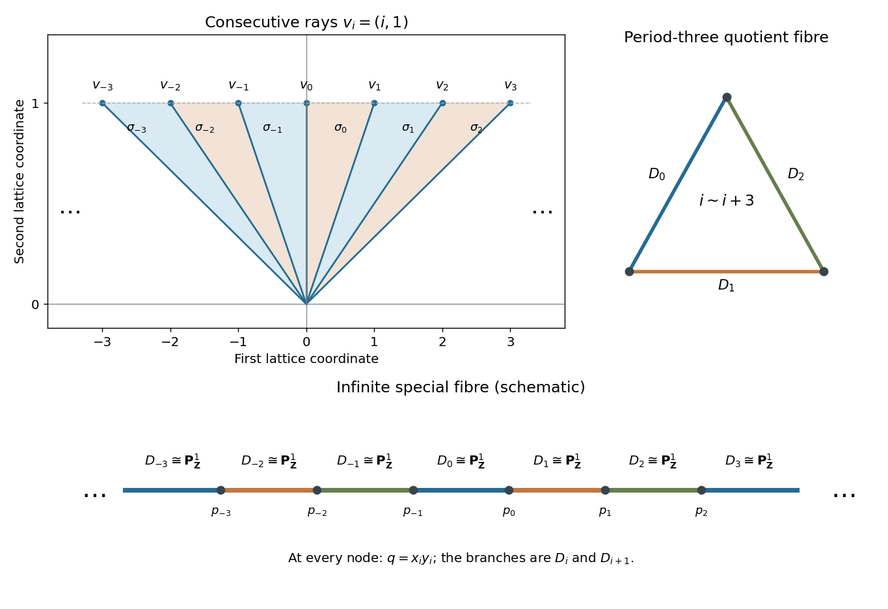

<h1 id="2/solution">Solution</h1>

↑ **Parent:** [2](../2.md)

Use the [toric scheme over a base ring](../../../../../toric-scheme-over-a-base-ring.md) construction over $\mathbb Z$. Take the [cocharacter lattice of an algebraic torus](../../../../../cocharacter-lattice-of-an-algebraic-torus.md) $N=\mathbb Z^2$ and dual [character lattice of an algebraic torus](../../../../../character-lattice-of-an-algebraic-torus.md) $M=\operatorname{Hom}(N,\mathbb Z)$. For every $i\in\mathbb Z$, set

$$
v_i=(i,1),\qquad \rho_i=\mathbb R_{\geq0}v_i,\qquad
\sigma_i=\mathbb R_{\geq0}v_i+\mathbb R_{\geq0}v_{i+1}.
$$

These [cones in toric geometry](../../../../../cone-in-toric-geometry.md), together with their rays and the zero cone, form an [infinite fan in toric geometry](../../../../../infinite-fan-in-toric-geometry.md). Adjacent two-dimensional cones meet in their common ray; all other pairs meet only at zero. Thus the face and intersection axioms hold even though there are infinitely many charts.

The consecutive vectors $v_i,v_{i+1}$ are a [basis](../../../../../basis.md) of $N$, since their [determinant](../../../../../determinant.md) is $-1$. The dual cone has integral generators

$$
a_i=(1,-i),\qquad b_i=(-1,i+1),
$$

with $\langle a_i,v_i\rangle=0$, $\langle a_i,v_{i+1}\rangle=1$, $\langle b_i,v_i\rangle=1$, $\langle b_i,v_{i+1}\rangle=0$. Its integral points form the [free commutative monoid](../../../../../free-commutative-monoid.md) $\mathbb N a_i+\mathbb N b_i$. Hence the associated [semigroup algebra](../../../../../semigroup-algebra.md) chart is simply

$$
U_i=\operatorname{Spec}\mathbb Z[\sigma_i^\vee\cap M]
=\operatorname{Spec}\mathbb Z[x_i,y_i].
$$

On the dense [algebraic torus](../../../../../algebraic-torus.md), write $t=\chi^{(1,0)}$ and $q=\chi^{(0,1)}$. The chart coordinates are

$$
\boxed{x_i=tq^{-i},\qquad y_i=t^{-1}q^{i+1},\qquad q=x_i y_i.}
$$

Although these expressions use inverses on the torus, $x_i,y_i,q$ are regular on the indicated charts.

The common-ray chart of $U_i$ and $U_{i+1}$ is $D(y_i)\subset U_i$, identified with $D(x_{i+1})\subset U_{i+1}$ by

$$
\boxed{x_{i+1}=y_i^{-1},\qquad y_{i+1}=x_i y_i^2.}
$$

The inverse is $y_i=x_{i+1}^{-1}$, $x_i=y_{i+1}x_{i+1}^2$. Nonadjacent charts meet in the common dense torus, and all transition maps agree there with the same [characters of an algebraic torus](../../../../../algebraic-torus-character.md) $t,q$, so their cocycle identities follow. By [gluing of schemes along open subschemes](../../../../../gluing-of-schemes-along-open-subschemes.md), these charts construct a [scheme](../../../../../scheme.md) $X$.

The lattice projection $(a,b)\mapsto b$ carries every $\sigma_i$ into the nonnegative ray of the fan of the [affine line](../../../../../affine-line.md). It therefore defines a [toric morphism](../../../../../toric-morphism.md)

$$
f:X\longrightarrow\operatorname{Spec}\mathbb Z[q].
$$

Explicitly its pullback on each chart sends $q$ to $x_i y_i$. The adjacent-chart formula preserves that product, so the local morphisms glue.

Compute its [scheme-theoretic fibre](../../../../../scheme-theoretic-fibre.md) over $q=0$:

$$
Y\cap U_i=\operatorname{Spec}\mathbb Z[x_i,y_i]/(x_i y_i).
$$

This is the union of the two coordinate [affine lines](../../../../../affine-line.md), each with multiplicity one. Let $D_i$ denote the [toric divisor](../../../../../toric-divisor.md) corresponding to $\rho_i$. Its part in $U_i$ is $y_i=0$, with coordinate $x_i$; its part in $U_{i-1}$ is $x_{i-1}=0$, with coordinate $y_{i-1}$. On the overlap these coordinates satisfy $x_i=y_{i-1}^{-1}$. Consequently these two [affine lines](../../../../../affine-line.md) glue to

$$
D_i\cong\mathbb P^1_{\mathbb Z}.
$$

The neighbouring components $D_i,D_{i+1}$ meet at the section $p_i=(x_i,y_i)=(0,0)$, isomorphic to $\operatorname{Spec}\mathbb Z$. No other components meet. Every special-fibre chart has exactly these two branches and no embedded or extra components. Thus

$$
\boxed{Y=\cdots\cup D_{-1}\cup D_0\cup D_1\cup\cdots,
\quad D_i\cong\mathbb P^1_{\mathbb Z},\quad
D_i\cap D_j=\varnothing\ \text{if }|i-j|>1.}
$$

The union is an infinite chain, not a finite-type curve disguised as one: its infinitely many components account for the infinitely many toric charts.

Over the [principal open subset](../../../../../principal-open-subscheme.md) $D(q)$, both $x_i$ and $y_i$ are [units](../../../../../unit-in-a-ring.md) because their product is $q$. Every chart then becomes the same torus chart:

$$
\begin{aligned}
\mathbb Z[x_i,y_i,(x_i y_i)^{-1}]
&=\mathbb Z[q,q^{-1},x_i,x_i^{-1}]\\
&=\mathbb Z[q,q^{-1},t,t^{-1}],\qquad t=x_i q^i.
\end{aligned}
$$

The transition maps identify the coordinate $t$ exactly, so

$$
\boxed{X\times_{\mathbb Z[q]}\mathbb Z[q,q^{-1}]
\cong\mathbb G_{m,\mathbb Z[q,q^{-1}]}.}
$$

This is the generic region described in the question; over the actual generic point of $\operatorname{Spec}\mathbb Z[q]$ its fibre is $\mathbb G_{m,\mathbb Q(q)}$.

The construction is also flat. Indeed, each node chart has a free $\mathbb Z[q]$-module [basis](../../../../../basis.md)

$$
1,\quad x_i^a\ (a\geq1),\quad y_i^b\ (b\geq1).
$$

Every monomial $x_i^u y_i^v$ reduces uniquely by taking out $q^{\min(u,v)}$, and the resulting monomials are independent. Thus the chart morphisms are [flat morphisms](../../../../../flat-morphism.md). This verifies directly that the [semistable infinite chain from a toric fan](../../../../../semistable-infinite-chain-from-a-toric-fan.md) is a degeneration of the [multiplicative group scheme](../../../../../multiplicative-group-scheme.md) rather than an unrelated special fibre.

**[Figure 1](#2/image-the-infinite-toric-fan-its-chain-of-projective-lines-and-the-period-three-quotient-fibre). The infinite toric fan, its chain of projective lines, and the period-three quotient fibre**.

## ↑ Ancestors (10)

1. [2](../2.md)
2. [Paper 17](../../paper-17-split.md)
3. [Iii](../../split.md)
4. [2005](../../../split.md)
5. [Past exam of the mathematics course of the University of Cambridge](../../../../split.md)
6. [Mathematics course of the University of Cambridge](../../../../../mathematics-course-of-the-university-of-cambridge.md)
7. [Course of the University of Cambridge](../../../../../course-of-the-university-of-cambridge.md)
8. [University of Cambridge](../../../../../university-of-cambridge-split.md)
9. [List of universities](../../../../../list-of-universities.md)
10. [Codex Wiki](../../../../../split.md)
