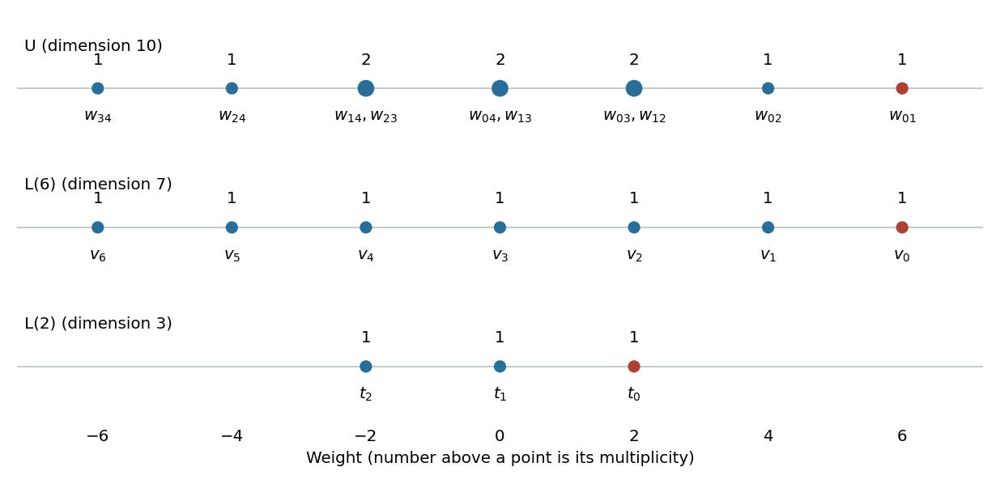

<h1 id="1/a/ii/solution">Solution</h1>

↑ **Parent:** [Ii](../ii.md)

The [weight diagram](../../../../../../../weight-diagram.md) has [weights](../../../../../../../weight-representation-theory.md) $6,4,2,0,-2,-4,-6$ with multiplicities $1,1,2,2,2,1,1$. An [Irreducible Lie algebra representation](../../../../../../../irreducible-lie-algebra-representation.md) of the [sl2 Lie algebra](../../../../../../../sl2-lie-algebra.md) with [highest weight](../../../../../../../highest-weight-of-a-representation.md) $n$ has [weights](../../../../../../../weight-representation-theory.md) $n,n-2,\ldots,-n$, all of multiplicity one. The top [weight](../../../../../../../weight-representation-theory.md) therefore forces one $L(6)$ summand. Subtracting its [formal character](../../../../../../../formal-character-of-a-weight-module.md) leaves [weights](../../../../../../../weight-representation-theory.md) $2,0,-2$, each once, which is $L(2)$. By [Weyl complete reducibility theorem](../../../../../../../weyl-complete-reducibility-theorem.md),

$$
\boxed{\Lambda^2(\operatorname{Sym}^4V)\cong L(6)\oplus L(2)
\cong\operatorname{Sym}^6V\oplus\operatorname{Sym}^2V.}
$$

Their [dimensions](../../../../../../../dimension-vector-space.md) $7+3=10$ account for the entire module.

**[Figure 1](#1/a/ii/image-the-exterior-square-weight-diagram-and-its-two-irreducible-summands-basis-labels-are-defined-in-part-iii). The exterior-square weight diagram and its two irreducible summands; basis labels are defined in part iii**.

## ↑ Ancestors (12)

1. [Ii](../ii.md)
2. [A](../../a.md)
3. [1](../../../1.md)
4. [Paper 2](../../../../paper-2-split.md)
5. [Iii](../../../../split.md)
6. [2005](../../../../../split.md)
7. [Past exam of the mathematics course of the University of Cambridge](../../../../../../split.md)
8. [Mathematics course of the University of Cambridge](../../../../../../../mathematics-course-of-the-university-of-cambridge.md)
9. [Course of the University of Cambridge](../../../../../../../course-of-the-university-of-cambridge.md)
10. [University of Cambridge](../../../../../../../university-of-cambridge-split.md)
11. [List of universities](../../../../../../../list-of-universities.md)
12. [Codex Wiki](../../../../../../../split.md)
