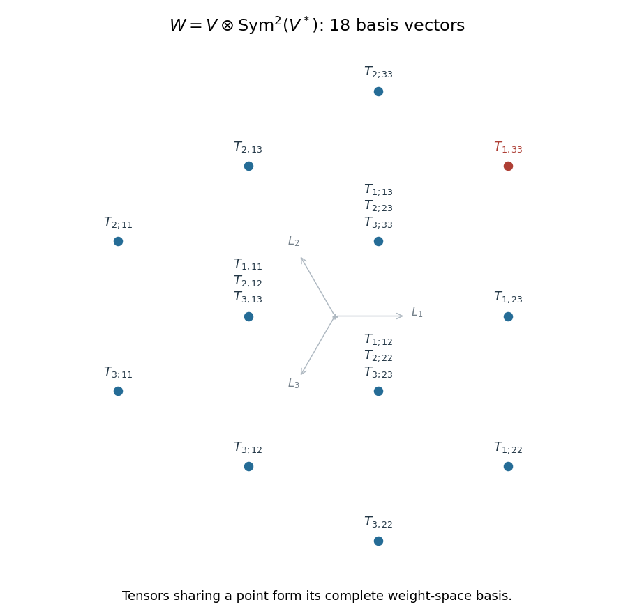

<h1 id="1/b/i/solution">Solution</h1>

↑ **Parent:** [I](../i.md)

Let $e_1,e_2,e_3$ be the [basis](../../../../../../../basis.md) of the [defining representation](../../../../../../../defining-representation-of-a-matrix-lie-algebra.md) and $y_1,y_2,y_3$ its dual. On a diagonal element of the [Cartan subalgebra](../../../../../../../cartan-subalgebra.md) their [weights](../../../../../../../weight-representation-theory.md) are $L_i$ and $-L_i$, with $L_1+L_2+L_3=0$. Use the [tensor product](../../../../../../../tensor-product.md) and [symmetric square](../../../../../../../symmetric-square.md) [basis](../../../../../../../basis.md)

$$
T_{i;jk}=e_i\otimes y_jy_k,\qquad 1\leq i\leq3,\quad1\leq j\leq k\leq3.
$$

Its [weight](../../../../../../../weight-representation-theory.md) is $L_i-L_j-L_k$. For the three repeated [weights](../../../../../../../weight-representation-theory.md) put

$$
A_j=T_{j;jj},\qquad B_{i;j}=e_i\otimes y_i y_j\quad(i\ne j).
$$

If $\{i,l\}=\{1,2,3\}\setminus\{j\}$, the complete [weight-space decomposition](../../../../../../../weight-space-decomposition.md) is

$$
\begin{array}{c|c|c}
\text{weight}&\text{basis}&\text{multiplicity}\\ \hline
L_i-2L_j\ (i\ne j)&T_{i;jj}&1\\
2L_i&T_{i;jk},\quad\{i,j,k\}=\{1,2,3\},\ j<k&1\\
-L_j&A_j,\ B_{i;j},\ B_{l;j}&3
\end{array}
$$

There are six spaces of the first type, three of the second, and three of the third. Their [dimensions](../../../../../../../dimension-vector-space.md) sum to $6+3+9=18$. The [weight diagram](../../../../../../../weight-diagram.md) below labels every space with all of its [basis vectors](../../../../../../../basis-vector.md).

**[Figure 2](#1/b/i/image-all-weight-spaces-of-the-sl3-tensor-module-with-each-tensor-basis-vector-shown-at-its-weight). All weight spaces of the sl3 tensor module, with each tensor-basis vector shown at its weight**.

## ↑ Ancestors (12)

1. [I](../i.md)
2. [B](../../b.md)
3. [1](../../../1.md)
4. [Paper 2](../../../../paper-2-split.md)
5. [Iii](../../../../split.md)
6. [2005](../../../../../split.md)
7. [Past exam of the mathematics course of the University of Cambridge](../../../../../../split.md)
8. [Mathematics course of the University of Cambridge](../../../../../../../mathematics-course-of-the-university-of-cambridge.md)
9. [Course of the University of Cambridge](../../../../../../../course-of-the-university-of-cambridge.md)
10. [University of Cambridge](../../../../../../../university-of-cambridge-split.md)
11. [List of universities](../../../../../../../list-of-universities.md)
12. [Codex Wiki](../../../../../../../split.md)
