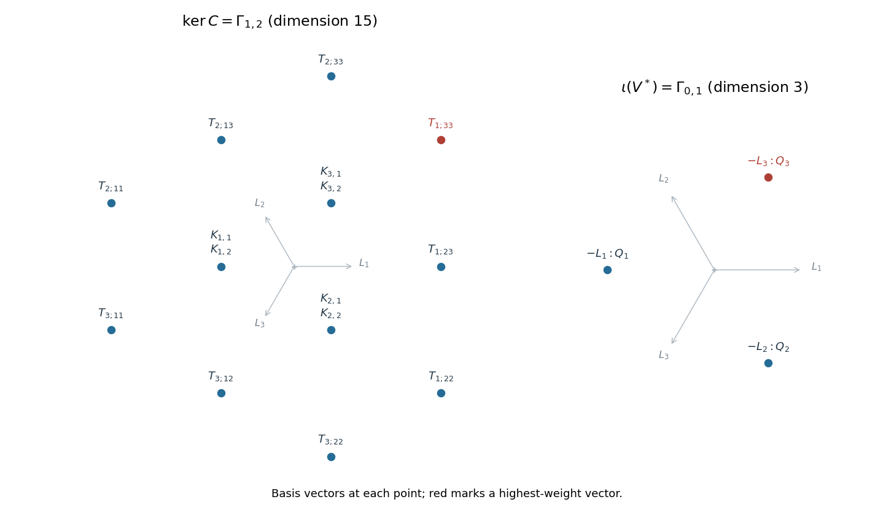

<h1 id="1/b/ii/solution">Solution</h1>

↑ **Parent:** [Ii](../ii.md)

Use the [contraction splitting of a defining module tensor a dual symmetric square](../../../../../../../contraction-splitting-of-a-defining-module-tensor-a-dual-symmetric-square.md). For a quadratic [polynomial](../../../../../../../polynomial-split.md) $p$ in the dual variables, define

$$
C(e_i\otimes p)=\partial_{y_i}p,\qquad
\iota(y_j)=Q_j:=\sum_{i=1}^3e_i\otimes y_i y_j.
$$

Both maps are [intertwiners](../../../../../../../intertwiner.md). The first is the natural [tensor contraction](../../../../../../../tensor-contraction.md); the second uses the [invariant tensor](../../../../../../../invariant-tensor.md) $\sum_i e_i\otimes y_i$. Directly, $C(Q_j)=4y_j$, so $C\iota=4I$ and

$$
W=\ker C\oplus\operatorname{im}\iota,\qquad
\operatorname{im}\iota\cong V^*,\qquad \dim\ker C=18-3=15.
$$

The vector $T_{1;33}=e_1\otimes y_3^2$ lies in $\ker C$ and is killed by both positive simple-root operators $E_{12},E_{23}$. It is a [highest-weight vector](../../../../../../../highest-weight-vector.md) of [weight](../../../../../../../weight-representation-theory.md) $L_1-2L_3=\omega_1+2\omega_2$. By [Weyl complete reducibility theorem](../../../../../../../weyl-complete-reducibility-theorem.md), it generates the corresponding irreducible summand. The [Weyl dimension formula](../../../../../../../weyl-dimension-formula.md) for $\mathfrak{sl}_3$ gives $\dim\Gamma_{a,b}=(a+1)(b+1)(a+b+2)/2$, hence $\dim\Gamma_{1,2}=15$, exhausting the [kernel](../../../../../../../kernel-of-a-linear-map.md). Therefore

$$
\boxed{V\otimes\operatorname{Sym}^2V^*\cong\Gamma_{1,2}\oplus\Gamma_{0,1},
\qquad \Gamma_{0,1}=V^*.}
$$

The [kernel](../../../../../../../kernel-of-a-linear-map.md) has the nine outer [weights](../../../../../../../weight-representation-theory.md) of multiplicity one and each inner [weight](../../../../../../../weight-representation-theory.md) $-L_j$ of multiplicity two; the dual summand has just the three [weights](../../../../../../../weight-representation-theory.md) $-L_j$, each once.

**[Figure 3](#1/b/ii/image-weight-diagrams-and-basis-labels-of-the-fifteen-dimensional-kernel-and-the-dual-summand). Weight diagrams and basis labels of the fifteen-dimensional kernel and the dual summand**.

## ↑ Ancestors (12)

1. [Ii](../ii.md)
2. [B](../../b.md)
3. [1](../../../1.md)
4. [Paper 2](../../../../paper-2-split.md)
5. [Iii](../../../../split.md)
6. [2005](../../../../../split.md)
7. [Past exam of the mathematics course of the University of Cambridge](../../../../../../split.md)
8. [Mathematics course of the University of Cambridge](../../../../../../../mathematics-course-of-the-university-of-cambridge.md)
9. [Course of the University of Cambridge](../../../../../../../course-of-the-university-of-cambridge.md)
10. [University of Cambridge](../../../../../../../university-of-cambridge-split.md)
11. [List of universities](../../../../../../../list-of-universities.md)
12. [Codex Wiki](../../../../../../../split.md)
