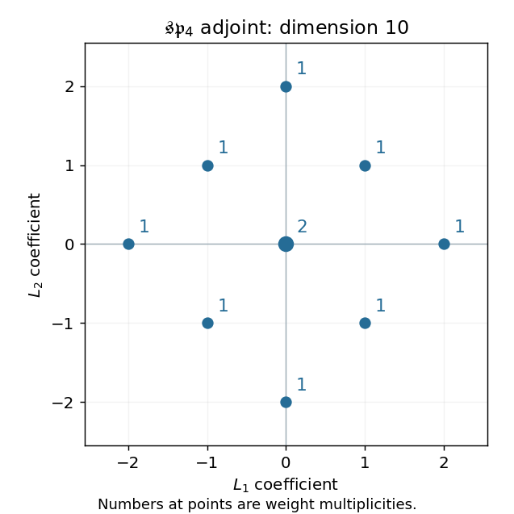

<h1 id="2/ii/a/solution">Solution</h1>

↑ **Parent:** [A](../a.md)

For the [Adjoint representation](../../../../../../../adjoint-representation-of-a-lie-algebra.md), the [root-space decomposition](../../../../../../../root-space-decomposition.md) gives the eight nonzero [weights](../../../../../../../weight-representation-theory.md)

$$
\pm2L_1,\quad\pm2L_2,\quad\pm L_1\pm L_2,
$$

each of multiplicity one, and [weight](../../../../../../../weight-representation-theory.md) zero of multiplicity two from the [Cartan subalgebra](../../../../../../../cartan-subalgebra.md). Thus its [weight diagram](../../../../../../../weight-diagram.md) is the [root](../../../../../../../root-of-a-root-system.md) diagram with a double zero [weight](../../../../../../../weight-representation-theory.md), and its total [dimension](../../../../../../../dimension-vector-space.md) is $8+2=10$.

**[Figure 4](#2/ii/a/image-adjoint-sp4-weights-the-eight-roots-and-the-zero-weight-of-multiplicity-two). Adjoint sp4 weights: the eight roots and the zero weight of multiplicity two**.

## ↑ Ancestors (12)

1. [A](../a.md)
2. [Ii](../../ii.md)
3. [2](../../../2.md)
4. [Paper 2](../../../../paper-2-split.md)
5. [Iii](../../../../split.md)
6. [2005](../../../../../split.md)
7. [Past exam of the mathematics course of the University of Cambridge](../../../../../../split.md)
8. [Mathematics course of the University of Cambridge](../../../../../../../mathematics-course-of-the-university-of-cambridge.md)
9. [Course of the University of Cambridge](../../../../../../../course-of-the-university-of-cambridge.md)
10. [University of Cambridge](../../../../../../../university-of-cambridge-split.md)
11. [List of universities](../../../../../../../list-of-universities.md)
12. [Codex Wiki](../../../../../../../split.md)
