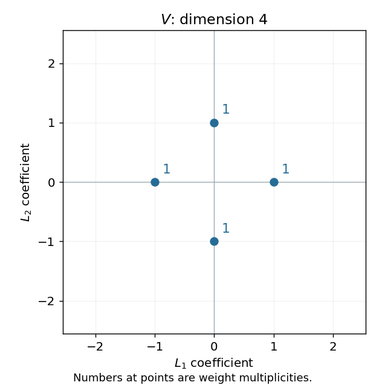

<h1 id="2/ii/b/solution">Solution</h1>

↑ **Parent:** [B](../b.md)

In the [defining representation](../../../../../../../defining-representation-of-a-matrix-lie-algebra.md), the diagonal element of the [Cartan subalgebra](../../../../../../../cartan-subalgebra.md) acts on the four standard [basis vectors](../../../../../../../basis-vector.md) with [eigenvalues](../../../../../../../eigenvalue.md) $r,s,-r,-s$. Therefore

$$
\boxed{\operatorname{wt}(V)=\{L_1,L_2,-L_1,-L_2\},\qquad\text{each with multiplicity one}.}
$$

Their [weight diagram](../../../../../../../weight-diagram.md) is the four-point cross below.

**[Figure 5](#2/ii/b/image-the-four-defining-representation-weights-of-sp4). The four defining-representation weights of sp4**.

## ↑ Ancestors (12)

1. [B](../b.md)
2. [Ii](../../ii.md)
3. [2](../../../2.md)
4. [Paper 2](../../../../paper-2-split.md)
5. [Iii](../../../../split.md)
6. [2005](../../../../../split.md)
7. [Past exam of the mathematics course of the University of Cambridge](../../../../../../split.md)
8. [Mathematics course of the University of Cambridge](../../../../../../../mathematics-course-of-the-university-of-cambridge.md)
9. [Course of the University of Cambridge](../../../../../../../course-of-the-university-of-cambridge.md)
10. [University of Cambridge](../../../../../../../university-of-cambridge-split.md)
11. [List of universities](../../../../../../../list-of-universities.md)
12. [Codex Wiki](../../../../../../../split.md)
