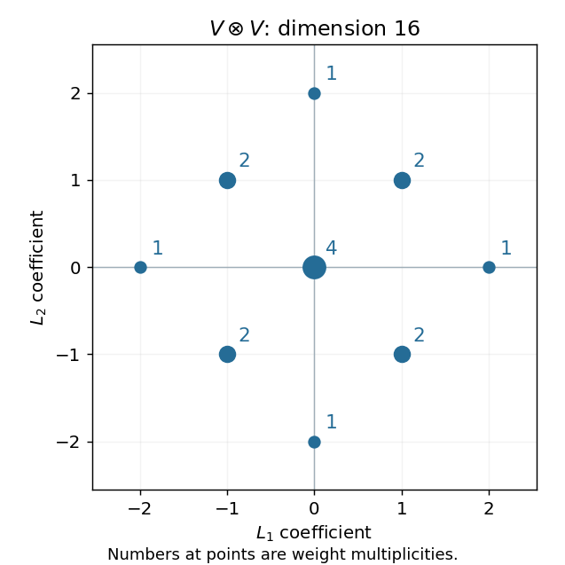

<h1 id="2/ii/c/solution">Solution</h1>

↑ **Parent:** [C](../c.md)

The [tensor-product weight diagram](../../../../../../../tensor-product-weight-diagram.md) is obtained by adding every ordered pair of defining [weights](../../../../../../../weight-representation-theory.md). Each $\pm2L_i$ occurs once, while each of the four [weights](../../../../../../../weight-representation-theory.md) $\pm L_1\pm L_2$ occurs twice, from the two orders of the summands. Zero occurs four times, from the ordered pairs $(L_i,-L_i)$ and $(-L_i,L_i)$ for $i=1,2$. Hence

$$
\begin{array}{c|c}
\text{weight}&\text{multiplicity}\\ \hline
\pm2L_1,\ \pm2L_2&1\\
\pm L_1\pm L_2&2\\
0&4
\end{array}
$$

The [dimensions](../../../../../../../dimension-vector-space.md) sum to $4+8+4=16$, as required for $V\otimes V$.

**[Figure 6](#2/ii/c/image-tensor-square-sp4-weights-including-the-double-diagonal-weights-and-four-dimensional-zero-space). Tensor-square sp4 weights, including the double diagonal weights and four-dimensional zero space**.

## ↑ Ancestors (12)

1. [C](../c.md)
2. [Ii](../../ii.md)
3. [2](../../../2.md)
4. [Paper 2](../../../../paper-2-split.md)
5. [Iii](../../../../split.md)
6. [2005](../../../../../split.md)
7. [Past exam of the mathematics course of the University of Cambridge](../../../../../../split.md)
8. [Mathematics course of the University of Cambridge](../../../../../../../mathematics-course-of-the-university-of-cambridge.md)
9. [Course of the University of Cambridge](../../../../../../../course-of-the-university-of-cambridge.md)
10. [University of Cambridge](../../../../../../../university-of-cambridge-split.md)
11. [List of universities](../../../../../../../list-of-universities.md)
12. [Codex Wiki](../../../../../../../split.md)
